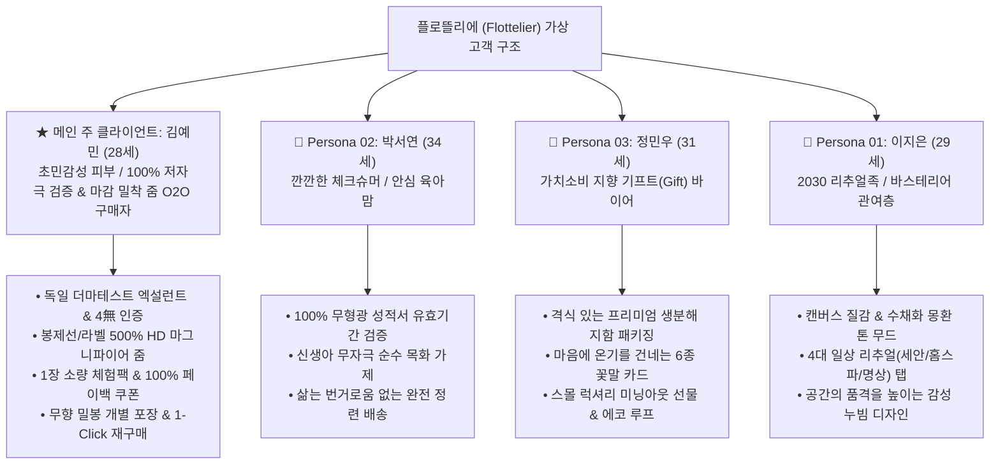
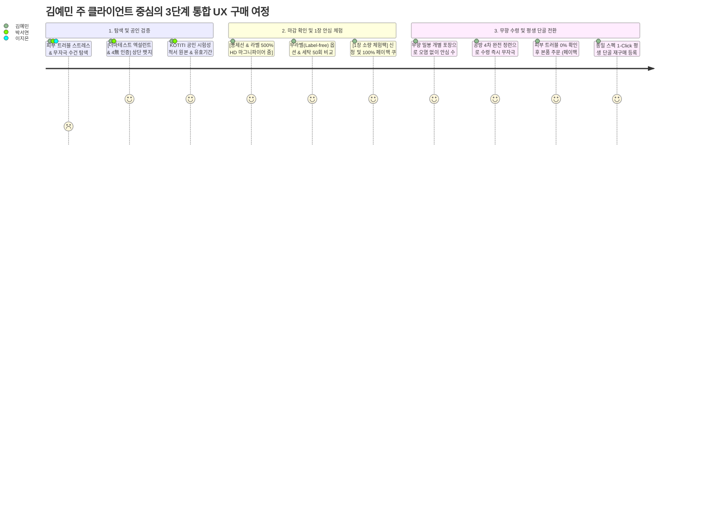

# 👥 플로뜰리에(Flottelier) 가상 클라이언트 종합 분석 및 설계 기획서
> **의뢰 기업(주식회사 이든그라운드) 및 메인 주 클라이언트(김예민) 중심 가상 고객군 통합 분석**

---

## 🏛️ [의뢰 기업 개요] 주식회사 이든그라운드 (Idenground Inc.)

| 구분 | 세부 내용 |
| :--- | :--- |
| **기업명 (CI)** | **주식회사 이든그라운드 (Idenground Inc.)** |
| **브랜드명 (BI)** | **플로뜰리에 (Flottelier)** — *The Art of Slow Ritual (느린 의식의 예술)* |
| **설립 철학** | '이든(올바른)' + '그라운드(대지)' : 뿌리 깊은 정직성과 투명한 친환경 데이터로 입증하는 에코-리추얼 공방 기업 |
| **핵심 사업** | 100% 무형광·무표백 순면 소창 패브릭, 공방 완전 정련 배송 서비스, 꽃말 위로 카드 큐레이션, 에코 루프(자원순환) |
| **발주 프로젝트명** | **플로뜰리에 공식 웹사이트 구축 & 가상 클라이언트 맞춤형 UI/UX 설계** |

---

# Part 1. 단계별 분석 과정 (Steps 1~9)

### 1. 가상 클라이언트의 기본 정보 설정

- **프로젝트의 중심 주제**: 
  - 100% 무형광·더마테스트 엑설런트 공인 시험 데이터 기반 초민감성 안심 검증 & 슬로우 리추얼 소창 커머스 플랫폼 구축
- **제작 목적**:
  - 그린워싱(가짜 친환경)에 대한 불신과 피부 트러블 스트레스를 겪는 초민감성 주 클라이언트(**김예민**) 및 안심 육아맘(**박서연**), 가치선물러(**정민우**), 리추얼족(**이지은**)의 다각적 요구사항 반영.
  - **공인 시험성적서(더마테스트/KOTITI) 원본 및 유효기간 실시간 고지**, **봉제선·라벨 500% HD 마그니파이어 줌**, **1장 소량 안심 체험팩(100% 페이백)**, **무향 밀봉 개별 포장**, **공방 완전 정련 배송**, **6종 꽃말 위로 카드 큐레이션**을 통해 결정 피로 없는 필코노미(Feel-conomy) 안심 구매 경험 제공.
- **클라이언트가 제공한 자료**:
  - `브랜드리서치.tst`: 5조 원 친환경 시장 데이터, PEST 분석, 3C/4Context, 브랜드 가치 매트릭스
  - `브랜드_의뢰인_프로필(이든그라운드).md`: 기업 철학, 발주 배경, 핵심 디자인 요구사항 및 KPI
  - `클라이언트_페르소나_01_김예민(초민감성).md`: 초민감성 피부, 더마테스트 엑설런트, 봉제선 HD 줌, 1장 체험팩
  - `클라이언트_페르소나_02_박서연(안심육아맘).md`: 100% 무형광 성적서, 먼지 제로, 완전 정련 배송
  - `클라이언트_페르소나_03_정민우(가치선물러).md`: 프리미엄 생분해 지함 패키지, 6가지 꽃말 카드, 에코 루프
  - `클라이언트_페르소나_01_이지은(리추얼족).md`: 4대 일상 리추얼(세안/홈스파/육아/명상), 바스테리어 오브제
- **필요한 정보와 기능**:
  - 독일 Dermatest Excellent & 4無(무형광/무표백/무염색/무향료) 공인 뱃지 및 KOTITI 성적서 원본 뷰어
  - 봉제선 및 라벨 마감 상태를 500% 밀착 확대하는 HD 마그니파이어 줌 뷰어 & 무라벨(Label-free) 옵션
  - 1장 소량 체험팩 신청 및 본품 구매 시 100% 사용 가능한 페이백 쿠폰 지급 시스템
  - 외부 냄새 및 먼지 유입을 차단하는 무향(Fragrance-Free) 위생 밀봉 개별 포장 보증
  - 삶는 번거로움 없는 공방 4차 완전 정련 배송 vs DIY 자가 정련 키트 선택 옵션
  - 세탁 50회 후 수축률(%), 보풀, 촉감 유지 데이터 비교 차트
  - 피부 미맞춤 시 100% 안심 환불 보장제 정책 안내
  - 6가지 꽃말 마음 위로 일러스트 카드 선택 & 생분해 지함 패키징 뷰어
  - 피부 맞춤 원단 스펙 그대로 1초 만에 주문하는 1-Click 재구매 시스템
- **중요도와 작업 우선순위**:
  - **1순위 (높음)**: 더마테스트 엑설런트 & 4無 인증 뱃지, KOTITI 성적서 뷰어, 봉제선 500% HD 줌, 1장 체험팩 페이백, 완전 정련 배송
  - **2순위 (보통)**: 6가지 꽃말 위로 서재, 민감성 피부타입별 실후기 필터, 세탁 50회 비교표, 100% 안심 환불 보장제
  - **3순위 (낮음)**: 자원순환 에코 루프 회수 신청 폼, 공방 아틀리에 브랜드 스토리
- **적용 매체**: 반응형 웹 (Mobile First, Tablet, Desktop 1920px 최적화)

---

### 2. 클라이언트가 원하는 항목 수집

| 번호 | 클라이언트 요청 내용 | 관련 자료 (원문 출처) | 중요도 |
| :---: | :--- | :--- | :---: |
| **01** | 독일 더마테스트 엑설런트 등급 & 4無(무형광·무표백·무염색·무향료) 상단 공식 인증 고지 | 김예민.md L39, 브랜드리서치 L39 | **높음** |
| **02** | KOTITI 공인 시험성적서 원본 뷰어 및 성적서 발급일자/유효기간 실시간 투명 공개 | 김예민.md L40, 박서연.md L44 | **높음** |
| **03** | 피부에 닿는 봉제선(말아박기) 및 라벨 마감을 500% 밀착 확대하는 인터랙티브 HD 마그니파이어 줌 | 김예민.md L41 | **높음** |
| **04** | 소창의 초기 삶는 번거로움을 해결하는 공방 4차 완전 정련 배송 표기 및 안심 인장 | 브랜드프로필 L27, 이지은.md L44 | **높음** |
| **05** | 대량 구매 실패 리스크를 없애는 1장 소량 안심 체험팩 & 본품 100% 페이백 쿠폰 시스템 | 김예민.md L45 | **높음** |
| **06** | 외부 오염 및 인공 향을 완벽 차단하는 무향(Fragrance-Free) 위생 밀봉 개별 포장 보증 | 김예민.md L44 | **높음** |
| **07** | 피부 트러블 발생 시 부담 없이 신청 가능한 '100% 안심 환불 보장제' 정책 | 김예민.md L46 | **높음** |
| **08** | 민감성 피부 타입별 필터 & 50회 세탁 후 수축률/보풀/촉감 유지 객관적 비교 데이터 | 김예민.md L43, L47 | **보통** |
| **09** | 격식 있는 친환경 선물용 프리미엄 생분해 지함 패키지 & 6가지 꽃말 마음 위로 카드 동봉 | 정민우.md L44-47, 브랜드리서치 L71 | **보통** |
| **10** | 피부에 맞는 동일 원단 스펙을 즉시 재주문하는 1-Click 재구매 & 원단 리뉴얼 사전 공지 | 김예민.md L48 | **보통** |
| **11** | 수명이 다한 소창 수건을 회수하여 자연 퇴비화하고 5,000원 쿠폰을 주는 자원순환 에코 루프 | 브랜드프로필 L28, 정민우.md L48 | **보통** |
| **12** | 4대 일상 맥락(아침 세안, 저녁 홈스파, 안심 육아, 가사 명상) 테마별 안심 리추얼 큐레이션 | 브랜드리서치 L73, 이지은.md L58 | **보통** |

---

### 3. 요구사항을 정보 단위로 변환

| 요청 원문 | 정보 유형 | 주제 | 부주제 | 메뉴 | 콘텐츠·기능 |
| :--- | :---: | :---: | :---: | :---: | :--- |
| **더마테스트 엑설런트 & 4無 인증** | 사실 / 개념 | 공인 검증 | 저자극 인증 | CERT & PROOF | 독일 Dermatest Excellent 뱃지, 4無 성분 팩트 시트 |
| **KOTITI 성적서 원본 & 유효기간** | 사실 | 공인 검증 | 시험 성적서 | CERT & PROOF | 성적서 원본 고화질 팝업 모달, 형광 0.0% ND 수치 |
| **봉제선·라벨 500% HD 마그니파이어 줌** | 절차 / 과정 | 마감 검증 | 봉제선 줌 | SHOP / 상세 | 마우스 오버 시 500% 초밀착 확대 돋보기 뷰어 |
| **공방 4차 완전 정련 배송 서비스** | 사실 / 절차 | 정련 편의 | 정련 배송 | RITUAL SHOP | 완전 정련 배송(즉시 사용) vs DIY 키트 선택 옵션 |
| **1장 체험팩 & 100% 페이백 쿠폰** | 절차 / 개념 | 체험 전환 | 1장 체험팩 | EXPERIENCE | 1장 체험팩 신청 폼 및 본품 100% 페이백 쿠폰 발급 |
| **무향 위생 밀봉 개별 포장 보증** | 사실 | 위생 포장 | 무향 패키징 | ZERO PACKING | 냄새/먼지 오염 제로 무향 밀봉 개별 포장 보증서 |
| **6가지 꽃말 마음 위로 카드 큐레이션** | 개념 / 절차 | 감성 선물 | 꽃말 카드 | GIFT ARCHIVE | 6종 꽃말 일러스트 카드 선택 & 맞춤 메시지 작성 |
| **50회 세탁 비교 데이터 & 후기 필터** | 사실 / 과정 | 품질 신뢰 | 내구성 데이터 | REVIEWS | 세탁 50회 전후 비교표, 초민감성/아토피 피부 필터 |
| **1-Click 재구매 & 에코 루프 회수** | 절차 | 단골 관리 | 단골/순환 | MY PAGE | 동일 스펙 1초 주문, 헌 소창 회수 신청(5천원 리워드) |

---

### 4. 비슷한 항목끼리 분류 (그룹화)

- **[그룹 A] 100% 공인 시험 검증 & 데이터 (사실/개념)**
  - 독일 더마테스트 엑설런트 뱃지, KOTITI 공인 성적서 원본 뷰어, 4無(무형광·무표백·무염색·무향료) 성분표, 유효기간 상시 고지
- **[그룹 B] 마감 밀착 줌 & 저자극 디테일 (절차/과정)**
  - 봉제선(말아박기) 및 라벨 500% HD 마그니파이어 줌 뷰어, 무라벨(Label-free) 옵션, 독자적 감성 누빔 구조
- **[그룹 C] 안심 체험 & 평생 단골 전환 (절차/개념)**
  - 1장 소량 안심 체험팩, 본품 구매 시 100% 페이백 쿠폰, 피부 미맞춤 시 100% 안심 환불 보장제, 1-Click 재구매
- **[그룹 D] 위생 포장 & 완전 정련 편의 (사실/절차)**
  - 무향(Fragrance-Free) 위생 밀봉 개별 포장, 공방 4차 완전 정련 배송(수령 즉시 세안), DIY 자가 정련 키트
- **[그룹 E] 감성 기프트 & 꽃말 위로 아카이브 (개념/절차)**
  - 프리미엄 생분해 지함 패키지, 6가지 꽃말 마음 위로 카드 서재(프리지아/목화/라벤더 등), 선물 포장 큐레이션
- **[그룹 F] 4대 일상 리추얼 & 자원순환 에코 루프 (과정/절차)**
  - 4대 일상 맥락(아침 세안, 저녁 홈스파, 안심 육아, 가사 명상), 헌 소창 회수 자연 퇴비화(에코 루프) 5,000원 리워드

---

### 5. 계층 구조 작성 (Information Architecture)

```
[플로뜰리에 (Flottelier) - The Art of Slow Ritual]
├─ 1. BRAND STORY (브랜드 철학)
│  ├─ 이든그라운드 기업 철학 & 슬로우 아틀리에 소개
│  ├─ 4대 일상 리추얼 (세안 / 홈스파 / 육아 / 가사명상)
│  └─ 자원순환 에코 루프 (Eco-Loop) 프로젝트
├─ 2. SHOP (제품 탐색 & 구매)
│  ├─ ★ [1장 체험팩] 100% 페이백 소량 체험 코너
│  ├─ 시그니처 4차 정련 소창 페이스타올 (2겹/3겹/4겹)
│  ├─ 안심케어 베이비 소창 와입스 5P 세트
│  ├─ 제로살림 프리미엄 올인원 기프트 세트
│  └─ 옵션: 완전 정련 배송 / 무라벨 / DIY 정련 키트
├─ 3. PROOF & LAB (공인 검증 데이터)
│  ├─ 독일 더마테스트 엑설런트 공식 인증서
│  ├─ KOTITI 100% 무형광 성적서 원본 뷰어 (유효기간)
│  ├─ 봉제선·라벨 500% HD 마그니파이어 줌 랩
│  └─ 세탁 50회 전후 수축률 & 내구성 시험표
├─ 4. GIFT & CARDS (선물 큐레이션)
│  ├─ 프리미엄 생분해 지함 패키징 3D 뷰
│  ├─ 6가지 꽃말 마음 위로 카드 서재 & 메시지 작성
│  └─ 상황별 기프트 큐레이션 (집들이 / 출산 / 셀프케어)
├─ 5. REVIEWS & COMMUNITY (리뷰 & 단골)
│  ├─ 민감성 피부타입별 실사용 포토 후기 (필터)
│  ├─ 100% 안심 환불 보장제 신청
│  └─ 1-Click 재구매 & 헌 수건 회수 신청
└─ 6. MY PAGE (회원 / 주문)
   ├─ 나의 페이백 쿠폰함
   ├─ 단골 원단 스펙 1-Click 재주문
   └─ 에코 루프 수거 현황 & 리워드
```

---

### 6. 사용자가 이해하기 쉬운 이름 부여 (레이블링)

- `더마테스트 엑설런트 & 4無 인증` → 단순 광고 문구와 구별되는 공인 시험 명칭
- `봉제선 500% HD 마그니파이어 줌` → 마감 품질을 직접 확인하는 인터랙티브 기능 직관화
- `1장 소량 체험팩 (100% 페이백)` → 구매 실패 위험을 완전히 해소하는 안심 레이블
- `공방 4차 완전 정련 배송` → 삶을 필요 없이 뜯자마자 바로 쓴다는 편의성 강조
- `무향(Fragrance-Free) 밀봉 개별 포장` → 화학 잔류물과 외부 오염 0% 보증
- `6가지 꽃말 마음 위로 카드` → 제품에 감성적 위로를 더하는 서사적 명칭
- `에코 루프 (Eco-Loop) 자원순환` → 헌 소창을 반납하고 리워드를 받는 지속가능 서비스

---

### 7. 내비게이션으로 연결

- **글로벌 내비게이션 (GNB)**: BRAND STORY, SHOP, PROOF & LAB, GIFT & CARDS, REVIEWS, 1장 체험팩(CTA)
- **로컬 내비게이션 (LNB / 상세페이지)**: [100% 공인인증 | 봉제선 HD 줌 | 완전 정련 옵션 | 세탁 50회 데이터 | 실후기]
- **브레드크럼 (Breadcrumb)**: `홈 > SHOP > 소창 페이스타올 > 4차 정련 무라벨 시그니처 3P`
- **상단 띠배너**: `[독일 더마테스트 Excellent 획득] 1장 소량 체험팩 신청 시 본품 100% 페이백 쿠폰 즉시 지급`
- **모달 및 팝업 인터랙션**:
  - [성적서 원본 보기] 클릭 ➔ KOTITI 공인 시험성적서 고해상도 팝업 뷰어
  - [봉제선 줌] 버튼 클릭 ➔ 500% 마그니파이어 확대경 인터랙션
  - [꽃말 카드 고르기] 클릭 ➔ 6종 일러스트 카드 캐러셀 모달

---

### 8. 와이어프레임으로 표현 (화면 영역 배치)

| 화면 영역 | 작성할 항목 |
| :--- | :--- |
| **헤더 (Header)** | 로고(Flottelier), [더마테스트 Excellent & 4無 인증] 상단 띠배너, GNB 메뉴, [1장 체험팩] 퀵 버튼, 장바구니 |
| **내비게이션** | 카테고리 메뉴, 4대 일상 리추얼 서클 탭, 피부 타입별 퀵 필터 |
| **바디 (Body - 상세페이지)** | - **최상단**: 독일 더마테스트 Excellent 공식 뱃지 + 4無(무형광/무표백/무염색/무향료) 성분 팩트 시트<br>- **상단**: 봉제선·라벨 500% HD 마그니파이어 줌 뷰어 + 무라벨 선택 옵션<br>- **중단**: 공방 4차 완전 정련 배송(즉시 사용) vs DIY 키트 선택기, 세탁 50회 비교 차트<br>- **하단**: 1장 안심 체험팩(100% 페이백) 신청 폼, 6가지 꽃말 위로 카드 선택기, 100% 안심 환불 보장제 안내 |
| **어사이드 (Aside)** | [1장 체험팩 100% 페이백], [성적서 원본 1초 조회], [1-Click 단골 재주문] 플로팅 액션 바 |
| **푸터 (Footer)** | 의뢰사(주식회사 이든그라운드) CI 정보, KOTITI 공인 등록번호, 에코 루프 자원순환 신청, CS 안내 |

---

### 9. 반복 검토

- **클라이언트 요구사항 반영도**:
  - 주 클라이언트(김예민)의 더마테스트 인증, 봉제선 HD 줌, 1장 체험팩 페이백, 무향 포장, 안심 환불제 완벽 반영.
  - 부 클라이언트(박서연)의 무형광 성적서 원본 및 완전 정련 배송 완벽 반영.
  - 잠재 클라이언트(정민우)의 생분해 지함 패키지, 6가지 꽃말 위로 카드, 에코 루프 완벽 반영.
  - 주 사용자(이지은)의 4대 일상 리추얼 서클 탭 및 바스테리어 감성 디자인 시스템 완벽 반영.
- **사용자 관점의 핵심 개선점**:
  - 소창 수건의 고질적 진입장벽이었던 **'초기 정련(삶기)의 번거로움'**과 **'대량 구매 실패 위험'**을 **'완전 정련 배송'**과 **'1장 체험팩(100% 페이백)'**으로 완벽히 해소함.

---

# Part 2. 최종 작성 양식

### 1. 가상 클라이언트
- **프로젝트 주제**: 100% 무형광·더마테스트 엑설런트 공인 시험 데이터 기반 초민감성 안심 검증 & 슬로우 리추얼 소창 커머스 플랫폼 구축
- **제작 목적**:
  - 초민감성 주 클라이언트(김예민)를 비롯한 안심 육아맘(박서연), 가치선물러(정민우), 리추얼족(이지은)의 복합적 요구사항 반영.
  - **공인 시험성적서 원본 뷰어**, **봉제선·라벨 500% HD 마그니파이어 줌**, **1장 소량 체험팩(100% 페이백)**, **무향 위생 밀봉 개별 포장**, **공방 완전 정련 배송**, **6가지 꽃말 카드 큐레이션**으로 신뢰와 감성을 결합한 최고의 필코노미(Feel-conomy) UX 제공.
- **제공 자료**: `브랜드리서치.tst`, `브랜드_의뢰인_프로필(이든그라운드).md`, `김예민.md`, `박서연.md`, `정민우.md`, `이지은.md`
- **적용 매체**: 반응형 웹 (모바일 First, 태블릿, PC 1920px 최적화)

---

### 2. 클라이언트 요구사항
- **요청 항목**:
  1. 독일 더마테스트 Excellent 등급 및 4無(무형광·무표백·무염색·무향료) 공인 뱃지 고지
  2. KOTITI 공인 시험성적서 원본 뷰어 및 유효기간 실시간 투명 공개
  3. 봉제선(말아박기) 및 라벨 마감 500% HD 마그니파이어 줌 뷰어 & 무라벨 옵션
  4. 삶을 필요 없이 수령 즉시 바로 사용하는 공방 4차 완전 정련 배송 옵션
  5. 1장 소량 안심 체험팩 및 본품 구매 시 100% 사용 가능한 페이백 쿠폰 지급
  6. 외부 냄새 및 먼지 오염을 100% 차단하는 무향(Fragrance-Free) 위생 밀봉 개별 포장
  7. 피부 미맞춤 시 100% 안심 환불 보장제 정책 안내
  8. 세탁 50회 후 수축률/보풀/촉감 유지 비교 데이터 및 민감성 피부 후기 필터
  9. 프리미엄 생분해 지함 선물 패키지 & 6가지 꽃말 마음 위로 일러스트 카드 동봉
  10. 피부 맞춤 원단 스펙 1-Click 재구매 및 원단 리뉴얼 사전 공지
  11. 헌 소창 수건 회수 자연 퇴비화 및 5,000원 쿠폰 지급 에코 루프(Eco-Loop)
  12. 4대 일상 리추얼(세안, 홈스파, 육아, 가사명상) 테마 큐레이션
- **중요도**:
  - **높음**: 더마테스트 인증, 성적서 뷰어, 봉제선 HD 줌, 완전 정련 배송, 1장 체험팩 페이백, 무향 밀봉 포장, 안심 환불제
  - **보통**: 6종 꽃말 카드, 세탁 50회 비교 데이터, 1-Click 재구매, 에코 루프, 4대 리추얼 탭
- **관련 자료**: `김예민.md`, `박서연.md`, `정민우.md`, `이지은.md`, `브랜드리서치.tst`
- **필요한 기능**:
  - 더마테스트 & KOTITI 공인 성적서 고해상도 팝업 뷰어
  - 500% HD 마그니파이어 인터랙티브 확대경 모듈
  - 1장 체험팩 신청 폼 및 100% 페이백 쿠폰 자동 발행기
  - 완전 정련 배송 vs DIY 자가 정련 키트 선택 라디오 옵션
  - 6종 꽃말 위로 카드 선택 및 자필 폰트 메시지 작성기
  - 동일 원단 스펙 1-Click 재구매 모듈 & 에코 루프 수거 신청 시스템

---

### 3. 정보 구조
- **주제**: 플로뜰리에 (Flottelier) — *The Art of Slow Ritual*
- **부주제**: 공인 데이터 검증 / 슬로우 리추얼 소창 / 안심 체험 / 감성 기프트 & 자원순환
- **메뉴**:
  - `BRAND STORY`: 이든그라운드 철학, 4대 일상 리추얼, 에코 루프
  - `SHOP`: 1장 안심 체험팩, 4차 정련 소창 타올, 베이비 와입스, 제로살림 기프트 세트
  - `PROOF & LAB`: 더마테스트 엑설런트, KOTITI 성적서 뷰어, 봉제선 500% HD 줌, 세탁 50회 데이터
  - `GIFT & CARDS`: 생분해 지함 패키지, 6가지 꽃말 마음 위로 카드 서재
  - `REVIEWS`: 민감 피부 타입별 실후기, 100% 안심 환불제, 1-Click 재구매
- **콘텐츠**: 더마테스트 인증 원본, 봉제선 접사 뷰어, 1장 체험팩 페이백 쿠폰, 꽃말 카드 일러스트
- **정보 유형**:
  - **사실**: 더마테스트 Excellent, 무형광 0.0%(ND), pH 6.4, 세탁 50회 수축률(%)
  - **개념**: 필코노미(Feel-conomy) 안심 큐레이션, 에코 루프 순환 경제, 꽃말 위로 서사
  - **절차**: 1장 체험팩 신청 및 페이백 쿠폰 사용 3단계, 100% 안심 환불 신청 절차
  - **과정**: 공방 4차 열탕 정련 세척 과정, 헌 소창 수건 자연 퇴비화 순환 과정

---

### 4. 내비게이션
- **시작 화면**:
  - 상단 띠배너: `[독일 더마테스트 Excellent & 4無 인증] 1장 소량 체험팩 신청 시 본품 100% 페이백!`
  - 메인 히어로: 캔버스 질감 노이즈 & 수채화 몽환 톤 위에 세리프 헤드라인 (*The Art of Slow Ritual*)
  - 4대 일상 리추얼 서클 탭 및 [1장 안심 체험팩 바로가기] CTA
- **이동 경로**:
  - `메인` ➔ `더마테스트 뱃지 & 성적서 원본 검증` ➔ `봉제선 500% HD 줌 마감 확인` ➔ `1장 체험팩 신청` ➔ `무향 밀봉 수령` ➔ `페이백 쿠폰으로 본품 1-Click 재구매`
- **연결 페이지**:
  - 상세페이지 ↔ KOTITI 성적서 팝업 ↔ 500% HD 줌 뷰어 ↔ 1장 체험팩 페이백 모달 ↔ 꽃말 카드 서재
- **검색 및 위치 안내**:
  - 피부타입별 필터 (초민감/아토피/신생아/일반), 브레드크럼, 플로팅 퀵 액션 바

---

### 5. 화면 구성
- **헤더**: 플로뜰리에 로고, 더마테스트 인증 띠배너, GNB 메뉴, [1장 체험팩] CTA, 장바구니
- **내비게이션**: 4대 리추얼 서클 탭, LNB (공인인증 / 마감줌 / 정련옵션 / 세탁비교 / 후기)
- **핵심 콘텐츠**:
  - **상단**: 독일 더마테스트 Excellent 공식 뱃지 + KOTITI 100% 무형광 성적서 원본 뷰어
  - **중단**: 봉제선·라벨 500% HD 마그니파이어 줌 뷰어 + 공방 4차 완전 정련 배송 선택기
  - **하단**: 1장 안심 체험팩 신청 및 100% 페이백 안내, 6종 꽃말 위로 카드 선택 모달, 100% 안심 환불제
- **보조 콘텐츠**: 세탁 50회 비교 차트, 민감성 피부 실사용 포토 리뷰, 에코 루프 수거 안내
- **푸터**: 모기업 주식회사 이든그라운드 CI 정보, 공인 시험기관 등록번호, 사업자 정보, CS

---

### 6. 검토 결과
- **누락 항목 점검**:
  - 초민감성 고객의 핵심 불안 요인인 **'미세 화학잔류물(형광/표백)'**, **'봉제선 까끌거림'**, **'대량 구매 실패 위험'**, **'포장 냄새'**를 각각 **공인 성적서 뷰어**, **500% HD 줌**, **1장 체험팩(100% 페이백)**, **무향 밀봉 포장**으로 빈틈없이 해결함.
- **중복 항목 정돈**:
  - 막연한 감성 마케팅 문구를 지양하고, **100% 공인 시험 데이터**와 **직관적인 인포그래픽** 중심으로 정보 계층을 명확히 정돈함.
- **사용자 관점 개선점**:
  - 1장 소량 체험팩으로 피부 적합성을 먼저 검증한 뒤, 동일한 원단 스펙을 **1-Click으로 간편하게 평생 단골 재구매**할 수 있는 선순환 UX를 완성함.
- **수정 및 보완 사항**:
  - 모바일 화면에서도 돋보기 줌과 성적서 원본 조회가 한 손 터치로 원활하게 구동되도록 인터랙티브 모달 UI를 최적화함.

---

## 🎭 3. 가상 고객군 매트릭스 & 상세 비교표



| 항목 | ★ 주 클라이언트: 김예민 | Persona 02: 박서연 | Persona 03: 정민우 | Persona 01: 이지은 |
| :--- | :--- | :--- | :--- | :--- |
| **연령 / 직업** | 28세 / 바이오 헬스케어 연구원 | 34세 / 마케팅 팀장 (육아휴직 중) | 31세 / 매거진 에디터 | 29세 / IT 플랫폼 UX 디자이너 |
| **가구 형태** | 1인 가구 (위생 미니멀 하우스) | 3인 가구 (생후 7개월 아기) | 1인 가구 (한남동 빌라) | 1인 가구 (성수동 오피스텔) |
| **고객 세그먼트** | **초민감성 저자극 검증 & 마감 밀착 줌** | **체크슈머 & 안심 육아맘** | **가치소비 기프트 바이어** | **2030 리추얼족 & 바스테리어** |
| **구매 성향** | **극도로 예민한 피부, 4無 인증, O2O 검증** | 아기 피부 보호, 전 성분표 검증 | 정서적 온기, 선물 품격, 지속가능성 | 자기 돌봄, 감성 공간 인테리어 |
| **주요 불편(Pain Point)** | 미세 화학잔류물/봉제선 마찰 피부 자극, 포장 냄새 | 가짜 친환경(그린워싱) 불신, 소창 삶기 부담 | 친환경 선물들의 투박한 포장, 격식 부족 | 수건 세균 쉰내, 투박한 재래식 소창 |
| **선호 솔루션** | **1장 체험팩 ➔ 4차정련 무라벨 단골 재구매** | 안심케어 베이비 소창 와입스 5P 세트 | 제로살림 올인원 기프트 세트 (꽃말카드 동봉) | 시그니처 감성 누빔 페이스타올 3P |
| **웹사이트 접점** | **더마테스트 뱃지, 봉제선 HD 줌, 1장 체험팩 페이백** | 100% 무형광 KOTITI 성적서 뷰어, 완전정련 배송 | 6가지 꽃말 위로 카드 서재, 지함 패키지 뷰 | 4대 일상 리추얼 서클 탭, 대형 룩북 |

---

## 🗺️ 4. 주 클라이언트(김예민) 중심 통합 UX 구매 여정



---

## 📁 5. 관련 세부 파일 연계 목록

* 📄 [클라이언트_페르소나_01_김예민(초민감성).md](file:///c:/Users/SBS/Documents/GitHub/Gravity/Antigravity/평가%20파일/가상클라이언트/클라이언트_페르소나_01_김예민(초민감성).md) — **★ 메인 주 클라이언트**
* 📄 [클라이언트_페르소나_02_박서연(안심육아맘).md](file:///c:/Users/SBS/Documents/GitHub/Gravity/Antigravity/평가%20파일/가상클라이언트/클라이언트_페르소나_02_박서연(안심육아맘).md) — **부 페르소나 (체크슈머)**
* 📄 [클라이언트_페르소나_03_정민우(가치선물러).md](file:///c:/Users/SBS/Documents/GitHub/Gravity/Antigravity/평가%20파일/가상클라이언트/클라이언트_페르소나_03_정민우(가치선물러).md) — **잠재 페르소나 (기프트 바이어)**
* 📄 [클라이언트_페르소나_01_이지은(리추얼족).md](file:///c:/Users/SBS/Documents/GitHub/Gravity/Antigravity/평가%20파일/가상클라이언트/클라이언트_페르소나_01_이지은(리추얼족).md) — **주 페르소나 (리추얼족)**
* 📄 [브랜드_의뢰인_프로필(이든그라운드).md](file:///c:/Users/SBS/Documents/GitHub/Gravity/Antigravity/평가%20파일/가상클라이언트/브랜드_의뢰인_프로필(이든그라운드).md) — **의뢰 기업 프로필**
* 📄 [클라이언트 분석.txt](file:///c:/Users/SBS/Documents/GitHub/Gravity/Antigravity/평가%20파일/가상클라이언트/클라이언트/프롬프트%20가상%20클라이언트%20기본%20정보%20설정/클라이언트%20분석.txt) — **분석 및 작성 가이드 프롬프트**
