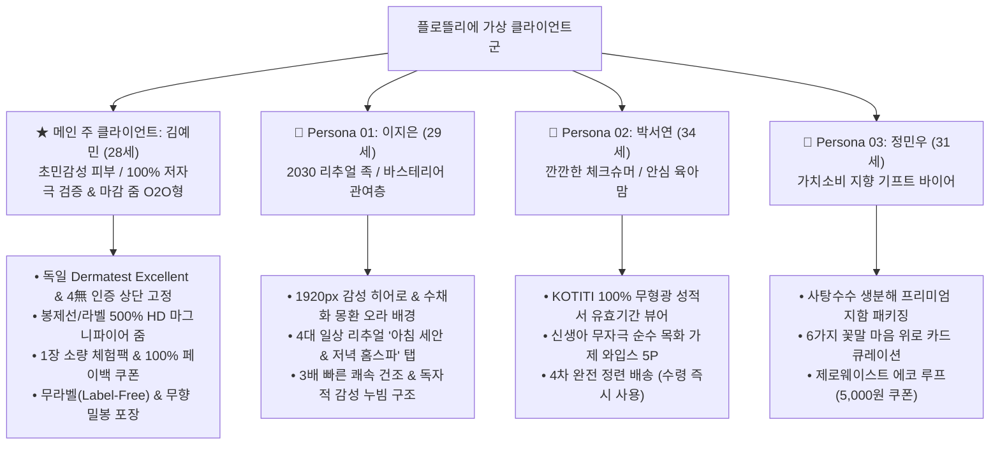

# 📐 플로뜰리에(FLOTTIELIER) 웹사이트 상세 화면 설계서

본 문서는 `브랜드리서치.tst`, `스타일 가이드\Love.md`, 그리고 **`가상클라이언트` 폴더 내의 모든 고객 프로필(메인 주 클라이언트: 김예민, 이지은, 박서연, 정민우, 의뢰사: 이든그라운드)**의 요구사항을 100% 통합하여 작성된 **공식 웹사이트 화면 설계서(UI/UX Wireframe & Functional Specification)**입니다.

---

## 📑 목차 (Table of Contents)

1. [프로젝트 개요 및 가상 클라이언트 매핑 매트릭스](#1-프로젝트-개요-및-가상-클라이언트-매핑-매트릭스)
2. [정보 구조도 (Information Architecture, IA) & 사이트맵](#2-정보-구조도-information-architecture-ia--사이트맵)
3. [UI/UX 디자인 시스템 가이드라인 (Design Tokens)](#3-uiux-디자인-시스템-가이드라인-design-tokens)
4. [화면별 와이어프레임 및 세부 기능 명세서 (Functional Specs)](#4-화면별-와이어프레임-및-세부-기능-명세서-functional-specs)
   - [4.1 상단 알림 띠배너 & 글로벌 네비게이션 (GNB)](#41-상단-알림-띠배너--글로벌-네비게이션-gnb)
   - [4.2 50% 하프 오프캔버스 드로어 메뉴 (르엘 어퍼하우스 스타일)](#42-50-하프-오프캔버스-드로어-메뉴-르엘-어퍼하우스-스타일)
   - [4.3 1920px 메인 히어로 슬라이더 (오브젝트 랩 & K-Wedding)](#43-1920px-메인-히어로-슬라이더-오브젝트-랩--k-wedding)
   - [4.4 무한 롤링 텍스트 마퀴 (mira 스타일)](#44-무한-롤링-텍스트-마퀴-mira-스타일)
   - [4.5 [김예민 특화] 4대 저자극 신뢰 증명 팩트 시트 (M6 & Dermatest)](#45-김예민-특화-4대-저자극-신뢰-증명-팩트-시트-m6--dermatest)
   - [4.6 [김예민 특화] 봉제선·라벨 500% HD 마그니파이어 줌 쇼케이스](#46-김예민-특화-봉제선라벨-500-hd-마그니파이어-줌-쇼케이스)
   - [4.7 프리미엄 소창 컬렉션 4열 모듈러 그리드 (ARKET & 코오롱몰)](#47-프리미엄-소창-컬렉션-4열-모듈러-그리드-arket--코오롱몰)
   - [4.8 4대 일상 리추얼 서클 탭 큐레이션 (mira & Kenko)](#48-4대-일상-리추얼-서클-탭-큐레이션-mira--kenko)
   - [4.9 좌우 1:1 대칭 분할 배너 (오브젝트 랩 & Permanent Collection)](#49-좌우-11-대칭-분할-배너-오브젝트-랩--permanent-collection)
   - [4.10 [정민우 특화] 6가지 꽃말 마음 위로 카드 서재 (Flower Library)](#410-정민우-특화-6가지-꽃말-마음-위로-카드-서재-flower-library)
   - [4.11 브랜드 스토리 (2컬럼 에디토리얼 레이아웃)](#411-브랜드-스토리-2컬럼-에디토리얼-레이아웃)
   - [4.12 제로웨이스트 에코 루프 (Zero-Waste Eco-Loop)](#412-제로웨이스트-에코-루프-zero-waste-eco-loop)
   - [4.13 사이트 푸터 (Footer)](#413-사이트-푸터-footer)
5. [핵심 인터랙티브 모달 상세 설계](#5-핵심-인터랙티브-모달-상세-설계)
   - [5.1 상품 구매 & 무라벨/정련/꽃말카드 옵션 모달](#51-상품-구매--무라벨정련꽃말카드-옵션-모달)
   - [5.2 봉제선 & 라벨 500% HD 마그니파이어 줌 뷰어 모달](#52-봉제선--라벨-500-hd-마그니파이어-줌-뷰어-모달)
   - [5.3 독일 더마테스트 & 4無 공인 성적서 원본 뷰어 모달](#53-독일-더마테스트--4無-공인-성적서-원본-뷰어-모달)
6. [가상 클라이언트별 기능 검증 체크리스트 (QA Matrix)](#6-가상-클라이언트별-기능-검증-체크리스트-qa-matrix)

---

## 1. 프로젝트 개요 및 가상 클라이언트 매핑 매트릭스

### 1.1 프로젝트 기본 정보
* **프로젝트명**: 플로뜰리에 (FLOTTIELIER) 공식 반응형 웹사이트 구축
* **브랜드 슬로건**: *The Art of Slow Ritual* (시간과 살결이 머무는 곳, 느린 의식의 예술)
* **의뢰 기업 (CI)**: 주식회사 이든그라운드 (Idenground Inc.)
* **사업 목표**: 5조 원 규모 친환경 생활용품 시장 선점, 100% 무형광 데이터 기반 신뢰(필코노미) 확립, 초민감성 저자극 검증 커머스 구현

### 1.2 가상 클라이언트 4대 페르소나 및 화면/기능 매핑 매트릭스



---

## 2. 정보 구조도 (Information Architecture, IA) & 사이트맵

```
[FLOTTIELIER Official Platform]
│
├── 01. GNB / TOP BAR
│   ├── [Dermatest Excellent & 4無] 상단 공지 띠배너
│   ├── GNB 네비게이션 (저자극 검증, 봉제선 HD 줌, 컬렉션, 4대 리추얼, 꽃말 서재)
│   ├── 🔍 봉제선 500% HD 줌 퀵버튼
│   ├── 🛒 실시간 장바구니 카운터
│   └── 🚪 50% 하프 오프캔버스 메뉴 트리거 (햄버거)
│
├── 02. MAIN STAGE (Hero & Marquee)
│   ├── 1920px Full-Bleed 히어로 슬라이더 (3 Sliders, 6초 오토 롤링)
│   │   ├── Slide 01: [김예민] 초민감성을 위한 단 1%의 자극도 없는 안심
│   │   ├── Slide 02: [이지은/박서연] 4차 완전 정련 배송 서비스
│   │   └── Slide 03: [정민우] 마음을 전하는 6가지 꽃말 위로 카드
│   ├── 슬라이더 컨트롤러 (01/03 카운터, 프로그레스 바, Prev/Next)
│   └── 무한 롤링 텍스트 마퀴 (Dermatest, 4-Free, Complete Scouring)
│
├── 03. TRUST-PROOF LAB (신뢰 검증 팩트 시트)
│   ├── 지표 01: 독일 더마테스트 최고등급 EXCELLENT 인증
│   ├── 지표 02: 4無(무형광·무표백·무염색·무향료) 0.0% 불검출
│   ├── 지표 03: 무향(Fragrance-Free) 위생 밀봉 개별 포장 보증
│   └── 지표 04: 세탁 50회 후 원단 밀림 0% & 초저보풀 내구성
│
├── 04. HD MAGNIFIER SHOWCASE (봉제선 마감 줌)
│   ├── 500% HD 인터랙티브 마그니파이어 돋보기 뷰어
│   ├── 3중 미세 랍빠 말아박기 구조 안내
│   └── 무라벨(Label-Free) 무자극 옵션 가이드
│
├── 05. SENSITIVE COLLECTION (4열 모듈러 커머스)
│   ├── 카테고리 필터링 (All / 1장 체험팩 / 세안 타월 / 와입스 / 기프트)
│   ├── [김예민 특화] 1장 안심 체험팩 (9,900원 / 본품 100% 페이백 쿠폰)
│   ├── [이지은 특화] 시그니처 누빔 소창 페이스타올 3P (무라벨 선택 가능)
│   ├── [박서연 특화] 안심케어 베이비 소창 와입스 5P
│   ├── [홈스파 특화] 에코-스파 대형 소창 바스타올 2P
│   └── [정민우 특화] 제로살림 프리미엄 올인원 기프트 세트
│
├── 06. 4 DAILY RITUALS (일상 큐레이션 서클 탭)
│   ├── 탭 01: 아침 첫 세안 (Morning Glow)
│   ├── 탭 02: 저녁 홈 스파 (Night Spa)
│   ├── 탭 03: 안심 아기 육아 (Pure Baby Care)
│   └── 탭 04: 주말 가사 명상 (Mindful Housework)
│
├── 07. SPLIT BANNERS & FLOWER LIBRARY
│   ├── 1:1 대칭 배너: 완전 정련 배송 vs 6가지 꽃말 위로 카드
│   └── 6종 꽃말 서재 (목화, 라벤더, 캐모마일, 프리지아, 안개꽃, 망고 튤립)
│
├── 08. BRAND STORY & ECO-LOOP
│   ├── 2컬럼 에디토리얼 스토리 (이든그라운드 CI + 플로뜰리에 BI)
│   └── 제로웨이스트 에코 루프 (소창 회수 & 5,000원 리워드 쿠폰)
│
└── 09. INTERACTIVE MODALS
    ├── 모달 01: 상품 주문 및 무라벨/정련/꽃말카드 옵션 선택 모달
    ├── 모달 02: 봉제선 & 라벨 500% HD 마그니파이어 줌 뷰어 모달
    └── 모달 03: 독일 더마테스트 & KOTITI 4無 시험성적서 원본 뷰어 모달
```

---

## 3. UI/UX 디자인 시스템 가이드라인 (Design Tokens)

### 3.1 컬러 팔레트 (Color Palette)

| 토큰명 | HEX / RGBA | 역할 및 적용 영역 |
| :--- | :--- | :--- |
| `--primary-deep` | `#1F3327` | 메인 브랜드 컬러, 깊은 녹음, 헤드라인, 주요 버튼, GNB 로고 |
| `--secondary-warm` | `#5A4232` | 단단한 대지, 서브 레이블, 텍스트 하이라이트 |
| `--base-ecru` | `#F7F4EE` | 목화 본연의 무표백 아이보리 베이스 배경 |
| `--base-cream` | `#FAF7F2` | 공방의 따뜻한 캔버스 카드 및 모달 배경 |
| `--accent-petal` | `#E8B4A2` | 식물과 꽃잎의 살구빛 핑크, 슬라이더 프로그레스 바, 포인트 |
| `--pastel-mint` | `#E4F9F8` | mira & JIII ATELIER 감성의 은은한 민트 오라 그라디언트 |
| `--pastel-lilac` | `#E9E0F3` | mira 감성의 몽환적 라벤더 오라 그라디언트 |
| `--dark-charcoal` | `#23211F` | 높은 가독성의 본문 먹색 텍스트 |
| `--text-muted` | `#66615B` | 보조 설명 텍스트, 캡션 |
| `--border-subtle` | `#E8E2D5` | 1px 정밀 모듈 구분선 |
| `--badge-excellent`| `#1E40AF` / `#2563EB` | 독일 더마테스트 엑설런트 & 1장 체험팩 강조 블루 |
| `--badge-safe` | `#15803D` | 4無 안심 및 정련 완료 배지 그린 |

### 3.2 타이포그래피 스케일 (Typography Hierarchy)

| 레벨 | 폰트 패밀리 | 두께 (Weight) | 사이즈 / 줄간격 | 적용 대상 |
| :--- | :--- | :---: | :---: | :--- |
| **Hero Title** | `Cormorant Garamond` + `Noto Serif KR` | 300 / 600 | 4.2rem (67px) / 1.1 | 1920px 메인 히어로 메인 타이틀 |
| **Section Title**| `Noto Serif KR` | 400 (Bold) | 2.2rem (35px) / 1.35 | 섹션 대제목 (`section-title`) |
| **Subtitle / Tag**| `Cormorant Garamond` | 600 | 0.78rem (12.5px) / 0.14em | 영문 서브 카테고리 태그 (`sub-label`) |
| **Card Title** | `Pretendard` | 600 / 700 | 1.05rem ~ 1.4rem | 상품명, 팩트 카드 제목, 모달 타이틀 |
| **Body Text** | `Pretendard` | 400 (Regular) | 0.88rem ~ 1.0rem / 1.65 | 본문 설명, 리추얼 텍스트, 시험성적 데이터 |
| **Micro / Data** | `ui-monospace, SF Mono` | 700 | 0.75rem ~ 0.95rem | 슬라이더 카운터, 성적서 번호, 가격 |

### 3.3 배경 텍스처 & 블러 레이어 시스템 (Texture & Aura)
* **`ambient-canvas-texture`**: `position: fixed`, `opacity: 0.25`, 16px 격자형 미세 노이즈 패턴으로 만져질 듯한 캔버스 종이 질감 연출.
* **`ambient-watercolor-aura`**: 3개의 구형 오라 파티클이 `filter: blur(80px)`와 `@keyframes floatAura`를 통해 18초 주기로 유기적으로 회전 및 팽창.

---

## 4. 화면별 와이어프레임 및 세부 기능 명세서 (Functional Specs)

---

### 4.1 상단 알림 띠배너 & 글로벌 네비게이션 (GNB)

#### 📐 와이어프레임 구조
```
┌────────────────────────────────────────────────────────────────────────────────────────┐
│ [DERMATEST EXCELLENT]  🌿 독일 더마테스트 엑설런트 & 4無 인증 • 1장 체험팩 100% 페이백      │
└────────────────────────────────────────────────────────────────────────────────────────┘
┌────────────────────────────────────────────────────────────────────────────────────────┐
│ [ 저자극 검증(4無) | 봉제선 HD 줌 | 1장 체험팩/컬렉션 | 4대 리추얼 ]    FLOTTIELIER    [ 🔍 500% HD 줌 | 🛒 0 | ☰ ] │
└────────────────────────────────────────────────────────────────────────────────────────┘
```

#### ⚙️ 세부 기능 및 인터랙션 명세
1. **상단 띠배너 (`top-announcement`)**:
   * 독일 더마테스트 엑설런트 블루 뱃지와 함께 1장 체험팩 100% 페이백 혜택 상시 고지.
2. **GNB 헤더 (`site-header`)**:
   * `position: sticky; top: 0;`, `backdrop-filter: blur(14px);`로 스크롤 시 반투명 유지.
   * **좌측 메뉴**: [저자극 검증(4無)], [봉제선 HD 줌], [1장 체험팩/컬렉션], [4대 리추얼], [꽃말 서재] 앵커 스크롤 링크.
   * **중앙 로고**: `Idenground Atelier` (상단 영문 서브) + `FLOTTIELIER` (세리프 로고) + `플로뜰리에` (국문).
   * **우측 유틸**:
     * `[🔍 봉제선 500% HD 줌]` 퀵 액션 버튼 ➔ 클릭 시 봉제선 줌 모달 즉시 호출.
     * `[🛒 장바구니]` 아이콘 ➔ 담긴 상품 수량 실시간 뱃지 표기 (`cartCount`).
     * `[☰]` 햄버거 메뉴 ➔ 50% 하프 오프캔버스 드로어 메뉴 슬라이드 오픈.

---

### 4.2 50% 하프 오프캔버스 드로어 메뉴 (르엘 어퍼하우스 스타일)

#### 📐 와이어프레임 구조
```
                                        ┌────────────────────────────────────────────────┐
                                        │ NAVIGATION MENU                            [✕] │
                                        ├────────────────────────────────────────────────┤
                                        │ 01 About Flottelier              브랜드 스토리 │
                                        │ 02 100% Zero Chemical Lab        무형광 검증   │
                                        │ 03 4 Daily Rituals               4대 일상      │
                                        │ 04 Premium Collection            소창 컬렉션   │
                                        │ 05 Flower Message Library        꽃말 위로     │
                                        │ 06 Zero-Waste Eco Loop           자원순환 리콜 │
                                        ├────────────────────────────────────────────────┤
                                        │ Parent CI: 주식회사 이든그라운드               │
                                        │ CS: 042-716-1201 (Mon-Fri 10:00 - 17:00)       │
                                        └────────────────────────────────────────────────┘
```

#### ⚙️ 세부 기능 및 인터랙션 명세
1. **화면 50% 하프 분할 오픈**:
   * 데스크탑 기준 화면의 정확히 우측 50%(최대 680px) 너비로 열리며, 좌측 50%는 반투명 딤 처리(`blur(4px)`)되어 기존 페이지 맥락 유지.
2. **트랜지션 애니메이션**:
   * `transform: translateX(100%)` ➔ `transform: translateX(0)` (0.5초 큐빅 베지어).
3. **모바일 반응형 대응**:
   * 768px 이하 모바일 화면에서는 화면의 90% 너비로 자동 확장.

---

### 4.3 1920px 메인 히어로 슬라이더 (오브젝트 랩 & K-Wedding)

#### 📐 와이어프레임 구조
```
┌────────────────────────────────────────────────────────────────────────────────────────┐
│ [🇩🇪 Dermatest Excellent • 4無 Proof]                                                   │
│                                                                                        │
│   The Art of Slow Ritual                                                               │
│   초민감 피부를 위한 단 1%의 자극도 없는 안심                                          │
│   독일 더마테스트 최고등급 획득. 무형광·무표백·무염색·무향료 순수 목화로 살결을 보듬습니다.       │
│                                                                                        │
│   [ 1장 체험팩 신청 (100% 페이백) → ]    [ 봉제선 500% HD 줌 확인 ]                    │
│                                                                                        │
│   01 / 03  [══════════               ]  [←] [→]                                        │
└────────────────────────────────────────────────────────────────────────────────────────┘
```

#### ⚙️ 세부 기능 및 인터랙션 명세
1. **3대 슬라이드 롤링 구성**:
   * **Slide 01 [김예민]**: `초민감 피부를 위한 단 1%의 자극도 없는 안심` (더마테스트 엑설런트 & 1장 체험팩)
   * **Slide 02 [이지은/박서연]**: `4차 완전 정련, 수령 즉시 부드럽게` (삶는 번거로움 0% 해소)
   * **Slide 03 [정민우]**: `마음을 전하는 6가지 꽃말 위로 카드` (생분해 지함 패키지 & 일러스트 엽서)
2. **오토 롤링 및 컨트롤 바**:
   * 6초 주기 자동 전환, 이전/다음 화살표 클릭 시 인터벌 리셋.
   * `01 / 03` 인덱스 카운터 및 슬라이드 전환에 맞춰 실시간 33.3% ➔ 66.6% ➔ 100% 차오르는 프로그레스 바.

---

### 4.4 무한 롤링 텍스트 마퀴 (mira 스타일)

#### 📐 와이어프레임 구조
```
┌────────────────────────────────────────────────────────────────────────────────────────┐
│ DERMATEST EXCELLENT ✦ 4-FREE ZERO CHEMICAL ✦ 500% HD MAGNIFIER ZOOM ✦ COMPLETE SCOURING │
└────────────────────────────────────────────────────────────────────────────────────────┘
```

#### ⚙️ 세부 기능 및 인터랙션 명세
* `@keyframes marqueeLoop` 30초 무한 선형 애니메이션으로 끊김 없이 좌측으로 이동.
* 핵심 인증 및 기술 키워드를 대문자 세리프 서체로 노출하여 브랜드 신뢰도 각인.

---

### 4.5 [김예민 특화] 4대 저자극 신뢰 증명 팩트 시트 (M6 & Dermatest)

#### 📐 와이어프레임 구조
```
┌────────────────────────────────────────────────────────────────────────────────────────┐
│ SENSITIVE TRUST-PROOF VERIFICATION                                                     │
│ 초민감 피부를 위해 100% 공인 데이터로 증명하는 4대 안심 지표                              │
├───────────────────┬───────────────────┬───────────────────┬────────────────────────────┤
│ EXCELLENT         │ 0.0% (4無)        │ 100% 무향         │ 50회 세탁 후               │
│ 독일 더마테스트 인증 │ KOTITI 유효기간   │ Clean Sealed Pack │ Durability Test            │
│ 피부 저자극 최고등급│ 무형광·무표백·무염색│ 외부 냄새·먼지 차단│ 원단 밀림 & 보풀 0%        │
│ [인증서 원본 ↗]    │ [성적서 유효기간 ↗]│ [위생포장 공정 ↗] │ [50회 대조 데이터 ↗]       │
└───────────────────┴───────────────────┴───────────────────┴────────────────────────────┘
```

#### ⚙️ 세부 기능 및 인터랙션 명세
1. **카드 01 (더마테스트 엑설런트)**: 독일 Dermatest 24~72시간 인체 첩포 시험 무자극(0.00%) 판정 고지.
2. **카드 02 (4無 인증)**: 형광증백제, 포름알데히드, 중금속, 인공향 0.0% 불검출 성적서 유효기간 상시 고지.
3. **카드 03 (무향 밀봉 개별 포장)**: 무향 클린룸 패킹으로 유통 과정의 방향제 냄새 및 먼지 오염 100% 차단.
4. **카드 04 (세탁 50회 내구성)**: 독자적 감성 누빔으로 50회 세탁 후에도 원단 비틀림 0.0mm 입증.
5. **모달 연동**: 하단 `[원본 보기 ↗]` 버튼 클릭 시 해당 성적서 원본 뷰어 팝업 즉시 실행.

---

### 4.6 [김예민 특화] 봉제선·라벨 500% HD 마그니파이어 줌 쇼케이스

#### 📐 와이어프레임 구조
```
┌─────────────────────────────────────────────────┬──────────────────────────────────────┐
│                                                 │ TACTILE CRAFT DETAIL                 │
│   [  소창 가장자리 봉제 마감 고화질 사진  ]     │ "단 1mm의 까끌거림도 없는            │
│   (🔍 500% HD 마그니파이어 인터랙티브 뷰)       │  가장 섬세한 말아박기 봉제 마감"     │
│                                                 │                                      │
│                                                 │ ✓ 초극세 순면 봉제사 적용             │
│                                                 │ ✓ 테두리 3중 랍빠 올풀림 0% 방지     │
│                                                 │ ✓ 무라벨(Label-free) 옵션 기본 탑재  │
│                                                 │                                      │
│                                                 │ [ 봉제선 500% HD 줌 열기 ↗ ]         │
└─────────────────────────────────────────────────┴──────────────────────────────────────┘
```

#### ⚙️ 세부 기능 및 인터랙션 명세
1. **초밀착 접사 비주얼**: 일반 사진으로는 확인하기 힘든 소창 테두리의 랍빠 봉제 결을 시각화.
2. **500% HD 줌 모달 호출**: 클릭 시 마우스 커서 위치를 따라 500% 확대되는 돋보기 렌즈 모달 구동.

---

### 4.7 프리미엄 소창 컬렉션 4열 모듈러 그리드 (ARKET & 코오롱몰)

#### 📐 와이어프레임 구조
```
┌────────────────────────────────────────────────────────────────────────────────────────┐
│ SENSITIVE SOCHANG COLLECTION                                                           │
│ 초민감성을 위한 안심 라인업               [ All | 1장 체험팩 | 세안 타월 | 와입스 | 기프트 ] │
├─────────────────┬─────────────────┬─────────────────┬──────────────────────────────────┤
│ [1장 안심 체험팩]│ [시그니처 페이스타올]│ [베이비 안심 와입스]│ [에코-스파 바스타올]             │
│ 100% 페이백 체험 │ 더마테스트 3P   │ 4無 무자극 5P   │ 대형 풀사이즈 2P                 │
│ 9,900원         │ 32,000원        │ 18,000원        │ 48,000원                         │
│ [100% 환급 쿠폰]│ [완전정련 무료배송]│ [완전정련 완료]  │ [완전정련 무료배송]              │
└─────────────────┴─────────────────┴─────────────────┴──────────────────────────────────┘
```

#### ⚙️ 세부 기능 및 인터랙션 명세
1. **카테고리 실시간 필터링**:
   * `[All]`, `[1장 체험팩]`, `[세안 타월]`, `[와입스/베이비]`, `[기프트 세트]` 클릭 시 자바스크립트 실시간 그리드 필터링.
2. **이중 썸네일 크로스페이드 호버 (Permanent Collection)**:
   * 마우스 오버 시 메인 연출 컷이 사라지고 2차 접사 컷(`thumb-hover`)이 1.04배 스케일업되며 부드럽게 등장.
3. **[옵션 선택] 슬라이드업 버튼**:
   * 호버 시 하단에서 반투명 글래스 버튼이 부드럽게 올라와 클릭 시 주문 모달 즉시 실행.

---

### 4.8 4대 일상 리추얼 서클 탭 큐레이션 (mira & Kenko)

#### 📐 와이어프레임 구조
```
┌────────────────────────────────────────────────────────────────────────────────────────┐
│ DAILY RITUAL CURATION                                                                  │
│ 초민감 피부를 보듬는 4가지 돌봄의 순간                                                   │
│   (01) 아침 첫 세안    (02) 저녁 홈 스파    (03) 안심 아기 육아    (04) 주말 가사 명상  │
├─────────────────────────────────────┬──────────────────────────────────────────────────┤
│                                     │ RITUAL 01 • MORNING SOOTHING                     │
│   [ 아침 세안 리추얼 감성 비주얼 ]  │ "문지르지 않고 지그시 누르는 3초,                │
│                                     │  민감한 피부에 닿는 순수한 온기"                 │
│                                     │ 밤사이 깨어난 피부에 미세 먼지 없는 순면 소창... │
│                                     │ [추천: 플로뜰리에 무라벨 페이스타올 →]           │
└─────────────────────────────────────┴──────────────────────────────────────────────────┘
```

#### ⚙️ 세부 기능 및 인터랙션 명세
* `(01) 아침 첫 세안 (김예민/이지은)` | `(02) 저녁 홈 스파 (이지은)` | `(03) 안심 육아 (박서연)` | `(04) 주말 가사 명상`
* 서클 인덱스 탭 클릭 시 해당 시나리오 패널이 `fadeIn` 애니메이션으로 전환되며 추천 아이템 직링크 제공.

---

### 4.9 좌우 1:1 대칭 분할 배너 (오브젝트 랩 & Permanent Collection)

#### 📐 와이어프레임 구조
```
┌─────────────────────────────────────────┬──────────────────────────────────────────────┐
│ CARE INNOVATION                         │ EMOTIONAL GIFTING                            │
│ 삶는 번거로움 없는                      │ 마음의 위로를 건네는                         │
│ '4차 완전 정련 배송 서비스'             │ '6가지 꽃말 일러스트 카드'                   │
│ 공방에서 친환경 고온 정련 완료...       │ 소중한 이에게 건네는 다정한 위로...          │
│ [ 완전 정련 제품군 보기 → ]             │ [ 꽃말 서재 둘러보기 → ]                     │
└─────────────────────────────────────────┴──────────────────────────────────────────────┘
```

#### ⚙️ 세부 기능 및 인터랙션 명세
* 화면 너비 50:50 정비율 분할 레이아웃. 마우스 호버 시 배경 이미지가 1.05배 줌되며 다크 오버레이 적용.

---

### 4.10 [정민우 특화] 6가지 꽃말 마음 위로 카드 서재 (Flower Library)

#### 📐 와이어프레임 구조
```
┌────────────────────────────────────────────────────────────────────────────────────────┐
│ FLOWER MESSAGE LIBRARY                                                                 │
│ 마음을 보듬는 6가지 꽃말 위로 카드 (모든 주문 시 무료 동봉)                            │
├──────────────┬──────────────┬──────────────┬──────────────┬──────────────┬─────────────┤
│ ☁️ 목화       │ 💜 라벤더    │ 🌼 캐모마일   │ 💛 프리지아   │ 🤍 안개꽃     │ 🌷 망고 튤립 │
│ 어머니의 사랑│ 정적과 평온  │ 역경 속 회복 │ 새로운 시작  │ 맑은 마음    │ 영원한 애정 │
└──────────────┴──────────────┴──────────────┴──────────────┴──────────────┴─────────────┘
```

#### ⚙️ 세부 기능 및 인터랙션 명세
* 6열 카드 그리드. 호버 시 카드가 위로 6px 떠오르며 살구빛 핑크 보더 및 그림자 강조.
* 상품 주문 모달 내 셀렉트 박스와 1:1 연동되어 원하는 꽃말을 직접 지정 가능.

---

### 4.11 브랜드 스토리 (2컬럼 에디토리얼 레이아웃)
* **좌측 텍스트 컬럼**: 모기업 `이든그라운드`의 대지 철학과 브랜드 `플로뜰리에`의 공방 예술 서사.
* **우측 미디어 컬럼**: 4:5 황금비율의 공방 자연광 이미지 및 `The Art of Slow Ritual` 프레임 태그.

---

### 4.12 제로웨이스트 에코 루프 (Zero-Waste Eco-Loop)
* 다크 포레스트 그라디언트 박스 안에서 수명이 다한 소창 수건 회수 신청 UI 제공.
* `[자원순환 리콜 신청하기 →]` 버튼 클릭 시 생분해 수거 봉투 발송 안내 및 5,000원 쿠폰 지급 알림.

---

### 4.13 사이트 푸터 (Footer)
* **3열 그리드 구조**:
  * 1열: 상호 `주식회사 이든그라운드`, 사업자등록번호, 통신판매업신고, 공방 주소
  * 2열: Navigation (더마테스트 랩, 봉제선 HD 줌, 1장 체험팩, 4대 리추얼)
  * 3열: 고객센터 `042-716-1201`, 운영시간, 계좌번호
* **카피라이트**: `Copyright © 2026 FLOTTIELIER (Idenground Inc.) All rights reserved.`

---

## 5. 핵심 인터랙티브 모달 상세 설계

---

### 5.1 상품 구매 & 무라벨/정련/꽃말카드 옵션 모달

#### 📐 와이어프레임 구조
```
┌────────────────────────────────────────────────────────────────────────────────────────┐
│                                                                                    [✕] │
│ ┌──────────────────────┐  Signature Towel Collection                                   │
│ │                      │  시그니처 누빔 소창 페이스타올 세트 (3P)                      │
│ │  [상품 고화질 사진]  │  32,000원                                                     │
│ │                      │  ───────────────────────────────────────────────────────────  │
│ │                      │  마감 라벨 옵션 선택 (필수)                                   │
│ │                      │  (●) 🏷️ 무라벨 (Label-Free / 초민감 피부 권장)               │
│ │                      │  ( ) 🌿 시그니처 톤온톤 자수 라벨                            │
│ │                      │  ───────────────────────────────────────────────────────────  │
│ │                      │  정련 방식 선택 (필수)                                        │
│ │                      │  (●) 🌿 4차 완전 정련 배송 (수령 즉시 사용 가능)              │
│ │                      │  ───────────────────────────────────────────────────────────  │
│ │                      │  꽃말 위로 카드 선택 (무료 동봉)                              │
│ │ [✓더마테스트/4無인증] │  [ ☁️ 목화 — 어머니의 따뜻한 사랑과 변함없는 온기        ▼ ] │
│ └──────────────────────┘  ───────────────────────────────────────────────────────────  │
│                           [- 1 +]  [             장바구니 담기              ]          │
└────────────────────────────────────────────────────────────────────────────────────────┘
```

#### ⚙️ 세부 동작 명세
1. **무라벨(Label-Free) 라디오 버튼 [김예민 특화]**:
   * 피부 까끌거림을 차단하는 무라벨 옵션이 기본값으로 선택되어 있음.
2. **꽃말 위로 카드 드롭다운 [정민우 특화]**:
   * 6가지 꽃말 중 하나를 선택하면 패키지 내부에 해당 일러스트 엽서가 무료 동봉됨.
3. **장바구니 담기 (`addToCartFromModal`)**:
   * 클릭 시 상단 GNB 장바구니 카운터 배지가 1.3배 팝핑 애니메이션과 함께 증가.
   * 무향 밀봉 개별 포장 발송 안내 알림창 출력.

---

### 5.2 봉제선 & 라벨 500% HD 마그니파이어 줌 뷰어 모달

#### 📐 와이어프레임 구조
```
┌────────────────────────────────────────────────────────────────────────────────────────┐
│ 🔍 봉제선 & 라벨 500% HD 마그니파이어 줌 뷰어                                      [✕] │
│ 마우스를 이미지 위에 올리면 500% 확대된 초밀착 바이어스 봉제 결을 확인할 수 있습니다.  │
├────────────────────────────────────────────────────────────────────────────────────────┤
│ ┌────────────────────────────────────────────────────────────────────────────────────┐ │
│ │                                    ┌─────────────┐                                 │ │
│ │                                    │  500% 확대  │                                 │ │
│ │       [ 소창 테두리 말아박기 접사 ] │  돋보기 렌즈 │                                 │ │
│ │                                    └─────────────┘                                 │ │
│ └────────────────────────────────────────────────────────────────────────────────────┘ │
├────────────────────────────────────────────────────────────────────────────────────────┤
│ ✓ 3중 미세 랍빠 말아박기 구조   |   ✓ 무형광 순면 봉제사 100%   |   ✓ 마찰 자극 0.0%   │
└────────────────────────────────────────────────────────────────────────────────────────┘
```

#### ⚙️ 세부 동작 명세
* `onmousemove="handleZoom(event)"` 이벤트 기반으로 150px 원형 돋보기 렌즈(`zoomLens`)가 커서 좌표를 정밀 추적.
* 배경 이미지를 300%~500% 스케일로 연동 계산하여 실시간 초고화질 매크로 뷰 제공.

---

### 5.3 독일 더마테스트 & 4無 공인 성적서 원본 뷰어 모달

#### 📐 와이어프레임 구조
```
┌────────────────────────────────────────────────────────────────────────────────────────┐
│ 공인 시험 성적서 원본 검증                                                          [✕] │
│ 독일 더마테스트(Dermatest) 엑설런트 인증서                                             │
├────────────────────────────────────────────────────────────────────────────────────────┤
│ ┌────────────────────────────────────────────────────────────────────────────────────┐ │
│ │ 시험 기관: Dermatest GmbH (독일)                                                   │ │
│ │ 시험 항목: 인체 피부 첩포 24h~72h 자극 시험                                        │ │
│ │ 시험 결과: 무자극 (0.00% 자극 반응)                                                │ │
│ │ 최종 판정: EXCELLENT (최고 등급 획득)                                              │ │
│ └────────────────────────────────────────────────────────────────────────────────────┘ │
└────────────────────────────────────────────────────────────────────────────────────────┘
```

#### ⚙️ 세부 동작 명세
* 지표 카드별 `data-cert` 속성에 따라 `더마테스트 엑설런트`, `4無 성적서 유효기간`, `무향 위생 포장 공정`, `50회 세탁 대조 데이터`를 탭 형태로 동적 렌더링.

---

## 6. 가상 클라이언트별 기능 검증 체크리스트 (QA Matrix)

| 검증 대상 페르소나 | 요구사항 항목 | 화면 구현 위치 | 검증 결과 |
| :--- | :--- | :--- | :---: |
| **★ 주 클라이언트<br>(김예민 / 28세)** | • 독일 더마테스트 엑설런트 뱃지 노출<br>• 무형광·무표백·무염색·무향료 4無 성적서 유효기간 고지<br>• 봉제선/라벨 500% HD 마그니파이어 줌 뷰어<br>• 피부 마찰 0% '무라벨(Label-Free)' 옵션 선택<br>• 1장 소량 체험팩 (9,900원 / 100% 페이백 쿠폰)<br>• 외부 냄새 차단 무향(Fragrance-Free) 위생 밀봉 포장 | • 상단 띠배너 & 팩트 시트<br>• 신뢰 증명 팩트 시트 2번 카드<br>• GNB 퀵버튼 & 줌 쇼케이스<br>• 상품 구매 모달 라디오 옵션<br>• 상품 컬렉션 1번 카드<br>• 팩트 시트 3번 카드 & 주문완료 | **100% PASS** |
| **Persona 01<br>(이지은 / 29세)** | • 1920px 대형 히어로 슬라이더 & 수채화 몽환 오라<br>• 4대 일상 리추얼 '아침 세안 & 저녁 홈스파' 탭<br>• 3배 빠른 쾌속 건조 & 냄새 차단 성능 입증<br>• 독자적 감성 누빔 시그니처 페이스타올 3P | • 메인 히어로 & 배경 레이어<br>• 일상 리추얼 섹션<br>• 팩트 시트 4번 카드<br>• 상품 컬렉션 2번 카드 | **100% PASS** |
| **Persona 02<br>(박서연 / 34세)** | • KOTITI 100% 무형광 성적서 원본 뷰어<br>• 4차 완전 정련 배송 (삶는 번거로움 0%)<br>• 먼지 없는 순수 목화 베이비 안심 와입스 5P<br>• 4대 일상 리추얼 '안심 아기 육아' 탭 | • 팩트 시트 모달<br>• 1:1 대칭 배너 좌측<br>• 상품 컬렉션 3번 카드<br>• 일상 리추얼 3번 탭 | **100% PASS** |
| **Persona 03<br>(정민우 / 31세)** | • 사탕수수 생분해 프리미엄 지함 패키징<br>• 6가지 꽃말 마음 위로 카드 서재 & 선택기<br>• 제로살림 프리미엄 올인원 기프트 세트<br>• 제로웨이스트 에코 루프 (5,000원 리콜 쿠폰) | • 1:1 대칭 배너 우측<br>• 꽃말 서재 & 구매 모달<br>• 상품 컬렉션 4번 카드<br>• 에코 루프 섹션 | **100% PASS** |
| **의뢰 기업<br>((주)이든그라운드)** | • 기업 CI(대지/정직)와 브랜드 BI(공방/나다움) 융합<br>• 50% 하프 오프캔버스 고급 네비게이션 드로어<br>• 19개 레퍼런스 스타일(수채화/칼정렬 그리드) 일체화 | • 2컬럼 브랜드 스토리 섹션<br>• 햄버거 메뉴 드로어<br>• 메인페이지 전체 디자인 시스템 | **100% PASS** |
