# 🗺️ [사이트맵] 플로뜰리에 (Flottelier) 오하운 스포츠 & 액티비티 센터 사이트맵

> **프로젝트**: 플로뜰리에 (Flottelier) 오하운 스포츠 & 액티비티 센터  
> **기반 페르소나**: 김운동 (김오하운 / 강태오 - 20대 후반 애슬레저·러닝·헬스 유저)  
> **기준 입력 파일**: `김운동_가상클라이언트_분석결과.md`  
> **결과물 저장 폴더**: `김운동 가상 클라이언트 설계 결과/`  
> **버전**: v1.0.0 (WCAG 2.1 AA 접근성 & 반응형 모바일 터치 최적화)  
> **인코딩**: UTF-8

---

## 1. 프로젝트 개요

본 프로젝트는 고강도 운동(러닝, 헬스, 크로스핏, 클라이밍 등) 시 발생하는 땀과 눅눅함, 운동 가방 속 땀 냄새(모락셀라균), 극세사 타월의 미세플라스틱 피부 자극에 불편을 겪는 애슬레저 유저 **김운동(김오하운)**의 15대 핵심 니즈를 완벽하게 반영하여 설계된 스포츠 전문 소창 플랫폼입니다.

전통 강화 소창의 4차 정련 기술을 기반으로 **[1초 초고속 땀 흡수]**, **[통기성 격자 구조를 통한 땀 냄새 99.8% 억제]**, **[일반 타월 대비 40% 가벼운 95g 초경량 휴대성]**, **[운동 후 1시간 퀵 드라이]** 실증 데이터를 직관적인 인터랙션으로 제공하고, 스포츠 슬림 롱타월(30x90cm) 및 스냅 단추 스트랩, Canvas 실시간 슬로건 자수, 1장 안심 체험팩(100% 환급)을 체계적으로 구조화하였습니다.

---

## 2. 설계 근거 및 핵심 사용자 목표

### 2.1 핵심 사용자 목표 (User Goals)
1. **운동 편의성 극대화**: 목에 두르고 헬스 기구나 락커룸 고리에 걸 수 있는 **30x90cm 슬림 롱타월** 및 **스냅 단추형 스트랩** 옵션 획득.
2. **위생 및 땀 냄새 불안 해소**: 땀을 흘리자마자 1초 만에 흡수하고, 가방 속 땀 냄새 99.8% 탈취 성적서와 1시간 초고속 건조 그래프 확인.
3. **나만의 슬로건 & 크루 자수 커스텀**: 운동 슬로건(*Never Stop*, *Run Free*)이나 러닝 크루명을 실시간 Canvas 자수 시뮬레이터로 시각화하여 주문.
4. **올인원 패키지 & 안심 체험**: 롱타월 1장 + 포켓 와입스 3장 + 통풍 메쉬 파우치가 결합된 **스타터 팩**을 구매하거나, 3,000원에 **1장 안심 체험팩(100% 환급)** 신청.
5. **삶기 없는 간편 관리**: 운동 후 세탁기 표준 코스로 바로 돌릴 수 있는 O/X 세탁 지침서 확인.

### 2.2 정보 아키텍처(IA) 설계 원칙
- **메뉴 폭 (Width)**: 1단계 메인 메뉴 5개 (`SPORT LINEUP`, `PERFORMANCE LAB`, `CUSTOM STUDIO`, `SPORT GUIDE`, `MY & CREW`) 구성 (권장 5~9개 준수).
- **최대 깊이 (Depth)**: 3단계 이내로 전 화면 3-Click 이내 진입 보장.
- **레이블 직관성**: 스포츠 기능성과 활동성에 맞춘 명확한 한국어/영문 병기 레이블 적용.

---

## 3. 전역 내비게이션 구조 (Navigation System)

### 3.1 공통 영역 (Global Common Area)
* **상단 공지 띠배너 (Top Promo Bar)**:
  - `[가방 속 땀 냄새 제로 - 3배 빠른 건조 소창 스포츠 타월]` | `[1장 3,000원 스포츠 안심 체험팩 (본품 구매 시 100% 환급)]`
* **글로벌 내비게이션 (GNB)**:
  - `SPORT LINEUP` (오하운 스타터 팩 / 4겹 슬림 롱타월 / 포켓 미니 와입스)
  - `PERFORMANCE LAB` (1초 땀 흡수 챌린지 / 땀 냄새 제로 99.8% / 40% 초경량 & 1시간 퀵 드라이)
  - `CUSTOM STUDIO` (슬로건 자수 시뮬레이터 / 스냅 스트랩 옵션 / 크루 단체 발주)
  - `SPORT GUIDE` (종목별 겹수 매칭 / 세탁기 간편 관리표 / 미세플라스틱 0% 인증)
  - `MY & CREW` (1장 체험팩 신청 / 장바구니 / 1초 재주문)
* **로컬 내비게이션 (LNB - 스티키 탭 바)**:
  - `[오하운 롱타월]` → `[1초 흡수 실증]` → `[스냅 스트랩 3D]` → `[슬로건 자수]` → `[종목별 겹수]` → `[1장 체험팩]`
* **브레드크럼 (Breadcrumb Navigation)**:
  - 예시: `홈 > SPORT LINEUP > 스포츠 롱타월 > 4겹 슬림 롱타월 (30x90cm)`
* **플로팅 퀵 액션 바 (Floating CTA)**:
  - `[1장 안심 체험팩 신청 (MOD-03)]` | `[Canvas 슬로건 자수기 (MOD-01)]` | `[러닝 크루 단체 견적 (MOD-04)]`
* **푸터 (Global Footer)**:
  - 러닝 크루/제휴 문의 CS, KATRI 탈취 성적서 번호, 4無 안전성 인증 번호, 세탁 가이드 PDF 다운로드, 이용약관, SNS

### 3.2 회원 상태별 영역 (User State Areas)
* **비회원 / 게스트**:
  - 간편 SNS 1초 로그인 (카카오 / 네이버 / Apple), 비회원 주문 조회, 1장 안심 체험팩 신청 가능
* **회원 (김운동 유저)**:
  - 마이 크루 자수 템플릿(문구/폰트/컬러) 자동 저장, 1-Click 재주문, 정기배송 알림, 100% 환급 쿠폰함

### 3.3 예외 처리 영역 (Exception Areas)
* `SCR-EX01` [검색 결과 없음 / 옵션 품절]: 인기 스포츠 검색어 추천, 유사 겹수 롱타월 대체 추천, 재입고 알림톡 신청
* `SCR-EX02` [404 에러 페이지]: 홈 및 오하운 스타터 팩 바로가기 링크 제공

---

## 4. 계층형 사이트맵 (Hierarchical Sitemap)

```text
Flottelier Sport & Activity Platform
├── 0. 공통 / 유틸리티 & 예외 (Global Shared & Exceptions)
│   ├── GNB 상단 띠배너 (땀 냄새 제로 99.8% & 1장 체험팩 안내)
│   ├── GNB 내비게이션 & 디바운스 실시간 검색창
│   ├── 플로팅 퀵바 (자수 시뮬레이터 / 체험팩 신청 / 크루 견적서)
│   ├── SCR-EX01: 검색 결과 없음 / 옵션 일시 품절 화면 [예외]
│   ├── SCR-EX02: 404 Not Found 안내 페이지 [예외]
│   └── 푸터 & KATRI 공인 시험성적서 & 세탁 가이드 PDF 다운로드
│
├── 1. 1차 깊이: SPORT & LINEUP (스포츠 컬렉션)
│   ├── SCR-01: 스포츠 메인 홈 (히어로 비주얼 & 13인 퀵 진입관) [1차]
│   ├── SCR-02: 전체 스포츠 카탈로그 (2·3·4겹 탭 & 종목별 태그) [1차]
│   ├── SCR-03: 오하운 스포츠 스타터 팩 상세 (롱타월+와입스+파우치) [2차]
│   └── SCR-04: 스포츠 슬림 롱타월 단품 상세 (30x90cm & 스냅 스트랩) [2차]
│
├── 2. 1차 깊이: PERFORMANCE & LAB (기능성 실증 연구소)
│   ├── SCR-05: 1초 초고속 땀 흡수 챌린지 (극세사 vs 소창 비교 영상) [1차]
│   ├── SCR-06: 땀 냄새 제로 99.8% 탈취 실험실 (KATRI 성적서 M-05) [1차]
│   └── SCR-07: 40% 초경량 & 1시간 퀵 드라이 랩 (95g 저울 실측 & 타임라인) [1차]
│
├── 3. 1차 깊이: CUSTOM STUDIO (크루 & 슬로건 커스텀)
│   ├── SCR-08: 슬로건 Canvas 실시간 자수 스튜디오 (0.05초 프리뷰) [1차]
│   └── SCR-09: 러닝 크루 단체 자수 & 대량 발주 (수량별 할인 & 직인 PDF) [1차]
│
├── 4. 1차 깊이: SPORT GUIDE (종목별 가이드 & 케어)
│   ├── SCR-10: 운동 종목별 겹수 맞춤 가이드 (러닝/헬스/크로스핏 매칭) [1차]
│   ├── SCR-11: 세탁기 간편 관리 지침서 (삶기 불필요 O/X 표 & PDF) [1차]
│   └── SCR-12: 미세플라스틱 0% 4無 안심 인증 (더마테스트 Excellent) [1차]
│
├── 5. 1차 깊이: MY & CONCIERGE (주문 & 고객 지원)
│   ├── SCR-13: 1장 3,000원 스포츠 안심 체험팩 (100% 환급 쿠폰 M-03) [1차]
│   ├── SCR-14: 장바구니 & 1초 간편결제 (N Pay / 카카오페이 / 메쉬파우치) [1차]
│   └── SCR-15: 마이페이지 & 1-Click 재구매 (자수 템플릿 저장 & 알림톡) [1차]
│
└── 6. 레이어드 모달 시스템 (Layered Modal System)
    ├── MOD-01: Canvas 실시간 슬로건 자수 모달 [인터랙션]
    ├── MOD-02: 스냅 단추 스트랩 3D 뷰어 모달 [인터랙션]
    ├── MOD-03: 1장 안심 체험팩 100% 환급 신청 모달 [인터랙션]
    ├── MOD-04: 러닝 크루 직인 견적서 PDF 1초 출력 모달 [사업자/단체]
    └── MOD-05: KATRI 땀 냄새 억제 성적서 200% 확대 모달 [인증/신뢰]
```

---

## 5. 페이지별 목적, 핵심 콘텐츠, 주요 기능, 연결 페이지 표

| 깊이 | 화면 ID | 페이지명 | 목적 | 핵심 콘텐츠 | 주요 기능 | 연결 페이지 / 모달 |
| :---: | :---: | :--- | :--- | :--- | :--- | :--- |
| **1차** | **SCR-01** | **스포츠 메인 홈** | 스포츠 첫인상 & 1초 흡수 가치 전달 | · 1초 땀 흡수 히어로 비주얼<br>· 40% 경량 & 냄새 억제 요약<br>· 베스트 스타터 팩 카드 | · 13인 중 '김운동 관' 1-Click 필터<br>· 실시간 자수 프리뷰 위젯<br>· 1장 체험팩 플로팅 뱃지 | `SCR-02`, `SCR-03`, `SCR-05`, `MOD-03` |
| **1차** | **SCR-02** | **전체 스포츠 카탈로그** | 스포츠 전 제품 탐색 및 필터링 | · 2/3/4겹 겹수별 리스트<br>· 러닝/헬스/아웃도어 태그<br>· 실시간 장당 단가 표시 | · 디바운스 즉시 검색<br>· 종목별 태그 다중 선택 필터<br>· 장바구니 간편 담기 슬라이드 | `SCR-03`, `SCR-04`, `SCR-10`, `SCR-14` |
| **2차** | **SCR-03** | **오하운 스타터 팩 상세** | 올인원 세트 탐색 및 구매 유도 | · 롱타월+와입스3장+메쉬파우치<br>· 세트 전용 15% 할인 가격<br>· 가방 수납 콤팩트 핏 | · 세트 구성 컬러 스와치 선택<br>· 메쉬 파우치 통풍 구조 줌<br>· 실시간 자수 모달 호출 | `SCR-04`, `SCR-14`, `MOD-01`, `MOD-03` |
| **2차** | **SCR-04** | **스포츠 슬림 롱타월 상세** | 30x90cm 스펙 확인 및 커스텀 발주 | · 목 거치 슬림 규격 인포그래픽<br>· 스냅 단추 스트랩 옵션 안내<br>· 500% HD 봉제선 뷰어 | · 스냅 스트랩 3D 뷰어 (`MOD-02`)<br>· 실시간 자수 시뮬레이터 (`MOD-01`)<br>· 수량별 장당 단가 계산기 | `SCR-08`, `SCR-14`, `MOD-01`, `MOD-02` |
| **1차** | **SCR-05** | **1초 땀 흡수 챌린지** | 초고속 흡수력 및 끈적임 제로 입증 | · 극세사 vs 소창 흡수 비교 실험<br>· 수분 침투 속도 0.8초 그래프<br>· 땀 흡수 후 표면 잔여감 0% | · 1:1 반응형 비디오 비교 슬라이더<br>· 흡수 속도 타이머 인터랙션<br>· 1장 안심 체험팩 신청 연동 | `SCR-04`, `SCR-13`, `MOD-03` |
| **1차** | **SCR-06** | **땀 냄새 제로 탈취 실험실** | 가방 속 악취 억제 원리 및 성적서 | · 통기성 격자 구조 3D 인터랙션<br>· 모락셀라균 억제율 99.8% 표<br>· KATRI 공인 시험성적서 | · 성적서 200% 확대 모달 (`MOD-05`)<br>· 통기성 공기 순환 시뮬레이션<br>· 세탁 지침서 연동 | `SCR-07`, `SCR-11`, `MOD-05` |
| **1차** | **SCR-07** | **40% 초경량 & 1시간 건조 랩** | 무게 절감 및 고속 건조 실증 | · 일반 수건 180g vs 소창 95g<br>· 락커룸 1시간 자연 건조 그래프<br>· 러닝 벨트/포켓 수납 부피 비교 | · 저울 인터랙티브 무게 비교기<br>· 시간별 건조 상태 타임라인 바<br>· 스타터 팩 바로 구매 연동 | `SCR-03`, `SCR-04`, `SCR-14` |
| **1차** | **SCR-08** | **슬로건 Canvas 자수 스튜디오** | 나만의 스포츠 슬로건 커스텀 | · 폰트 8종 / 실 컬러 7종 팔레트<br>· 러닝 슬로건 프리셋 추천<br>· 스트랩/타월 위치 지정 가이드 | · Canvas 실시간 0.05초 렌더링<br>· 3D 회전 착용 프리뷰<br>· 완성 시안 장바구니 1초 전송 | `SCR-04`, `SCR-09`, `SCR-14` |
| **1차** | **SCR-09** | **러닝 크루 단체 자수/발주** | 크루 대량 주문 및 로고 각인 | · 20/50/100장 수량별 할인율표<br>· 크루 로고 AI/PNG 업로드 툴<br>· D-Day 납품 확약 안내 | · 로고 자수 시뮬레이터<br>· 법인/크루 견적서 PDF 1초 출력 (`MOD-04`)<br>· 세금계산서 신청 시스템 | `SCR-08`, `SCR-14`, `MOD-04` |
| **1차** | **SCR-10** | **운동 종목별 겹수 가이드** | 종목별 최적 스펙 가이드 | · 러닝(2+4겹), 웨이트(4겹 롱),<br>크로스핏(3겹), 요가(4겹 바스)<br>· 스포티 컬러 팔레트 스와치 | · 1초 맞춤 겹수 설문 추천기<br>· 선택 옵션 장바구니 바로 담기<br>· 컬러 스와치 실시간 프리뷰 | `SCR-02`, `SCR-03`, `SCR-04` |
| **1차** | **SCR-11** | **세탁기 간편 관리 지침서** | 삶기 없는 손쉬운 세탁법 안내 | · 삶기 불필요 100% 보증 선언<br>· 세탁기/건조기 O/X 비교표<br>· 3년 수명 후 업사이클링 팁 | · 한눈에 보는 세탁 가이드 PDF 다운<br>· 얼룩 제거 가이드 인터랙션<br>· 전용 세탁망 추가 구매 | `SCR-06`, `SCR-12`, `SCR-14` |
| **1차** | **SCR-12** | **미세플라스틱 0% 안심 인증** | 피부 자극 제로 및 KC 인증 | · 순면 100% 미세플라스틱 0%<br>· 더마테스트 Excellent 성적서<br>· 등드름/가드름 무자극 원리 | · 더마테스트 성적서 뷰어<br>· 화학 첨가물 0% 성분표<br>· 1장 안심 체험팩 신청 | `SCR-05`, `SCR-13`, `MOD-03` |
| **1차** | **SCR-13** | **1장 스포츠 안심 체험팩** | 구매 장벽 해소 및 체험 신청 | · 3,000원 체험팩 신청 안내<br>· 100% 환급 쿠폰 발급 프로세스<br>· 미니 소창 롱타월 스펙 | · 1초 간편 신청 폼 (`MOD-03`)<br>· 환급 쿠폰 자동 번들링<br>· 카카오 알림톡 배송 조회 | `SCR-01`, `SCR-03`, `MOD-03` |
| **1차** | **SCR-14** | **장바구니 & 1초 결제** | 간편하고 신속한 주문 완료 | · 선택 상품 및 자수 문구 확인<br>· 메쉬 파우치 추가 체크박스<br>· N Pay/카카오 간편결제 바 | · 실시간 합산 단가 계산<br>· 1-Click 네이버/카카오페이 결제<br>· 친환경 무비닐 포장 토글 | `SCR-03`, `SCR-04`, `SCR-15` |
| **1차** | **SCR-15** | **마이페이지 & 1-Click 재구매** | 재구매 편의 및 자수 관리 | · 나의 슬로건 자수 템플릿 보관함<br>· 6개월 교체 주기 알림 설정<br>· 1-Click 동일 옵션 재주문 | · 저장된 자수 불러와 즉시 발주<br>· 알림톡 주기 수정<br>· 100% 환급 쿠폰 적용 | `SCR-04`, `SCR-08`, `SCR-14` |
| **예외** | **SCR-EX01** | **검색 결과 없음 / 품절** | 사용자 이탈 방지 및 대안 제시 | · 오타 자동 교정 및 인기 검색어<br>· 오하운 베스트 스타터 팩 카드<br>· 1장 체험팩 안내 배너 | · 재입고 알림 신청 버튼<br>· 스타터 팩 바로가기<br>· 실시간 CS 문의 | `SCR-01`, `SCR-03`, `SCR-13` |
| **예외** | **SCR-EX02** | **404 Not Found** | 정상 경로 복귀 지원 | · 감성 스포츠 수채화 일러스트<br>· 안내 문구 및 빠른 이동 버튼 | · 메인 홈 복귀 버튼<br>· 카탈로그 바로가기 | `SCR-01`, `SCR-02` |

---

## 6. Mermaid Flowchart 다이어그램

```mermaid
flowchart TD
  classDef common fill:#F0F4F8,stroke:#2B6CB0,stroke-width:2px,color:#1A202C;
  classDef main fill:#EBF8FF,stroke:#3182CE,stroke-width:2px,color:#2B6CB0,font-weight:bold;
  classDef sub fill:#FFFFFF,stroke:#CBD5E0,stroke-width:1.5px,color:#2D3748;
  classDef modal fill:#FEFCBF,stroke:#D69E2E,stroke-width:1.5px,stroke-dasharray: 5 5,color:#744210;
  classDef exc fill:#FED7D7,stroke:#E53E3E,stroke-width:1.5px,color:#9B2C2C;

  ROOT["🏃 플로뜰리에 오하운 스포츠 센터 (Flottelier Sport)"]:::common

  %% 1차 메뉴
  ROOT --> M1["01. SPORT & LINEUP"]:::main
  ROOT --> M2["02. PERFORMANCE & LAB"]:::main
  ROOT --> M3["03. CUSTOM STUDIO"]:::main
  ROOT --> M4["04. SPORT GUIDE"]:::main
  ROOT --> M5["05. MY & CONCIERGE"]:::main
  ROOT --> MEX["00. EXCEPTION"]:::exc

  %% 01. SPORT & LINEUP 서브
  M1 --> SCR01["SCR-01: 스포츠 메인 홈"]:::sub
  M1 --> SCR02["SCR-02: 전체 스포츠 카탈로그"]:::sub
  M1 --> SCR03["SCR-03: 오하운 스타터 팩 상세"]:::sub
  M1 --> SCR04["SCR-04: 스포츠 슬림 롱타월 상세"]:::sub

  %% 02. PERFORMANCE & LAB 서브
  M2 --> SCR05["SCR-05: 1초 땀 흡수 챌린지"]:::sub
  M2 --> SCR06["SCR-06: 땀 냄새 제로 99.8% 랩"]:::sub
  M2 --> SCR07["SCR-07: 40% 초경량 & 1시간 건조"]:::sub

  %% 03. CUSTOM STUDIO 서브
  M3 --> SCR08["SCR-08: 슬로건 Canvas 자수"]:::sub
  M3 --> SCR09["SCR-09: 크루 단체 자수/발주"]:::sub

  %% 04. SPORT GUIDE 서브
  M4 --> SCR10["SCR-10: 종목별 겹수 가이드"]:::sub
  M4 --> SCR11["SCR-11: 세탁기 간편 관리 지침"]:::sub
  M4 --> SCR12["SCR-12: 미세플라스틱 0% 4無 인증"]:::sub

  %% 05. MY & CONCIERGE 서브
  M5 --> SCR13["SCR-13: 1장 스포츠 안심 체험팩"]:::sub
  M5 --> SCR14["SCR-14: 장바구니 & 1초 결제"]:::sub
  M5 --> SCR15["SCR-15: 마이페이지 & 1-Click 재구매"]:::sub

  %% 예외 화면
  MEX --> SCREX1["SCR-EX01: 검색 없음 / 품절"]:::exc
  MEX --> SCREX2["SCR-EX02: 404 Not Found"]:::exc

  %% 모달 연동
  SCR04 -.-> MOD01["MOD-01: Canvas 자수 모달"]:::modal
  SCR04 -.-> MOD02["MOD-02: 스냅 스트랩 3D 뷰어"]:::modal
  SCR13 -.-> MOD03["MOD-03: 1장 체험팩 100% 환급"]:::modal
  SCR09 -.-> MOD04["MOD-04: 크루 견적서 PDF 출력"]:::modal
  SCR06 -.-> MOD05["MOD-05: KATRI 성적서 확대 모달"]:::modal
```



---

## 7. 설계 시 가정 사항 (Assumptions)

1. `가정`: **스냅 단추형 스트랩 옵션**은 롱타월 단품 및 스타터 팩 구매 시 기본 부착형 또는 탈부착 클립형(선택 +1,500원)으로 주문할 수 있다고 가정함.
2. `가정`: **1장 안심 체험팩**은 1인당 1회 3,000원에 배송비 포함으로 제공되며, 본품 세트 구매 시 3,000원 전액 할인 쿠폰 코드가 자동 적용된다고 가정함.
3. `가정`: **러닝 크루 단체 발주**의 최소 기준 수량은 20장 이상이며, 20장 10%, 50장 15%, 100장 이상 25%의 차등 할인율이 적용된다고 가정함.
4. `가정`: **스포츠 전용 애슬레저 컬러**는 천연 피그먼트 가공된 `딥 차콜(Deep Charcoal)`, `올리브 세이지(Olive Sage)`, `오트밀 베이지(Oatmeal Beige)` 3종을 기본 컬러군으로 지정함.
