# 🗺️ [김골프] 플로뜰리에 (Flottelier) 골프 기어 & 라운딩 패브릭 사이트맵 설계서

> **문서 버전**: v1.0.0  
> **대상 페르소나**: 김골프 / 배진혁 (40대 골프 매니아 & 비즈니스 골퍼, 캐디백 기어 및 홀인원 답례품 구매자)  
> **기준 입력 파일**: `클라이언트/가상클라이언트_분석결과_모음/김골프/김골프_가상클라이언트_분석결과.md`  
> **저장 위치**: `클라이언트/와이어프레임/김골프 가상 클라이언트 설계 결과/사이트맵.md`  
> **인코딩**: UTF-8

---

## 1. 프로젝트 개요

* **프로젝트명**: 플로뜰리에 (Flottelier) 프리미엄 골프 기어 & 필드 라운딩 패브릭 커머스 플랫폼
* **핵심 슬로건**: "18홀 라운딩의 품격을 높이는 필드 기어, 1초 땀 흡수와 마그네틱 원터치 탈부착 소창 골프 타월"
* **설계 목적**:
  1. 기존 합성 극세사 골프 타월의 끈적임과 정전기, 클럽 오염 닦임성 부족을 해결하고 18홀 내내 뽀송함을 유지하려는 40대 골퍼('김골프 / 배진혁')의 고충 해결.
  2. 캐디백/카트에 원터치로 탈부착되는 **'마그네틱 자석 클립 & 카라비너 결합 스트랩'**, **'18홀 땀 흡수 롱 슬림 타월'**, **'클럽/볼 스크래치 제로 와입스'**를 실증 데이터로 입증.
  3. 홀인원/이글 기념 답례품 전용 고급 지함 패키지, 골프 엠블럼 자수 커스텀, 골프 동호회/월례회 단체 발주 할인 및 3,000원 체험팩을 구축하여 개인 및 단체 구매 결정을 신속히 유도.
* **적용 매체**: 반응형 웹 (Mobile 필드 원터치 주문 & Desktop 단체 견적/자수 시뮬레이터 최적화)

---

## 2. 설계 근거와 핵심 사용자 목표

### 2.1 김골프 페르소나 핵심 요구사항 매핑
| 번호 | 페르소나 요구사항 (김골프.md) | 중요도 | 정보 구조 및 사이트맵 반영 영역 |
| :---: | :--- | :--- :---: | :--- |
| 1 | 캐디백/카트에 원터치 탈부착하는 '마그네틱 자석 클립 & 카라비너 스트랩' | **높음** | `1. GOLF GEAR & TOWEL` > 마그네틱 캐디백 골프 타월 상세 (`SCR-02`) |
| 2 | 라운딩 땀을 1초 만에 흡수하는 '필드 땀 흡수 전용 롱 슬림 타월(25x100cm)' | **높음** | `1. GOLF GEAR & TOWEL` > 롱 슬림 땀 타월 단품/세트 (`SCR-02`) |
| 3 | 클럽 페이스와 골프공 흙먼지를 닦는 '클럽/볼 케어 전용 순면 와입스' | **높음** | `1. GOLF GEAR & TOWEL` > 클럽 & 볼 케어 와입스 (`SCR-03`) |
| 4 | 골퍼 이름, 이니셜, 골프 엠블럼을 새기는 '프리미엄 골프 자수 커스텀' | **높음** | `2. CUSTOM ATELIER` > 골프 자수 아틀리에 (`SCR-04`) |
| 5 | 홀인원, 이글 기념 동반자 선물용 '홀인원 기념 답례품 전용 고급 지함 패키지' | **높음** | `3. HOLE-IN-ONE GIFT` > 홀인원/이글 답례품 패키지 (`SCR-05`) |
| 6 | 필드 잔디와 어우러지는 클래식 스포츠 컬러(포레스트그린, 네이비, 아이보리) | **보통** | `1. GOLF GEAR & TOWEL` & 컬러 스와치 (`SCR-02`) |
| 7 | 흙먼지와 잔디 물을 지우는 '골프 패브릭 얼룩 제거 세척 가이드' | **낮음** | `4. CARE & PROOFS` > 골프 패브릭 세척 및 관리 매뉴얼 (`SCR-06`) |
| 8 | 골프 동호회/월례회를 위한 '단체 대량 주문 할인 및 로고 시뮬레이터' | **보통** | `3. HOLE-IN-ONE GIFT` > 동호회 단체 견적 계산기 (`SCR-05`) |
| 9 | 3,000원에 원단 감촉을 써보는 '골퍼 안심 1장 체험팩 100% 환급' | **높음** | `5. TRIAL & ASSURANCE` > 1장 안심 체험팩 신청 (`SCR-07`) |
| 10 | 100회 세탁에도 결착 부위가 튼튼한 '필드 내구성 품질 보증' | **보통** | `4. CARE & PROOFS` > 인장강도 및 자석 내구성 성적서 (`SCR-06`) |
| 11 | 우중 라운딩에도 눅눅해지지 않는 '초고속 자연 통기 건조 스펙' | **보통** | `4. CARE & PROOFS` > 우중 라운딩 통기성 데이터 (`SCR-06`) |
| 12 | 달아오른 피부에 자극을 주지 않는 '저자극 4無 안심 인증' | **보통** | `4. CARE & PROOFS` > 4無 무화학 시험성적서 (`SCR-06`) |

### 2.2 핵심 사용자 목표
1. **필드 기어 스펙 확인**: 캐디백 탈부착 자석 클립 및 1초 땀 흡수 성능을 3D 시뮬레이터와 실측 데이터로 3초 만에 검증.
2. **나만의 골프 자수 완성**: 영문 이름, 핸디캡, 골프 엠블럼을 조합하여 실시간 렌더링으로 확인 후 주문.
3. **홀인원/이글 답례품 간편 발주**: 10~50세트 수량별 할인율과 고급 지함 포장, 감사 문구 카드를 원클릭으로 견적 산출.
4. **동호회 단체 로고 발주**: 월례회 및 대회 기념품용 로고 AI 파일 업로드 및 단체 할인 적용.

---

## 3. 전역 내비게이션 구조 (Global Navigation Architecture)

```
[전역 내비게이션 시스템 (GNB / LNB / Floating / Footer)]
│
├── 상단 공지 띠배너 (Top Notice Banner)
│   ├── [18홀 내내 뽀송! 마그네틱 골프 타월 런칭 특가]
│   ├── [홀인원/이글 답례품 10세트 이상 주문 시 무료 각인 & 고급 포장]
│   └── [1장 3,000원 골퍼 안심 체험팩 - 본품 구매 시 100% 환급]
│
├── 글로벌 헤더 (GNB)
│   ├── 로고: 플로뜰리에 GOLF (Flottelier Golf)
│   ├── 1. GOLF GEAR (마그네틱 타월, 롱 슬림 타월, 클럽/볼 와입스)
│   ├── 2. CUSTOM ATELIER (골퍼 이니셜, 핸디캡, 골프 엠블럼 자수)
│   ├── 3. HOLE-IN-ONE GIFT (홀인원/이글 답례품, 동호회 단체 견적)
│   ├── 4. CARE & PROOFS (1초 땀흡수 실험실, 자석 내구성, 세척법)
│   ├── 5. TRIAL (1장 안심 체험팩)
│   └── 유틸리티: [검색], [장바구니], [단체 대량 견적서 PDF], [마이페이지]
│
├── 플로팅 퀵 액션 바 (Floating Quick Action Bar)
│   ├── [실시간 자수 시뮬레이터 바로가기]
│   ├── [홀인원 답례품 단체 견적기]
│   └── [3,000원 1장 체험팩 신청]
│
└── 글로벌 푸터 (Footer)
    ├── 브랜드 스토리 및 품질 보증 (KATRI 성적서, 자석 인장력 인증)
    ├── B2B 골프 동호회/기업 특판 전담 상담 핫라인
    ├── 실시간 세금계산서 발행 및 PDF 직인 견적서 다운로드 안내
    └── 이용약관 및 개인정보처리방침
```

---

## 4. 계층형 사이트맵 (Hierarchical Sitemap)

```
1.0 홈 (Home / SCR-01)
├── 2.0 골프 기어 샵 (Golf Gear Shop)
│   ├── 2.1 마그네틱 캐디백 골프 타월 상세 (SCR-02)
│   │   ├── 2.1.1 롱 슬림 땀 흡수 타월 (25x100cm)
│   │   ├── 2.1.2 마그네틱 자석 클립 & 카라비너 결착 옵션
│   │   └── 2.1.3 클래식 스포츠 컬러 (포레스트그린, 네이비, 아이보리)
│   ├── 2.2 클럽 & 볼 케어 순면 와입스 (SCR-03)
│   │   ├── 2.2.1 스크래치 제로 클럽 페이스 케어
│   │   └── 2.2.2 20x20cm 포켓용 볼 타월 3장 세트
│   └── 2.3 필드 올인원 기어 스타터 팩 (SCR-02/03 결합)
├── 3.0 골프 자수 아틀리에 (Custom Atelier / SCR-04)
│   ├── 3.1 골퍼 영문 이니셜 & 한글 네임 각인
│   ├── 3.2 핸디캡 & 라운딩 넘버 각인
│   ├── 3.3 골프 엠블럼 6종 (드라이버, 퍼터, 플래그, 이글, 트로피, 볼)
│   └── 3.4 실시간 Canvas 자수 렌더러
├── 4.0 홀인원/이글 기념 기프트 (Hole-in-One Gift / SCR-05)
│   ├── 4.1 홀인원 기념 답례품 전용 세트 (10/20/30/50세트)
│   ├── 4.2 한지 지함 박스 & 순면 소창 보자기 포장 옵션
│   ├── 4.3 동반자 감사 메시지 카드 대필 서비스
│   └── 4.4 골프 동호회/월례회 단체 견적 계산기 및 로고 일괄 각인
├── 5.0 필드 케어 & 검증 (Care & Proofs / SCR-06)
│   ├── 5.1 18홀 라운딩 1초 땀 흡수 실험실
│   ├── 5.2 마그네틱 자석 클립 인장력 & 100회 세탁 내구성 성적서
│   ├── 5.3 잔디 물/흙먼지 천연 세척 및 얼룩 케어 가이드
│   └── 5.4 우중 라운딩 초고속 통기 건조 스펙
├── 6.0 골퍼 안심 체험팩 (Trial Pack / SCR-07)
│   ├── 6.1 1장 3,000원 체험팩 신청
│   └── 6.2 본품 구매 시 100% 환급 쿠폰 발급
├── 7.0 주문 & 결제 (Checkout & Orders)
│   ├── 7.1 장바구니 (SCR-08)
│   ├── 7.2 결제 및 단체 발주서 작성 (SCR-09)
│   ├── 7.3 주문 완료 및 자수 시안 확인 (SCR-10)
│   └── 7.4 단체 배송지 엑셀 업로드 (SCR-11)
└── 8.0 검색 및 공통 (Search & Common)
    ├── 8.1 통합 검색 결과 (SCR-12)
    └── 8.2 마그네틱 탈부착 3D 모달 (MODAL-01)
```

---

## 5. 페이지별 상세 정의 표

| 화면 ID | 페이지명 | 주요 목적 | 핵심 콘텐츠 | 주요 기능 및 CTA | 연결 화면 |
| :---: | :--- | :--- | :--- | :--- | :--- |
| **SCR-01** | 메인페이지 | 브랜드 핵심 가치 전달 및 필드 기어 퀵 진입 | • 마그네틱 골프 타월 히어로<br>• 1초 땀흡수 vs 극세사 비교<br>• 홀인원 답례품 베스트 라인업 | • [필드 올인원 기어팩 담기]<br>• [자수 시뮬레이터 실행]<br>• [홀인원 단체 견적기] | SCR-02, SCR-04, SCR-05, SCR-07 |
| **SCR-02** | 마그네틱 골프타월 상세 | 롱 슬림 타월 및 마그네틱 클립 옵션 선택 | • 25x100cm 롱 슬림 규격<br>• 네오디뮴 자석 클립 3D 뷰어<br>• 포레스트그린/네이비 스와치 | • 자석 클립/카라비너 선택<br>• 수량 선택 및 자수 연동<br>• [N-Pay 1초 결제] | SCR-04, SCR-08, SCR-09, MODAL-01 |
| **SCR-03** | 클럽/볼 와입스 상세 | 스크래치 제로 클럽/볼 케어 타월 구매 | • 20x20cm 순면 포켓 와입스<br>• 클럽 페이스 스크래치 방지 컷<br>• 3장 번들 세트 구성 | • 3장 세트 할인 선택<br>• [장바구니 담기]<br>• [골프 기어 세트 결합] | SCR-02, SCR-08 |
| **SCR-04** | 골프 자수 아틀리에 | 나만의 골퍼 이니셜/엠블럼 실시간 렌더링 | • 영문 로만/이탤릭 폰트 4종<br>• 골프 심볼 엠블럼 6종<br>• 실시간 캔버스 자수 렌더러 | • 텍스트/엠블럼 실시간 조합<br>• 자수 시안 저장/적용<br>• [자수 적용하고 구매] | SCR-02, SCR-05, SCR-08 |
| **SCR-05** | 홀인원/이글 답례품 | 동반자 감사 선물 및 동호회 단체 견적 | • 한지 지함 및 보자기 패키지<br>• 10/20/30/50세트 할인표<br>• 단체 로고 일괄 각인 안내 | • 실시간 단체 견적 계산<br>• PDF 견적서 즉시 다운로드<br>• [단체 주문 발주서 작성] | SCR-04, SCR-09, SCR-11 |
| **SCR-06** | 필드 케어 & 검증실 | 1초 땀흡수, 내구성, 세척법 데이터 제공 | • 1초 흡수 실험 타임랩스<br>• KATRI 인장강도/항균 성적서<br>• 잔디 얼룩 천연 세척 가이드 | • 성적서 원본 PDF 다운로드<br>• 세척 팁 인포그래픽 확인<br>• [골프 기어 구매하기] | SCR-02, SCR-05 |
| **SCR-07** | 1장 안심 체험팩 | 3,000원에 원단 감촉 및 흡수력 검증 | • 1장 3,000원 체험팩 안내<br>• 본품 구매 시 100% 환급 안내<br>• 실구매 골퍼 후기 모음 | • [3,000원 체험팩 신청]<br>• 100% 환급 쿠폰 자동 발급 | SCR-09 |
| **SCR-08** | 장바구니 | 선택 상품, 옵션, 자수 내역 검토 | • 상품 목록 및 자수 시안 썸네일<br>• 배송비 및 할인 총액 계산<br>• 추천 결합 기어 | • 수량 변경 및 옵션 수정<br>• [선택 상품 주문하기]<br>• [N-Pay 간편결제] | SCR-02, SCR-09 |
| **SCR-09** | 주문 및 결제 | 단일/복합 배송지 입력 및 결제 | • 주문자 정보, 결제 수단 선택<br>• 세금계산서 신청 체크박스<br>• 가격표 미동봉 선물 배송 옵션 | • [결제하기]<br>• 세금계산서 즉시 발행<br>• 카카오페이/N-Pay 결제 | SCR-10, SCR-11 |
| **SCR-10** | 주문 완료 | 주문 확인, 자수 시안 최종 확인, 영수증 | • 주문 번호 및 배송 예정일<br>• 최종 자수 렌더링 확인증<br>• D-Day 납품 확약서 | • 주문 내역서 출력<br>• 카카오 알림톡 배송 조회<br>• [홈으로 이동] | SCR-01 |
| **SCR-11** | 단체 배송지 엑셀 등록 | 홀인원 답례품 다중 개별 주소 등록 | • 엑셀 템플릿 다운로드<br>• 엑셀 파일 드래그앤드롭 업로드<br>• 주소 유효성 검사 및 정정 | • 엑셀 업로드 및 주소 확인<br>• [다중 배송지 일괄 저장] | SCR-09, SCR-10 |
| **SCR-12** | 통합 검색 결과 | 키워드 검색 결과 리스트 | • 기어/자수/선물 필터<br>• 검색 결과 상품 그리드 | • 상세 화면 이동<br>• 필터 정렬 (인기순/가격순) | SCR-02, SCR-03, SCR-05 |
| **MODAL-01** | 마그네틱 탈부착 3D 뷰어 | 자석 클립 탈부착 원리 3D 인터랙션 | • 네오디뮴 마그네틱 결착 모션<br>• 캐디백/카트 거치 시연 360도 | • [닫기]<br>• [옵션에 마그네틱 추가] | SCR-02 |

---

## 6. Mermaid 사이트맵 플로우차트

```mermaid
flowchart TD
  ROOT["플로뜰리에 GOLF 마스터 IA"]

  %% 1Depth
  ROOT --> M1["1.0 홈 (SCR-01)"]
  ROOT --> M2["2.0 골프 기어 샵"]
  ROOT --> M3["3.0 자수 아틀리에 (SCR-04)"]
  ROOT --> M4["4.0 홀인원 답례품 (SCR-05)"]
  ROOT --> M5["5.0 필드 케어 & 검증 (SCR-06)"]
  ROOT --> M6["6.0 체험팩 (SCR-07)"]
  ROOT --> M7["7.0 주문/결제"]
  ROOT --> M8["8.0 공통/검색"]

  %% 2Depth - Gear Shop
  M2 --> G1["2.1 마그네틱 골프 타월 (SCR-02)"]
  M2 --> G2["2.2 클럽 & 볼 와입스 (SCR-03)"]
  M2 --> G3["2.3 올인원 기어 스타터 팩"]

  %% 2Depth - Custom Atelier
  M3 --> C1["3.1 영문/한글 네임 각인"]
  M3 --> C2["3.2 핸디캡/백넘버 각인"]
  M3 --> C3["3.3 골프 엠블럼 6종"]
  M3 --> C4["3.4 실시간 캔버스 렌더러"]

  %% 2Depth - Hole in One Gift
  M4 --> H1["4.1 10~50세트 단체 패키지"]
  M4 --> H2["4.2 한지 지함 & 보자기 포장"]
  M4 --> H3["4.3 동호회 단체 견적기"]
  M4 --> H4["4.4 감사 메시지 카드"]

  %% 2Depth - Care & Proofs
  M5 --> P1["5.1 1초 땀흡수 실험실"]
  M5 --> P2["5.2 마그네틱 인장력 성적서"]
  M5 --> P3["5.3 잔디 얼룩 천연 세척 가이드"]
  M5 --> P4["5.4 4無 안전성 인증"]

  %% 2Depth - Checkout
  M7 --> O1["7.1 장바구니 (SCR-08)"]
  M7 --> O2["7.2 주문 및 결제 (SCR-09)"]
  M7 --> O3["7.3 주문 완료 (SCR-10)"]
  M7 --> O4["7.4 엑셀 다중 배송지 (SCR-11)"]

  %% 2Depth - Common
  M8 --> S1["8.1 통합 검색 (SCR-12)"]
  M8 --> S2["8.2 마그네틱 3D 모달 (MODAL-01)"]

  %% Linkages
  G1 -.-> M3
  G1 -.-> S2
  G1 -.-> O1
  M4 -.-> O4
  M6 -.-> O2
```


