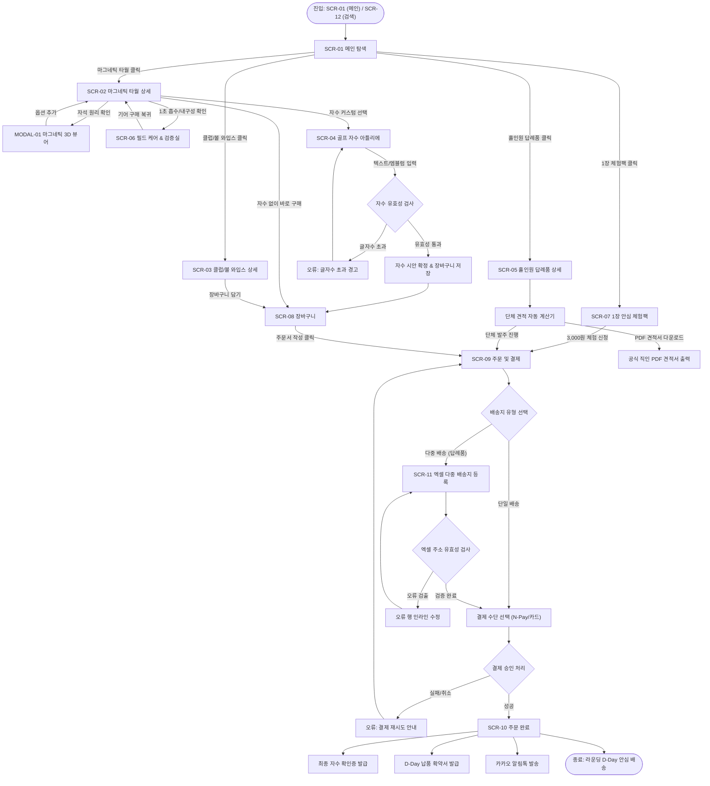

# 🔄 [김골프] 플로뜰리에 (Flottelier) 골프 기어 서비스 흐름도 (Service Flow)

> **문서 버전**: v1.0.0  
> **대상 페르소나**: 김골프 / 배진혁 (40대 골프 매니아 & 비즈니스 골퍼, 18홀 라운딩 땀타월 & 홀인원 답례품 구매자)  
> **기준 입력 파일**: `김골프 가상 클라이언트 설계 결과/사이트맵.md`, `클라이언트/가상클라이언트_분석결과_모음/김골프/김골프_가상클라이언트_분석결과.md`  
> **저장 위치**: `김골프 가상 클라이언트 설계 결과/서비스_흐름도.md`  
> **인코딩**: UTF-8

---

## 1. 서비스 흐름 개요

본 서비스 흐름도는 기존 합성 극세사 골프 타월의 끈적임과 클럽 흠집 문제를 해결하고, 18홀 라운딩 내내 뽀송함을 유지하려는 김골프(배진혁) 페르소나의 인지·탐색·자수 커스텀·단체 견적·결제 전 과정을 최적화한 사용자 여정(User Journey) 설계서입니다.

사용자가 사이트에 진입하여 **'마그네틱 자석 클립'**, **'1초 땀흡수 성능'**, **'실시간 자수 시뮬레이터'**, **'홀인원 단체 견적 계산기'**를 거쳐 원클릭 간편결제 또는 대량 발주를 완료하기까지의 모든 정상 경로와 분기/예외 경로를 상세히 다룹니다.

---

## 2. 사용자 유형과 시작 조건

### 2.1 사용자 유형 (User Personas)
1. **개인 필드 기어 구매자 (Primary)**: 캐디백에 걸 마그네틱 골프 타월과 본인 영문 이니셜/핸디캡 자수를 커스텀하려는 열혈 골퍼.
2. **홀인원/이글 답례품 발주자 (Secondary)**: 홀인원 기념으로 동반자 10~50명에게 보낼 고급 지함 세트와 단체 자수 각인을 주문하려는 비즈니스 골퍼.
3. **골프 동호회/월례회 총무 (Tertiary)**: 동호회 단체 로고를 일괄 각인하고 세금계산서 발행 및 단체 할인을 받으려는 단체 구매 담당자.
4. **원단 검증 체험자 (Quaternary)**: 3,000원에 원단 감촉과 땀 흡수력을 먼저 테스트해 보려는 소창 입문 골퍼.

### 2.2 시작 조건 (Entry Triggers)
* **진입점 A**: 메인페이지(`SCR-01`) 상단 히어로 배너 [18홀 땀흡수 마그네틱 골프 타월] 클릭
* **진입점 B**: 상단 공지 띠배너 [홀인원 답례품 10세트 이상 무료 각인 & 고급 포장] 클릭
* **진입점 C**: 검색창(`SCR-12`)에서 골프 핵심 키워드("마그네틱 타월", "홀인원 선물", "골프 자수", "골프공 타월") 검색
* **진입점 D**: 1장 체험팩 플로팅 배너 [1장 3,000원 체험 후 본품 구매 시 100% 환급] 클릭

---

## 3. 핵심 정상 흐름 (Primary Happy Path)

주요 서비스 흐름은 `탐색 ➔ 선택 ➔ 상세 확인 ➔ 핵심 행동 ➔ 결과 확인`의 5단계 표준 여정을 따릅니다.

```
[탐색: SCR-01 / SCR-12]
   │
   ▼
[선택: SCR-02 (마그네틱 타월) / SCR-05 (홀인원 답례품)]
   │
   ▼
[상세 확인: MODAL-01 (자석 3D 뷰어) / SCR-06 (1초 흡수 검증실)]
   │
   ▼
[핵심 행동: SCR-04 (실시간 자수 커스텀) ➔ SCR-08 (장바구니) ➔ SCR-09 (결제/견적)]
   │
   ▼
[결과 확인: SCR-10 (주문 완료) + 자수 확인증 & D-Day 납품 확약서 발급]
```

### 3.1 단계별 상세 흐름
1. **탐색 (Explore)**: 사용자가 메인(`SCR-01`)에 진입하여 '마그네틱 자석 클립 & 1초 땀흡수' 히어로와 홀인원 베스트 라인업을 확인.
2. **선택 (Select)**: 베스트 1위 `[마그네틱 롱 슬림 골프 타월]`을 클릭하여 상품 상세(`SCR-02`)로 진입하거나, `[홀인원 답례품(SCR-05)]` 선택.
3. **상세 확인 (Inspect & Validate)**:
   - `MODAL-01(마그네틱 3D 뷰어)`를 열어 캐디백/카트에 찰칵 달라붙는 자석 결착력 확인.
   - `필드 검증실(SCR-06)`에서 1초 땀흡수 타임랩스 및 100회 세탁 인장강도 성적서 확인.
4. **핵심 행동 (Action)**:
   - `자수 아틀리에(SCR-04)`로 이동하여 영문 이니셜, 핸디캡, 골프 엠블럼 6종을 실시간 캔버스에 렌더링하고 시안 확정.
   - 장바구니(`SCR-08`)에서 수량별 할인율을 확인하고, 주문서 작성(`SCR-09`)에서 단일 배송 또는 엑셀 다중 배송(`SCR-11`) 선택 후 결제.
5. **결과 확인 (Confirm)**:
   - 주문 완료(`SCR-10`) 화면에서 최종 자수 확인증 및 라운딩 D-Day 납품 확약서 확인.

---

## 4. 분기, 오류, 이탈 및 재진입 흐름 (Branches & Exceptions)

| 구분 | 발생 조건 | 사용자 인터랙션 및 시스템 처리 | 이동/복구 화면 |
| :--- | :--- | :--- | :--- |
| **분기 A**<br>(개인 vs 단체) | 상품 상세에서 10세트 이상 선택 시 | 대량 단체 할인 안내 팝업 노출 및 `홀인원/단체 견적(SCR-05)`으로 전환 안내 | SCR-02 ➔ SCR-05 |
| **분기 B**<br>(자수 커스텀 유무) | 타월 단품 구매 시 자수 옵션 선택 여부 | [자수 추가] 선택 시 자수 아틀리에(`SCR-04`) 호출, [미선택] 시 기본 완제품 장바구니 담기 | SCR-02 ➔ SCR-04 또는 SCR-08 |
| **분기 C**<br>(배송지 다중 분기) | 답례품 10세트 이상 구매 시 | [단일 일괄 배송] vs [동반자 엑셀 다중 직배송] 선택 바텀시트 호출 | SCR-09 ➔ SCR-11 |
| **오류 1**<br>(자수 글자수 초과) | 영문 12자 / 한글 6자 초과 입력 시 | 입력창 붉은색 테두리 경고 및 "자수 영역 최대 글자수를 초과했습니다" 토스트 | SCR-04 (인라인 유지) |
| **오류 2**<br>(엑셀 주소 양식 오류) | 다중 배송지 업로드 시 전화번호/주소 누락 | 오류 행(Row) 하이라이트 표시 및 인라인 수정 그리드 제공 | SCR-11 (인라인 수정) |
| **오류 3**<br>(결제 실패/취소) | 한도 초과 또는 결제 창 이탈 | 주문서 작성(`SCR-09`)으로 복귀 및 "주문 정보가 안전하게 보관되었습니다" 안내 | SCR-09 (재시도) |
| **이탈/재진입** | 장바구니 담기 후 사이트 이탈 | 24시간 내 재방문 시 상단 토스트 알림: "장바구니에 담긴 골프 기어가 보관 중입니다" | SCR-01 ➔ SCR-08 |

---

## 5. 단계별 사용자 행동-시스템 처리 매트릭스

| 단계 | 사용자 행동 (User Action) | 시스템 처리 (System Process) | 출력 화면 | 다음 분기/조건 |
| :---: | :--- | :--- | :---: | :--- |
| **1. 탐색** | 메인 진입 후 마그네틱 타월 카드 클릭 | 타월 상세 스펙 및 마그네틱 클립 옵션 로드 | **SCR-01 ➔ SCR-02** | 단품 구매 or 자수 추가 |
| **2. 검증** | 마그네틱 3D 모달 열기 버튼 클릭 | 네오디뮴 자석 결착 3D 인터랙션 애니메이션 실행 | **MODAL-01** | 확인 후 옵션 추가 |
| **3. 커스텀** | [나만의 골프 자수 만들기] 클릭 | 실시간 Canvas 자수 렌더러 초기화 및 폰트 로드 | **SCR-04** | 이니셜/엠블럼 입력 |
| **4. 답례품 견적** | [홀인원 단체 견적 계산기] 조작 | 수량(10~50세트)별 할인율 및 포장 단가 즉시 연산 | **SCR-05** | PDF 견적서 출력 or 발주 |
| **5. 장바구니** | 장바구니 담기 클릭 | 자수 시안 이미지 썸네일 생성 및 장바구니 세션 저장 | **SCR-08** | [주문하기] 클릭 |
| **6. 배송 등록** | [엑셀 다중 배송지 업로드] 클릭 | 엑셀 파싱 및 도로명 주소 유효성 자동 검사 | **SCR-11** | 유효성 통과 시 결제 이동 |
| **7. 결제** | 결제 수단 선택 및 [결제하기] 클릭 | PG사 간편결제 승인 및 실시간 세금계산서 발행 큐 등록 | **SCR-09** | 결제 성공 ➔ 완료 화면 |
| **8. 완료** | 주문 완료 확인 및 영수증 출력 | 주문 번호 채번, D-Day 납품 확약서 PDF 생성, 알림톡 발송 | **SCR-10** | 카카오 배송 트래킹 |

---

## 6. Mermaid 전체 서비스 흐름도


