# 🗺️ 플로뜰리에(Flottelier) - 김기업(송민재) 페르소나 맞춤형 B2B 기업 특판 사이트맵 (Sitemap)

> **프로젝트**: 기업 명절/창립기념일 ESG 친환경 VIP 기프트 & 로고 자수 및 엑셀 일괄 배송 B2B 특판 플랫폼  
> **기반 페르소나**: 김기업 / 송민재 (42세, 중견기업 인사·총무팀 총괄 팀장 / B2B 대량 특판 구매 결정권자)  
> **입력 파일**: `김기업_가상클라이언트_분석결과.md`, `김기업.md`  
> **저장 폴더**: `김기업 가상클라이언트 설계 결과/`  
> **인코딩**: UTF-8

---

## 1. 프로젝트 개요

본 사이트맵은 40대 기업 인사·총무팀장 '김기업(송민재)'의 핵심 구매 결정 요소인 **예산별(3/5/10만원대) ESG 비즈니스 기프트 팩(최대 40% 할인)**, **기업 로고(AI/PNG) 실시간 Canvas 금사/은사 자수 시뮬레이터**, **수백 명 임직원 주소지를 1초 만에 등록하는 엑셀 일괄 업로드 다중 직배송**, **직인 날인 실시간 공식 견적서 PDF 1초 출력**, **사업자 세금계산서 원클릭 즉시 발행**, **기업 ESG 실적 증빙용 친환경 탄소/플라스틱 절감 리포트 동봉**, **D-Day 납기일 엄수 확약서** 니즈를 완벽하게 반영하여 설계된 B2B 기업 특판 전문 정보 구조(IA) 문서입니다.

기업 담당자의 최대 업무 피로 요소(품의용 견적 지연, 수백 명 주소지 수기 입력, 로고 자수 불량 리스크, 세금계산서 지연, 납기 지연 불안)를 웹 플랫폼 자동화 기술로 100% 해소하여 구매 전환율과 대량 수주를 극대화합니다.

---

## 2. 설계 근거 및 핵심 사용자 목표

### 2.1 설계 근거 (김기업 15대 요구사항 맵핑)
1. **견적 및 품의 자동화 (1순위)**: 전화 대기 없이 화면에서 수량(100~500개) 입력 즉시 법인 도장이 날인된 `공식 견적서 PDF`를 1초 만에 출력.
2. **배송 업무 제로화 (1순위)**: 수백 명의 임직원/고객 주소지를 한 번에 등록하는 `엑셀(Excel) 1초 일괄 업로드 다중 개별 직배송 시스템`.
3. **기업 CI 브랜딩 (1순위)**: 기업 로고 AI 파일 업로드 시 소창 원단 위에 금사/은사로 정밀 합성되는 `Canvas 실시간 자수 시뮬레이터`.
4. **ESG 경영 실적 증빙 (2순위)**: 세트당 플라스틱 120g 및 탄소 배출 저감 수치가 공인 인증된 `친환경 ESG 기여 리포트` 전 세트 무료 동봉.
5. **사전 검증 지원 (2순위)**: 경영진 대면 보고용 `기업 담당자 무료 샘플 키트 (24시간 내 발송)`.
6. **일정 보증 (1순위)**: 창립기념일 및 명절 기한을 보증하는 `납기일 엄수 보증제(D-Day 납품 확약서)`.

### 2.2 핵심 사용자 목표 (User Goals)
- **Goal 1**: 회사 예산(3/5/10만원대)에 맞는 기프트 팩을 선택하고, 1초 만에 직인 날인 견적서 PDF를 다운로드하여 사내 품의를 즉시 통과시킨다.
- **Goal 2**: 기업 로고 AI 파일을 업로드하여 금사/은사 자수 시안을 사전 확인하고, 대표이사 CEO 감사 카드를 동봉한다.
- **Goal 3**: 엑셀 파일 하나로 200명 개별 주소지를 일괄 등록하고, 세금계산서 발행과 함께 D-Day 확약서로 납기를 보장받는다.

---

## 3. 전역 내비게이션 구조 (Navigation System)

- **상단 띠배너 (Top Notice Banner)**: `[B2B 사업자 세금계산서 100% 즉시 발행] | [엑셀 1초 일괄 업로드 개별 직배송] | [ESG 탄소/플라스틱 절감 리포트 무료 동봉] | [실시간 견적서 PDF 1초 출력]`
- **글로벌 내비게이션 (GNB)**:
  - `ABOUT ESG` (친환경 소창 철학 / 4차 정련 위생 공정 / ESG 탄소 절감 인증)
  - `BUDGET GIFT` (3만원대 베이직 / 5만원대 프리미엄 / 10만원대 VIP 프레스티지)
  - `CI EMBROIDERY` (기업 로고 자수 스튜디오 / 금사·은사 / 맞춤 슬리브 & CEO 카드)
  - `MASS DELIVERY` (엑셀 주소록 일괄 업로드 / D-Day 납기 확약서 / 실시간 배송 트래킹)
  - `QUOTE & TAX` (실시간 자동 견적서 PDF 출력 / 사업자 세금계산서 / 법인카드 결제)
  - `FREE SAMPLE` (경영진 보고용 무료 샘플 키트 신청 / 1:1 전담 매니저 핫라인)
- **로컬 내비게이션 (LNB - 상세 스티키 탭)**:
  - `[예산별 기프트 팩]` ➔ `[기업 로고 자수기]` ➔ `[ESG 탄소 리포트]` ➔ `[엑셀 일괄 배송]` ➔ `[실시간 견적서 PDF]` ➔ `[세금계산서 신청]`
- **브레드크럼 (Breadcrumb)**: `홈 > BUDGET GIFT > 프리미엄 팩 > 5만원대 창립기념일 스탠다드 세트`
- **플로팅 퀵바 (Floating Bar)**: `[실시간 견적서 PDF (M-04)]`, `[엑셀 주소록 업로드 (M-01)]`, `[기업 로고 자수기 (M-03)]`, `[무료 샘플 키트 신청]`, `[1:1 B2B 전담 상담]`
- **푸터 (Footer)**: B2B 기업 특판 전담팀, 사업자등록번호 및 통신판매업 정보, 세금계산서 센터, KC 4無 안전성 인증번호, 100% 무비닐 ESG 패키징 선언

---

## 4. 계층형 사이트맵 (Hierarchical Sitemap)

```text
[플로뜰리에 (Flottelier) - B2B ENTERPRISE Edition]
├── 0. 공통 / 기업 공통 영역 (Global Shared)
│   ├── GNB 상단 띠배너 (세금계산서 즉시 발행 & 엑셀 일괄 배송 & ESG 리포트)
│   ├── GNB 내비게이션 & B2B 특판 검색창
│   ├── 플로팅 퀵바 (견적서 PDF / 엑셀 업로드 / 로고 자수기 / 무료 샘플)
│   └── 푸터 & B2B 전담 지원 센터 & KC 성적서 원본 다운로드
│
├── 1. 1차 깊이: MAIN (B2B 기업 특판 홈)
│   └── P-01. B2B 기업 메인페이지 (ESG 비즈니스 비주얼 & 예산별 퀵 견적) [공통]
│
├── 2. 1차 깊이: BUDGET GIFT (예산별 기프트 팩)
│   ├── P-02. 3만원대 실속 베이직 팩 (임직원 복지/근로자의 날) [공통]
│   ├── P-03. 5만원대 프리미엄 팩 (창립기념일/명절 베스트 1위) [공통]
│   └── P-04. 10만원대 VIP 프레스티지 팩 (임원/주요 고객 한지 지함) [공통]
│
├── 3. 1차 깊이: CI EMBROIDERY (기업 로고 자수 & 패키징)
│   ├── P-05. 기업 로고 자수 센터 (AI/PNG 업로드 & 금/은사 시뮬레이터) [공통]
│   ├── M-03. Canvas 실시간 로고 자수기 모달 [인터랙션]
│   └── P-06. 맞춤 슬리브 & CEO 감사 카드 제작관 (대표이사 인사말 인쇄) [공통]
│
├── 4. 1차 깊이: MASS DELIVERY (엑셀 일괄 배송 & 일정 보증)
│   ├── P-07. 엑셀 일괄 배송 센터 (템플릿 다운로드 & 1초 업로드) [기업/회원]
│   ├── M-01. 주소록 엑셀 1초 일괄 파서 모달 [인터랙션]
│   ├── P-08. 납기일 엄수 보증관 (D-Day 납품 확약서 발급) [공통]
│   └── P-09. 실시간 임직원 배송 트래킹 대시보드 (송장 추적) [기업/회원]
│
├── 5. 1차 깊이: QUOTE & ESG (견적 · 회계 · ESG 실증)
│   ├── P-10. 실시간 자동 견적서 & 세금계산서 센터 [기업/공통]
│   ├── M-04. 직인 날인 공식 견적서 PDF 1초 출력 모달 [인터랙션]
│   ├── P-11. 친환경 ESG 탄소/플라스틱 절감 리포트관 (인증서 동봉) [공통]
│   ├── M-02. KC 4無 및 100회 세탁 성적서 200% 확대 모달 [인터랙션]
│   └── P-12. 경영진 보고용 무료 샘플 키트 신청관 (24시간 발송) [기업]
│
└── 6. 예외 & 안내 페이지 (Exception Pages)
    ├── EX-01. 엑셀 주소록 파일 형식/헤더 오류 검증 피드백 [가정]
    ├── EX-02. 1,000세트 이상 초대형 특판 생산 라인 조율 안내 [가정]
    └── EX-03. 404 Not Found 페이지 [가정]
```

> **[가정 표기]**: `EX-01`(엑셀 주소록 형식 오류), `EX-02`(1,000세트 이상 초대형 특판 납기 조율)는 분석 결과서에 구체적 오류 화면 명시가 없으나 비즈니스 발주 완결을 위해 `가정`으로 명시하여 포함함.

---

## 5. 페이지별 상세 명세표 (Page Specifications)

| 깊이 | 화면 ID | 페이지명 | 목적 | 핵심 콘텐츠 | 주요 기능 | 연결 페이지 | 김기업 타겟 니즈 |
| :---: | :---: | :--- | :--- | :--- | :--- | :--- | :---: |
| 1차 | **P-01** | **B2B 기업 메인페이지** | 기업 특판 가치 제안 및 원스톱 퀵 견적 | • ESG 친환경 비즈니스 비주얼<br>• 3/5/10만원대 퀵 견적 카드<br>• 엑셀 일괄 배송 안내 배너 | • 수량별 실시간 단가 연산<br>• 로고 자수기 바로가기<br>• 견적서 PDF 원클릭 출력 | P-02, P-03, P-04, P-05, P-07, P-10 | 견적 자동화, 엑셀 배송, ESG 가치 |
| 2차 | **P-02** | **3만원대 실속 베이직 팩** | 대량 임직원 복지/창립일 선물 탐색 | • 3겹 페이스타월 3장 세트<br>• 100% 무비닐 재생지 패키지<br>• ESG 탄소 리포트 동봉 | • 수량별 할인율(25~30%) 계산<br>• 로고 자수 옵션 선택<br>• 견적서 PDF 출력 | P-05, P-07, P-10 | 실속 예산, 임직원 만족 |
| 2차 | **P-03** | **5만원대 프리미엄 팩** | 창립기념일/명절 베스트 세트 구성 | • 3겹 세안 3장 + 4겹 바스 1장<br>• 맞춤 슬리브 & CEO 감사 카드<br>• 4차 정련 완제품 인증서 | • 실시간 장당 단가 계산기<br>• 금사/은사 자수기 연동 (`M-03`)<br>• 엑셀 배송 신청 | P-05, P-06, P-07, P-10, M-03 | 베스트 1위, CEO 카드 동봉 |
| 2차 | **P-04** | **10만원대 VIP 프레스티지 팩** | 임원 및 VIP 거래처 최고급 선물 | • 바스 2장+세안 4장+핸드 2장<br>• 고급 한지 지함 박스 & 보자기<br>• 최고급 샴페인골드 자수 | • 한지 지함 패키징 3D 뷰어<br>• VIP 개별 맞춤 문구 입력<br>• 다중 배송지 지정 | P-05, P-07, P-10 | VIP 품격, 한지 지함 포장 |
| 1차 | **P-05** | **기업 로고 자수 센터** | 기업 CI/BI 브랜딩 및 자수 시안 확인 | • 로고 AI/SVG/PNG 업로더<br>• 럭셔리 실 3종(금사/은사/차콜)<br>• 자수 위치(우측하단/중앙) | • Canvas 실시간 자수 렌더링 (`M-03`)<br>• 1:1 대량 자수 사전 검수<br>• 시안 이미지 다운로드 | P-03, P-06, P-07, M-03 | 로고 각인, 자수 퀄리티 신뢰 |
| 2차 | **P-06** | **맞춤 슬리브 & CEO 감사 카드** | 기업 맞춤형 메시지 및 슬리브 디자인 | • 대표이사 인사말 템플릿 5종<br>• 기업 로고 인쇄 패키징 슬리브<br>• 콩기름 친환경 인쇄 보증 | • 인사말 텍스트 실시간 프리뷰<br>• 기업 서명 이미지 업로드<br>• 인쇄 시안 승인 | P-05, P-07, P-10 | 대표이사 인사말, 슬리브 |
| 1차 | **P-07** | **엑셀 일괄 배송 센터** | 수백 명 주소지 1초 일괄 등록 | • 표준 엑셀 주소록 템플릿<br>• 드래그앤드롭 엑셀 파서 (`M-01`)<br>• 주소 유효성 실시간 피드백 | • 엑셀 1초 일괄 업로드<br>• 오류 행 인라인 즉시 수정<br>• 수백 개 송장 자동 분기 | P-01, P-08, P-10, M-01, EX-01 | 엑셀 일괄 배송, 업무 제로화 |
| 2차 | **P-08** | **납기일 엄수 보증관** | 창립일/명절 기한 내 납품 100% 확약 | • D-Day 납품 확약서 양식<br>• 긴급 생산 라인 가동 정책<br>• 지연 시 100% 보상 보증 규정 | • 행사일 D-Day 지정 계산기<br>• D-Day 납품 확약서 PDF 다운로드 | P-07, P-10 | 행사 기한 엄수, 납기 보증 |
| 2차 | **P-09** | **실시간 배송 트래킹 대시보드** | 발송 후 임직원 수령 현황 추적 | • 전체 발송 건수/배송완료 현황<br>• 택배사 실시간 연동 API 뷰어<br>• 미수령자 알림톡 재발송 | • 엑셀 배송 현황 다운로드<br>• 배송 오류지 실시간 수정 | P-07, P-10 | 배송 추적, 담당자 안심 |
| 1차 | **P-10** | **실시간 견적 & 세금계산서** | B2B 품의 및 회계 결제 자동화 | • 직인 날인 견적서 양식<br>• 사업자등록번호 검증창<br>• 법인카드 분할/가상계좌 결제 | • 직인 견적서 PDF 1초 출력 (`M-04`)<br>• 세금계산서 원클릭 신청<br>• 거래명세서/통장사본 뷰 | P-01, P-07, P-11, M-04 | 실시간 견적서, 세금계산서 |
| 2차 | **P-11** | **ESG 탄소/플라스틱 리포트관** | 기업 ESG 실적 증빙용 리포트 제공 | • 플라스틱 120g/세트 절감 수치<br>• 탄소 저감 공인 인증서 샘플<br>• 100회 세탁 KATRI 시험성적서 | • 성적서 200% HD 확대 (`M-02`)<br>• ESG 성과 보고서 PDF 다운로드 | P-01, P-10, M-02 | ESG 실적 증빙, 친환경 인증 |
| 2차 | **P-12** | **기업 무료 샘플 키트 신청** | 경영진 대면 보고용 실물 사전 검증 | • 2/3/4겹 원단 및 로고 자수 샘플<br>• ESG 패키징 박스 샘플 세트 | • 사업자 전용 무료 신청 폼<br>• 24시간 내 긴급 퀵/택배 발송 | P-01, P-03, P-10 | 경영진 품의 보고, 샘플 지원 |
| 예외 | **EX-01** | **엑셀 주소록 형식 오류 피드백** `[가정]` | 엑셀 업로드 시 열/주소 누락 대응 | • 전화번호 자릿수/우편번호 오류 행 표시<br>• 표준 양식 재다운로드 안내 | • 화면 내 인라인 주소 수정<br>• 수정 파일 재업로드 | P-07 | 배송 사고 방지 |
| 예외 | **EX-02** | **1,000세트 이상 생산 조율** `[가정]` | 초대형 발주 시 납기 분할 대응 | • 긴급 원단 직조 일정 안내<br>• 1:1 B2B 전담 매니저 배정 | • 분할 순차 출고 확약<br>• 핫라인 직통 통화 연결 | P-08, P-10 | 대량 납기 완결 |
| 예외 | **EX-03** | **404 Not Found** `[가정]` | 잘못된 경로 접근 시 복구 | • 감성 일러스트 및 안내 문구 | • B2B 메인 바로가기<br>• 실시간 견적서 이동 | P-01, P-10 | UX 연속성 유지 |

---

## 6. Mermaid 사이트맵 플로우차트 (Flowchart Architecture)

```mermaid
flowchart TD
  %% 루트
  ROOT(["플로뜰리에 (Flottelier) - B2B ENTERPRISE Edition"])

  %% 1차 메뉴 (GNB)
  ROOT --> MAIN["P-01 B2B 기업 메인페이지"]
  ROOT --> BUDGET["02. 예산별 기프트 팩"]
  ROOT --> EMBROIDERY["03. 기업 로고 자수 & 패키징"]
  ROOT --> DELIVERY["04. 엑셀 일괄 배송 & 납기"]
  ROOT --> QUOTE["05. 견적 · 회계 · ESG 실증"]

  %% 2차/3차 서브페이지
  BUDGET --> P02["P-02 3만원대 실속 베이직 팩"]
  BUDGET --> P03["P-03 5만원대 프리미엄 팩"]
  BUDGET --> P04["P-04 10만원대 VIP 프레스티지 팩"]

  EMBROIDERY --> P05["P-05 기업 로고 자수 센터"]
  EMBROIDERY --> P06["P-06 맞춤 슬리브 & CEO 감사 카드"]

  DELIVERY --> P07["P-07 엑셀 일괄 배송 센터"]
  DELIVERY --> P08["P-08 납기일 엄수 보증관"]
  DELIVERY --> P09["P-09 실시간 배송 트래킹 대시보드"]

  QUOTE --> P10["P-10 실시간 견적 & 세금계산서"]
  QUOTE --> P11["P-11 ESG 탄소/플라스틱 리포트관"]
  QUOTE --> P12["P-12 기업 무료 샘플 키트 신청관"]

  %% 레이어드 모달 연동
  P07 -.-> M01["M-01 주소록 엑셀 1초 일괄 파서 모달"]
  P11 -.-> M02["M-02 KC 4無/100회 세탁 성적서 확대 모달"]
  P05 -.-> M03["M-03 Canvas 실시간 로고 자수기 모달"]
  P03 -.-> M03
  P10 -.-> M04["M-04 직인 견적서 PDF 1초 출력 모달"]
  P01 -.-> M04

  %% 예외 페이지 [가정]
  P07 -.-> EX01["EX-01 엑셀 형식 오류 피드백 (가정)"]
  P08 -.-> EX02["EX-02 1,000세트 생산 조율 안내 (가정)"]
  ROOT -.-> EX03["EX-03 404 Not Found (가정)"]

  %% 스타일 클래스
  classDef primary fill:#E8F3F1,stroke:#4A7C72,stroke-width:2px,color:#1A3B34;
  classDef b2b fill:#EBF3FA,stroke:#2B6CB0,stroke-width:2px,color:#1A365D;
  classDef modal fill:#FFF6ED,stroke:#D97706,stroke-width:1.5px,color:#92400E;
  classDef exception fill:#FEE2E2,stroke:#EF4444,stroke-width:1.5px,stroke-dasharray: 4 4,color:#991B1B;
  
  class ROOT,MAIN,BUDGET,EMBROIDERY,DELIVERY,P02,P03,P04,P05,P06,P07,P08,P09 primary;
  class QUOTE,P10,P11,P12 b2b;
  class M01,M02,M03,M04 modal;
  class EX01,EX02,EX03 exception;
```


