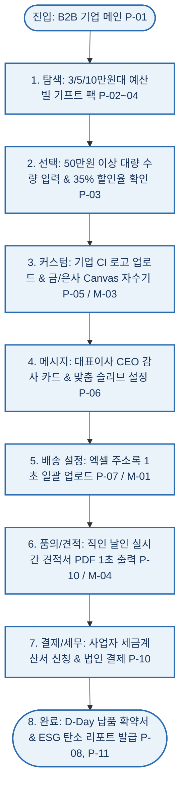

# 🔄 플로뜰리에(Flottelier) - 김기업 B2B 서비스 흐름도 (Service Flowchart)

> **프로젝트**: 기업 명절/창립기념일 ESG 친환경 VIP 기프트 & 로고 자수 및 엑셀 일괄 배송 B2B 특판 플랫폼  
> **기반 페르소나**: 김기업 / 송민재 (42세, 중견기업 인사·총무팀 총괄 팀장 / B2B 대량 특판 구매 결정권자)  
> **입력 파일**: `김기업 가상클라이언트 설계 결과/사이트맵.md`, `김기업_가상클라이언트_분석결과.md`  
> **저장 폴더**: `김기업 가상클라이언트 설계 결과/` 및 `김기억 가상 클라이언트 설계 결과/`  
> **인코딩**: UTF-8

---

## 1. 서비스 흐름 개요

본 서비스 흐름도는 기업 인사·총무팀장 '김기업(송민재)'이 B2B 특판 플랫폼에 접속하여 **예산별 기프트 팩 탐색 ➔ 수량 입력(100~500세트) 및 대량 할인율 확인 ➔ 기업 로고 업로드 & 금사/은사 자수 시안 확인 ➔ 엑셀 1초 일괄 업로드 다중 직배송 설정 ➔ 직인 날인 실시간 공식 견적서 PDF 출력 ➔ 사업자 세금계산서 신청 & 결제 ➔ D-Day 확약서 및 배송 트래킹**에 이르는 B2B 구매 여정 전체를 완벽하게 설계한 서비스 플로우 문서입니다.

수백 명 주소지 입력의 번거로움, 로고 자수 시안 확인 지연, 세금계산서 지연, 납기 지연 불안을 100% 자동화하여 해결합니다.

---

## 2. 사용자 유형과 시작 조건

| 사용자 유형 | 진입 경로 (Entry Point) | 시작 조건 및 심리 상태 | 목표 (Goal) |
| :--- | :--- | :--- | :--- |
| **신규 구매 담당자 (송민재)** | B2B 기업 특판 메인 (`P-01`) 또는 포털 B2B 검색 | "창립기념일 200명 임직원에게 줄 5만원대 친환경 ESG 선물을 품의해야 한다." | 5만원대 프리미엄 팩 선택, 기업 로고 자수 확인, 견적서 PDF 다운로드 후 사내 품의 상정 |
| **경영진 보고 담당자** | 무료 샘플 신청 배너 (`P-12`) | "임원 회의에서 실물 패키지와 자수 퀄리티를 직접 보고해야 한다." | 기업 무료 샘플 키트 신청 ➔ 24시간 내 수령 ➔ 품의 통과 후 본품 발주 |
| **대량 배송 발주자** | 엑셀 일괄 배송 센터 (`P-07`) | "200명 임직원의 자택 주소지를 엑셀 파일 하나로 한 번에 등록하고 싶다." | 주소록 엑셀 1초 업로드 (`M-01`) ➔ 세금계산서 신청 ➔ D-Day 납품 확약서 수령 |

---

## 3. 핵심 정상 흐름 (Happy Path)

---

## 4. 분기, 오류, 이탈 및 재진입 흐름 (Branching & Exception Flows)

1. **경영진 보고용 무료 샘플 키트 분기 (Sample First Flow)**:
   - 기프트 상세(`P-03`)에서 임원 보고용 실물 확인 필요 시 ➔ `[기업 무료 샘플 키트 신청 (P-12)]` 분기 ➔ 24시간 내 실물 패키지 퀵 수령 ➔ 품의 통과 후 본품 장바구니 재진입.
2. **엑셀 주소록 파일 형식 및 헤더 오류 분기 (EX-01)**:
   - 엑셀 업로드 시 우편번호 5자리 누락, 전화번호 형식 오류 행 발생 ➔ `[EX-01 엑셀 오류 피드백]` 팝업 ➔ 화면 내 인라인 즉시 수정 또는 표준 템플릿 재다운로드.
3. **견적서 다운로드 후 사내 품의 결재 재진입 (Quote-to-Order)**:
   - 견적서 PDF(`M-04`) 다운로드 후 사이트 이탈 ➔ 사내 결재 완료 후 알림톡 링크 또는 견적서 번호 입력으로 결제창(`P-10`) 1초 재진입.
4. **1,000세트 이상 초대형 특판 생산 라인 조율 분기 (EX-02)**:
   - 1,000세트 초과 초대형 발주 시 ➔ `[EX-02 초대형 특판 조율]` 분기 ➔ 1:1 B2B 전담 매니저 배정 및 분할 순차 출고 확약서 제공.

---

## 5. 단계별 서비스 상세 흐름표 (Step-by-Step Matrix)

| 단계 | 사용자 행동 (User Action) | 시스템 처리 (System Action) | 표시 화면 (Screen) | 다음 조건 (Next Condition) |
| :---: | :--- | :--- | :--- | :--- |
| **01. 진입** | B2B 기업 메인페이지 접속 및 탐색 | 상단 세금계산서 즉시 발행 띠배너 및 3/5/10만원대 퀵 견적 카드 노출 | `P-01 B2B 기업 메인` | 예산별 카드 클릭 시 02단계 이동 |
| **02. 탐색** | 3만원대(베이직), 5만원대(프리미엄), 10만원대(VIP) 기프트 팩 스펙 비교 | 세트별 수량(50/100/200/500개)에 따른 실시간 대량 할인율(25~40%) 및 세트당 단가 연산 | `P-02 ~ P-04 기프트 팩` | 5만원대 팩 선택 시 03단계 이동 |
| **03. 선택** | 5만원대 프리미엄 팩 선택 및 수량(200세트) 입력 | 35% 대량 할인 적용 총액(1,000만원 &rarr; 650만원) 계산 및 4차 정련 완제품 스펙 로드 | `P-03 5만원대 팩 상세` | `[기업 로고 자수 커스텀]` 클릭 시 04단계 이동 (샘플 원할 시 P-12 분기) |
| **04. 커스텀** | 기업 CI 로고 파일(AI, PNG) 업로드 및 금사/은사 자수 실 색상 선택 | Canvas 렌더링 엔진이 0.05초 만에 소창 패브릭 위에 실사 자수 합성 프리뷰 생성 | `P-05 자수 센터` / `M-03 자수 모달` | 파일 정상 시 자수 확정, 오류 시 `EX-01` 분기 |
| **05. 메시지** | 대표이사 CEO 감사 카드 인사말 템플릿 선택 및 회사 직인 이미지 등록 | 콩기름 친환경 인쇄 슬리브 및 CEO 감사 카드 실시간 3D 렌더링 시안 확정 | `P-06 맞춤 슬리브관` | `[엑셀 일괄 배송 설정]` 클릭 시 06단계 이동 |
| **06. 배송설정** | 200명 임직원 주소록 엑셀 파일 드래그앤드롭 업로드 | 엑셀 파서(`M-01`)가 1초 만에 200명 주소 유효성을 검증하고 200개 송장 자동 분기 | `P-07 엑셀 배송 센터` / `M-01 엑셀 모달` | 주소 정상 시 07단계 이동, 오류 시 `EX-01` 인라인 수정 |
| **07. 견적/품의** | 실시간 공식 견적서 PDF 다운로드 클릭 | 법인 직인이 날인된 공식 견적서 PDF 1초 자동 생성 및 브라우저 다운로드 실행 | `P-10 견적 센터` / `M-04 견적 모달` | 사내 품의 통과 후 결제 시 08단계 이동 |
| **08. 결제/세무** | 사업자등록번호 입력 및 세금계산서 신청 체크 후 법인카드/가상계좌 결제 | 국세청 사업자 유효성 실시간 API 검증, 전자세금계산서 자동 승인 예약, 100% 무비닐 포장 확정 | `P-10 B2B 결제` | 결제 승인 완료 시 09단계 이동 |
| **09. 완료/추적** | 발주 완료 페이지 확인, D-Day 납품 확약서 및 ESG 탄소 절감 리포트 다운로드 | D-Day 확약서 PDF 발급, 세트당 120g 플라스틱 절감 인증서 동봉 확정, 배송 트래킹 활성화 | `P-08 납기 보증관` / `P-09 배송 대시보드` / `P-11 ESG 리포트관` | 종료 및 실시간 배송 추적 |

---

## 6. Mermaid 전체 서비스 흐름도 (Full Service Flowchart)

```mermaid
flowchart TD
  %% 시작점
  START([시작: 기업 담당자 B2B 플랫폼 접속 P-01]) --> STEP1[/1. 탐색: 3/5/10만원대 예산별 기프트 팩 조회 P-02~04/]

  %% 탐색 및 분기
  STEP1 --> DECISION1{경영진 대면 보고용<br>무료 샘플 필요 여부?}
  DECISION1 -- "샘플 먼저 수령" --> SAMPLE[기업 무료 샘플 키트 신청 P-12]
  SAMPLE --> SAMPLE_RECV[24시간 내 실물 패키지 퀵 수령 & 품의 승인]
  SAMPLE_RECV --> STEP2

  DECISION1 -- "본품 즉시 발주" --> STEP2[2. 선택: 5만원대 프리미엄 팩 수량 200개 입력 P-03]

  %% 옵션 및 자수
  STEP2 --> STEP3[3. 커스텀: 기업 로고 AI 업로드 P-05]
  
  STEP3 --> FILE_CHECK{로고 파일 형식<br>& 해상도 유효성?}
  FILE_CHECK -- "비지원 포맷/저화질" --> LOGO_ERR[로고 오류 안내 & 디자이너 1:1 무료 벡터 보정]
  LOGO_ERR --> STEP3

  FILE_CHECK -- "정상 AI/PNG 파일" --> CANVAS[Canvas 실시간 금사/은사 자수 렌더링 M-03]
  CANVAS --> STEP4[4. 메시지: CEO 감사 카드 & 맞춤 슬리브 설정 P-06]

  %% 엑셀 일괄 배송
  STEP4 --> STEP5[5. 배송 설정: 엑셀 주소록 일괄 업로드 P-07 / M-01]
  STEP5 --> EXCEL_CHECK{엑셀 주소록<br>데이터 유효성 검증}

  EXCEL_CHECK -- "우편번호/연락처 오류" --> EX01[EX-01 엑셀 오류 안내 & 화면 내 인라인 즉시 수정]
  EX01 --> STEP5

  EXCEL_CHECK -- "200명 주소 정상 파싱" --> STEP6[6. 견적 확인: 직인 날인 공식 견적서 PDF 1초 출력 P-10 / M-04]

  %% 품의 및 결제
  STEP6 --> QUOTE_CHECK{사내 품의 결재<br>즉시 진행 여부?}
  QUOTE_CHECK -- "견적서 파일 저장 후 이탈" --> LEAVE[사내 결재 진행]
  LEAVE --> RE_ENTRY[알림톡 링크 / 견적서 번호로 재진입]
  RE_ENTRY --> STEP7

  QUOTE_CHECK -- "즉시 발주" --> STEP7[7. 주문/결제: 사업자 세금계산서 신청 & 법인 결제 P-10]

  %% 결제 및 세무 처리
  STEP7 --> TAX_INPUT[사업자등록번호 & 담당자 이메일 입력]
  TAX_INPUT --> SYS_TAX[시스템: 국세청 사업자 유효성 실시간 검증]
  SYS_TAX --> PAY_METHOD{결제 수단 선택}
  
  PAY_METHOD -- "법인카드 분할 결제" --> PAY_INSTANT[1초 즉시 승인]
  PAY_METHOD -- "가상계좌 / 세금계산서" --> PAY_VIRTUAL[전자세금계산서 자동 발행 예약]

  PAY_INSTANT --> STEP8[8. 발주 완료: D-Day 납품 확약서 발급 P-08]
  PAY_VIRTUAL --> STEP8

  %% 사후 관리 및 ESG 리포트
  STEP8 --> ESG_REPORT[ESG 탄소/플라스틱 절감 리포트 수령 P-11]
  ESG_REPORT --> TRACKING[실시간 임직원 배송 트래킹 대시보드 P-09]
  TRACKING --> END([종료: 전 임직원 100% 무비닐 ESG 선물 전달 완료])

  %% 스타일 클래스
  classDef startEnd fill:#1A365D,stroke:#0F294A,stroke-width:2px,color:#FFFFFF;
  classDef action fill:#EBF3FA,stroke:#2B6CB0,stroke-width:1.5px,color:#1A365D;
  classDef system fill:#E8F3F1,stroke:#4A7C72,stroke-width:1.5px,color:#1A3B34;
  classDef branch fill:#FFF6ED,stroke:#D97706,stroke-width:1.5px,color:#92400E;
  classDef error fill:#FEE2E2,stroke:#EF4444,stroke-width:1.5px,stroke-dasharray: 4 4,color:#991B1B;

  class START,END startEnd;
  class STEP1,STEP2,STEP3,STEP4,STEP5,STEP6,STEP7,STEP8,SAMPLE,SAMPLE_RECV,LEAVE,RE_ENTRY,TAX_INPUT,ESG_REPORT,TRACKING action;
  class CANVAS,SYS_TAX,PAY_INSTANT,PAY_VIRTUAL system;
  class DECISION1,FILE_CHECK,EXCEL_CHECK,QUOTE_CHECK,PAY_METHOD branch;
  class LOGO_ERR,EX01 error;
```

