# 🗺️ [김노마드] 플로뜰리에 (Flottelier) 트래블 패브릭 & 노마드 기어 사이트맵 설계서

> **문서 버전**: v1.0.0  
> **대상 페르소나**: 김노마드 / 장서진 (30대 글로벌 디지털 노마드, 해외 출장러 & 워케이션 디자이너)  
> **기준 입력 파일**: `김노마드_가상클라언트_분석결과.md`  
> **저장 위치**: `chlwlgP/클라이언트/와이어프레임/김노마드 가상 클라이언트 설계 결과/사이트맵.md`  
> **인코딩**: UTF-8

---

## 1. 프로젝트 개요

* **프로젝트명**: 플로뜰리에 노마드 (Flottelier NOMAD) — 캐리어 초슬림 압축 & 호텔 룸 3시간 오버나이트 퀵드라이 트래블 패브릭 플랫폼
* **핵심 슬로건**: "여권 크기로 줄어들고, 호텔 방에서 밤사이 뽀송하게 마르는 글로벌 출장 필수 패브릭 기어"
* **설계 목적**:
  1. 잦은 국내외 출장과 워케이션 시 숙소 공용 수건의 위생 불신과 두꺼운 부피, 실내 건조 지연 문제를 해결하려는 30대 비즈니스 트래블러('김노마드 / 장서진')의 고충 해소.
  2. 캐리어 70% 공간 절감 **'여권 크기 초슬림 압축 패킹 규격'**, 호텔 실내 환경 3~4시간 완건조 **'오버나이트 퀵드라이 실측 데이터'**, 젖은 타월 보관용 **'초경량 항균 방수 파우치'**를 시각화.
  3. 비즈니스 트래블 2종 키트, 스냅 단추형 트래블 행잉 스트랩, 영문 이니셜/국가코드(IATA) 자수, 당일 특급 출고 서비스를 통해 출장 전 긴급 구매 및 스마트한 패킹 여정을 완성.
* **적용 매체**: 반응형 웹 (Mobile 출장 이동 중 원터치 주문 & Desktop 캐리어 패킹 시뮬레이터 최적화)

---

## 2. 설계 근거와 핵심 사용자 목표

### 2.1 김노마드 페르소나 핵심 요구사항 매핑
| 번호 | 페르소나 요구사항 (김노마드 분석결과) | 중요도 | 정보 구조 및 사이트맵 반영 영역 |
| :---: | :--- | :--- :---: | :--- |
| 1 | 여권/다이어리 크기로 콤팩트하게 접히는 '초슬림 압축 패킹 규격' | **높음** | `1. TRAVEL GEAR` > 2종 키트 상세 (`SCR-02`), 캐리어 시뮬레이터 (`SCR-05`) |
| 2 | 호텔 룸 안에서도 밤사이(3~4시간) 뽀송하게 마르는 '오버나이트 퀵드라이 데이터' | **높음** | `2. LAB & PROOFS` > 호텔 룸 3시간 속건 실험실 (`SCR-06`) |
| 3 | 젖은 타월을 냄새 없이 담는 '초경량 항균 방수 트래블 파우치' | **높음** | `1. TRAVEL GEAR` > 항균 방수 파우치 상세 (`SCR-03`) |
| 4 | 호텔 옷걸이/문고리에 거는 '스냅 단추형 트래블 행잉 스트랩' | **보통** | `1. TRAVEL GEAR` > 행잉 스트랩 옵션 (`SCR-02`, `SCR-04`) |
| 5 | 영문 이니셜, 국가 코드, 비행기를 새기는 '글로벌 노마드 자수 커스텀' | **보통** | `3. NOMAD ATELIER` > 글로벌 자수 아틀리에 (`SCR-04`) |
| 6 | 샤워용 롱타월과 세안용 미니타월 구성 '비즈니스 트래블 2종 스타터 키트' | **높음** | `1. TRAVEL GEAR` > 비즈니스 트래블 2종 키트 (`SCR-02`) |
| 7 | 기내 건조한 피부에 얹는 '인플라이트 수분 진정 페이셜 와입스 활용법' | **낮음** | `4. TRAVEL GUIDE` > 기내 수분 진정 팁 & 케어 가이드 (`SCR-11`) |
| 8 | 여행지에 어울리는 세련된 모던 컬러(샌드베이지, 슬레이트그레이, 올리브) | **보통** | `1. TRAVEL GEAR` > 컬러 스와치 셀렉터 (`SCR-02`) |
| 9 | 3,000원에 원단 경량성을 확인하는 '트래블 안심 1장 체험팩 100% 환급' | **높음** | `5. TRIAL PACK` > 1장 안심 체험팩 (`SCR-07`) |
| 10 | 잦은 손빨래에도 올이 풀리지 않는 '고밀도 강화 직조 내구성 보증' | **보통** | `2. LAB & PROOFS` > 세탁 내구성 시험성적서 (`SCR-06`) |
| 11 | 해외 출장 시 바로 받는 '당일 특급 발송 및 항공 배송 연계' | **보통** | `6. ORDER & CHECKOUT` > 당일 특급 출고 시스템 (`SCR-09`, `SCR-10`) |
| 12 | 불필요한 쓰레기가 없는 100% 무비닐 재생 패키징 | **낮음** | `6. ORDER & CHECKOUT` > 에코 패키징 옵션 (`SCR-09`) |

### 2.2 핵심 사용자 목표
1. **캐리어 부피 및 속건성 검증**: 테리 타월 대비 70% 줄어든 여권 크기 패킹과 호텔 룸 3시간 완건조 성능을 인터랙티브 뷰어로 3초 만에 검증.
2. **트래블 스타터 키트 원스톱 구매**: 샤워용 롱타월(35x90cm) + 페이셜 와입스(25x25cm) + 방수 파우치 올인원 구성을 원클릭으로 장바구니 담기.
3. **나만의 글로벌 스트랩 커스텀**: 본인 영문 이름, IATA 공항 코드(ICN, SFO, CDG 등), 비행기 심볼을 실시간 렌더링하여 자수 스트랩 완성.
4. **출장 D-Day 당일 특급 출고**: 출국 일정에 맞춰 오후 3시 이전 주문 시 당일 공항 픽업/특급 택배로 긴급 수령.

---

## 3. 전역 내비게이션 구조 (Global Navigation Architecture)

```text
[전역 내비게이션 시스템 (GNB / LNB / Floating / Footer)]
│
├── 상단 공지 띠배너 (Top Notice Banner)
│   ├── [✈️ 출국 전 긴급 발송: 평일 15시 이전 주문 시 당일 특급 출고 보장]
│   ├── [호텔 룸 3시간 완건조! 노마드 2종 스타터 키트 15% 런칭 할인]
│   └── [1장 3,000원 트래블 체험팩 — 본품 구매 시 100% 전액 환급]
│
├── 글로벌 헤더 (GNB)
│   ├── 로고: 플로뜰리에 NOMAD (Flottelier Nomad)
│   ├── 1. TRAVEL GEAR (비즈니스 2종 키트, 롱 바스타월, 페이셜 와입스, 방수 파우치)
│   ├── 2. LAB & PROOFS (호텔 3시간 속건 실험실, 캐리어 70% 부피 절감 데이터)
│   ├── 3. NOMAD ATELIER (영문 이니셜, 국가 코드, 비행기 자수 스트랩)
│   ├── 4. PACKING SIMULATOR (캐리어 여유 공간 및 무게 계산기)
│   ├── 5. TRIAL (1장 3,000원 안심 체험팩)
│   └── 유틸리티: [통합 검색 (SCR-12)], [장바구니 (SCR-08)], [당일 출고 조회], [마이페이지]
│
├── 플로팅 퀵 액션 바 (Floating Quick Action Bar)
│   ├── [✈️ 글로벌 자수 시뮬레이터 바로가기]
│   ├── [🧳 캐리어 부피 계산기 열기]
│   └── [🌿 3,000원 1장 체험팩 신청]
│
└── 글로벌 푸터 (Footer)
    ├── 브랜드 스토리 & 공인 시험연구원(KATRI) 속건성/항균 성적서 번호
    ├── 당일 특급 발송 및 인천공항 수령 제휴 안내
    ├── 100% 무화학 4차 정련 & 무비닐 제로웨이스트 선언
    └── 이용약관 및 고객 케어 센터 (1588-0000)
```

---

## 4. 계층형 사이트맵 (Hierarchical Sitemap)

```text
1.0 홈 (Home / SCR-01)
├── 2.0 트래블 기어 샵 (Travel Gear Shop)
│   ├── 2.1 비즈니스 트래블 2종 키트 상세 (SCR-02)
│   │   ├── 2.1.1 롱 바스타월 (35x90cm) & 스냅 행잉 스트랩
│   │   ├── 2.1.2 페이셜 와입스 (25x25cm)
│   │   └── 2.1.3 모던 트래블 컬러 (샌드베이지, 슬레이트그레이, 올리브)
│   ├── 2.2 초경량 항균 방수 트래블 파우치 (SCR-03)
│   │   ├── 2.2.1 멤브레인 통풍 방수 소재 (냄새 차단)
│   │   └── 2.2.2 카라비너 결착형 캐리어 서브백
│   └── 2.3 인플라이트 수분 진정 페이셜 와입스 세트
├── 3.0 노마드 자수 아틀리에 (Nomad Atelier / SCR-04)
│   ├── 3.1 영문 네임 & 이니셜 각인
│   ├── 3.2 글로벌 IATA 공항/국가 코드 (ICN, SFO, NRT, LHR 등)
│   ├── 3.3 트래블 엠블럼 6종 (비행기, 나침반, 여권, 지구본, 캐리어, 산)
│   └── 3.4 실시간 Canvas 스트랩 렌더러
├── 4.0 캐리어 패킹 시뮬레이터 (Packing Simulator / SCR-05)
│   ├── 4.1 20인치/24인치 캐리어 부피 절감 시뮬레이션
│   ├── 4.2 수건 무게(85g vs 350g) 비교 인포그래픽
│   └── 4.3 여권 크기 롤업 패킹 3D 가이드 (MODAL-01)
├── 5.0 랩 & 검증실 (Lab & Proofs / SCR-06)
│   ├── 5.1 호텔 룸 3시간 오버나이트 퀵드라이 타임랩스
│   ├── 5.2 잦은 손빨래 내구성 & 무먼지 KC 성적서
│   └── 5.3 4無 안심 인증 (피부 트러블 제로)
├── 6.0 트래블 안심 체험팩 (Trial Pack / SCR-07)
│   ├── 6.1 1장 3,000원 체험팩 신청
│   └── 6.2 본품 키트 구매 시 100% 환급 쿠폰 발급
├── 7.0 주문 & 결제 (Checkout & Orders)
│   ├── 7.1 장바구니 (SCR-08)
│   ├── 7.2 주문서 작성 및 당일 특급 출고 선택 (SCR-09)
│   ├── 7.3 주문 완료 및 출장 D-Day 확인 (SCR-10)
│   └── 7.4 디지털 노마드 여행 체크리스트 PDF 다운로드
└── 8.0 검색 및 가이드 (Search & Guide)
    ├── 8.1 통합 검색 결과 (SCR-12)
    ├── 8.2 기내 수분 진정 팁 & 세탁 매뉴얼 (SCR-11)
    └── 8.3 캐리어 롤업 3D 모달 (MODAL-01)
```

---

## 5. 페이지별 상세 정의 표

| 화면 ID | 페이지명 | 주요 목적 | 핵심 콘텐츠 | 주요 기능 및 CTA | 연결 화면 |
| :---: | :--- | :--- | :--- | :--- | :--- |
| **SCR-01** | 메인페이지 | 노마드 브랜드 가치 전달 및 트래블 기어 퀵 구매 유도 | • 여권 크기 롤업 히어로 비주얼<br>• 호텔 3시간 완건조 vs 테리 수건 비교<br>• 비즈니스 트래블 2종 베스트 팩 | • [트래블 2종 키트 바로 담기]<br>• [캐리어 부피 계산기 실행]<br>• [글로벌 자수 시뮬레이터] | SCR-02, SCR-04, SCR-05, SCR-07 |
| **SCR-02** | 트래블 2종 키트 상세 | 롱타월+미니와입스 구성 및 컬러/스트랩 옵션 선택 | • 35x90cm 롱 바스타월 + 25x25cm 미니<br>• 스냅 단추형 행잉 스트랩 시연<br>• 샌드베이지/그레이/올리브 스와치 | • 행잉 스트랩 추가 여부 선택<br>• 자수 아틀리에(SCR-04) 연동<br>• [당일 특급 발송으로 구매] | SCR-04, SCR-08, SCR-09, MODAL-01 |
| **SCR-03** | 항균 방수 파우치 상세 | 이동 중 젖은 타월 보관용 방수백 단품/결합 구매 | • 멤브레인 통기 방수 원단 스펙<br>• 냄새/습기 차단 항균 성적서<br>• 캐리어 외측 카라비너 결착 컷 | • 키트 결합 할인 옵션 선택<br>• [장바구니 담기]<br>• [바로 구매하기] | SCR-02, SCR-08 |
| **SCR-04** | 글로벌 자수 아틀리에 | 영문 이니셜, 국가 코드, 비행기 심볼 실시간 각인 | • 산세리프/모던 영문 폰트 4종<br>• IATA 공항 코드 20종 프리셋<br>• 실시간 Canvas 스트랩 렌더러 | • 텍스트/심볼 실시간 조합<br>• 자수 시안 저장 및 키트 적용<br>• [시안 확정하고 주문] | SCR-02, SCR-08 |
| **SCR-05** | 캐리어 패킹 계산기 | 기존 수건 대비 부피 70% 및 무게 500g 절감 시각화 | • 20/24인치 캐리어 내부 3D 시각화<br>• 타월 개수별 여유 공간 계산 그래프<br>• 여권 크기 롤업 비교 컷 | • 수건 개수 슬라이더 조작<br>• [최적 트래블 세트 담기]<br>• [3D 롤업 가이드 보기] | SCR-02, MODAL-01 |
| **SCR-06** | 랩 & 속건 검증실 | 호텔 룸 실내 환경 3시간 속건 타임랩스 및 성적서 | • 1h, 2h, 3h 수분 증발율 그래프<br>• KATRI 속건성/인장강도 성적서<br>• 호텔 세면대 손빨래 팁 | • 공인 시험성적서 원본 PDF<br>• 세척 팁 인포그래픽 확인<br>• [트래블 키트 구매하기] | SCR-02, SCR-07 |
| **SCR-07** | 트래블 1장 체험팩 | 3,000원에 원단 경량성(85g) 및 부드러움 체험 | • 1장 3,000원 체험팩 안내<br>• 본품 구매 시 100% 환급 안내<br>• 디지털 노마드 실사용 포토 리뷰 | • [3,000원 체험팩 신청]<br>• 100% 환급 쿠폰 자동 발급 | SCR-09 |
| **SCR-08** | 장바구니 | 선택 기어, 자수 스트랩 시안, 수량 최종 검토 | • 상품 목록 및 자수 스트랩 썸네일<br>• 출국 D-Day 특급 배송비 계산<br>• 추천 트래블 서브 기어 | • 수량 변경 및 옵션 수정<br>• [주문하기]<br>• [N-Pay 1초 결제] | SCR-02, SCR-09 |
| **SCR-09** | 주문 및 결제 | 특급 배송지 입력 및 항공편 픽업 옵션 선택 | • 당일 특급 출고 / 일반 택배 선택<br>• 공항 수령 안내 체크<br>• 무비닐 재생 패키징 기본 적용 | • [결제하기]<br>• 네이버/카카오/토스 결제<br>• 출국 일정 메모 입력 | SCR-10 |
| **SCR-10** | 주문 완료 | 주문 번호, 자수 확인증, 출장 D-Day 확약서 발급 | • 주문 번호 및 당일 송장 번호<br>• 최종 자수 렌더링 확인증<br>• 노마드 패킹 체크리스트 PDF | • 패킹 리스트 다운로드<br>• 카카오 알림톡 배송 조회<br>• [홈으로 이동] | SCR-01 |
| **SCR-11** | 기내 수분 진정 팁 | 인플라이트 페이셜 와입스 케어 및 세탁 매뉴얼 | • 기내 10시간 비행 피부 진정법<br>• 세면대 1분 손빨래 & 비틀어짜기 팁<br>• 장기 출장 수명 관리법 | • 기내 케어 가이드북 PDF<br>• [페이셜 와입스 세트 구매] | SCR-02 |
| **SCR-12** | 통합 검색 결과 | 키워드 검색 결과 리스트 및 노마드 퀵 필터 | • 기어/키트/자수 필터<br>• 검색 결과 상품 그리드 | • 상세 화면 이동<br>• 인기순/경량순 정렬 | SCR-02, SCR-03 |
| **MODAL-01** | 캐리어 롤업 3D 뷰어 | 여권 크기로 말리는 롤업 패킹 인터랙션 3D 모달 | • 35x90cm ➔ 여권 크기 롤업 모션<br>• 무게 85g 체감 비교 게이지 | • [닫기]<br>• [이 키트 바로 구매] | SCR-02, SCR-05 |

---

## 6. Mermaid 사이트맵 플로우차트

```mermaid
flowchart TD
  ROOT["플로뜰리에 NOMAD 마스터 IA"]

  %% 1Depth
  ROOT --> M1["1.0 홈 (SCR-01)"]
  ROOT --> M2["2.0 트래블 기어 샵"]
  ROOT --> M3["3.0 노마드 자수 (SCR-04)"]
  ROOT --> M4["4.0 패킹 시뮬레이터 (SCR-05)"]
  ROOT --> M5["5.0 랩 & 검증실 (SCR-06)"]
  ROOT --> M6["6.0 체험팩 (SCR-07)"]
  ROOT --> M7["7.0 주문/결제"]
  ROOT --> M8["8.0 가이드/검색"]

  %% 2Depth - Gear Shop
  M2 --> G1["2.1 트래블 2종 키트 (SCR-02)"]
  M2 --> G2["2.2 항균 방수 파우치 (SCR-03)"]
  M2 --> G3["2.3 페이셜 와입스 세트"]

  %% 2Depth - Custom Atelier
  M3 --> C1["3.1 영문 네임/이니셜"]
  M3 --> C2["3.2 IATA 공항/국가 코드"]
  M3 --> C3["3.3 트래블 엠블럼 6종"]
  M3 --> C4["3.4 실시간 스트랩 렌더러"]

  %% 2Depth - Packing Simulator
  M4 --> P1["4.1 20/24인치 부피 계산"]
  M4 --> P2["4.2 무게 비교 인포그래픽"]
  M4 --> P3["4.3 롤업 3D 가이드 (MODAL-01)"]

  %% 2Depth - Lab & Proofs
  M5 --> L1["5.1 호텔 3시간 속건 타임랩스"]
  M5 --> L2["5.2 손빨래 내구성 성적서"]
  M5 --> L3["5.3 4無 안심 인증"]

  %% 2Depth - Checkout
  M7 --> O1["7.1 장바구니 (SCR-08)"]
  M7 --> O2["7.2 주문 및 특급 배송 (SCR-09)"]
  M7 --> O3["7.3 주문 완료 (SCR-10)"]
  M7 --> O4["7.4 패킹 체크리스트 PDF"]

  %% 2Depth - Guide & Search
  M8 --> S1["8.1 기내 수분 진정 팁 (SCR-11)"]
  M8 --> S2["8.2 통합 검색 (SCR-12)"]
  M8 --> S3["8.3 롤업 3D 모달 (MODAL-01)"]

  %% Linkages
  G1 -.-> M3
  G1 -.-> S3
  G1 -.-> O1
  M4 -.-> G1
  M6 -.-> O2
```


