# 🗺️ [김살림] 플로뜰리에 (Flottelier) 스마트 살림 & 번들 플랫폼 사이트맵 설계서

> **문서 버전**: v1.0.0  
> **대상 페르소나**: 김살림 / 이현정 (3040 스마트 미니멀 살림 큐레이터, 수건 전면 교체 및 정기구독 구매자)  
> **기준 입력 파일**: `클라이언트/가상클라이언트_분석결과_모음/김살림/김살림_가상클라이언트_분석결과.md`  
> **저장 위치**: `김살림 가상 클라이언트 설계 결과/사이트맵.md`  
> **인코딩**: UTF-8

---

## 1. 프로젝트 개요

* **프로젝트명**: 플로뜰리에 (Flottelier) 스마트 살림 & 수건 전체 교체 커머스 플랫폼
* **핵심 슬로건**: "장마철에도 쉰내 제로, 3배 빠른 건조와 1/3 슬림 수납으로 완성하는 스마트 살림"
* **제작 목적**:
  1. 장마철과 겨울철 젖은 수건의 쿰쿰한 쉰내(모락셀라균 세균 번식)와 좁은 욕실 수납장의 부피 부담에 스트레스를 받는 3040 미니멀 살림 큐레이터('김살림 / 이현정')의 핵심 고충 해결.
  2. 4차 정련 소창 수건의 핵심 강점인 **3배 빠른 초고속 자연 건조**, **99.9% 항균·통기성 구조**, **1/3 슬림 수납(공간 절약)**, **3년 이상 지속되는 내구성**을 실증 데이터와 비포/애프터 비교 갤러리로 증명.
  3. 10장/20장 일괄 교체용 **'올 체인지(All-Change) 대용량 번들 팩'**, 실시간 장당 단가 계산기, 6개월/1년 단위 정기배송(구독) 및 교체 주기 알림, 삶을 필요 없는 세탁기/건조기 간편 관리 O/X 지침을 제공하여 전면 교체 결정을 신속히 유도.
* **적용 매체**: 반응형 웹 (Mobile 터치 스와이프 및 한 손 결제 & Desktop 고해상도 인포그래픽 최적화)

---

## 2. 설계 근거와 핵심 사용자 목표

### 2.1 김살림 페르소나 핵심 요구사항 매핑
| 번호 | 페르소나 요구사항 (김살림.md) | 중요도 | 정보 구조 및 사이트맵 반영 영역 |
| :---: | :--- | :---: | :--- |
| 1 | 집안 수건을 한 번에 바꿀 수 있는 10장/20장 '올 체인지 번들 팩'과 대량 할인 | **높음** | `1. BUNDLE & SUBSCRIPTION` > 10장 올체인지 데일리 팩, 20장 패밀리 팩 |
| 2 | 테리 타월 대비 3배 빠른 건조 속도 및 세균/냄새 억제 실험 데이터 | **높음** | `2. SMART CARE & PROOFS` > 3배 빠른 초고속 건조 실험실, 세균 99.9% 억제 차트 |
| 3 | 욕실 수납장(상부장)에 넣었을 때 부피가 1/3로 줄어드는 슬림 수납 비교 사진 | **높음** | `2. SMART CARE & PROOFS` > 욕실 상부장 1/3 슬림 수납 비교 갤러리 |
| 4 | 6개월/1년 주기로 자동 발송되는 '정기배송(구독) 및 교체 주기 알림 서비스' | **보통** | `1. BUNDLE & SUBSCRIPTION` > 6개월/1년 정기구독 신청 & 카카오 알림톡 설정 |
| 5 | 삶지 않고 세탁기 울/표준코스로 편리하게 관리하는 세탁기 간편 관리 가이드(O/X 표) | **높음** | `3. LAUNDRY GUIDE` > 삶기 없는 세탁기 표준/울코스 지침서 |
| 6 | 건조기 사용 가능 여부 및 주의사항(저온 권장, 수축률 안내) 명시 | **높음** | `3. LAUNDRY GUIDE` > 건조기 저온 사용 & 수축 안정화 가이드 |
| 7 | 행주, 세안타월, 바스타월, 발매트까지 욕실과 주방을 통일하는 '풀 라인업 살림 세트' | **보통** | `4. HOME LINEUP` > 2겹 주방와입스, 3겹 페이스, 4겹 바스타월 풀 세트 |
| 8 | 10장 세트 구매 시 장당 가격을 한눈에 확인하는 실시간 장당 단가 계산기 | **높음** | `1. BUNDLE & SUBSCRIPTION` & 상세 페이지 > 실시간 장당 단가 & 절감액 계산기 |
| 9 | 정갈한 욕실 인테리어를 위한 호텔식 수건 접기 방법 및 수납 가이드 | **보통** | `3. LAUNDRY GUIDE` > 호텔식 소창 수건 3단 롤 접기 & 수납 가이드 |
| 10 | 화학 유연제 없이도 뽀송함을 유지하는 친환경 천연 세탁 팁 | **보통** | `3. LAUNDRY GUIDE` > 화학 섬유유연제 무첨가 친환경 세탁 팁 |
| 11 | 수건걸이에 걸어두기 편한 '걸이용 루프(고리) 옵션' 선택 기능 | **보통** | `4. HOME LINEUP` & 주문 옵션 > 순면 걸이용 루프(고리) 유무 선택 |
| 12 | 세탁 횟수(1회, 10회, 30회, 50회)에 따른 세탁 타임라인 엠보싱 텍스처 컷 | **높음** | `2. SMART CARE & PROOFS` > 세탁 횟수별 엠보싱 타임라인 뷰어 |
| 13 | 3년 사용 후 낡은 소창을 청소용으로 재활용하는 '살림 업사이클링 팁' | **낮음** | `3. LAUNDRY GUIDE` > 3년 수명 후 주방 행주/걸레 업사이클 가이드 |
| 14 | 10장 구매 전 3,000원에 먼저 써보는 '1장 안심 체험팩 100% 환급 시스템' | **높음** | `5. TRIAL & ASSURANCE` > 1장 3,000원 체험팩 신청 및 100% 환급 쿠폰 발급 |
| 15 | 내추럴 아이보리, 오가닉 세이지 등 정갈한 미니멀 컬러 라인업 | **보통** | `4. HOME LINEUP` > 미니멀 내추럴 컬러 스와치 (아이보리, 세이지, 베이지) |

### 2.2 핵심 사용자 목표
1. **구매 장벽의 신속한 해소**: "소창은 삶아야 한다"는 오해를 4차 정련 완료 뱃지와 세탁기 O/X 표로 1초 만에 해소.
2. **수건 전면 교체 혜택 확인**: 10장 구매 시 장당 9,900원(정가 대비 26,000원 절감) 혜택을 슬라이더로 직관적 확인.
3. **공간 및 위생 실증**: 상부장 1/3 슬림 수납과 3배 빠른 건조 속도를 시각적 인터랙션으로 납득.
4. **지속 가능한 관리**: 6개월/12개월 정기구독 신청 및 카카오 알림톡 교체 리마인더로 재구매 피로도 제로화.

---

## 3. 전역 내비게이션 구조 (Global Navigation Architecture)

```
[전역 내비게이션 시스템 (GNB / LNB / Floating / Footer)]
│
├── 상단 공지 띠배너 (Top Notice Banner)
│   ├── [받아서 바로 쓰는 4차 정련 완료 완제품 - 삶지 않고 세탁기로 바로 사용]
│   ├── [1장 3,000원 체험팩 - 본품 구매 시 100% 환급]
│   └── [1588-0000 전화 주문 & 대량 상담]
│
├── 글로벌 헤더 (Global Header)
│   ├── 브랜드 로고 (Flottelier Home 바로가기)
│   ├── GNB 5대 메인 메뉴 (BUNDLE / PROOFS / GUIDE / LINEUP / TRIAL)
│   └── 유틸리티 (실시간 검색창, 로그인/회원가입, 장바구니 [0], 마이페이지)
│
├── 로컬 내비게이션 바 (LNB - 스티키 탭)
│   └── [10장/20장 번들 팩] ➔ [3배 건조 & 1/3 수납 데이터] ➔ [세탁기/건조기 O/X] ➔ [호텔식 접기] ➔ [정기구독]
│
├── 위치 안내 및 브레드크럼 (Breadcrumb)
│   └── 예: 홈 > 10장/20장 교체 팩 > 10장 올 체인지 데일리 팩
│
├── 플로팅 퀵 액션 바 (Floating Action Bar)
│   ├── [10장 세트 특가 주문] (실시간 장당 9,900원 표시)
│   ├── [1장 안심 체험팩 신청] (3,000원 결제 시 100% 환급 쿠폰)
│   └── [정기배송 구독 신청] (6개월/1년 주기 설정)
│
└── 푸터 (Global Footer)
    ├── 4차 정련 100% 무화학 보증 선언 & KATRI 시험성적서 번호
    ├── 고객센터 (1588-0000 / 카카오톡 1:1 상담 / 운영시간 09:00~18:00)
    ├── 세탁 및 관리 지침서 PDF 다운로드 링크
    ├── 정기배송 구독 변경/해지 안내
    └── 사업자 정보, 이용약관, 개인정보처리방침, SNS
```

---

## 4. 계층형 사이트맵 (Hierarchical Sitemap)

* **1차 메뉴 폭 (Depth 1)**: 5개 (PDF 권장 5~9개 기준 충족)
* **최대 메뉴 깊이 (Max Depth)**: 3단계 (PDF 권장 5단계 이내 충족)

```text
Flottelier Smart Living Platform
│
├── 0. 공통 영역 (Global Shared Area)
│   ├── 0.1 상단 공지 띠배너 (4차 정련 완료 & 체험팩 환급 안내)
│   ├── 0.2 글로벌 헤더 & 통합 검색 (키워드: 10장세트, 쉰내제로, 건조기, 단가계산)
│   ├── 0.3 플로팅 퀵 액션바 (10장 특가구매 / 1장 체험팩 / 정기배송)
│   └── 0.4 글로벌 푸터 (공식 성적서 번호, CS 센터, 관리 PDF 다운로드)
│
├── 1. [Depth 1] BUNDLE & SUBSCRIPTION (대용량 교체 & 정기구독)
│   ├── 1.1 [Depth 2] 10장 올 체인지 데일리 팩 (Best 1위) [SCR-02]
│   │   ├── 1.1.1 [Depth 3] 실시간 장당 단가 & 절감액 계산기 [MODAL-01]
│   │   └── 1.1.2 [Depth 3] 순면 루프(고리형) 옵션 선택기
│   ├── 1.2 [Depth 2] 20장 패밀리 풀 하우스 팩 (최대 35% 할인)
│   └── 1.3 [Depth 2] 정기배송(구독) 및 교체주기 알림 센터 [SCR-05]
│       ├── 1.3.1 [Depth 3] 6개월 / 12개월 배송 주기 설정
│       └── 1.3.2 [Depth 3] 카카오 알림톡 교체 리마인더 등록 [MODAL-03]
│
├── 2. [Depth 1] SMART CARE & PROOFS (위생 & 실증 데이터)
│   ├── 2.1 [Depth 2] 3배 빠른 초고속 건조 실험실 [SCR-03]
│   │   ├── 2.1.1 [Depth 3] 테리 타월 vs 소창 타월 1시간 건조 비교 그래프
│   │   └── 2.1.2 [Depth 3] 젖은 상태 쉰내(모락셀라균 99.9%) 억제 성적서
│   ├── 2.2 [Depth 2] 욕실 상부장 1/3 슬림 수납 비교 갤러리 [SCR-03]
│   │   └── 2.2.1 [Depth 3] 수납장 적재 부피 68% 절약 비포/애프터 슬라이더
│   └── 2.3 [Depth 2] 세탁 횟수별 엠보싱 타임라인 [MODAL-02]
│       └── 2.3.1 [Depth 3] 1회, 10회, 30회, 50회 질감 및 흡수력 확대컷
│
├── 3. [Depth 1] LAUNDRY GUIDE (세탁기 & 건조기 간편 관리)
│   ├── 3.1 [Depth 2] 삶기 없는 세탁기 표준/울코스 지침서 [SCR-04]
│   │   ├── 3.1.1 [Depth 3] 세탁기 / 건조기 / 삶기 / 섬유유연제 O/X 표
│   │   └── 3.1.2 [Depth 3] 한눈에 보는 살림 세탁 가이드 PDF 다운로드
│   ├── 3.2 [Depth 2] 건조기 저온 사용 & 수축 안정화 가이드 [SCR-04]
│   ├── 3.3 [Depth 2] 호텔식 소창 수건 3단 롤 접기 & 수납 팁 [SCR-04]
│   └── 3.4 [Depth 2] 3년 수명 후 걸레 재활용 살림 업사이클링 [SCR-04]
│
├── 4. [Depth 1] HOME LINEUP (미니멀 살림 풀 라인업)
│   ├── 4.1 [Depth 2] 3겹 데일리 페이스타월 (세안용 표준)
│   ├── 4.2 [Depth 2] 4겹 바스타월 & 스포츠 롱타월 (샤워/헤어)
│   ├── 4.3 [Depth 2] 2겹 주방 행주 & 와입스 (다용도 키친)
│   └── 4.4 [Depth 2] 미니멀 내추럴 컬러 스와치 (아이보리/세이지/베이지)
│
├── 5. [Depth 1] TRIAL & ASSURANCE (체험 & 안심 보증)
│   ├── 5.1 [Depth 2] 1장 3,000원 안심 체험팩 신청관 [SCR-06]
│   │   └── 5.1.1 [Depth 3] 본품 10장 세트 구매 시 100% 환급 쿠폰 자동 발급
│   └── 5.2 [Depth 2] 4차 정련 완제품 무형광 안심 보증서
│
├── 6. [Depth 1] ORDER & CONCIERGE (주문 및 고객 지원)
│   ├── 6.1 [Depth 2] 장바구니 및 1초 간편결제 (N Pay/카카오) [SCR-07]
│   ├── 6.2 [Depth 2] 주문 / 정기구독 완료 [SCR-08]
│   └── 6.3 [Depth 2] 마이페이지 / 구독 관리 [SCR-09]
│
└── 7. 예외 페이지 (Exception Pages)
    ├── EX-01 검색 결과 없음 / 일시 품절 대안 페이지 [SCR-EX01] [가정]
    └── EX-02 404 Not Found 안내 페이지 [SCR-EX02] [가정]
```

---

## 5. 페이지별 상세 명세표 (Master Page Specifications)

| 깊이 | 화면 ID | 페이지명 | 목적 | 핵심 콘텐츠 | 주요 기능 | 연결 페이지 | 비고 (가정/상태) |
| :---: | :---: | :--- | :--- | :--- | :--- | :--- | :---: |
| **Depth 1** | **SCR-01** | **메인페이지** | 살림 브랜드 첫인상 & 수건 전면 교체 동기 부여 | • 3배 빠른 건조 & 1/3 수납 히어로<br>• 10장 올체인지 번들 특가 카드<br>• 삶기 불필요 4차 정련 뱃지 | • 실시간 장당 단가 미니 프리뷰<br>• 건조 비교 인터랙션 숏컷<br>• 1장 체험팩 신청 팝업 호출 | `SCR-02`, `SCR-03`, `SCR-04`, `SCR-06` | 공통 |
| **Depth 2** | **SCR-02** | **10장 수건 교체 번들 상세** | 수건 전면 교체 상품 정보 제공 및 구매 전환 | • 10장 데일리 번들 스펙 & 옵션<br>• 장당 9,900원(총 26,000원 절감)<br>• 순면 루프(고리) 옵션 | • 수량별 장당 단가 실시간 계산기<br>• 고리형 루프 옵션 토글<br>• 1초 N-Pay/장바구니 담기 | `SCR-07`, `SCR-05`, `MODAL-01` | 공통 / 핵심 |
| **Depth 2** | **SCR-03** | **건조 & 수납 실험실** | 소창의 기능적 우수성(건조속도/공간절약) 실증 | • 1시간 자연 건조 실험 비교 차트<br>• 모락셀라균 99.9% 억제 시험성적서<br>• 상부장 1/3 슬림 수납 비포/애프터 | • 수납장 적재 부피 비교 Slider<br>• KATRI 공인 성적서 200% 확대<br>• 엠보싱 타임라인 뷰어 호출 | `SCR-02`, `MODAL-02` | 공통 |
| **Depth 2** | **SCR-04** | **세탁기 & 건조기 가이드** | 관리 피로도(삶기 오해) 해소 및 올바른 사용법 안내 | • 삶기 불필요 세탁기 울/표준코스 가이드<br>• 건조기 저온 사용 & 수축 안내<br>• 호텔식 롤 접기 & 3년 업사이클 | • 세탁기/건조기 O/X 인포그래픽<br>• 세탁 가이드 PDF 즉시 다운로드<br>• 3단 롤 접기 팁 아코디언 | `SCR-02`, `SCR-05` | 공통 |
| **Depth 2** | **SCR-05** | **정기배송 구독 센터** | 주기적 교체 자동화로 가사 피로도 절감 | • 6개월/12개월 정기구독 플랜<br>• 정기배송 10% 추가 할인 혜택<br>• 카카오 알림톡 교체 리마인더 | • 배송 주기(6/12개월) 선택기<br>• 알림톡 수신 번호 입력 폼<br>• 정기 결제 카드 등록 | `SCR-08`, `SCR-09`, `MODAL-03` | 회원 전용 |
| **Depth 2** | **SCR-06** | **1장 안심 체험팩** | 구매 장벽 제거 및 본품 10장 세트 환급 유도 | • 1장 3,000원 체험팩 구성 안내<br>• 본품 구매 시 100% 환급 프로세스<br>• 안심 무료 환불 보증 | • 체험팩 1초 신청 폼<br>• 3,000원 환급 쿠폰 자동 발급<br>• 카카오 알림톡 쿠폰 전송 | `SCR-02`, `SCR-07` | 공통 |
| **Depth 2** | **SCR-07** | **장바구니 & 간편결제** | 투명한 할인 단가 확인 및 신속한 결제 | • 10장 번들 품목 및 루프 옵션<br>• 실시간 총 결제금액 및 절감액<br>• 친환경 무비닐 종이 포장 옵션 | • 네이버페이 / 카카오페이 1초 결제<br>• 1장 체험팩 환급 쿠폰 적용<br>• 배송지 1초 입력 | `SCR-08` | 공통 |
| **Depth 2** | **SCR-08** | **주문/구독 완료** | 주문 접수 확인 및 후속 케어 안내 | • 주문 번호 및 배송 예정일<br>• 정기구독 다음 결제일 안내<br>• 받자마자 바로 쓰는 1분 가이드 | • 주문 상세 내역 조회<br>• 카카오 알림톡 주문서 전송<br>• 세탁 가이드 PDF 다운로드 | `SCR-01`, `SCR-09` | 완료 상태 |
| **Depth 2** | **SCR-09** | **마이페이지 / 구독 관리** | 정기배송 주기 변경 및 1-Click 재주문 | • 현재 구독 중인 10장 번들 상태<br>• 다음 결제일 및 교체 알림 내역<br>• 이전 주문 번들 옵션 | • 정기배송 주기 연기/즉시 발송<br>• 1-Click 동일 조건 재주문<br>• 배송지/결제 수단 변경 | `SCR-05`, `SCR-07` | 회원 전용 |
| **Depth 2** | **SCR-10** | **검색 결과 및 큐레이션** | 살림 키워드 기반 신속 탐색 | • 검색어 매칭 상품 및 가이드<br>• 연관 추천 키워드 (쉰내, 건조기 등) | • 필터(번들/단품/가이드)<br>• 장바구니 즉시 담기 | `SCR-02`, `SCR-04` | 공통 |
| **예외** | **SCR-EX01** | **검색 결과 없음 / 품절** | 이탈 방지 및 대안 제시 | • 검색 결과 없음 안내 메시지<br>• 베스트 10장 번들 추천 카드<br>• 재입고 알림톡 신청 폼 | • 검색어 자동 보정 추천<br>• 1장 안심 체험팩 바로가기<br>• 재입고 알림 신청 | `SCR-01`, `SCR-02`, `SCR-06` | [가정] |
| **예외** | **SCR-EX02** | **404 Not Found** | 정상 경로 복귀 지원 | • 페이지를 찾을 수 없음 안내<br>• 메인 홈 및 인기 번들 바로가기 | • 1초 메인 홈 이동 버튼<br>• 고객센터 1:1 문의 | `SCR-01`, `SCR-02` | [가정] |

---

## 6. Mermaid 사이트맵 플로우차트

```mermaid
flowchart TD
  ROOT["플로뜰리에 (Flottelier)<br>스마트 살림 & 수건 전체 교체 플랫폼"]

  %% 1차 메뉴 (Depth 1)
  ROOT --> GNB1["01. BUNDLE & SUBSCRIPTION<br>(대용량 교체 & 정기구독)"]
  ROOT --> GNB2["02. SMART CARE & PROOFS<br>(위생 & 실증 데이터)"]
  ROOT --> GNB3["03. LAUNDRY GUIDE<br>(세탁기 & 건조기 간편 관리)"]
  ROOT --> GNB4["04. HOME LINEUP<br>(미니멀 살림 풀 라인업)"]
  ROOT --> GNB5["05. TRIAL & ASSURANCE<br>(1장 체험 & 안심 보증)"]
  ROOT --> GNB6["06. ORDER & CONCIERGE<br>(주문 & 구독 관리)"]
  ROOT --> GNB7["07. EXCEPTION PAGES<br>(예외 처리)"]

  %% 2차/3차 세부 화면
  GNB1 --> SCR02["SCR-02: 10장 올체인지 데일리 팩<br>(장당 9,900원 / 대량할인)"]
  GNB1 --> B02["20장 패밀리 풀 하우스 팩<br>(최대 35% 할인)"]
  GNB1 --> SCR05["SCR-05: 정기배송 구독 센터<br>(6/12개월 교체 알림)"]

  GNB2 --> SCR03["SCR-03: 건조 & 수납 실험실<br>(3배 빠른 건조 / 1/3 슬림 수납)"]
  GNB2 --> P02["모락셀라 쉰내균 99.9% 억제 성적서"]
  GNB2 --> M02["MODAL-02: 세탁 타임라인 엠보싱 컷<br>(1회~50회 질감 확대)"]

  GNB3 --> SCR04["SCR-04: 세탁기 & 건조기 가이드<br>(삶기 없는 O/X 인포그래픽)"]
  GNB3 --> G02["건조기 저온 가이드 & 수축 안정화"]
  GNB3 --> G03["호텔식 소창 수건 3단 롤 접기"]
  GNB3 --> G04["3년 수명 후 청소용 걸레 업사이클링"]

  GNB4 --> L01["3겹 페이스타월 (표준 세안)"]
  GNB4 --> L02["4겹 바스타월 & 스포츠 롱타월"]
  GNB4 --> L03["2겹 주방 행주 & 키친 와입스"]
  GNB4 --> L04["순면 걸이용 루프(고리) 옵션"]

  GNB5 --> SCR06["SCR-06: 1장 안심 체험팩 신청관<br>(3,000원 / 100% 환급 쿠폰)"]
  GNB5 --> T02["4차 정련 완제품 무형광 안심 보증"]

  GNB6 --> SCR01["SCR-01: 메인페이지 (스마트 살림 Hero)"]
  GNB6 --> SCR07["SCR-07: 장바구니 & 간편결제 (N-Pay)"]
  GNB6 --> SCR08["SCR-08: 주문 / 구독 완료 페이지"]
  GNB6 --> SCR09["SCR-09: 마이페이지 / 구독 관리"]
  GNB6 --> SCR10["SCR-10: 검색 결과 & 살림 큐레이션"]

  GNB7 --> EX01["SCR-EX01: 검색 결과 없음 / 품절 (가정)"]
  GNB7 --> EX02["SCR-EX02: 404 Not Found (가정)"]

  %% 모달 시스템
  SCR02 -.-> M01["MODAL-01: 실시간 단가/절감액 계산기"]
  SCR03 -.-> M02
  SCR05 -.-> M03["MODAL-03: 카카오 알림톡 교체주기 설정"]

  %% 스타일링
  classDef root fill:#232527,stroke:#111,stroke-width:2px,color:#fff,font-weight:bold;
  classDef gnb fill:#7E8D7F,stroke:#556B2F,stroke-width:2px,color:#fff,font-weight:bold;
  classDef scr fill:#F4F9F8,stroke:#7E8D7F,stroke-width:1.5px,color:#232527;
  classDef modal fill:#FFF9E6,stroke:#C47A5A,stroke-width:1.5px,color:#232527;
  classDef ex fill:#FFF0F0,stroke:#D9534F,stroke-width:1.5px,color:#232527;

  class ROOT root;
  class GNB1,GNB2,GNB3,GNB4,GNB5,GNB6,GNB7 gnb;
  class SCR01,SCR02,SCR03,SCR04,SCR05,SCR06,SCR07,SCR08,SCR09,SCR10,B02,P02,G02,G03,G04,L01,L02,L03,L04,T02 scr;
  class M01,M02,M03 modal;
  class EX01,EX02 ex;
```


