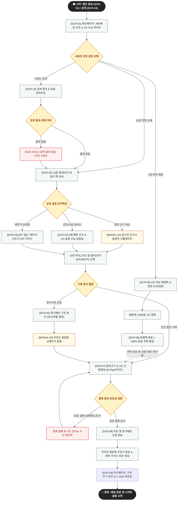

# 🔄 [김살림] 플로뜰리에 (Flottelier) 스마트 살림 서비스 흐름도 (Service Flow)

> **문서 버전**: v1.0.0  
> **대상 페르소나**: 김살림 / 이현정 (스마트 미니멀 살림 큐레이터, 10장 수건 전면 교체 & 정기배송 구매자)  
> **기준 입력 파일**: `김살림 가상 클라이언트 설계 결과/사이트맵.md`, `클라이언트/가상클라이언트_분석결과_모음/김살림/김살림_가상클라이언트_분석결과.md`  
> **저장 위치**: `김살림 가상 클라이언트 설계 결과/서비스_흐름도.md`  
> **인코딩**: UTF-8

---

## 1. 서비스 흐름 개요

본 서비스 흐름도는 젖은 수건의 쿰쿰한 쉰내와 좁은 욕실 수납장의 부피 부담을 해결하고자 하는 김살림(이현정) 페르소나의 인지·탐색·검증·의사결정 전 과정을 최적화한 사용자 여정(User Journey) 설계서입니다.

사용자가 사이트에 진입하여 **'3배 빠른 초고속 건조'**, **'1/3 슬림 수납'**, **'삶기 불필요 4차 정련 완제품'**을 확인하고, **'10장 번들 장당 9,900원'**의 실질적 가격 혜택을 체감한 뒤 1초 간편결제 또는 정기구독을 완료하기까지의 모든 정상 경로와 분기/예외 경로를 빈틈없이 다룹니다.

---

## 2. 사용자 유형과 시작 조건

### 2.1 사용자 유형 (User Personas)
1. **대용량 번들 전면 교체자 (Primary)**: 집안 수건 10~20장을 일괄 교체하고 장당 단가(9,900원) 및 수납 공간 절약을 최우선으로 보는 고객.
2. **소창 입문 안심 체험자 (Secondary)**: 소창 수건의 건조 속도와 냄새 억제 효과를 의심하여 3,000원 1장 체험팩을 먼저 써보려는 고객.
3. **정기구독 및 자동 케어 희망자 (Tertiary)**: 6개월/1년 주기 교체 알림톡을 받고 자동으로 신규 수건을 정기배송받고자 하는 미니멀 살림 고객.

### 2.2 시작 조건 (Entry Triggers)
* **진입점 A**: 메인페이지(`SCR-01`) 상단 히어로 배너 [장마철 쉰내 제로 10장 올 체인지 팩] 클릭
* **진입점 B**: 상단 공지 띠배너 [받아서 바로 쓰는 4차 정련 소창 100% 보장] 클릭
* **진입점 C**: 검색창(`SCR-10`)에서 살림 핵심 키워드("10장 세트", "수건 쉰내", "건조기", "상부장 정리") 검색
* **진입점 D**: 1장 체험팩 플로팅 배너 [1장 3,000원 체험 후 본품 구매 시 100% 환급] 클릭

---

## 3. 핵심 정상 흐름 (Primary Happy Path)

주요 서비스 흐름은 `탐색 ➔ 선택 ➔ 상세 확인 ➔ 핵심 행동 ➔ 결과 확인`의 5단계 표준 여정을 따릅니다.

```
[탐색: SCR-01 / SCR-10]
   │
   ▼
[선택: SCR-02 (10장 번들 팩)]
   │
   ▼
[상세 확인: SCR-03 (건조·수납 실험실) / SCR-04 (세탁기 O/X)]
   │
   ▼
[핵심 행동: MODAL-01 (단가 계산) + SCR-07 (N-Pay 1초 결제 / SCR-05 정기구독)]
   │
   ▼
[결과 확인: SCR-08 (주문 완료) + 알림톡 수신 & 세탁 가이드 PDF]
```

1. **탐색 (Explore)**: 사용자가 메인(`SCR-01`)에 진입하여 '3배 빠른 건조 & 1/3 슬림 수납' 히어로와 4차 정련 완료 뱃지를 확인.
2. **선택 (Select)**: 베스트 1위 `[10장 올 체인지 데일리 팩]` 카드를 클릭하여 상세 화면(`SCR-02`)으로 진입.
3. **상세 확인 (Inspect & Validate)**:
   - 실시간 장당 단가 계산기(`MODAL-01`)로 10장 구매 시 장당 9,900원(26,000원 할인) 혜택 확인.
   - `건조 & 수납 실험실(SCR-03)`에서 일반 타월 대비 3배 빠른 1시간 건조 그래프 및 상부장 1/3 수납 슬라이더 확인.
   - `세탁기 가이드(SCR-04)`에서 삶을 필요 없이 세탁기 울/표준코스로 바로 사용 가능함을 O/X 표로 확인.
4. **핵심 행동 (Action)**:
   - 순면 고리형 루프 옵션 선택 ➔ [10장 세트 장바구니 담기] or [6개월 정기배송 신청] 클릭.
   - 장바구니 및 주문 결제(`SCR-07`)에서 네이버페이 / 카카오페이 1초 결제 승인.
5. **결과 확인 (Confirm & Post-Care)**:
   - 주문 완료 화면(`SCR-08`)에서 배송 예정일 확인.
   - 카카오톡으로 즉시 주문서 수신 및 `세탁기 간편 관리 지침서 PDF` 다운로드.

---

## 4. 분기, 오류, 이탈 및 재진입 흐름 (Branching & Exception Flows)

### 4.1 구매 방식 분기 (단건 구매 vs 정기구독 vs 1장 체험팩)
* **분기 1 (1장 안심 체험팩 경로)**:
  - 10장 일괄 구매가 망설여지는 경우 `[1장 3,000원 체험팩 신청(SCR-06)]` 클릭.
  - 3,000원 결제 완료 즉시 `[본품 10장 세트 구매 시 3,000원 100% 환급 쿠폰]`이 카카오 알림톡으로 자동 발급.
  - 이후 10장 번들 구매 시 쿠폰을 적용하여 실질 0원에 체험팩을 이용하는 재진입 플로우.
* **분기 2 (정기배송 구독 경로)**:
  - 상세(`SCR-02`)에서 `[6개월/12개월 정기구독]` 옵션 선택 시 `정기배송 센터(SCR-05)`로 분기.
  - 정기배송 10% 추가 할인 적용 및 카카오 알림톡 교체 주기 등록(`MODAL-03`).

### 4.2 오류 및 예외 처리 흐름
* **오류 1: 검색 결과 없음 / 상품 품절 (`SCR-EX01`)**
  - 잘못된 검색어 입력 시 오타 자동 보정 키워드 추천 ("'소창수건' 검색 결과입니다").
  - 유사 겹수 번들 상품 및 `1장 안심 체험팩` 바로가기 버튼 제공으로 이탈 방지.
* **오류 2: 필수 옵션 누락 (고리 유무 / 배송 주기 미선택)**
  - [장바구니 담기] 또는 [구매하기] 클릭 시 옵션 선택 영역으로 부드러운 스크롤 이동 및 붉은색 안내 하이라이트.
* **오류 3: 결제 인증 실패 / 잔액 부족**
  - 주문 결제(`SCR-07`) 페이지 유지 및 상단 토스트 메시지 안내 ("결제 승인이 실패했습니다. 결제 수단을 다시 확인해 주세요").
* **오류 4: 잘못된 URL 접근 (`SCR-EX02`)**
  - 404 Not Found 화면에서 [메인 홈으로 이동], [10장 세트 바로가기] 퀵 버튼 제공.

---

## 5. 단계별 서비스 흐름 명세표 (Flow Step Specifications)

| 단계 | 화면 ID | 사용자 행동 (User Action) | 시스템 처리 (System Action) | 화면 전환 / 다음 조건 |
| :---: | :---: | :--- | :--- | :--- |
| **01. 진입** | `SCR-01` | 메인 접속 또는 띠배너 클릭 | 세션 초기화, 살림 히어로 및 10장 번들 팩 노출 | 10장 번들 클릭 시 `SCR-02` 이동 |
| **02. 탐색** | `SCR-10` | 검색창에 "수건 쉰내" 입력 | 디바운스 실시간 검색 및 건조/수납 관련 상품 매칭 | 검색 결과 리스트 노출 (`SCR-10`) |
| **03. 선택** | `SCR-02` | 10장 올체인지 데일리 팩 진입 | 기본 10장(단가 9,900원) 및 26,000원 절감 뱃지 렌더링 | 스크롤 또는 LNB 탭 클릭 |
| **04. 시뮬레이션** | `MODAL-01` | 수량 슬라이더 조작 (10장 ➔ 20장) | 실시간 장당 단가(9,900원 ➔ 8,900원) 및 할인율 자동 재계산 | [확인] 누르면 옵션 반영 |
| **05. 실증 확인** | `SCR-03` | 수납 비교 슬라이더 좌우 드래그 | 일반 수건 vs 소창 수건 수납 부피(68% 절감) 1:1 비교 렌더링 | `SCR-04` 탭 클릭 |
| **06. 관리 검증** | `SCR-04` | 세탁기/건조기 O/X 표 및 롤접기 확인 | 4차 정련 완제품(삶기 불필요) 보증 및 저온 건조 안내 렌더링 | [세탁 가이드 PDF 다운] 클릭 |
| **07. 옵션 결정** | `SCR-02` | 순면 루프(고리) 유무 체크 후 [구매하기] | 장바구니 세션 업데이트 및 배송비 무료 적용 | 단건 구매 시 `SCR-07`, 구독 시 `SCR-05` |
| **08-A. 구독 설정** | `SCR-05` | 배송 주기(6개월/12개월) 선택 및 알림톡 번호 입력 | 정기배송 10% 추가할인 계산 및 알림톡 스케줄러 등록 | [정기결제 진행] 시 `SCR-07` 이동 |
| **08-B. 체험 전환** | `SCR-06` | [1장 체험팩 신청] 클릭 | 3,000원 결제창 팝업 및 100% 환급 쿠폰 예약 | 결제 후 `SCR-08`로 이동 |
| **09. 결제 처리** | `SCR-07` | N-Pay / 카카오페이 결제 버튼 클릭 | PG 결제창 호출 및 유효성(배송지, 결제인증) 검증 | 결제 성공 시 `SCR-08`, 실패 시 `SCR-07` 유지 |
| **10. 완료 & 후속** | `SCR-08` | 주문 완료 확인 및 알림톡 확인 | 주문 DB 저장, 카카오 알림톡 발송, 배송 D-Day 카운트다운 시작 | 마이페이지(`SCR-09`) 이동 가능 |

---

## 6. Mermaid 전체 서비스 흐름도 (Service Flow Diagram)


