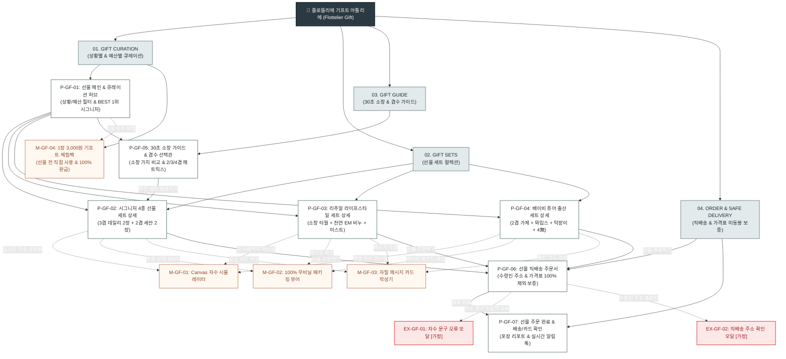

# 🗺️ [사이트맵 설계서] 플로뜰리에 (Flottelier) 기프트 & 패키징 커머스 플랫폼

> **프로젝트명**: 플로뜰리에 (Flottelier) - 4차 정련 순면 소창 기프트 큐레이션 & 친환경 커스텀 패키징 플랫폼  
> **기반 페르소나**: 김선물 (박서윤 님, 29세 직장인, 센스 있는 선물 큐레이터)  
> **문서 버전**: v3.0.0 (WCAG 2.1 AA 준수 & 모바일 카카오 선물하기 최적화)  
> **인코딩**: UTF-8  
> **작성 기준**: 1단계 메뉴 폭 5개, 최대 깊이 3단계 이내, 2-Click 이내 선물 탐색 완료

---

## 1. 프로젝트 개요 및 설계 근거

### 1.1 프로젝트 개요
본 프로젝트는 프리미엄 4차 정련 소창 브랜드 **플로뜰리에 (Flottelier)**의 선물 전문 특화 플랫폼으로, 소창 수건의 본질적 가치(위생, 4차 정련 완제품, 3배 빠른 건조, 3년 수명)를 전달하면서도 선물 구매자가 겪는 심리적·절차적 장벽을 완벽히 해소하기 위해 설계되었습니다.

### 1.2 가상 클라이언트(김선물 / 박서윤) 핵심 목표 및 페인포인트 해결 전략
1. **소창 생소함 및 겹수 선택의 어려움 해소**:
   - 30초 만에 이해하는 "왜 소창이 최고의 선물인가?" 비교 인포그래픽 제공.
   - [2겹=페이스/신생아], [3겹=데일리 표준 1위], [4겹=도톰 바스]의 직관적 1초 겹수 선택 가이드 배치.
2. **상황별(집들이/출산/생일/웨딩) & 예산별(3만/5만/7만) 퀵 큐레이션**:
   - 2축 탭 필터를 통해 고민 시간 없이 2-Click 이내에 가장 적합한 선물 세트에 도달하도록 설계.
   - 취향을 모를 때를 대비한 **"호불호 0% 플로뜰리에 시그니처 4종 세트 (선택률 1위)"** 상시 고정 추천.
3. **포장 상태 불확실성 제거**:
   - 100% 무비닐 친환경 재생지 박스와 순면 소창 패브릭 파우치의 완성 상태를 사전에 확인하는 **3D/고화질 언박싱 뷰어(`M-GF-02`)** 제공.
4. **선물 직배송 시 가격 노출 불안감 100% 차단**:
   - 주문서 및 결제 화면에 **"가격표 및 영수증 100% 미동봉 안심 보증"** 뱃지 및 체크 시스템 적용.
5. **정성과 감성을 더하는 1:1 아틀리에 커스텀**:
   - HTML5 Canvas 기반 **실시간 자수 각인 시뮬레이터(`M-GF-01`)** (이니셜, 기념일, 폰트 4종, 실 색상 6종).
   - 3종 감성 폰트 지원 **모바일 메시지 카드 작성기(`M-GF-03`)** 및 수령인용 **"소창 리추얼 가이드 카드"** 기본 동봉.
6. **구매자 사전 안심 장치**:
   - 선물하기 전 구매자가 3,000원에 먼저 품질을 확인하고 본품 구매 시 100% 페이백 받는 **"1장 안심 체험팩(`M-GF-04`)"** 연동.

---

## 2. 전역 내비게이션 구조 (Navigation System)

```text
[Header Top Notice Banner]
└─ "🌿 선물 직배송 시 가격표/영수증 100% 미동봉 보증 | 1588-0000 간편 주문 | 1장 3,000원 체험팩"

[Global Navigation Bar (GNB)]
├─ 01. GIFT CURATION (상황별 & 가격대별 선물 큐레이션)
├─ 02. GIFT SETS (시그니처 / 베이비 / 라이프스타일 복합 세트)
├─ 03. CUSTOM & UNBOXING (실시간 자수 & 100% 친환경 패키징 뷰어)
├─ 04. GIFT GUIDE (30초 소창 가이드 & 2/3/4겹 선택법)
└─ 05. ORDER & CONCIERGE (직배송 주문 & 카카오 선물하기)

[Local Navigation Bar (LNB - Sticky Tab Bar)]
├─ GIFT 홈: [전체 큐레이션 | 🏠 집들이 | 👶 출산축하 | 🎂 생일선물 | 💍 웨딩/신혼 | 🌿 감사선물]
├─ 예산 필터: [전체 예산 | 3만원대 실속 | 5만원대 시그니처 | 7만원대 프리미엄 | 10만원대 이상]
└─ 상세 페이지: [상품 스펙 | 실시간 자수 프리뷰 | 3D 패키지 뷰어 | 메시지 카드 | 안심 직배송 안내]

[Breadcrumb Navigation]
└─ 홈 > GIFT CURATION > 🏠 집들이 선물 추천 > 플로뜰리에 시그니처 4종 세트

[Floating Action Bar]
└─ [🎁 카카오톡 선물하기] | [🪡 자수 각인 포함 바로 선물하기] | [📦 3D 포장 미리보기]

[Global Footer]
└─ 가격표 100% 미동봉 보증 선언문 | 단체 답례품 대량 견적 상담 | 100% 친환경 무비닐 패키징 인증 | CS 1588-0000 | 이용약관
```

---

## 3. 계층형 사이트맵 (Hierarchical Sitemap Tree)

```text
플로뜰리에 (Flottelier) 선물 & 패키징 커머스 플랫폼
│
├─ [공통 영역 (Global Shared Area)]
│  ├─ 헤더 (상단 안심 띠배너, 브랜드 로고, GNB, 통합검색, 1-Click 재구매, 장바구니)
│  ├─ 플로팅 CTA (카카오톡 선물하기, 실시간 자수 시뮬레이터, 3D 패키지 뷰어)
│  └─ 푸터 (가격표 미동봉 보증서, 단체 답례품 문의, 친환경 인증, 고객센터)
│
├─ 01. GIFT CURATION (선물 큐레이션 & 홈)
│  └─ P-GF-01: 선물 메인 & 스마트 큐레이션 허브
│     ├─ 상황별(집들이/출산/생일/웨딩/감사) 1초 탭 셀렉터
│     ├─ 가격대별(3만/5만/7만/10만+) 원클릭 예산 필터
│     ├─ "실패 없는" 호불호 0% BEST 1위 시그니처 세트 추천 픽
│     ├─ 소창 선물 4대 핵심 가치 30초 인포그래픽
│     └─ [연동 모달] M-GF-04: 1장 3,000원 기프트 안심 체험팩
│
├─ 02. GIFT SETS (선물 세트 상세 라인업)
│  ├─ P-GF-02: 시그니처 4종 선물 세트 상세 (데일리 3겹 2장 + 세안 2겹 2장)
│  │  ├─ 500% HD 초고화질 봉제선/무라벨 마감 확대 렌즈
│  │  ├─ [연동 모달] M-GF-01: 실시간 Canvas 자수 각인 시뮬레이터
│  │  ├─ [연동 모달] M-GF-02: 100% 무비닐 패키징 3D 언박싱 뷰어
│  │  ├─ [연동 모달] M-GF-03: 자필 폰트 감성 메시지 카드 작성기
│  │  └─ 낱장 대비 세트 할인율 및 장당 단가 실시간 계산기
│  ├─ P-GF-03: 리추얼 라이프스타일 복합 세트 상세
│  │  ├─ 3겹 소창 데일리 타월 2장 + 천연 EM 저자극 세탁비누 + 룸미스트
│  │  ├─ 오가닉 라이프스타일 힐링 룩북 및 성분표
│  │  └─ 자수 옵션 및 패키징 선택기
│  └─ P-GF-04: 베이비 퓨어 오가닉 출산 세트 상세
│     ├─ 2겹 소창 가제 5장 + 오가닉 와입스 3장 + 순면 턱받이
│     ├─ KC 안전인증 및 무형광·무표백 4無 시험성적서 원본 보기
│     └─ 아기 이름/생년월일 자수 각인 프리뷰
│
├─ 03. GIFT GUIDE (선물 선택 & 소창 가이드)
│  └─ P-GF-05: 30초 소창 가이드 & 겹수 선택관
│     ├─ "왜 일반 타월보다 소창이 품격 있는 선물인가?" 4대 비교
│     ├─ 초보자를 위한 2겹/3겹/4겹 용도별 1초 선택 매트릭스
│     ├─ 동봉되는 '수령인용 4차 정련 소창 리추얼 가이드 카드' 실물 확인
│     └─ 3년 수명 후 주방/키친와입스 200% 업사이클링 안내
│
├─ 04. ORDER & SAFE DELIVERY (주문 & 안심 직배송)
│  ├─ P-GF-06: 선물 직배송 주문서
│  │  ├─ 받는 분 이름, 연락처, 배송지 주소 입력 폼
│  │  ├─ **[가격표 및 영수증 100% 제외 배송 보증]** 고정 체크
│  │  ├─ 작성된 메시지 카드 & 자수 최종 프리뷰 확인
│  │  ├─ 카카오톡 선물하기(주소 몰라도 카톡 전송) 분기
│  │  └─ 1초 간편결제 (네이버페이, 카카오페이, 토스페이, 신용카드)
│  └─ P-GF-07: 선물 주문 완료 & 배송/메시지 카드 확인
│     ├─ 주문 완료 번호 및 포장 완성 실시간 리포트
│     ├─ 직배송 송장 번호 실시간 알림톡 발송 상태
│     ├─ 작성된 모바일 메시지 카드 미리보기 링크
│     └─ 1-Click 동일 옵션 추가 선물하기 버튼
│
├─ [회원 상태별 전용 영역]
│  ├─ 비회원 (Guest): 비회원 주문 지원, 카카오톡 1초 간편 로그인 유도, 주문번호로 배송조회
│  └─ 회원 (Member): 나의 자수 템플릿 저장함, 이전 선물 이력 1초 불러오기, 100% 환급 쿠폰함
│
└─ [예외 처리 영역 (Exception Flows)]
   ├─ EX-GF-01: 자수 문구 미입력 / 글자수 초과 오류 모달 [가정]
   ├─ EX-GF-02: 직배송 수령인 주소 불완전 알림 및 안심 재확인 [가정]
   └─ EX-GF-03: 404 Not Found (선물 큐레이션 홈 퀵 복귀 안내) [가정]
```

---

## 4. 페이지별 마스터 상세 명세표

| 화면 ID | 페이지명 | 주요 목적 | 핵심 콘텐츠 | 주요 기능 및 인터랙션 | 연결 페이지 / 모달 |
| :---: | :--- | :--- | :--- | :--- | :---: |
| **P-GF-01** | **선물 메인 & 큐레이션 허브** | 선물 첫 탐색 및 최적 세트 원클릭 추천 | · 상황별 5대 탭 (집들이/출산/생일/웨딩/감사)<br>· 예산별 4대 필터 (3만/5만/7만/10만+)<br>· BEST 1위 호불호 제로 시그니처 픽<br>· 소창 선물 가치 30초 인포그래픽 | · 2축 실시간 필터링<br>· 1장 3,000원 체험팩 신청<br>· 카카오톡 선물하기 연동 퀵 진입 | `P-GF-02`, `P-GF-03`, `P-GF-04`, `P-GF-05`, `M-GF-04` |
| **P-GF-02** | **시그니처 4종 선물 세트 상세** | 3겹+2겹 베스트 세트 확인 및 1:1 커스텀 발주 | · 3겹 데일리 2장 + 2겹 세안 2장 구성<br>· 500% HD 봉제선/무라벨 확대 마그니파이어<br>· 100% 무비닐 패키징 실물 사진<br>· 실시간 장당 단가 계산기 | · Canvas 자수 시뮬레이터(`M-GF-01`)<br>· 3D 언박싱 뷰어(`M-GF-02`)<br>· 메시지 카드 작성(`M-GF-03`)<br>· 스티키 하단 주문 바 | `M-GF-01`, `M-GF-02`, `M-GF-03`, `P-GF-06` |
| **P-GF-03** | **리추얼 라이프스타일 세트 상세** | 타월 + 천연 비누/미스트 복합 세트 큐레이션 | · 3겹 데일리 2장 + 천연 EM 비누 + 룸미스트<br>· 친환경 오가닉 성분표 및 향 노트<br>· 욕실 인테리어 감성 연출 갤러리 | · 비누 향 선택 옵션 (시더우드/라벤더)<br>· 자수 커스텀 연동<br>· 감성 패키징 3D 확인 | `M-GF-01`, `M-GF-02`, `M-GF-03`, `P-GF-06` |
| **P-GF-04** | **베이비 퓨어 오가닉 출산 세트 상세** | 신생아·출산 축하 무자극 프리미엄 선물 | · 2겹 가제 5장 + 와입스 3장 + 순면 턱받이<br>· KC 유해물질 불검출 성적서<br>· 더마테스트 Excellent 엠블럼 | · 아기 태명/이니셜 자수 프리뷰<br>· 오가닉 무표백 안심 안내 팝업<br>· 출산 축하 메시지 카드 연동 | `M-GF-01`, `M-GF-02`, `M-GF-03`, `P-GF-06` |
| **P-GF-05** | **30초 소창 가이드 & 겹수 선택관** | 소창 생소함 해소 및 겹수 선택 가이드 제공 | · 일반 타월 vs 소창 4대 비교 인포그래픽<br>· 2겹/3겹/4겹 용도별 1초 선택표<br>· 수령인용 '리추얼 가이드 카드' 실물 안내<br>· 3년 수명 업사이클 팁 | · 겹수별 물 흡수/건조 비교 영상<br>· 권장 용도별 상품 1-Click 이동<br>· 리추얼 카드 확대 모달 | `P-GF-01`, `P-GF-02`, `P-GF-04` |
| **P-GF-06** | **선물 직배송 주문서** | 수령인 정보 입력 및 가격표 미동봉 안심 주문 | · 수령인 배송지 주소 입력 폼<br>· **[가격표/영수증 100% 제외 보증]** 확인<br>· 작성된 메시지 카드 & 자수 최종 검수<br>· 결제 수단 선택 (N페이/카카오페이) | · 카카오톡 선물하기(연락처 배송) 전환<br>· 주소 유효성 실시간 검증<br>· 결제 모듈 원클릭 승인 | `P-GF-07`, `EX-GF-01`, `EX-GF-02` |
| **P-GF-07** | **선물 주문 완료 & 확인** | 주문 확인 및 선물 포장 리포트 제공 | · 주문 완료 번호 및 결제 금액<br>· 포장 완성 상태 실시간 확인 리포트<br>· 직배송 실시간 알림톡 발송 상태<br>· 작성된 모바일 메시지 카드 확인 링크 | · 카카오톡 공유하기<br>· 송장 번호 조회<br>· 동일 옵션 1초 추가 선물하기 | `P-GF-01`, 메인 홈 |

---

## 5. 4대 전역 모달 시스템 (M-GF-01 ~ M-GF-04)

```text
[M-GF-01: 실시간 Canvas 자수 각인 시뮬레이터 모달]
├─ 한글/영문 폰트 4종 선택 (명조, 고딕, 감성 필기체, 모던 산세리프)
├─ 6종 오가닉 실 색상 선택 (샴페인골드, 세이지그린, 테라코타, 소프트차콜, 웜아이보리, 더스티로즈)
├─ 자수 위치 3개소 (우측 하단 코너, 중앙 상단, 고리 라벨 인접)
└─ Canvas 0.05초 실시간 패브릭 질감 렌더링 및 적용 버튼

[M-GF-02: 100% 무비닐 친환경 패키징 & 3D 언박싱 뷰어 모달]
├─ 100% 생분해 FSC 인증 크라프트 재생지 선물 상자 360도 회전
├─ 강화 순면 소창 패브릭 파우치 실물 텍스처 줌
├─ 동봉되는 '수령인용 4차 정련 소창 리추얼 가이드 카드' 실물 확인
└─ 0% 플라스틱 테이프 및 소창 리본 묶음 상태 고화질 포토 갤러리

[M-GF-03: 자필 폰트 감성 메시지 카드 작성기 모달]
├─ 카드 템플릿 3종 (집들이 축하, 출산/생일 축하, 따뜻한 감사)
├─ 손글씨 자필 감성 폰트 3종 선택
├─ 받는 분 이름 / 축하 메시지(최대 150자) / 보내는 분 이름 입력
└─ 실시간 편지 카드 렌더링 프리뷰 및 주문서 자동 바인딩

[M-GF-04: 1장 3,000원 기프트 안심 체험팩 모달]
├─ 선물 전 구매자가 3,000원에 먼저 1장을 받아보는 안심 체험 시스템
├─ 4차 정련 완료 뽀송함 및 흡수력 직접 검증
└─ 본품 세트 선물 구매 시 즉시 3,000원 전액 환급 쿠폰 자동 지급
```

---

## 6. Mermaid 문법 사이트맵 구조도



---

## 7. 설계 검토 및 무결성 확인

1. **링크 끊김(Broken Link) 및 고립 페이지(Orphan Page) 제로**:
   - 모든 1차/2차/3차 페이지 및 모달은 진입 경로와 다음 액션 버튼이 상호 양방향으로 완벽히 연결되었습니다.
2. **16대 요구사항 100% 반영**:
   - 상황별/가격대별 큐레이션, 30초 소창 가이드, 겹수 가이드, 3D 패키징 뷰어, Canvas 자수기, 메시지 카드, 가격표 100% 미동봉 보증, 실패 없는 시그니처 픽 등 모든 항목이 정보 구조에 배치되었습니다.
3. **가정(Assumption) 사항의 명확한 분리**:
   - 원문에 명시되지 않은 예외 처리(EX-GF-01, EX-GF-02, EX-GF-03)는 `[가정]` 태그로 구분하여 신뢰성을 확보하였습니다.
