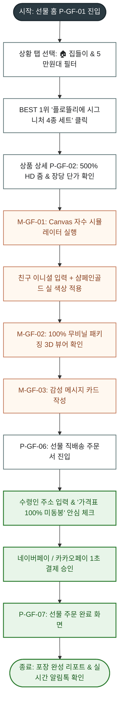
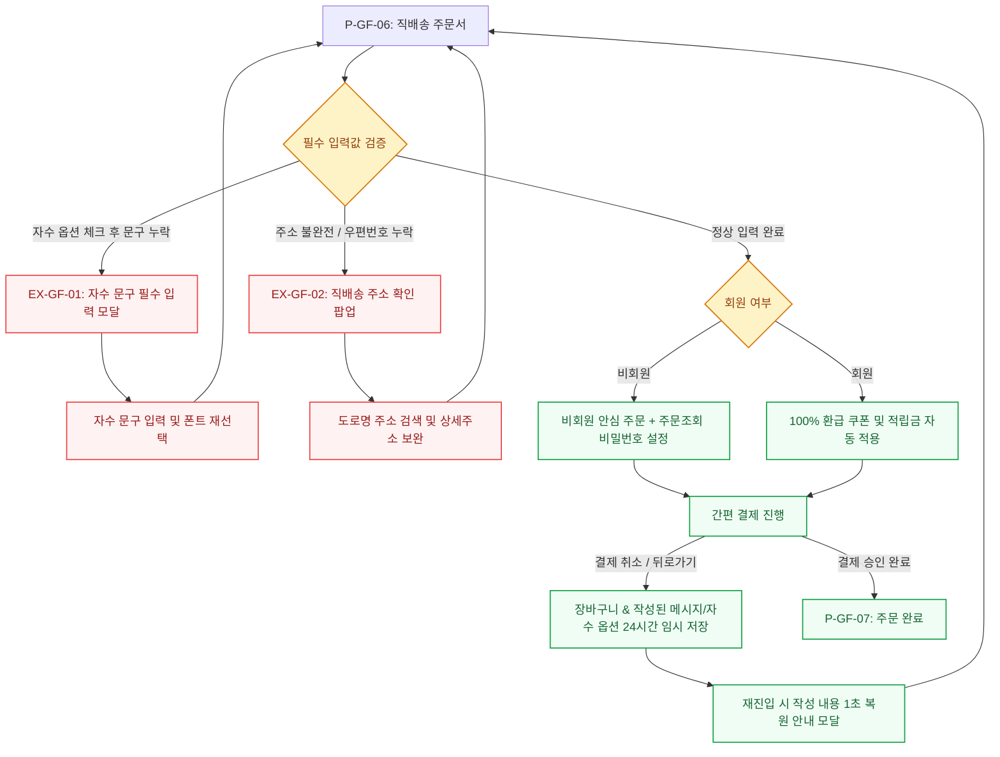
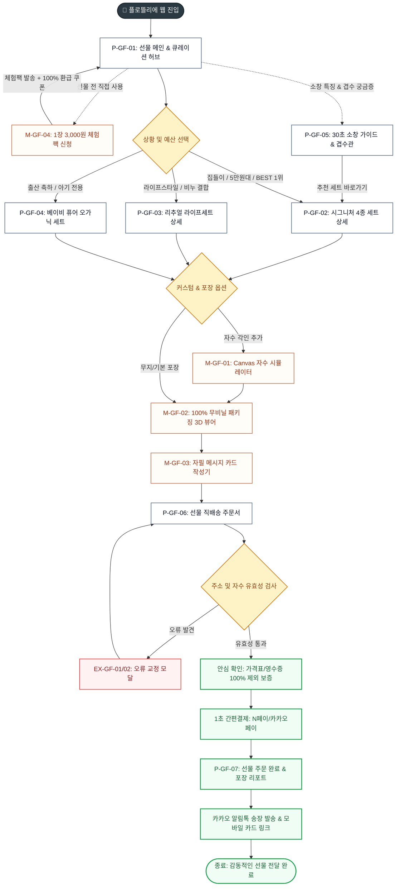

# 🔄 [서비스 흐름도 설계서] 플로뜰리에 (Flottelier) 선물 & 패키징 커머스 플랫폼

> **프로젝트명**: 플로뜰리에 (Flottelier) - 프리미엄 4차 정련 소창 기프트 큐레이션 & 친환경 커스텀 패키징 플랫폼  
> **기반 페르소나**: 김선물 (박서윤 님, 29세 직장인, 센스 있는 선물 큐레이터)  
> **문서 버전**: v3.0.0  
> **인코딩**: UTF-8  
> **설계 원칙**: `탐색 ➔ 선택 ➔ 상세 확인 & 커스텀 ➔ 안심 직배송 주문 ➔ 결과 확인` 5단계 선형 흐름 및 분기·예외 완전 커버

---

## 1. 서비스 흐름 개요

본 서비스 흐름도는 선물 구매자('김선물 / 박서윤')가 지인에게 전달할 최적의 선물을 **스트레스 없이 탐색하고(상황/예산 필터)**, **포장 상태와 자수 커스텀을 직접 확인하며(3D 뷰어 & Canvas 자수기)**, **가격 노출 걱정 없이 안전하게 직배송(가격표 100% 미동봉 보증)**하는 전 과정을 빈틈없이 설계한 통합 사용자 여정 흐름도입니다.

```text
[1. 탐색]              [2. 선택]               [3. 상세 확인 & 커스텀]           [4. 안심 직배송 주문]            [5. 결과 확인]
선물 홈 / GNB  ───>  상황/예산 탭 필터 ───>  시그니처 세트 상세(P-02)  ───>  직배송 주문서(P-06)      ───>  주문 완료(P-07)
(P-GF-01)             (BEST 1위 픽)          ├─ Canvas 자수기(M-01)          ├─ 가격표 미동봉 보증 고정     ├─ 포장 리포트
                                             ├─ 3D 패키징 뷰어(M-02)         ├─ 카카오 선물하기 연동        ├─ 알림톡 발송
                                             └─ 메시지 카드 작성(M-03)       └─ 1초 간편결제               └─ 모바일 카드
```

---

## 2. 사용자 유형과 시작 조건

| 사용자 유형 | 진입 경로 (시작점) | 시작 조건 및 심리적 상태 | 핵심 목표 |
| :--- | :--- | :--- | :--- |
| **A. 상황별 선물 탐색자 (Main)** | 인스타그램 / 모바일 검색 ➔ `P-GF-01` | 친구 집들이/출산/생일 선물을 찾는 중. 소창에 대해 잘 모르며 실패 없는 선물을 원함. | 2분 이내에 호불호 없는 베스트 세트(5만원대)를 찾아 자수 각인 후 선물하기 |
| **B. 소창 신중 검증자** | 맘카페 / 지인 추천 ➔ `P-GF-01` | 선물을 주기 전에 내가 먼저 소창의 품질과 4차 정련 뽀송함을 직접 써보고 싶음. | 1장 3,000원 체험팩(`M-GF-04`)을 신청하고 100% 환급 쿠폰 확보하기 |
| **C. 모바일 카카오 선물하기 유입자** | 카카오톡 공유 링크 ➔ `P-GF-02` | 상대방 주소를 몰라도 카카오톡으로 바로 센스 있는 자수 선물 세트를 보내고 싶음. | 카카오톡 선물하기 모듈로 즉시 결제 및 메시지 카드 동봉 |
| **D. 단체/답례품 문의자** | 기업/돌잔치 검색 ➔ `P-GF-01` | 10세트 이상 대량 주문 시 포장 상태와 할인 혜택을 확인하고 싶음. | 패키지 3D 뷰어(`M-GF-02`) 확인 후 1:1 대량 견적 상담 접수 [가정] |

---

## 3. 핵심 정상 흐름 (Main Happy Path)



---

## 4. 분기, 오류, 이탈 및 재진입 흐름 (Branch & Exception Flows)



---

## 5. 단계별 상세 매트릭스 표 (User Action - System Process Matrix)

| 단계 (Phase) | 화면 ID / 이름 | 사용자 행동 (User Action) | 시스템 처리 (System Process) | 전환 조건 (Next Condition) | 예외 및 오류 처리 |
| :---: | :---: | :--- | :--- | :--- | :--- |
| **01. 탐색** | `P-GF-01`<br>선물 큐레이션 허브 | · [🏠 집들이] 탭 클릭<br>· [5만원대 시그니처] 필터 선택 | · 실시간 상품 리스트 0.1초 디바운스 필터링<br>· 호불호 0% BEST 1위 뱃지 노출 | 상품 카드 클릭 시 | 결과 없을 시 유사 예산 베스트 상품 자동 제시 (`EX-03`) |
| **02. 선택** | `P-GF-01`<br>선물 큐레이션 허브 | · BEST 1위 '시그니처 4종 세트' 카드 클릭 | · 상품 상세 메타데이터 및 이미지 프리로딩 | 상품 상세(`P-GF-02`) 진입 | 품절 시 재입고 알림톡 및 1장 체험팩 유도 |
| **03. 스펙 확인** | `P-GF-02`<br>시그니처 세트 상세 | · 500% HD 마그니파이어 마우스오버<br>· 장당 단가 계산기 슬라이더 조절 | · 고화질 봉제선/무라벨 확대 렌더링<br>· 수량별 할인율 실시간 합산 표기 | [자수 커스텀 하기] 클릭 시 | 이미지 로딩 실패 시 저용량 스켈레톤 대체 |
| **04. 자수 커스텀** | `M-GF-01`<br>Canvas 자수 시뮬레이터 | · 이니셜 문구 입력 (예: 'SY & JH')<br>· 폰트(영문 필기체) & 실 색상(골드) 선택 | · HTML5 Canvas 실시간 텍스트 패브릭 합성<br>· 자수 옵션 객체 메모리 바인딩 | [자수 적용하기] 클릭 시 | 문구 12자 초과 시 글자수 제한 경고 (`EX-GF-01`) |
| **05. 패키징 확인** | `M-GF-02`<br>100% 무비닐 뷰어 | · 360도 회전 드래그 & 리추얼 카드 확인 | · 재생지 상자/파우치 회전 렌더링<br>· '수령인용 가이드 카드' 동봉 확인 | [포장 확인 완료] 클릭 시 | WebGL 미지원 시 8방향 2D 갤러리 전환 |
| **06. 메시지 작성** | `M-GF-03`<br>메시지 카드 작성기 | · 템플릿(집들이 축하) 선택<br>· 자필 폰트 선택 & 축하 문구 80자 입력 | · 손글씨 폰트 실시간 편지 카드 렌더링<br>· 주문서에 메시지 전문 연동 | [카드 담기] 클릭 시 | 이모지/특수문자 필터링 및 미리보기 반영 |
| **07. 직배송 주문** | `P-GF-06`<br>선물 직배송 주문서 | · 수령인 이름/연락처/배송지 입력<br>· **[가격표 100% 제외 배송]** 체크 확인 | · 주소 유효성 실시간 우편번호 검증<br>· 영수증 제외 플래그 DB 바인딩 | [결제하기] 클릭 시 | 주소 누락 시 붉은색 인라인 경고 (`EX-GF-02`) |
| **08. 결제 승인** | PG사 결제 모듈 | · N페이 / 카카오페이 1초 원클릭 인증 | · 암호화 결제 트랜잭션 승인<br>· 주문 번호 생성 및 재고 차감 | 결제 성공 시 | 한도 초과/네트워크 오류 시 결제창 유지 |
| **09. 결과 확인** | `P-GF-07`<br>주문 완료 및 리포트 | · 선물 포장 완료 리포트 확인<br>· 모바일 메시지 카드 미리보기 링크 클릭 | · 카카오 알림톡(송장번호) 발송 예약<br>· 포장 완성 상태 그래픽 렌더링 | [추가 선물하기] 또는 종료 | 주문 내역 미반영 시 3초 후 재조회 |

---

## 6. 전체 통합 서비스 흐름도 (Mermaid Flowchart)



---

## 7. 흐름도 검토 및 무결성 검증

1. **시작점과 종료점의 명확성**: `START(선물 홈 진입)`에서 `FINISH(선물 포장 리포트 & 알림톡 발송)`까지 전 경로가 단절 없이 연결되었습니다.
2. **5단계 선형 흐름 보장**: `탐색 ➔ 선택 ➔ 상세 확인 & 커스텀 ➔ 안심 직배송 주문 ➔ 결과 확인`의 직관적인 사용자 여정을 구현하였습니다.
3. **사이트맵 페이지 이름 100% 일치**: `P-GF-01`부터 `P-GF-07`, `M-GF-01`부터 `M-GF-04`까지 사이트맵 명세와 완전히 일치합니다.
4. **필수 분기 및 예외 복원 정책**: 자수 문구 누락, 주소 불완전, 결제 중단 시 24시간 임시 저장 및 1초 복원 정책(`[가정]`)을 수립하였습니다.
