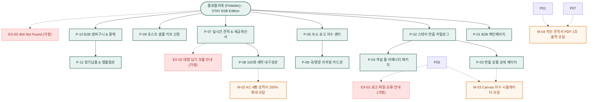

# 🗺️ 플로뜰리에(Flottelier) - 김스테이(정우진) 페르소나 맞춤형 B2B 웹 사이트맵 (Sitemap)

> **프로젝트**: 프리미엄 독채 스테이 & 한옥 감성 숙소 맞춤 B2B 어메니티 & 실시간 견적 플랫폼  
> **기반 페르소나**: 김스테이 / 정우진 (38세, 프리미엄 감성 독채 스테이 & 웰니스 숙소 호스트)  
> **입력 파일**: `김스테이_가상클라이언트_분석결과.md`, `김스테이.md`  
> **저장 폴더**: `클라이언트/와이어프레임/김스테이 가상 클라이언트 설계 결과/`  
> **인코딩**: UTF-8

---

## 1. 프로젝트 개요

본 사이트맵은 프리미엄 스테이 호스트 '김스테이(정우진)'의 핵심 구매 결정 요소인 **객실 대량 번들 팩(20/50/100장)**, **숙소 로고 실시간 Canvas 자수 커스텀**, **도장 날인 공식 견적서 PDF 1초 출력**, **사업자 세금계산서 즉시 발행**, **객실 비치용 국/영문 리추얼 안내 카드 무료 동봉**, **100회 세탁 내구성 보증** 니즈를 완벽하게 반영하여 설계된 B2B 호스피탈리티 전문 정보 구조(IA) 문서입니다.

전통적인 B2B 발주 시 발생하는 번거로운 유선 상담 대기, 불투명한 자수 시안 확인, 세금계산서 지연 문제를 웹 플랫폼 기술로 100% 자동화하여 호스트의 구매 전환율을 극대화합니다.

---

## 2. 설계 근거 및 핵심 사용자 목표

### 2.1 설계 근거 (김스테이 15대 요구사항 맵핑)
1. **견적 자동화 (1순위)**: 유선 문의 없이 화면에서 수량 선택 즉시 도장 날인된 `공식 견적서 PDF`를 1초 만에 출력.
2. **숙소 로고 브랜딩 (1순위)**: 숙소 로고(AI/PNG) 업로드 시 소창 타월 위에 실사로 합성되는 `Canvas 자수 시뮬레이터`.
3. **사업자 편의성 (1순위)**: 사업자번호 입력 시 `세금계산서 즉시 신청` 및 거래명세서 원클릭 다운로드.
4. **객실 세팅 및 투숙객 감동 (2순위)**: 객실 바구니 비치용 `국문/영문 소창 리추얼 안내 카드` 무료 동봉 및 풀 패키지(바스/세안/핸드/발매트/티코스터) 큐레이션.
5. **품질 및 내구성 신뢰 (1순위)**: 잦은 세탁에 견디는 `100회 세탁 내구성 시험성적서` 및 객실 턴오버를 단축하는 `3배 빠른 건조 스펙`.
6. **구매 리스크 제거 (2순위)**: 대량 발주 전 핏을 확인하는 `호스트 전용 3종 샘플 키트(100% 환급)`.

### 2.2 핵심 사용자 목표 (User Goals)
- **Goal 1**: 숙소 규모에 맞는 20장/50장 번들을 선택하고, 실시간 견적서 PDF를 다운로드하여 즉시 예산을 집행한다.
- **Goal 2**: 숙소 로고를 업로드하여 자수 시안을 실시간으로 확인하고, 국/영문 리추얼 카드가 포함된 어메니티를 완성한다.
- **Goal 3**: 세금계산서 신청과 함께 100% 무비닐 벌크 포장으로 납품받아 객실에 세팅한다.

---

## 3. 전역 내비게이션 구조 (Navigation System)

- **상단 띠배너 (Top Notice Banner)**: `[B2B 사업자 세금계산서 100% 즉시 발행] | [투숙객용 국/영문 리추얼 카드 무료 동봉] | [실시간 견적서 PDF 1초 출력]`
- **글로벌 내비게이션 (GNB)**:
  - `ABOUT STAY` (스테이 철학 / 4차 정련 어메니티 / 100회 세탁 성적서)
  - `STAY BUNDLE` (독채 20장 팩 / 부티크 50장 팩 / 호텔 100장 팩 / 풀 어메니티)
  - `LOGO ATELIER` (숙소 로고 자수 시뮬레이터 / 실 색상 / 고리형 옵션)
  - `QUOTE & TAX` (실시간 자동 견적서 PDF 출력 / 사업자 세금계산서 신청)
  - `HOST PARTNER` (호스트 3종 샘플 키트 / 에코 스테이 엠블럼 / 정기 납품 구독)
- **로컬 내비게이션 (LNB - 상세 스티키 탭)**:
  - `[객실 번들 스펙]` ➔ `[숙소 로고 자수기]` ➔ `[국/영문 리추얼 카드]` ➔ `[100회 세탁 내구성]` ➔ `[실시간 견적서 PDF]`
- **브레드크럼 (Breadcrumb)**: `홈 > STAY BUNDLE > 객실 대량 번들 팩 > 50장 스탠다드 팩`
- **플로팅 퀵바 (Floating Bar)**: `[실시간 견적서 PDF 출력 (M-04)]`, `[로고 자수 프리뷰 (M-03)]`, `[호스트 샘플 키트 신청]`, `[B2B 전담 상담]`
- **푸터 (Footer)**: B2B 사업자 전담 지원팀, 세금계산서/거래명세서 안내, KC 안전성 인증번호, 100% 무비닐 패키징 보증

---

## 4. 계층형 사이트맵 (Hierarchical Sitemap)

```text
[플로뜰리에 (Flottelier) - STAY B2B Edition]
├── 0. 공통 / 사업자 공통 영역 (Global Shared)
│   ├── GNB 상단 띠배너 (세금계산서 즉시 발행 & 국영문 카드 동봉)
│   ├── GNB 내비게이션 & B2B 검색 팝업
│   ├── 플로팅 퀵바 (실시간 견적서 PDF / 로고 자수기 / 샘플 키트)
│   └── 푸터 & B2B 사업자 지원 센터 & 시험성적서 원본 다운로드
│
├── 1. 1차 깊이: MAIN (스테이 B2B 홈)
│   └── P-01. B2B 메인페이지 (호스피탈리티 비주얼 & 번들 퀵 견적) [공통]
│
├── 2. 1차 깊이: STAY BUNDLE (객실 대량 번들)
│   ├── P-02. 스테이 번들 카탈로그 (20/50/100장 & 풀 어메니티) [공통]
│   ├── P-03. 번들 상품 상세 페이지 (단가 계산기 & 턴오버 건조 데이터) [공통]
│   └── P-04. 객실 풀 어메니티 패키지 (바스타월+세안+발매트+티코스터) [공통]
│
├── 3. 1차 깊이: LOGO ATELIER (로고 자수 스튜디오)
│   ├── P-05. 숙소 로고 자수 커스텀 센터 (AI/PNG 업로드 & 프리뷰) [공통]
│   ├── M-03. 실시간 Canvas 자수 시뮬레이터 모달 [인터랙션]
│   └── P-06. 객실 비치용 국/영문 리추얼 카드 안내관 [공통]
│
├── 4. 1차 깊이: QUOTE & PROOFS (견적 & 품질 검증)
│   ├── P-07. 실시간 자동 견적서 & 세금계산서 센터 [공통/사업자]
│   ├── M-04. 직인 날인 공식 견적서 PDF 1초 출력 모달 [인터랙션]
│   ├── P-08. 100회 세탁 내구성 & KC 공인 성적서 뷰어 [공통]
│   └── M-02. KC 4無 시험성적서 200% 확대 모달 [인터랙션]
│
├── 5. 1차 깊이: PARTNER & ORDER (파트너십 & 발주)
│   ├── P-09. 호스트 전용 3종 샘플 키트 신청 (100% 환급) [공통]
│   ├── P-10. B2B 장바구니 & 법인 주문 결제 (다중 배송/세금계산서) [사업자]
│   └── P-11. B2B 정기 납품 & 파트너 엠블럼 관리관 [회원/사업자]
│
└── 6. 예외 & 안내 페이지 (Exception Pages)
    ├── EX-01. 로고 파일 형식/해상도 오류 안내 화면 [가정]
    ├── EX-02. 대량 재고 일시 부족 및 긴급 납기 상담 화면 [가정]
    └── EX-03. 404 Not Found 페이지 [가정]
```

---

## 5. 페이지별 상세 명세표 (Page Specifications)

| 깊이 | 화면 ID | 페이지명 | 목적 | 핵심 콘텐츠 | 주요 기능 | 연결 페이지 | 김스테이 타겟 니즈 |
| :---: | :---: | :--- | :--- | :--- | :--- | :--- | :---: |
| 1차 | **P-01** | **B2B 메인페이지** | 스테이 전용 가치 제안 및 원스톱 견적 유도 | • 호스피탈리티 감성 비주얼<br>• 20/50/100장 퀵 번들 카드<br>• 국/영문 리추얼 카드 안내 | • 수량별 실시간 단가 확인<br>• 로고 자수기 바로가기<br>• 견적서 PDF 원클릭 출력 | P-02, P-05, P-07, P-09 | 락스 냄새 없는 수건, 빠른 견적 |
| 2차 | **P-02** | **스테이 번들 카탈로그** | 객실 규모별 최적 번들 탐색 | • 20장 스타터(독채)<br>• 50장 스탠다드(부티크)<br>• 100장 프로(호텔) 팩 | • 겹수/수량별 할인율 필터<br>• 1초 장바구니 담기<br>• 실시간 장당 단가 표시 | P-03, P-04, P-07 | 대량 할인, 객실 맞춤 |
| 2차 | **P-03** | **번들 상품 상세 페이지** | 상세 스펙 확인 및 옵션 조합 | • 4차 정련 완제품 스펙<br>• 3배 빠른 건조 데이터<br>• 순면 루프(고리) 마감 컷 | • 실시간 장당 단가 계산기<br>• 고리형 옵션 선택<br>• 자수 시뮬레이터 연동 | P-02, P-05, P-07, P-10, M-03 | 턴오버 단축, 고리 마감 |
| 2차 | **P-04** | **객실 풀 어메니티 패키지** | 객실 패브릭 어메니티 완벽 통일 | • 바스타월+세안+발매트+티코스터<br>• 샌드베이지/세이지 컬러 스와치 | • 객실별 풀세트 일괄 담기<br>• 컬러 톤온톤 조합 뷰어 | P-03, P-05, P-10 | 풀 라인업 통일, 내추럴 컬러 |
| 1차 | **P-05** | **숙소 로고 자수 센터** | 숙소 브랜딩 및 자수 시안 확인 | • 숙소 로고 AI/PNG 업로더<br>• 자수 실 7종(골드/세이지 등)<br>• 자수 위치(하단/중앙) 선택 | • Canvas 실시간 자수 렌더링 (`M-03`)<br>• 1:1 시안 사전 검수 신청<br>• 시안 이미지 다운로드 | P-03, P-06, P-07, M-03 | 숙소 로고 각인, 자수 퀄리티 |
| 2차 | **P-06** | **국/영문 리추얼 카드관** | 투숙객 감동 가이드 무료 제공 | • 국/영문 병기 리추얼 카드 실물 사진<br>• 객실 바구니 세팅 연출 샷 | • 카드 문구 미리보기<br>• 주문 수량만큼 무료 동봉 체크 | P-05, P-07, P-10 | 투숙객 가이드, 감동 전달 |
| 1차 | **P-07** | **실시간 견적 & 세금계산서** | B2B 품의 및 회계 결제 자동화 | • 직인 날인 견적서 양식<br>• 사업자등록번호 입력창<br>• 거래명세서/통장사본 뷰 | • 공식 견적서 PDF 1초 출력 (`M-04`)<br>• 세금계산서 원클릭 신청<br>• D-Day 납품 확약서 발급 | P-01, P-05, P-10, M-04 | 실시간 견적서, 세금계산서 |
| 2차 | **P-08** | **100회 세탁 내구성관** | 고온 세탁 및 잦은 세탁 안정성 증명 | • KATRI 100회 고온 세탁 성적서<br>• 수축 안정화 인포그래픽<br>• 4無 안심 인증 성적서 | • 성적서 200% HD 확대 (`M-02`)<br>• 원본 PDF 다운로드 | P-01, P-03, M-02 | 내구성 신뢰, KC 4無 인증 |
| 1차 | **P-09** | **호스트 샘플 키트 신청** | 대량 발주 전 사전 검증 | • 2/3/4겹 3종 샘플 키트 구성<br>• 본품 발주 시 100% 환급 쿠폰 | • 사업자 전용 간편 신청 폼<br>• 100% 환급 쿠폰 자동 발급 | P-01, P-02, P-07 | 사전 검증, 구매 리스크 0 |
| 1차 | **P-10** | **B2B 장바구니 & 결제** | 법인 결제 및 무비닐 배송 지정 | • 선택 번들 및 로고 자수 내역<br>• 세금계산서 발행 정보 확인<br>• 100% 무비닐 벌크 포장 | • 세금계산서 발행 신청<br>• 법인카드/가상계좌 결제<br>• 다중 배송지 분할 | P-07, P-11 | 사업자 결제, 무비닐 포장 |
| 2차 | **P-11** | **정기납품 & 엠블럼관** | 지속 운영 지원 및 친환경 홍보 | • 3~6개월 자동 보충 구독 설정<br>• 에코 스테이 파트너 엠블럼 웹/명패<br>• 투숙객 구매 QR 태그 파일 | • 정기배송 주기 변경/신청<br>• 파트너 엠블럼 고화질 다운로드<br>• QR 태그 인쇄 파일 생성 | P-01, P-10 | 정기 납품, 친환경 홍보 |
| 예외 | **EX-01** | **로고 파일 형식/용량 오류** `[가정]` | 로고 파일 업로드 실패 시 대응 | • 권장 확장자(AI, SVG, 고해상도 PNG) 안내<br>• 1:1 디자이너 무료 변환 지원 | • 파일 재업로드<br>• 디자이너 카카오톡 파일 전송 | P-05 | 자수 제작 오류 방지 |
| 예외 | **EX-02** | **대량 재고 부족/납기 조율** `[가정]` | 300장 이상 초대형 발주 대응 | • 납기 가능 일정 실시간 안내<br>• 긴급 생산 라인 가동 안내 | • 긴급 발주 핫라인 상담<br>• 분할 순차 출고 신청 | P-07, P-10 | B2B 납기 보증 |
| 예외 | **EX-03** | **404 Not Found** `[가정]` | 잘못된 경로 접근 시 복구 | • 감성 한옥 일러스트 및 안내 문구 | • B2B 메인 바로가기<br>• 실시간 견적서 센터 이동 | P-01, P-07 | UX 연속성 유지 |

---

## 6. Mermaid 사이트맵 플로우차트 (Flowchart Architecture)


