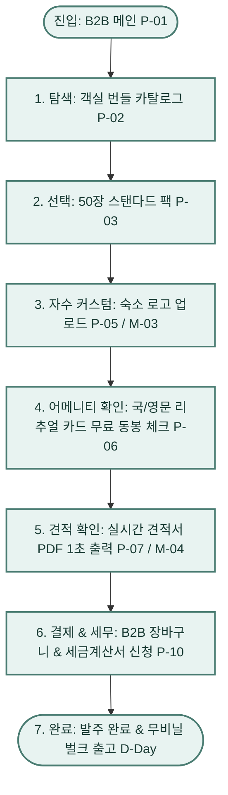

# 🔄 플로뜰리에(Flottelier) - 김스테이 B2B 서비스 흐름도 (Service Flowchart)

> **프로젝트**: 프리미엄 독채 스테이 & 한옥 감성 숙소 맞춤 B2B 어메니티 & 실시간 견적 플랫폼  
> **기반 페르소나**: 김스테이 / 정우진 (38세, 프리미엄 감성 독채 스테이 & 웰니스 숙소 호스트)  
> **입력 파일**: `김스테이_가상클라이언트_분석결과.md`, `김스테이.md`  
> **저장 폴더**: `클라이언트/와이어프레임/김스테이 가상 클라이언트 설계 결과/`  
> **인코딩**: UTF-8

---

## 1. 서비스 흐름 개요

본 서비스 흐름도는 프리미엄 스테이 호스트 '김스테이(정우진)'가 웹 플랫폼에 접속하여 **객실 대량 번들 탐색 ➔ 수량/옵션 선택 ➔ 숙소 로고 업로드 & 자수 시안 확인 ➔ 실시간 공식 견적서 PDF 다운로드 ➔ 사업자 세금계산서 신청 ➔ 발주 완료**에 이르는 전체 사용자 여정(User Journey)을 빈틈없이 설계한 B2B 특화 서비스 플로우 문서입니다.

---

## 2. 사용자 유형과 시작 조건

| 사용자 유형 | 진입 경로 (Entry Point) | 시작 조건 및 심리 상태 | 목표 (Goal) |
| :--- | :--- | :--- | :--- |
| **신규 호스트 (정우진)** | B2B 메인 (`P-01`) 또는 네이버/인스타그램 광고 | "락스 냄새 없는 최고급 친환경 어메니티로 객실 수건을 전면 교체하고 싶다." | 50장 스탠다드 번들 선택, 숙소 로고 자수 시안 확인, 실시간 견적서 PDF 출력 후 발주 |
| **사전 검증 호스트** | 샘플 신청 배너 또는 메인 CTA | "대량 구매 전 객실 세팅 핏과 원단 감촉을 직접 만져보고 결정하고 싶다." | 3종 샘플 키트(15,000원) 신청 ➔ 100% 환급 쿠폰 수령 ➔ 본품 발주 |
| **정기 구독 호스트** | 마이페이지 / 알림톡 링크 | "3~6개월마다 낡은 수건을 자동으로 교체 및 보충받고 싶다." | B2B 정기 납품 신청 (`P-11`) 및 에코 파트너 엠블럼 다운로드 |

---

## 3. 핵심 정상 흐름 (Happy Path)

---

## 4. 단계별 서비스 상세 흐름표 (Step-by-Step Matrix)

| 단계 | 사용자 행동 (User Action) | 시스템 처리 (System Action) | 표시 화면 (Screen) | 다음 조건 (Next Condition) |
| :---: | :--- | :--- | :--- | :--- |
| **01. 진입** | B2B 메인 진입 및 스크롤 | 상단 세금계산서 즉시 발행 띠배너 및 20/50/100장 퀵 번들 카드 노출 | `P-01 B2B 메인` | 번들 카드 클릭 시 02단계 이동 |
| **02. 탐색** | 객실 번들 카탈로그에서 숙소 규모별 팩 탐색 | 20장(독채), 50장(부티크), 100장(호텔) 수량별 할인율(25~40%) 및 장당 단가 실시간 연산 | `P-02 번들 카탈로그` | 특정 번들 클릭 시 03단계 이동 |
| **03. 선택** | 50장 스탠다드 팩 선택 및 고리형 옵션 체크 | 3배 빠른 건조 스펙 및 수납 부피 절약 데이터 로드, 고리형 루프 옵션 적용 | `P-03 번들 상세` | `[로고 자수 커스텀]` 클릭 시 04단계 이동 |
| **04. 커스텀** | 숙소 로고 파일(AI, PNG) 업로드 및 실 색상(골드) 선택 | Canvas 렌더링 엔진이 0.05초 만에 소창 패브릭 위에 실사 자수 합성 프리뷰 생성 | `P-05 자수 센터` / `M-03 자수 모달` | 파일 정상 시 프리뷰 완료, 오류 시 `EX-01` 분기 |
| **05. 부가선택** | 객실 비치용 국/영문 리추얼 안내 카드 문구 확인 | 주문 수량만큼 국/영문 리추얼 카드 무료 동봉 0원 자동 적용 | `P-06 리추얼 카드관` | `[실시간 견적서 출력]` 클릭 시 06단계 이동 |
| **06. 견적확인** | 실시간 공식 견적서 PDF 다운로드 클릭 | 법인 직인이 날인된 공식 견적서 PDF 1초 자동 생성 및 브라우저 다운로드 실행 | `P-07 견적 센터` / `M-04 견적 모달` | 품의 통과 후 즉시 결제 시 07단계 이동 |
| **07. 결제/세무** | 사업자등록번호 입력 및 세금계산서 신청 체크 후 결제 | 사업자 휴폐업 실시간 API 검증, 전자세금계산서 자동 승인 예약, 100% 무비닐 포장 확정 | `P-10 B2B 결제` | 결제 승인 완료 시 08단계 이동 |
| **08. 완료/구독** | 발주 완료 페이지 확인 및 D-Day 납품 확약서 확인 | D+2 자수 제작 및 출고 일정 카카오 알림톡 발송, 에코 스테이 파트너 엠블럼 다운로드 링크 제공 | `P-11 파트너관` | 3~6개월 자동 정기 납품 구독 활성화 |

---

## 5. Mermaid 전체 서비스 흐름도 (Full Service Flowchart)

```mermaid
flowchart TD
  %% 시작점
  START([시작: 스테이 호스트 B2B 플랫폼 접속 P-01]) --> STEP1[/1. 탐색: 객실 번들 카탈로그 조회 P-02/]

  %% 탐색 및 분기
  STEP1 --> DECISION1{사전 검증<br>샘플 필요 여부?}
  DECISION1 -- "샘플 먼저 체험" --> SAMPLE[호스트 3종 샘플 키트 신청 P-09]
  SAMPLE --> SAMPLE_PAY[15,000원 결제 & 샘플 수령]
  SAMPLE_PAY --> COUPON[100% 환급 쿠폰 수령 후 재진입]
  COUPON --> STEP2

  DECISION1 -- "본품 즉시 발주" --> STEP2[2. 선택: 50장 스탠다드 팩 상세 P-03]

  %% 옵션 및 자수
  STEP2 --> OPTION[고리형 루프 & 겹수 옵션 선택]
  OPTION --> STEP3[3. 커스텀: 숙소 로고 업로드 P-05]
  
  STEP3 --> FILE_CHECK{로고 파일 형식<br>& 해상도 유효성?}
  FILE_CHECK -- "비지원 포맷/저화질" --> EX01[EX-01 로고 오류 안내 & 디자이너 1:1 지원]
  EX01 --> STEP3

  FILE_CHECK -- "정상 AI/PNG 파일" --> CANVAS[Canvas 실시간 자수 렌더링 M-03]
  CANVAS --> STEP4[4. 어메니티: 국/영문 리추얼 카드 무료 동봉 P-06]

  %% 견적 및 품의
  STEP4 --> STEP5[5. 견적 확인: 실시간 견적서 PDF 1초 출력 P-07 / M-04]
  STEP5 --> QUOTE_CHECK{사내 품의 결재<br>즉시 진행 여부?}
  
  QUOTE_CHECK -- "견적서 파일 저장 후 이탈" --> LEAVE[품의 결재 진행]
  LEAVE --> RE_ENTRY[알림톡 링크 / 견적서 번호로 재진입]
  RE_ENTRY --> STEP6

  QUOTE_CHECK -- "즉시 발주" --> STEP6[6. 주문/결제: B2B 장바구니 P-10]

  %% 결제 및 세무 처리
  STEP6 --> TAX_INPUT[사업자등록번호 & 담당자 이메일 입력]
  TAX_INPUT --> SYS_TAX[시스템: 국세청 사업자 유효성 실시간 검증]
  SYS_TAX --> PAY_METHOD{결제 수단 선택}
  
  PAY_METHOD -- "법인카드 / 간편결제" --> PAY_INSTANT[1초 즉시 승인]
  PAY_METHOD -- "가상계좌 / 세금계산서" --> PAY_VIRTUAL[전자세금계산서 자동 발행 예약]

  PAY_INSTANT --> STEP7[7. 완료: 발주 완료 & 출고 D-Day 확약 P-11]
  PAY_VIRTUAL --> STEP7

  %% 사후 관리 및 구독
  STEP7 --> SUBSCRIPTION[8. 사후관리: 3~6개월 정기 납품 구독 & 에코 엠블럼 수령]
  SUBSCRIPTION --> END([종료: 객실 시그니처 소창 어메니티 세팅 완료])

  %% 스타일 클래스
  classDef startEnd fill:#1A3B34,stroke:#102A24,stroke-width:2px,color:#FFFFFF;
  classDef action fill:#E8F3F1,stroke:#4A7C72,stroke-width:1.5px,color:#1A3B34;
  classDef system fill:#EBF3FA,stroke:#2B6CB0,stroke-width:1.5px,color:#1A365D;
  classDef branch fill:#FFF6ED,stroke:#D97706,stroke-width:1.5px,color:#92400E;
  classDef error fill:#FEE2E2,stroke:#EF4444,stroke-width:1.5px,stroke-dasharray: 4 4,color:#991B1B;

  class START,END startEnd;
  class STEP1,STEP2,OPTION,STEP3,STEP4,STEP5,STEP6,STEP7,SAMPLE,SAMPLE_PAY,COUPON,LEAVE,RE_ENTRY,TAX_INPUT,SUBSCRIPTION action;
  class CANVAS,SYS_TAX,PAY_INSTANT,PAY_VIRTUAL system;
  class DECISION1,FILE_CHECK,QUOTE_CHECK,PAY_METHOD branch;
  class EX01 error;
```

