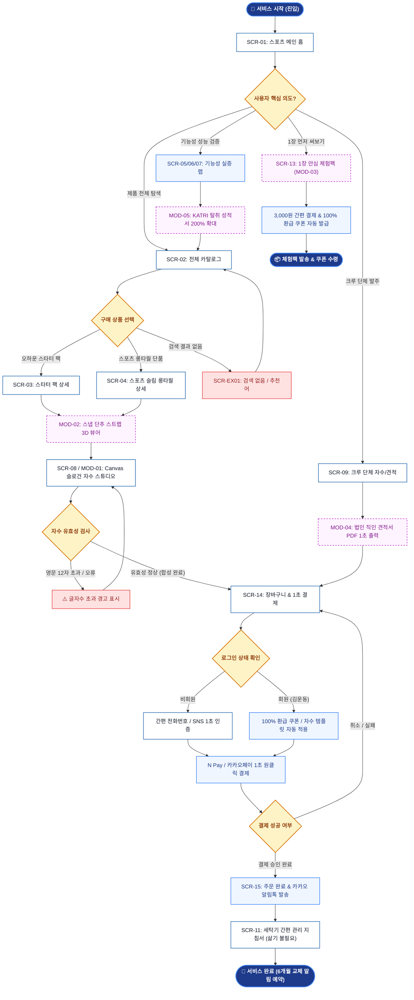

# 🔄 [서비스 흐름도] 플로뜰리에 (Flottelier) 오하운 스포츠 센터 서비스 흐름도

> **프로젝트**: 플로뜰리에 (Flottelier) 오하운 스포츠 & 액티비티 센터  
> **기반 페르소나**: 김운동 (김오하운 / 강태오 - 20대 후반 애슬레저 유저)  
> **사이트맵 입력 파일**: [사이트맵.md](file:///C:/chlwlgP/%EA%B9%80%EC%9A%B4%EB%8F%99%20%EA%B0%80%EC%83%81%20%ED%81%B4%EB%9D%BC%EC%9D%B4%EC%96%B8%ED%8A%B8%20%EC%84%A4%EA%B3%84%20%EA%B2%B0%EA%B3%BC/%EC%82%AC%EC%9D%B4%ED%8A%B8%EB%A7%B5.md)  
> **추가 참고 파일**: `김운동_가상클라이언트_분석결과.md`  
> **결과물 저장 폴더**: `김운동 가상 클라이언트 설계 결과/`  
> **버전**: v1.0.0  
> **인코딩**: UTF-8

---

## 1. 서비스 흐름 개요

본 서비스 흐름도는 **김운동(김오하운)** 페르소나가 운동 가방 속 땀 냄새와 눅눅함, 미세플라스틱 자극 문제를 해결하기 위해 플로뜰리에 스포츠 플랫폼에 진입하여 **[탐색 ➔ 실증 데이터 확인 ➔ 상품 상세 및 스냅 스트랩/자수 커스텀 ➔ 장바구니/간편결제 또는 1장 안심 체험팩 신청 ➔ 주문 완료/재구매]**에 이르는 전 과정을 체계적으로 정의합니다.

모든 화면 명칭과 ID는 앞서 정의된 [사이트맵.md](file:///C:/chlwlgP/%EA%B9%80%EC%9A%B4%EB%8F%99%20%EA%B0%80%EC%83%81%20%ED%81%B4%EB%9D%BC%EC%9D%B4%EC%96%B8%ED%8A%B8%20%EC%84%A4%EA%B3%84%20%EA%B2%B0%EA%B3%BC/%EC%82%AC%EC%9D%B4%ED%8A%B8%EB%A7%B5.md)의 16개 화면 및 5개 모달 시스템과 100% 일치하도록 구성되었습니다.

---

## 2. 사용자 유형과 시작 조건

| 사용자 유형 | 진입 경로 / 시작 조건 | 주요 목표 및 행동 의도 |
| :--- | :--- | :--- |
| **개인 러너 / 헬스 유저**<br>(김운동 개인) | · SNS/인스타 러닝 피드 광고<br>· 검색창 "땀 냄새 안 나는 스포츠 타월"<br>· 지인 추천 1장 안심 체험팩 링크 | · 목에 거는 30x90cm 롱타월 및 스냅 스트랩 확인<br>· 1초 땀 흡수 및 99.8% 탈취 성적서 검증<br>· 나만의 러닝 슬로건 자수 후 스타터 팩 구매 |
| **러닝 크루 / 동호회 리더**<br>(김운동 단체) | · 러닝 크루 단체 기프트 검색<br>· 스포츠 센터 B2B 제휴 배너 | · 크루 20~100장 대량 수량별 할인율 확인<br>· 크루 로고/슬로건 Canvas 자수 시뮬레이션<br>· 직인 날인 견적서 PDF 즉시 출력 및 발주 |
| **초기 탐색 및 신중 구매자**<br>(체험 희망자) | · 3,000원 스포츠 안심 체험팩 배너<br>· 등드름/가드름 무자극 4無 인증 검색 | · 3,000원에 먼저 1장 써보고 땀 흡수력 테스트<br>· 100% 환급 쿠폰 수령 후 스타터 팩 전환 |

---

## 3. 핵심 정상 흐름 (Main Happy Path)

```text
[STEP 1. 진입 & 탐색]
스포츠 메인 홈 (SCR-01) 진입 ➔ 상단 1초 땀 흡수 비주얼 확인 ➔ 전체 카탈로그 (SCR-02) 이동 ➔ 4겹 슬림 롱타월 또는 오하운 스타터 팩 선택

[STEP 2. 실증 데이터 검증]
1초 땀 흡수 챌린지 (SCR-05) 영상 확인 ➔ 땀 냄새 제로 랩 (SCR-06) KATRI 성적서 모달 (MOD-05) ➔ 40% 경량 95g 저울 비교 (SCR-07)

[STEP 3. 상세 확인 & 커스텀]
스타터 팩 상세 (SCR-03) / 롱타월 상세 (SCR-04) ➔ 스냅 단추 스트랩 3D 뷰어 (MOD-02) ➔ Canvas 슬로건 자수기 (MOD-01/SCR-08)에서 문구('Run Free') 및 실 색상(딥 골드) 실시간 합성

[STEP 4. 장바구니 & 간편 주문]
장바구니 (SCR-14) ➔ 순면 메쉬 스포츠 파우치 결합 체크 ➔ N Pay / 카카오페이 1-Click 간편 결제

[STEP 5. 주문 완료 & 사후 케어]
주문 완료 알림톡 수령 ➔ 세탁기 간편 관리 지침서 (SCR-11) 확인 ➔ 6개월 후 마이페이지 (SCR-15)에서 자수 템플릿 불러와 1초 재주문
```

---

## 4. 분기, 오류, 이탈 및 재진입 흐름 (Branch & Exception Flows)

### 4.1 분기 흐름 (Branch Flows)
1. **[분기 A] 1장 스포츠 안심 체험팩 경로**:
   - `SCR-01` 또는 `SCR-05`에서 `[1장 3,000원 체험팩 신청 (MOD-03)]` 클릭 ➔ 배송지 입력 ➔ 3,000원 결제 ➔ 카카오 알림톡으로 `100% 환급 3,000원 쿠폰` 자동 발급 ➔ 추후 스타터 팩 구매 시 자동 할인.
2. **[분기 B] 러닝 크루 단체 대량 발주 경로**:
   - `SCR-09` 이동 ➔ 수량 슬라이더(20~100장) 조절 ➔ 크루 로고 이미지(AI/PNG) 업로드 ➔ `[공식 직인 견적서 PDF 1초 출력 (MOD-04)]` ➔ 세금계산서 신청 ➔ 대량 발주 완료.
3. **[분기 C] 종목별 겹수 매칭 설문 경로**:
   - `SCR-10` 종목별 가이드 진입 ➔ 종목 선택(러닝/헬스/크로스핏) ➔ "4겹 슬림 롱타월 + 스냅 스트랩" 자동 추천 ➔ 1클릭 장바구니 담기.

### 4.2 오류 및 예외 흐름 (Error & Exception Handling)
1. **[오류 E-1] 검색어 결과 없음 (`SCR-EX01`)**:
   - 통합 검색창에 일치하는 상품이 없을 경우, 오타 자동 보정 및 베스트 스타터 팩(`SCR-03`) 퀵 링크 제시.
2. **[오류 E-2] 자수 문구 유효성 오류**:
   - 영문 최대 12자(한글 8자) 초과 입력 시 인라인 붉은색 경고 메시지 `[영문 최대 12자까지 입력 가능합니다]` 출력 및 포커스 유지.
3. **[오류 E-3] 결제 취소 및 중도 이탈**:
   - 결제창 닫기 시 장바구니(`SCR-14`)로 복귀하며, 입력한 자수 시안 데이터는 브라우저 로컬 스토리지에 24시간 안전 보관.
4. **[오류 E-4] 404 페이지 에러 (`SCR-EX02`)**:
   - 정갈한 스포츠 일러스트 그래픽과 함께 `[메인 홈 바로가기]`, `[카탈로그 바로가기]` 버튼 제공.

---

## 5. 단계별 사용자 행동, 시스템 처리, 화면, 다음 조건 표

| 단계 ID | 사용자 행동 (User Action) | 시스템 처리 (System Process) | 출력 화면 (Screen ID) | 다음 조건 및 분기 |
| :---: | :--- | :--- | :---: | :--- |
| **ST-01** | 서비스 접속 및 홈 탐색 | 스포츠 히어로 비주얼 및 1초 흡수 뱃지 렌더링 | **SCR-01** | · 카탈로그 이동 (`ST-02`)<br>· 1장 체험팩 클릭 (`ST-08`) |
| **ST-02** | 카탈로그 탐색 & 필터 선택 | 겹수별(2/3/4겹) 및 종목 태그 디바운스 필터링 | **SCR-02** | · 스타터 팩 선택 (`ST-03`)<br>· 롱타월 선택 (`ST-04`) |
| **ST-03** | 오하운 스타터 팩 상세 확인 | 롱타월+와입스+파우치 번들 15% 할인가 계산 | **SCR-03** | · 스냅 스트랩 3D 확인 (`MOD-02`)<br>· 자수 커스텀 호출 (`ST-05`) |
| **ST-04** | 스포츠 슬림 롱타월 상세 확인 | 30x90cm 목 거치 핏 & 500% 봉제선 줌 렌더링 | **SCR-04** | · 자수 커스텀 호출 (`ST-05`)<br>· 기능성 랩 확인 (`ST-06`) |
| **ST-05** | 슬로건 자수 문구/색상 입력 | Canvas에 0.05초 실시간 패브릭 자수 합성 | **SCR-08** / **MOD-01** | · 유효성 검사 통과 시 장바구니 (`ST-07`)<br>· 초과 시 인라인 오류 |
| **ST-06** | 1초 흡수 및 냄새 억제 검증 | KATRI 시험성적서 200% 확대 줌 모달 로드 | **SCR-05, 06, 07** / **MOD-05** | · 검증 후 상품 상세 복귀 (`ST-03, 04`) |
| **ST-07** | 장바구니 확인 & 간편 결제 | 메쉬 파우치 추가 여부 확인 및 결제 모듈 호출 | **SCR-14** | · N Pay/카카오 1초 승인 (`ST-10`)<br>· 결제 취소 시 장바구니 유지 |
| **ST-08** | 1장 안심 체험팩 신청 | 3,000원 결제창 띄우고 환급 쿠폰 데이터 생성 | **SCR-13** / **MOD-03** | · 체험팩 완료 및 쿠폰 발급 (`ST-09`) |
| **ST-09** | 100% 환급 쿠폰 수령 | 회원 계정 쿠폰함에 3,000원 자동 적립 및 알림톡 발송 | **SCR-15** | · 스타터 팩 재진입 시 자동 할인 |
| **ST-10** | 주문 완료 및 세탁 지침 확인 | 주문 접수 DB 저장, 카카오 알림톡 발송, 세탁 PDF 링크 | **SCR-15, SCR-11** | · 6개월 후 1-Click 재구매 트리거 |
| **ST-11** | 크루 대량 발주 및 견적 | 수량별 할인율 자동 계산 및 PDF 직인 견적서 렌더링 | **SCR-09** / **MOD-04** | · PDF 다운로드 및 B2B 결제 승인 |

---

## 6. Mermaid 전체 서비스 흐름도



---

## 7. 설계 시 가정 사항 (Assumptions)

1. `가정`: **체험팩 신청 시 발급되는 100% 환급 쿠폰**은 회원가입 시 계정 쿠폰함으로 즉시 적립되며, 비회원 신청 시에는 카카오 알림톡으로 난수형 8자리 쿠폰 코드가 발송되어 결제 시 입력할 수 있다고 가정함.
2. `가정`: **Canvas 실시간 자수 합성기**는 모바일 브라우저에서도 지연 없이 0.05초 이내에 패브릭 텍스처와 실 질감을 실시간 블렌딩하여 렌더링한다고 가정함.
3. `가정`: **러닝 크루 단체 주문 시 제공되는 공식 견적서 PDF**는 사업자등록번호 및 직인이 포함된 유효한 전자 문서 규격으로 서버리스 클라이언트 사이드에서 즉시 생성된다고 가정함.
