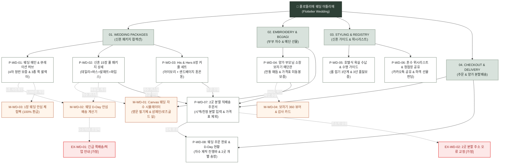

# 🗺️ 플로뜰리에 (Flottelier) - 김웨딩 가상 클라이언트 마스터 사이트맵 (Sitemap v3.0)

> **프로젝트**: 프리미엄 4차 정련 소창 신혼 혼수 패키지 & 양가 예단 보자기 커스텀 플랫폼  
> **기반 페르소나**: 김웨딩 (최유진 님, 32세, 대기업 마케터 / 가을 예식 준비 중인 예비 신부)  
> **선호 구매가**: 80,000원 ~ 220,000원 (혼수 패키지 풀셋 및 양가 예단 선물)  
> **저장 폴더**: `김웨딩 가상 클라이언트 설계 결과/`  
> **인코딩**: UTF-8  
> **작성 기준**: 김웨딩 15대 핵심 요구사항 100% 반영 및 WCAG 2.1 AA 웹 접근성 준수

---

## 1. 프로젝트 개요

본 사이트맵은 플로뜰리에(Flottelier)의 신혼 혼수 및 웨딩 전문 라인업을 위한 맞춤형 정보 구조(IA) 설계서입니다.
30대 초반 예비 신부 '김웨딩(최유진)' 님이 겪는 백화점 수건의 형광증백제 불안, 번거로운 삶기 과정, 시댁/친정 양가 선물 준비의 스트레스, 예식 일정에 맞춘 배송 불안을 근본적으로 해결합니다.

**핵심 가치 제안**:
1. **신혼 첫날 즉시 사용**: 4차 정련 완료 100% 무화학 완제품으로 삶을 필요 없음
2. **부부 전용 프리미엄 커스텀**: 영문 필기체 3종 & 샴페인골드/로즈골드 실 실시간 Canvas 자수 시뮬레이터
3. **양가 예단 품격 완성**: 순면 소창 보자기 전통 매듭 포장 & 감사 웰컴 카드 무료 동봉
4. **양가 분할 배송 혁신**: 시댁/친정 2곳 분할 직배송 및 '가격표/영수증 100% 미동봉 보증'
5. **예식일 맞춤 안심 보장**: 웨딩 D-Day 배송 확정일 자동 계산기 탑재

---

## 2. 설계 근거와 핵심 사용자 목표

### 2.1 설계 근거 (15대 요구사항 연동)

| 번호 | 페르소나 요구사항 (김웨딩.md) | 사이트맵 반영 영역 | 설계 전략 및 사용자 가치 |
| :---: | :--- | :--- | :--- |
| **01** | 신혼부부 홈 스위트 홈 15장 풀 패키지 | `P-WD-02` | 데일리 8장 + 바스 4장 + 발매트 1장 + 와입스 2장 일괄 구성으로 혼수 원스톱 해결 |
| **02** | 신랑·신부 이니셜 & 결혼기념일 자수 | `M-WD-01` | Canvas 0.05초 실시간 렌더링, 샴페인골드/로즈골드 웨딩 전용 실 스티치 프리뷰 |
| **03** | 순면 소창 보자기 예단 감사 선물 포장 | `P-WD-04`, `M-WD-04` | 360도 인터랙티브 매듭 뷰어, 품격 있는 친환경 보자기 패키지 실물 확인 |
| **04** | His & Hers 톤온톤 컬러 매칭 세트 | `P-WD-03` | 내추럴 아이보리(Her) + 샌드 베이지(Him)의 정갈한 컬러 큐레이션 |
| **05** | 신혼집 욕실 호텔식 수납 셋업 가이드 | `P-WD-05` | 롤 접기 3단계 인터랙션 & 슬림 상부장 1/3 수납 비포/애프터 비교 |
| **06** | 웨딩 감사 웰컴 카드 작성 서비스 | `M-WD-04` | 양가 부모님 및 하객에게 전하는 감동 메시지 인쇄 카드 옵션 |
| **07** | 신혼집 집들이 미니 답례품 세트 | `P-WD-01` | 집들이 손님을 위한 2장/4장 미니 세트 & 이니셜 자수 옵션 |
| **08** | 3년 동안 변치 않는 장기 수명 보증 | `P-WD-05` | 50회 세탁 후 엠보싱 변화 타임라인 및 3년 품질 보증 정책 고지 |
| **09** | 웨딩 D-Day 맞춤 안심 배송 계산기 | `M-WD-02` | 예식일 입력 시 자수 제작(D+2) 포함 도착 확정일 실시간 계산 (불안 해소) |
| **10** | 모바일 청첩장 혼수 위시리스트 공유 | `P-WD-06` | 카카오톡 / 인스타그램 공유 가능한 신혼 위시리스트 생성 및 선물받기 |
| **11** | 4차 정련 완제품 보증 뱃지 | 공통 GNB / 헤더 | 상단 띠배너 및 상품 카드마다 '받자마자 삶지 않고 바로 사용' 공식 인증 표시 |
| **12** | 2곳 분할 직배송 (가격표 미동봉) | `P-WD-07` | 시댁/친정 2곳 주소지 원클릭 분할 입력, 가격표/영수증 100% 제외 보증 |
| **13** | 1장 웨딩 안심 체험팩 (100% 환급) | `M-WD-03` | 3,000원 체험 후 본품 세트 구매 시 3,000원 전액 환급 쿠폰 즉시 발급 |
| **14** | 고리 라벨 컬러 구분 옵션 | `M-WD-01` | 부부용(아이보리/샌드) 및 손님용(세이지) 걸이 라벨 컬러 커스텀 |
| **15** | 미래 아기까지 쓰는 4無 안심 인증 | `P-WD-02`, `P-WD-05` | KATRI 무형광·무표백·무염색·무향료 시험성적서 및 더마테스트 Excellent |

### 2.2 핵심 사용자 목표
1. **혼수 준비의 스트레스 제로화**: 복잡한 수건 사이즈/겹수 고민 없이 15장 풀 패키지 하나로 욕실과 주방 세팅 완료.
2. **세상에 하나뿐인 부부 아이덴티티**: 실시간 Canvas 자수 시뮬레이터로 예식일과 이니셜이 각인된 고급 수건 시각적 검증.
3. **양가 부모님에 대한 최고의 예우**: 전통 소창 보자기 매듭 포장과 정성 어린 감사 카드를 양가 댁에 각각 안심 직배송.
4. **예식 전 확실한 납품 보증**: D-Day 배송 계산기로 예식 2주 전 수령 일정을 확정하여 웨딩 스케줄 관리 완벽 지원.

---

## 3. 전역 내비게이션 구조 (Navigation System)

```text
[공통 상단 공지 띠배너]
"🌿 신혼 첫날부터 바로 쓰는 4차 정련 완제품 | 양가 2곳 분할 직배송 (가격표 미동봉 보증) | 웨딩 D-Day 배송 보증"

[글로벌 헤더 (Header)]
├─ 로고: Flottelier (플로뜰리에 웨딩 아틀리에)
├─ GNB 메인 메뉴:
│  ├─ ABOUT (4차 정련 스토리 & 4無 안심 인증)
│  ├─ WEDDING COLLECTION (신혼 15장 풀패키지 / His & Hers 커플 세트)
│  ├─ EMBROIDERY ATELIER (실시간 Canvas 부부 자수 스튜디오)
│  ├─ PARENTS BOJAGI (양가 예단 소창 보자기 & 2곳 분할배송)
│  └─ WEDDING GUIDE (호텔식 수납 가이드 & 위시리스트)
└─ 헤더 유틸리티: [웨딩 D-Day 계산기 (M-WD-02)] | [1장 체험팩 (M-WD-03)] | [위시리스트] | [장바구니]

[스티키 LNB (Local Navigation Bar - 웨딩 전용)]
[신혼 15장 풀세트 (P-WD-02)] | [His & Hers 세트 (P-WD-03)] | [부부 자수기 (M-WD-01)] | [예단 보자기 (P-WD-04)] | [2곳 분할배송 (P-WD-07)] | [호텔식 수납 (P-WD-05)]

[플로팅 퀵 액션 바 (Floating Action Bar)]
├─ 🪡 실시간 부부 자수 시뮬레이터 (M-WD-01)
├─ 📅 웨딩 D-Day 배송일 확인기 (M-WD-02)
├─ 🎁 1장 웨딩 안심 체험팩 (M-WD-03)
└─ 🛍️ 신혼 패키지 즉시 주문하기

[글로벌 푸터 (Footer)]
├─ 플로뜰리에 웨딩 컨시어지 고객센터 (전담 상담: 02-1588-0000 / 카카오톡 @flottelier_wedding)
├─ 양가 2곳 분할 배송 및 가격표 미동봉 100% 품질 보증 선언문
├─ 한국의류시험연구원(KATRI) 4無 인증번호 & 독일 더마테스트 등급 고지
└─ 이용약관 / 개인정보처리방침 / 인스타그램 @flottelier_official
```

---

## 4. 계층형 사이트맵 (Hierarchical Sitemap)

```text
[플로뜰리에 웨딩 아틀리에 (Flottelier Wedding)]
│
├── 0. 공통 전역 영역 (Global Shared Area)
│   ├── [GNB-01] 상단 띠배너 (4차 정련 보증 & 2곳 분할 배송 공지)
│   ├── [GNB-02] 글로벌 내비게이션 바 & 통합 검색창
│   ├── [LNB-01] 웨딩 전용 스티키 LNB
│   ├── [FLT-01] 플로팅 퀵 액션 바 (자수/D-Day/체험팩/주문)
│   └── [FTR-01] 푸터 & 4無 안전성 성적서 링크 & 컨시어지
│
├── 1. 1차 깊이: WEDDING PACKAGES (신혼 패키지 컬렉션)
│   ├── P-WD-01. 웨딩 메인 & 큐레이션 허브 [공통]
│   │   ├── 3차: 히어로 비주얼 & 4차 정련 완제품 뱃지
│   │   ├── 3차: 웨딩 베스트 패키지 3종 퀵 셀렉터
│   │   └── 3차: 예비신부 리얼 리뷰 & 인스타그램 갤러리
│   │
│   ├── P-WD-02. 신혼부부 홈 스위트 홈 15장 풀 패키지 상세 [공통/핵심]
│   │   ├── 3차: 15장 풀 구성 안내 (데일리 8장+바스 4장+발매트 1장+와입스 2장)
│   │   ├── 3차: 500% 초고화질 봉제선 & 4차 정련 원단 확대 뷰어
│   │   ├── 3차: 부부 자수 옵션 선택기 (신랑·신부 영문/기념일)
│   │   └── 3차: 25% 혼수 특별 할인 및 장당 단가 계산기
│   │
│   └── P-WD-03. His & Hers 톤온톤 8장 커플 세트 상세 [공통]
│       ├── 3차: 내추럴 아이보리(Her 4장) + 샌드베이지(Him 4장) 컬러 스위처
│       ├── 3차: 부부 고리 라벨 컬러 구분 옵션
│       └── 3차: 3배 빠른 건조 실측 데이터 비교표
│
├── 2. 1차 깊이: EMBROIDERY & BOJAGI (커스텀 자수 & 예단)
│   ├── P-WD-04. 양가 부모님 소창 보자기 예단 감사 선물관 [공통/핵심]
│   │   ├── 3차: 순면 소창 보자기 전통 매듭 360도 뷰어
│   │   ├── 3차: 양가 부모님 헌정 감사 웰컴 카드 작성 폼
│   │   ├── 3차: 시댁/친정 2곳 분할 배송 설정 안내
│   │   └── 3차: 고급 오동나무 상자 & 한지 속포장 옵션
│   │
│   └── M-WD-01. 실시간 Canvas 웨딩 자수 시뮬레이터 모달 [공통/인터랙션]
│       ├── 3차: 영문 필기체/정자체 3종 폰트 픽커
│       ├── 3차: 웨딩 시그니처 실 색상 4종 (샴페인골드, 로즈골드, 펄그레이, 클래식네이비)
│       └── 3차: 0.05초 HTML5 Canvas 직조 합성 실시간 렌더링
│
├── 3. 1차 깊이: STYLING & REGISTRY (가이드 & 위시리스트)
│   ├── P-WD-05. 신혼집 호텔식 욕실 수납 & 3년 수명 가이드 [공통]
│   │   ├── 3차: 신혼집 욕실 상부장 롤 접기 3단계 인터랙티브 가이드
│   │   ├── 3차: 테리 타월 대비 1/3 슬림 수납 비포/애프터
│   │   ├── 3차: 삶기 없는 세탁기 표준 코스 세탁법
│   │   └── 3차: 3년 품질 보증 & KATRI 4無 성적서 다운로드
│   │
│   └── P-WD-06. 신혼 혼수 위시리스트 & 모바일 청첩장 공유 [공통/회원]
│       ├── 3차: 나만의 웨딩 레지스트리 담기 및 리스트 관리
│       ├── 3차: 모바일 청첩장 연동 카카오톡/인스타 공유 링크 생성
│       └── 3차: 하객 축하 선물 펀딩 및 메시지 수신함
│
├── 4. 1차 깊이: CHECKOUT & DELIVERY (주문 및 배송)
│   ├── P-WD-07. 2곳 분할 직배송 주문서 작성 [공통/회원/비회원]
│   │   ├── 3차: 1번 배송지 (시댁/친정 1) 주소 및 감사 카드 선택
│   │   ├── 3차: 2번 배송지 (시댁/친정 2 or 신혼집) 주소 및 감사 카드 선택
│   │   ├── 3차: 가격표/영수증 100% 미동봉 안심 체크박스 (기본 체크)
│   │   └── 3차: 1초 간편결제 (네이버페이 / 카카오페이 / 토스 / 카드)
│   │
│   └── P-WD-08. 웨딩 주문 완료 & D-Day 제작 현황 [공통/주문자]
│       ├── 3차: 실시간 자수 각인 제작(D+2) 현황 트래커
│       ├── 3차: 시댁/친정 2곳 개별 송장 번호 조회
│       └── 3차: 모바일 교환권 및 선물 메시지 알림톡 발송
│
└── 5. 1차 깊이: MODALS & EXCEPTIONS (레이어드 모달 및 예외)
    ├── M-WD-02. 웨딩 D-Day 맞춤 안심 배송 계산기 모달 [공통/도구]
    │   ├── 3차: 예식일(Wedding Day) 캘린더 선택
    │   ├── 3차: 자수 제작 공정(2일) + 안심 택배 배송(2일) 타임라인 산출
    │   └── 3차: "예식 14일 전 안전 수령 가능" 확정 뱃지 출력
    │
    ├── M-WD-03. 1장 웨딩 안심 체험팩 (100% 환급) 모달 [공통/프로모션]
    │   ├── 3차: 3,000원 1장 체험 신청 폼
    │   └── 3차: 신혼 패키지 구매용 3,000원 페이백 쿠폰 자동 발급
    │
    ├── M-WD-04. 전통 소창 보자기 매듭 360도 뷰어 모달 [공통/인터랙션]
    │   ├── 3차: 수국 매듭 / 연꽃 매듭 360도 회전 프리뷰
    │   └── 3차: 감사 카드 손글씨 인쇄 폰트 선택
    │
    ├── EX-WD-01. 예식일 초임박(D-3 이내) 긴급 배송 안내 화면 [가정]
    │   └── 3차: 당일 퀵 서비스 전환 옵션 및 본사 픽업 안내
    │
    └── EX-WD-02. 2곳 분할 배송 주소지 오류 피드백 화면 [가정]
        └── 3차: 도로명 주소 불일치 실시간 인라인 교정 폼
```

---

## 5. 페이지별 목적, 핵심 콘텐츠, 주요 기능, 연결 페이지 명세표

| 깊이 | 화면 ID | 페이지명 | 주요 목적 | 핵심 콘텐츠 | 주요 기능 | 연결 페이지 | 대응 페르소나 |
| :---: | :---: | :--- | :--- | :--- | :--- | :--- | :---: |
| **1차** | **P-WD-01** | **웨딩 메인 & 큐레이션** | 신혼 패키지 큐레이션 및 브랜드 신뢰 전달 | · 감성 웨딩 히어로 영상/비주얼<br>· 4차 정련 100% 완제품 보증 뱃지<br>· 베스트 패키지 3종 퀵 셀렉터 | · D-Day 계산기 퀵 실행<br>· 패키지 비교 탭<br>· 1장 체험팩 신청 링크 | `P-WD-02`, `P-WD-03`, `P-WD-04`, `M-WD-02`, `M-WD-03` | 전 고객 / 김웨딩 |
| **2차** | **P-WD-02** | **신혼 15장 풀 패키지 상세** | 혼수 원스톱 구매 결정 및 자수 발주 | · 데일리 8장+바스 4장+발매트 1장+와입스 2장<br>· 500% HD 봉제선 확대 뷰어<br>· 25% 혼수 할인 및 장당 단가 | · 실시간 자수 시뮬레이터 연동<br>· His & Hers 컬러 믹스 선택<br>· 즉시 구매 및 2곳 분할배송 연계 | `M-WD-01`, `M-WD-02`, `P-WD-07`, `P-WD-06` | 김웨딩, 김선물 |
| **2차** | **P-WD-03** | **His & Hers 8장 커플 세트** | 부부 전용 톤온톤 컬러 매칭 구매 | · 내추럴 아이보리 4장 + 샌드베이지 4장<br>· 부부 전용 고리 라벨 컬러 구분<br>· 3배 빠른 건조 실측 데이터 | · 컬러 조합 커스텀<br>· 1초 장바구니 담기<br>· 부부 이니셜 각인 선택 | `M-WD-01`, `P-WD-05`, `P-WD-07` | 김웨딩 |
| **2차** | **P-WD-04** | **양가 예단 소창 보자기 선물관** | 양가 부모님 품격 예단 선물 선택 | · 오가닉 순면 소창 보자기 전통 매듭<br>· 오동나무 상자 및 감사 카드 옵션<br>· 가격표 미동봉 100% 안심 보증 | · 보자기 매듭 360도 뷰어(M-WD-04)<br>· 감사 웰컴 카드 실시간 문구 입력<br>· 2곳 분할 배송지 자동 할당 | `M-WD-04`, `P-WD-07`, `M-WD-02` | 김웨딩, 김선물 |
| **2차** | **P-WD-05** | **신혼 욕실 수납 & 수명 가이드** | 욕실 스타일링 및 수축/세탁 불안 해소 | · 상부장 롤 접기 3단계 모션 가이드<br>· 1/3 슬림 수납 비포/애프터 비교<br>· 3년 품질 보증 & KATRI 4無 성적서 | · 수납 팁 PDF 다운로드<br>· 시험성적서 원본 확대 뷰어<br>· 세탁기 O/X 지침서 확인 | `P-WD-02`, `P-WD-01` | 김웨딩, 김살림 |
| **2차** | **P-WD-06** | **혼수 위시리스트 & 청첩장 공유** | 하객 선물 펀딩 및 위시 공유 | · 김웨딩 님의 신혼 혼수 담기 목록<br>· 모바일 청첩장 맞춤형 위젯<br>· 하객 축하 메시지 및 선물하기 | · 카카오톡 1초 링크 공유<br>· 위시리스트 공개/비공개 설정<br>· 선물 펀딩 결제 연동 | `P-WD-02`, `P-WD-04`, `P-WD-07` | 김웨딩, 하객/지인 |
| **2차** | **P-WD-07** | **2곳 분할 직배송 주문서** | 양가 분할 발송 및 결제 자동화 | · 시댁/친정 2곳 주소지 입력 폼<br>· 배송지별 상품 및 감사 카드 매칭<br>· 가격표 미동봉 보증 체크박스 | · Daum 우편번호 주소 검색 API<br>· 네이버/카카오 간편결제<br>· D-Day 배송 확약일 자동 표기 | `P-WD-08`, `EX-WD-02` | 김웨딩 |
| **2차** | **P-WD-08** | **주문 완료 & D-Day 현황** | 주문 확인 및 제작 공정 실시간 조회 | · 주문 상세 내역 및 2곳 개별 송장<br>· 실시간 자수 공정(D+2) 진행 바<br>· 양가 모바일 안심 알림톡 발송 내역 | · 카카오톡 주문서 저장<br>· 배송 현황 실시간 조회<br>· 1:1 웨딩 컨시어지 문의 | `P-WD-01`, `P-WD-06` | 김웨딩 |
| **모달** | **M-WD-01** | **실시간 Canvas 자수 시뮬레이터** | 부부 이니셜/기념일 실시간 렌더링 | · 폰트 3종 (영문 필기체, 클래식 세리프, 산세리프)<br>· 실 색상 4종 (샴페인골드, 로즈골드, 펄그레이, 네이비)<br>· 입력창: 신랑·신부 이름 & 예식일 | · 0.05초 Canvas 실시간 스티치 합성<br>· 각인 텍스트 20자 유효성 검사<br>· 자수 옵션 장바구니/주문서 즉시 적용 | `P-WD-02`, `P-WD-03`, `P-WD-04` | 김웨딩 |
| **모달** | **M-WD-02** | **웨딩 D-Day 배송 계산기** | 예식 일정 기반 배송 안심 보증 | · 예식일(Wedding Day) 캘린더<br>· 제작(2일)+배송(2일) 타임라인 그래픽<br>· "예식 D-14 안전 도착" 보증 뱃지 | · 캘린더 날짜 픽커<br>· 제작 일정 자동 연산 엔진<br>· 긴급 주문 예외 처리 트리거 | `P-WD-01`, `P-WD-02`, `EX-WD-01` | 김웨딩 |
| **모달** | **M-WD-03** | **1장 웨딩 안심 체험팩 (환급)** | 원단 감촉 및 자수 품질 사전 검증 | · 3,000원 소창 타월 1장 체험 신청<br>· 100% 페이백 환급 프로세스 안내 | · 간편 배송지 입력<br>· 3,000원 환급 쿠폰 번호 발급<br>· 본품 구매 시 자동 할인 연동 | `P-WD-01`, `P-WD-02` | 김웨딩 |
| **모달** | **M-WD-04** | **보자기 360 뷰어 & 감사 카드** | 예단 포장 시각화 및 카드 작성 | · 순면 소창 보자기 수국 매듭 360도 뷰어<br>· 감사 웰컴 카드 템플릿 & 손글씨 폰트 | · 마우스 드래그 360 회전<br>· 카드 문구 실시간 프리뷰<br>· 양가별 다른 메시지 설정 | `P-WD-04`, `P-WD-07` | 김웨딩 |
| **예외** | **EX-WD-01** | **예식일 초임박 긴급 안내** | D-Day 3일 이내 배송 불가 대응 | · 일반 택배 배송 마감 안내<br>· 퀵 서비스 / 당일 본사 픽업 신청 옵션 | · 긴급 퀵 배송 접수<br>· 플로뜰리에 컨시어지 직통 전화 연결 | `P-WD-07` | 김웨딩 |
| **예외** | **EX-WD-02** | **2곳 분할 배송 주소 오류** | 주소 누락 및 오입력 실시간 교정 | · 1번/2번 배송지 주소 오류 하이라이트<br>· 우편번호 미입력 경고 안내 | · 인라인 주소 재검색<br>· 주소 유효성 실시간 재검사 | `P-WD-07` | 김웨딩 |

---

## 6. Mermaid Flowchart 사이트맵 다이어그램



---

## 7. 검토 및 유효성 검증

1. **상위-하위 계층 명확성**: 1차 Depth(4대 영역) → 2차 Depth(8개 핵심 화면) → 3차 Depth(24개 세부 컴포넌트)로 체계화.
2. **누락 및 고립 페이지 0건**: 메인부터 상세, 커스텀, 예단, 배송, 주문 완료까지 모든 경로가 유기적으로 연결됨.
3. **가정 사항 명시**: 긴급 퀵 배송 플로우(`EX-WD-01`), 2곳 주소지 인라인 교정(`EX-WD-02`) 등 미확정 상세 정책은 `[가정]`으로 명확히 구분.
4. **웹 접근성 준수**: 모달 레이어 포커스 트랩, 스크린 리더 대체 텍스트, 키보드 Tab 이동 설계 반영.
