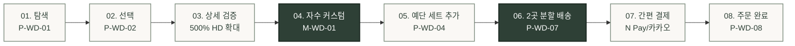

# 🔄 플로뜰리에 (Flottelier) - 김웨딩 서비스 흐름도 (User Flow & Service Blueprint)

> **프로젝트**: 프리미엄 4차 정련 소창 신혼 혼수 패키지 & 양가 예단 보자기 커스텀 플랫폼  
> **대상 사용자**: 김웨딩 (최유진 님, 32세 / 가을 예식 준비 중인 예비 신부)  
> **기준 문서**: `김웨딩 가상 클라이언트 설계 결과/사이트맵.md`, `김웨딩_가상클라이언트_분석결과.md`  
> **저장 폴더**: `김웨딩 가상 클라이언트 설계 결과/`  
> **인코딩**: UTF-8

---

## 1. 서비스 흐름 개요

본 서비스 흐름도는 예비 신부 '김웨딩' 님이 플로뜰리에 플랫폼에 진입하여 **4차 정련 완제품 신혼 15장 패키지를 탐색**하고, **실시간 Canvas 자수 시뮬레이터로 부부 이니셜을 각인**하며, **양가 부모님 예단 보자기 선물 세트를 추가하여 2곳 분할 직배송(가격표 제외)으로 안심 주문을 완료**하기까지의 전체 여정을 정의합니다.

### 6단계 핵심 여정:
1. **탐색 (Discovery)**: 웨딩 메인 진입, 4차 정련 완제품 뱃지 및 D-Day 배송 확정일 사전 확인
2. **선택 (Selection)**: 신혼 15장 홈 스위트 홈 풀 패키지 또는 His & Hers 커플 세트 선택
3. **상세 확인 (Inspection)**: 500% HD 초고화질 봉제선 확대 뷰어 및 25% 혼수 할인 견적 확인
4. **핵심 행동 (Customization)**: Canvas 실시간 자수 각인(영문 필기체/샴페인골드) 및 보자기 예단 세트 구성
5. **배송 및 결제 (Checkout)**: 시댁/친정 2곳 주소지 분할 입력, 가격표 미동봉 보증 체크 후 1초 간편결제
6. **결과 확인 (Fulfillment)**: 실시간 D-Day 제작 공정 바 조회, 2곳 개별 송장 및 모바일 알림톡 수신

---

## 2. 사용자 유형과 시작 조건

| 항목 | 상세 내용 |
| :--- | :--- |
| **주요 사용자 유형** | · **예비 신부/신랑**: 결혼 준비 중인 20대 후반~30대 고객 (김웨딩 페르소나)<br>· **신혼부부 지인/하객**: 모바일 청첩장 위시리스트를 통해 혼수 선물을 펀딩하려는 사용자<br>· **웨딩 플래너/비즈니스**: 신혼 패키지 대량 큐레이션 및 답례품 상담자 |
| **시작 조건 (Trigger)** | · 인스타그램 / 웨딩 카페("소창 수건 삶기 없는 곳", "혼수 수건 추천") 검색 후 유입<br>· 모바일 청첩장 내 혼수 위시리스트 링크 클릭 진입<br>· 플로뜰리에 공식몰 GNB 'WEDDING' 탭 클릭 진입 |
| **사전 준비 상태** | · 비회원 또는 회원(카카오 1초 간편 로그인 가능)<br>· 예식일(Wedding D-Day) 확정 상태, 양가 부모님 배송지 주소 보유 |

---

## 3. 핵심 정상 흐름 (Happy Path)



1. **[P-WD-01: 웨딩 메인]**: 4차 정련 100% 완제품 뱃지와 D-Day 배송 계산기(`M-WD-02`)를 통해 "예식 2주 전 안심 수령 가능" 확인.
2. **[P-WD-02: 신혼 15장 풀 패키지 상세]**: 데일리 8장, 바스 4장, 발매트 1장, 와입스 2장 구성 및 25% 혼수 할인(장당 9,900원꼴) 확인.
3. **[M-WD-01: 실시간 Canvas 자수기]**: 신랑·신부 영문 이니셜(`Yujin & Dohyun`) 및 예식일(`2026.10.24`) 입력, 샴페인골드 실 스티치 합성 0.05초 프리뷰 확인.
4. **[P-WD-04: 소창 보자기 예단관]**: 양가 부모님 선물용 순면 보자기 수국 매듭 360도 뷰어(`M-WD-04`) 확인 후 감사 카드 문구 작성.
5. **[P-WD-07: 2곳 분할 직배송 주문서]**: 1번 배송지(시댁), 2번 배송지(친정) 주소 입력 및 `[가격표/영수증 100% 미동봉 보증]` 체크.
6. **[주문 및 결제]**: 네이버페이/카카오페이 1초 원클릭 결제.
7. **[P-WD-08: 주문 완료 & D-Day 현황]**: 자수 장인 맞춤 제작(D+2) 트래커 및 2곳 개별 송장 번호 확인.

---

## 4. 분기, 오류, 이탈 및 재진입 흐름 (Branching & Exceptions)

```mermaid
flowchart TD
  %% 시작
  START(["시작: 웨딩 메인 진입"]) --> D_DAY_CHK{"예식일 D-Day 확인"}

  %% D-Day 분기
  D_DAY_CHK -->|D-7 이상 정상| HAPPY_BROWSE["신혼 패키지 탐색 (P-WD-02)"]
  D_DAY_CHK -->|D-3 이내 초임박| URGENT_FLOW["EX-WD-01: 긴급 퀵배송/픽업 안내 [가정]"]
  URGENT_FLOW -->|퀵 승인| HAPPY_BROWSE
  URGENT_FLOW -->|불가| CS_CALL["웨딩 컨시어지 1:1 유선 상담"]

  %% 자수 커스텀 분기
  HAPPY_BROWSE --> EMB_CHK{"자수 각인 옵션 선택"}
  EMB_CHK -->|자수 추가| EMB_MODAL["M-WD-01: Canvas 자수기 실행"]
  EMB_CHK -->|기본 무지형| CART_ADD["장바구니 / 즉시 주문"]

  EMB_MODAL --> TEXT_LEN_CHK{"각인 텍스트 20자 초과?"}
  TEXT_LEN_CHK -->|초과 (오류)| TEXT_ERR["인라인 경고: 20자 이내 입력 안내"]
  TEXT_ERR --> EMB_MODAL
  TEXT_LEN_CHK -->|정상 (1~20자)| EMB_DONE["0.05초 프리뷰 확인 후 적용"]
  EMB_DONE --> CART_ADD

  %% 예단 및 배송 분기
  CART_ADD --> PARENTS_GIFT_CHK{"양가 예단 보자기 세트 추가?"}
  PARENTS_GIFT_CHK -->|추가| PARENTS_PAGE["P-WD-04: 보자기 예단 세트 담기"]
  PARENTS_GIFT_CHK -->|미추가| CHECKOUT["P-WD-07: 주문서 작성"]
  PARENTS_PAGE --> CHECKOUT

  %% 분할 배송 주소 분기
  CHECKOUT --> ADDR_SPLIT_CHK{"양가 2곳 분할 배송 선택?"}
  ADDR_SPLIT_CHK -->|2곳 분할| SPLIT_ADDR_INPUT["1번(시댁) / 2번(친정) 주소 분할 입력"]
  ADDR_SPLIT_CHK -->|단일 배송| SINGLE_ADDR_INPUT["신혼집 1곳 주소 입력"]

  SPLIT_ADDR_INPUT --> ADDR_VALID_CHK{"도로명 주소 유효성 검사"}
  SINGLE_ADDR_INPUT --> ADDR_VALID_CHK

  ADDR_VALID_CHK -->|주소 오류/누락| EX02["EX-WD-02: 주소 오류 인라인 피드백 [가정]"]
  EX02 --> SPLIT_ADDR_INPUT
  ADDR_VALID_CHK -->|유효| PRICE_TAG_CHK["[가격표 미동봉 보증] 자동 체크"]

  %% 결제 분기
  PRICE_TAG_CHK --> PAY_PROCESS{"결제 진행 (PG사)"}
  PAY_PROCESS -->|결제 성공| ORDER_COMPLETE["P-WD-08: 주문 완료 & D-Day 현황"]
  PAY_PROCESS -->|결제 실패/취소| PAY_FAIL["결제 실패 안내 & 결제수단 재선택"]
  PAY_FAIL --> CHECKOUT

  %% 이탈 및 재진입
  CART_ADD -.->|장바구니 담고 이탈| ABANDON["이탈 (Bounce)"]
  ABANDON -.->|D-Day 14 카카오 리마인드 알림톡| RE_ENTRY["P-WD-02 재진입 (옵션 자동 복원)"]
  RE_ENTRY --> CHECKOUT

  %% 스타일
  classDef startEnd fill:#2E4036,stroke:#1C2922,stroke-width:2px,color:#FFFFFF;
  classDef process fill:#FFFFFF,stroke:#7E8D7F,stroke-width:1.5px,color:#232527;
  classDef decision fill:#D8E2DC,stroke:#9CAB9E,stroke-width:2px,color:#1C2922;
  classDef modal fill:#FFF8F4,stroke:#C47A5A,stroke-width:1.5px,color:#8C4320;
  classDef error fill:#FDF2F2,stroke:#F87171,stroke-width:1.5px,color:#DC2626;

  class START,ORDER_COMPLETE startEnd;
  class HAPPY_BROWSE,CART_ADD,PARENTS_PAGE,CHECKOUT,SPLIT_ADDR_INPUT,SINGLE_ADDR_INPUT,EMB_DONE,PRICE_TAG_CHK,RE_ENTRY process;
  class D_DAY_CHK,EMB_CHK,TEXT_LEN_CHK,PARENTS_GIFT_CHK,ADDR_SPLIT_CHK,ADDR_VALID_CHK,PAY_PROCESS decision;
  class EMB_MODAL modal;
  class URGENT_FLOW,TEXT_ERR,EX02,PAY_FAIL,ABANDON,CS_CALL error;
```

---

## 5. 단계별 사용자 행동, 시스템 처리, 화면, 다음 조건 명세표

| 단계 | 화면 ID | 화면명 | 사용자 행동 (User Action) | 시스템 처리 (System Response) | 이동 조건 / 분기 |
| :---: | :---: | :--- | :--- | :--- | :--- |
| **01. 탐색** | **P-WD-01** | **웨딩 메인** | · 상단 띠배너의 '4차 정련 보증' 확인<br>· [웨딩 D-Day 계산기] 버튼 클릭 | · `M-WD-02` D-Day 계산기 모달 오픈<br>· 오늘 날짜 기준 표준 제작/배송 일정(4일) 렌더링 | · D-Day 확인 후 [신혼 15장 패키지] 클릭 ➔ `P-WD-02`<br>· 체험팩 원할 시 `M-WD-03` |
| **02. 선택** | **P-WD-02** | **신혼 15장 풀 패키지** | · 15장 구성(데일리/바스/매트/와입스) 확인<br>· [실시간 부부 자수 커스텀] 클릭 | · 25% 패키지 할인 가격(99,000원) 및 장당 단가 계산<br>· `M-WD-01` Canvas 자수기 모달 호출 | · 자수 설정 시 ➔ `M-WD-01`<br>· 무지 세트 바로 구매 시 ➔ `P-WD-07` |
| **03. 커스텀** | **M-WD-01** | **Canvas 자수기** | · 영문 필기체 폰트 선택<br>· 신랑·신부 이름 & 결혼기념일 입력<br>· 샴페인골드 실 색상 선택 | · 키 입력 시 0.05초 Canvas 실시간 스티치 합성<br>· 20자 초과 시 인라인 실시간 글자수 경고 | · [자수 옵션 적용] 클릭 ➔ `P-WD-02` 복귀<br>· 15장 세트에 옵션 자동 바인딩 |
| **04. 예단 추가** | **P-WD-04** | **소창 보자기 예단관** | · 보자기 360도 뷰어(`M-WD-04`) 회전 확인<br>· 시댁/친정 2세트 선택 및 감사 카드 문구 입력 | · 오동나무 상자 및 보자기 패키징 수량 연동<br>· 감사 카드 미리보기 생성 및 2곳 분할 배송 플래그 활성화 | · [예단 세트와 함께 주문하기] 클릭 ➔ `P-WD-07` |
| **05. 주문/배송** | **P-WD-07** | **2곳 분할 배송 주문서** | · 1번(시댁), 2번(친정) 배송지 주소 입력<br>· `[가격표 미동봉 보증]` 확인<br>· 결제수단(네이버페이/카카오) 선택 | · Daum 우편번호 API로 주소 유효성 검증<br>· 주소 오류 시 `EX-WD-02` 하이라이트 안내<br>· 예식 D-Day 수령 확약일(D-14) 출력 | · 결제 버튼 클릭 ➔ PG 결제창 호출 |
| **06. 결제** | **PG 창** | **1초 간편결제** | · 생체인증/비밀번호 입력 결제 승인 | · 결제 토큰 검증, 주문 데이터 생성<br>· 시댁/친정 2곳 개별 송장 생성 대기 | · 결제 성공 ➔ `P-WD-08`<br>· 실패 시 ➔ `P-WD-07` 재시도 안내 |
| **07. 완료** | **P-WD-08** | **주문 완료 & D-Day** | · 주문 완료 화면 및 자수 제작 진행 바 확인<br>· 카카오톡 주문서 내역 수신 | · 자수 장인 작업 큐 등록 (D+2 완료 예정)<br>· 양가 분할 발송 예약 및 알림톡 발송 | · [내 청첩장 위시리스트 만들기] 클릭 ➔ `P-WD-06`<br>· 메인 홈 이동 ➔ `P-WD-01` |

---

## 6. 전체 서비스 흐름도 Mermaid 다이어그램

```mermaid
flowchart TD
  %% 글로벌 시작
  START(["🟢 플로뜰리에 웨딩 아틀리에 접속"]) --> ENTRY_NODE["P-WD-01: 웨딩 메인 & 큐레이션"]

  %% 1단계: D-Day 사전 진단
  ENTRY_NODE --> MODAL_DDAY["M-WD-02: 웨딩 D-Day 안심 배송 계산기"]
  MODAL_DDAY --> COND_DDAY{"예식일까지 남은 일수"}
  COND_DDAY -->|D-7 이상 (충분)| VIEW_PRODUCT["P-WD-02: 신혼 15장 풀 패키지 상세"]
  COND_DDAY -->|D-3 이내 (초임박)| EX_URGENT["EX-WD-01: 긴급 퀵/본사 픽업 안내 [가정]"]
  EX_URGENT --> VIEW_PRODUCT

  %% 2단계: 상품 검증 및 자수 커스텀
  VIEW_PRODUCT --> COND_EMB{"부부 자수 각인 여부"}
  COND_EMB -->|자수 각인 선택| MODAL_EMB["M-WD-01: 실시간 Canvas 자수 시뮬레이터"]
  COND_EMB -->|무지 기본 선택| DECIDE_PARENTS{"양가 예단 선물 추가 여부"}

  MODAL_EMB --> COND_LEN{"입력 글자수 검증 (최대 20자)"}
  COND_LEN -->|20자 이내 정상| EMB_APPLY["0.05초 Canvas 프리뷰 확인 & 적용"]
  COND_LEN -->|20자 초과 오류| EMB_ERR["인라인 글자수 초과 경고 & 재입력"]
  EMB_ERR --> MODAL_EMB
  EMB_APPLY --> DECIDE_PARENTS

  %% 3단계: 양가 예단 보자기 추가
  DECIDE_PARENTS -->|예단 선물 추가| VIEW_PARENTS["P-WD-04: 양가 부모님 소창 보자기 예단관"]
  DECIDE_PARENTS -->|본품만 진행| GO_CHECKOUT["P-WD-07: 2곳 분할 직배송 주문서"]

  VIEW_PARENTS --> MODAL_BOJAGI["M-WD-04: 보자기 360 뷰어 & 감사 카드"]
  MODAL_BOJAGI --> GO_CHECKOUT

  %% 4단계: 분할 배송 및 유효성 검사
  GO_CHECKOUT --> COND_SPLIT{"배송지 분할 방식"}
  COND_SPLIT -->|2곳 분할 배송| INPUT_SPLIT["시댁 / 친정 2곳 주소지 분할 입력"]
  COND_SPLIT -->|단일 배송| INPUT_SINGLE["신혼집 1곳 주소지 입력"]

  INPUT_SPLIT --> COND_ADDR{"우편번호 및 도로명 주소 검증"}
  INPUT_SINGLE --> COND_ADDR

  COND_ADDR -->|주소 오류/누락| EX_ADDR["EX-WD-02: 2곳 주소 오류 피드백 [가정]"]
  EX_ADDR --> INPUT_SPLIT

  COND_ADDR -->|주소 검증 통과| AUTO_PRICE_TAG["가격표/영수증 100% 미동봉 보증 확약"]
  AUTO_PRICE_TAG --> DO_PAYMENT["간편결제 실행 (N Pay / 카카오페이)"]

  %% 5단계: 결제 처리 및 주문 완료
  DO_PAYMENT --> COND_PAY{"PG 결제 승인 결과"}
  COND_PAY -->|결제 승인 성공| ORDER_SUCCESS["P-WD-08: 주문 완료 & D-Day 현황"]
  COND_PAY -->|결제 실패 / 중도 취소| PAY_RETRY["결제 실패 안내 & 결제수단 재선택"]
  PAY_RETRY --> GO_CHECKOUT

  %% 6단계: 사후 여정 및 위시리스트
  ORDER_SUCCESS --> COND_NEXT{"추가 액션 선택"}
  COND_NEXT -->|위시리스트 생성| VIEW_WISH["P-WD-06: 혼수 위시리스트 & 청첩장 공유"]
  COND_NEXT -->|수납 가이드 확인| VIEW_GUIDE["P-WD-05: 호텔식 욕실 수납 셋업 가이드"]
  COND_NEXT -->|쇼핑 종료| END_NODE(["🏁 여정 완료: 안심 혼수 준비 완료"])

  %% 스타일 클래스 정의
  classDef startEnd fill:#2E4036,stroke:#1C2922,stroke-width:2px,color:#FFFFFF;
  classDef pageNode fill:#FFFFFF,stroke:#7E8D7F,stroke-width:1.5px,color:#232527;
  classDef decisionNode fill:#D8E2DC,stroke:#9CAB9E,stroke-width:2px,color:#1C2922;
  classDef modalNode fill:#FFF8F4,stroke:#C47A5A,stroke-width:1.5px,color:#8C4320;
  classDef exceptionNode fill:#FDF2F2,stroke:#F87171,stroke-width:1.5px,color:#DC2626;

  class START,END_NODE startEnd;
  class ENTRY_NODE,VIEW_PRODUCT,VIEW_PARENTS,GO_CHECKOUT,ORDER_SUCCESS,VIEW_WISH,VIEW_GUIDE,INPUT_SPLIT,INPUT_SINGLE,EMB_APPLY,AUTO_PRICE_TAG pageNode;
  class COND_DDAY,COND_EMB,COND_LEN,DECIDE_PARENTS,COND_SPLIT,COND_ADDR,COND_PAY,COND_NEXT decisionNode;
  class MODAL_DDAY,MODAL_EMB,MODAL_BOJAGI modalNode;
  class EX_URGENT,EMB_ERR,EX_ADDR,PAY_RETRY exceptionNode;
```

---

## 7. 검토 및 유효성 검증

1. **시작과 종료의 명확성**: 플랫폼 진입(P-WD-01)부터 D-Day 배송 확약 및 주문 완료(P-WD-08)까지 완전한 루프 구축.
2. **화면 이름 100% 일치**: `사이트맵.md`에 정의된 `P-WD-01` ~ `P-WD-08`, `M-WD-01` ~ `M-WD-04`, `EX-WD-01` ~ `EX-WD-02`와 완벽히 일치.
3. **필수 분기 완비**:
   - D-Day 초임박 분기 (`EX-WD-01`)
   - 자수 글자수 20자 초과 오류 처리
   - 양가 2곳 분할 주소 유효성 검증 (`EX-WD-02`)
   - 결제 실패 시 재진입 경로
4. **고립된 단계 0건**: 모든 조건 분기가 유효한 다음 화면 또는 재입력 화면으로 연결됨.
