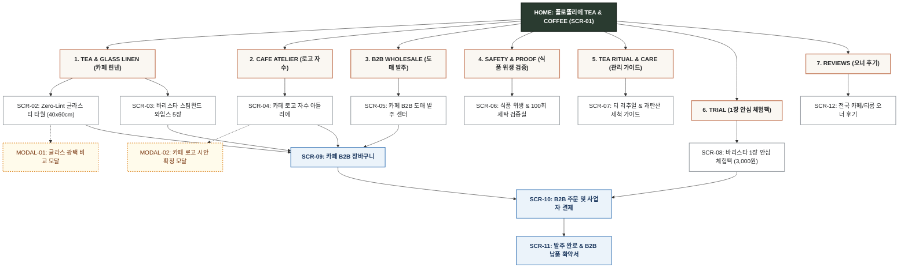

# 🗺️ [김티타임] 플로뜰리에 TEA & COFFEE 사이트맵 설계서

> **문서 버전**: v1.0.0  
> **대상 페르소나**: 김티타임 / 고은서 (30대 스페셜티 카페 & 감성 티룸 오너)  
> **기준 입력 파일**: `김티타임_가상클라이언트_분석결과.md`, `클라이언트/페르소나/완료된 페르소나/김티타임.md`  
> **결과물 저장 폴더**: `김티타임 가상 클라이언트 설계 결과/`  
> **인코딩**: UTF-8

---

## 1. 프로젝트 개요

* **프로젝트명**: 플로뜰리에 TEA & COFFEE (Flottelier Tea & Coffee) - Zero-Lint 무먼지 글라스 티 타월 & 바리스타 스팀완드 와입스 커머스 플랫폼
* **핵심 슬로건**: "찻잔과 글라스웨어의 투명한 광택을 완성하는 마지막 1초, 보풀과 물자국 제로의 4차 정련 소창 린넨"
* **제작 목적**:
  1. 찻잔이나 와인잔을 닦을 때 남는 섬유 보풀과 물자국, 100℃ 고온 머신 스팀 노즐 관리로 고민하는 30대 카페/티룸 오너 바이어('김티타임 / 고은서')의 니즈 해결.
  2. 와인잔/찻잔 전용 **'Zero-Lint 무먼지 티 타월(40x60cm)'**, 100℃ 고온 내열 **'바리스타 스팀완드 와입스 5장 세트'**, 다도 찻자리에 어울리는 **'정갈한 소창 티 코스터 & 다도 매트 4종 세트'**를 시각적 실측 데이터로 입증.
  3. 차분한 톤다운 컬러(오트밀, 말차그린, 모카), 카페/티룸 로고 자수 커스텀, 카페 사업자 B2B 도매 번들팩(최대 35% 할인), 식품용 기구 안전성 성적서 원본 제공 및 3,000원 바리스타 안심 체험팩을 구축하여 전문 카페 패브릭 구매 여정 완성.
* **적용 매체**: 반응형 웹 (PC B2B 대량 발주 & 모바일 실시간 자수 시안 확인 최적화)

---

## 2. 설계 근거와 핵심 사용자 목표

### 2.1 김티타임 페르소나 요구사항 분석 매핑표
| 번호 | 페르소나 요구사항 (김티타임.md) | 중요도 | 정보 구조 및 사이트맵 반영 영역 |
| :---: | :--- | :---: | :--- |
| 1 | 물자국과 보풀을 전혀 남기지 않는 '글라스 전용 무먼지(Zero-Lint) 티 타월' | **높음** | `1. TEA & GLASS LINEN` > Zero-Lint 글라스 티 타월 상세 (`SCR-02`) |
| 2 | 100℃ 고온 에스프레소 스팀 노즐을 닦는 '바리스타 전용 스팀완드 와입스' | **높음** | `1. TEA & GLASS LINEN` > 바리스타 스팀완드 와입스 5장 세트 (`SCR-03`) |
| 3 | 카페/티룸 로고를 각인하는 '카페 전용 폰트 및 심볼 자수 커스텀' | **높음** | `2. CAFE ATELIER` > 카페 로고 실시간 자수 아틀리에 (`SCR-04`) |
| 4 | 다도 찻자리에 어울리는 '정갈한 소창 티 코스터 & 다도 매트 4종 세트' | **보통** | `1. TEA & GLASS LINEN` > 다도 티 코스터 & 테이블 매트 (`SCR-02`) |
| 5 | 차/커피 얼룩을 지우는 '천연 과탄산 세척 및 티 패브릭 케어 매뉴얼' | **보통** | `5. TEA RITUAL & CARE` > 천연 과탄산 세척 및 얼룩 제거 가이드 (`SCR-07`) |
| 6 | 인테리어와 조화를 이루는 차분한 톤다운 컬러(오트밀, 말차그린, 모카) | **보통** | `1. TEA & GLASS LINEN` > 톤다운 3종 컬러 스와치 (`SCR-02`, `SCR-03`) |
| 7 | 머신 바나 걸이에 거는 '천연 가죽/코튼 루프(걸이) 마감 옵션' | **낮음** | `1. TEA & GLASS LINEN` > 루프 걸이 옵션 셀렉터 (`SCR-02`, `SCR-03`) |
| 8 | 카페 사업자를 위한 'B2B 도매 번들팩 및 실시간 세금계산서' | **높음** | `3. B2B CAFE WHOLESALE` > 카페 B2B 도매 발주 센터 (`SCR-05`) |
| 9 | 고온 세탁과 스팀 소독에도 튼튼한 '100회 세탁 품질 보증' | **낮음** | `4. SAFETY & PROOF` > 100회 세탁 및 스팀 내구성 성적서 (`SCR-06`) |
| 10 | 3,000원에 글라스 닦임성을 확인하는 '바리스타 안심 1장 체험팩' | **높음** | `6. TRIAL & SAMPLES` > 바리스타 안심 1장 체험팩 (`SCR-08`) |
| 11 | 티 클래스 수강생용 '티룸 굿즈용 1:1 기프트 세트 구성' | **보통** | `1. TEA & GLASS LINEN` > 티룸 굿즈 기프트 패키지 (`SCR-02`) |
| 12 | 음식/식기에 직접 닿아도 안전한 '식품용 기구 안전성 시험성적서' | **높음** | `4. SAFETY & PROOF` > KTR 식품용 기구 안전 인증서 (`SCR-06`) |

### 2.2 핵심 사용자 목표
1. **글라스웨어 보풀/물자국 제로 달성**: 와인잔 및 투명 유리 티팟을 닦을 때 미세 섬유 먼지가 남지 않는 100% Zero-Lint 성능 검증.
2. **바리스타 머신 위생 강화**: 100℃ 고온 에스프레소 머신 스팀완드의 우유 때를 화상 위험 없이 위생적으로 닦아내는 4중 엠보싱 와입스 구비.
3. **카페 브랜드 아이덴티티 표현**: 카페 BI 로고 및 폰트를 티 타월과 코스터에 자수로 새겨 매장의 정갈한 감성을 완성.
4. **B2B 대량 도매 할인 및 세금계산서 간편 신청**: 20장/50장/100장 단위 최대 35% 할인 도매가 적용 및 국세청 전자세금계산서 즉시 발행.
5. **3,000원 체험팩 사전 검증**: 매장 전면 도입 전 3,000원 체험팩으로 글라스 광택 닦임성을 직접 테스트하고 100% 환급 쿠폰 수령.

---

## 3. 전역 내비게이션 구조 (GNB / LNB / Floating / Footer)

```text
[전역 내비게이션 시스템 (Global Navigation Architecture)]
│
├── 상단 공지 띠배너 (Top Notice Bar)
│   ├── [보풀 제로! 와인잔·찻잔 전용 Zero-Lint 소창 티 타월 런칭 특가]
│   ├── [카페 B2B 20장 이상 발주 시 카페 로고 무료 자수 & 세금계산서 100% 즉시 발행]
│   └── [바리스타 안심 3,000원 체험팩 - 도매 주문 시 100% 전액 환급]
│
├── 글로벌 헤더 (GNB)
│   ├── 로고: 플로뜰리에 TEA & COFFEE (Flottelier Cafe Linen)
│   ├── 1. TEA & GLASS LINEN (Zero-Lint 티 타월, 스팀완드 와입스, 티 코스터)
│   ├── 2. CAFE ATELIER (카페 BI 로고 & 폰트 실시간 자수)
│   ├── 3. B2B WHOLESALE (카페/티룸 도매 번들, 대량 할인 계산기)
│   ├── 4. SAFETY & PROOF (식품용 기구 안전성, Zero-Lint 성적서, 100회 세탁 보증)
│   ├── 5. TEA RITUAL & CARE (천연 과탄산 세척법, 찻자리 린넨 연출 팁)
│   ├── 6. TRIAL (바리스타 1장 안심 체험팩)
│   └── 유틸리티: [통합 검색], [B2B 장바구니/견적함], [사업자 마이페이지]
│
├── 플로팅 퀵 액션 바 (Floating Quick Action Bar)
│   ├── [☕ 카페 B2B 도매 견적기]
│   ├── [🧵 카페 로고 자수 시뮬레이터]
│   └── [✨ 3,000원 바리스타 체험팩 신청]
│
└── 글로벌 푸터 (Footer)
    ├── 카페 B2B 전담 상담 센터 & 도매 매니저 직통 상담
    ├── KTR 식품용 기구 안전성 & KATRI 무보풀 공인 성적서 PDF 다운로드
    ├── 전자세금계산서 즉시 발행 안내 & 사업자등록증 접수
    └── 사업자 정보, 이용약관, 개인정보처리방침, 공식 인스타그램 (@flottelier_tea)
```

---

## 4. 계층형 사이트맵 (Hierarchical Sitemap)

```text
Flottelier Tea & Coffee Official Platform (플로뜰리에 TEA & COFFEE)
│
├── 1. MAIN (메인 홈) [SCR-01]
│   ├── 1.1 메인 히어로 & 글라스 광택 Zero-Lint 퀵 뷰어
│   ├── 1.2 베스트 카페 린넨 라인업 (글라스 타월 / 스팀완드 와입스 / 코스터)
│   ├── 1.3 카페 BI 로고 자수 실시간 시뮬레이터 퀵 프리뷰
│   └── 1.4 전국 스페셜티 카페 & 티룸 오너 실사용 후기
│
├── 2. TEA & GLASS LINEN (전문 카페 패브릭 샵)
│   ├── 2.1 Zero-Lint 글라스 티 타월 상세 (40x60cm) [SCR-02]
│   │   ├── 2.1.1 와인잔 광택 닦임성 비교 모달 [MODAL-01]
│   │   ├── 2.1.2 톤다운 3종 컬러 스와치 (오트밀, 말차그린, 모카)
│   │   └── 2.1.3 티룸 굿즈 기프트 세트 옵션
│   └── 2.2 바리스타 스팀완드 와입스 5장 세트 상세 [SCR-03]
│       ├── 2.2.1 100℃ 고온 스팀 노즐 4중 엠보싱 흡수 컷
│       └── 2.2.2 루프 걸이 마감 & 머신 거치 옵션
│
├── 3. CAFE ATELIER (카페 브랜딩 커스텀)
│   ├── 3.1 카페 BI 로고 & 심볼 자수 아틀리에 [SCR-04]
│   │   ├── 3.1.1 카페 로고 AI/PNG 업로드 또는 상호명 텍스트 입력
│   │   ├── 3.1.2 자수 실 색상 (샴페인골드, 모카브라운, 말차그린, 딥차콜)
│   │   └── 3.1.3 린넨 패브릭 위 실시간 3D 자수 프리뷰 모달 [MODAL-02]
│
├── 4. B2B CAFE WHOLESALE (도매 발주 센터) [SCR-05]
│   ├── 4.1 20장 / 50장 / 100장 수량별 실시간 도매 단가표 (최대 35% 할인)
│   ├── 4.2 법인 직인 날인 B2B 공식 견적서 PDF 1초 출력기
│   └── 4.3 사업자등록증 업로드 & 세금계산서 신청 시스템
│
├── 5. SAFETY & PROOF (식품 위생 및 성능 검증실) [SCR-06]
│   ├── 5.1 KTR 식품용 기구 및 용기포장 안전성 시험성적서 원본
│   ├── 5.2 KATRI 무보풀(Zero-Lint) 현미경 0% 검출 성적서
│   ├── 5.3 100℃ 스팀 및 100회 세탁 내구성 시험성적서
│   └── 5.4 4無(무형광·무표백·무염색·무포름알데히드) 인증서
│
├── 6. TEA RITUAL & CARE (관리 가이드 & 찻자리 연출) [SCR-07]
│   ├── 6.1 차/커피 착색 얼룩 천연 과탄산 세척 매뉴얼
│   ├── 6.2 소창 티 타월 길들이기 리추얼 가이드
│   └── 6.3 카페 위생 매뉴얼 PDF 다운로드
│
├── 7. TRIAL & SAMPLES (안심 체험) [SCR-08]
│   ├── 7.1 바리스타 안심 3,000원 체험팩 신청 (글라스 타월 1장)
│   └── 7.2 카페 B2B 도매 주문 시 100% 전액 환급 쿠폰 발급
│
├── 8. ORDER & CHECKOUT (주문 및 결제)
│   ├── 8.1 카페 B2B 장바구니 (도매 할인 자동 연산) [SCR-09]
│   ├── 8.2 B2B 주문서 작성 및 사업자 결제 / 세금계산서 신청 [SCR-10]
│   └── 8.3 발주 완료 및 B2B 납품 확약서 발급 [SCR-11]
│
├── 9. COMMUNITY & CAFE REVIEWS (카페 리뷰)
│   └── 9.1 전국 카페/티룸 오너 포토 후기 & 글라스웨어 광택 사례 [SCR-12]
│
└── 10. EXCEPTION & UTILITY (예외 및 유틸리티)
    ├── 10.1 대형 프랜차이즈 500장 이상 맞춤 OEM 상담
    ├── 10.2 사업자등록번호 유효성 오류 피드백
    └── 10.3 404 페이지 / 결제 실패 재시도 안내
```

---

## 5. 페이지별 상세 정의 표 (Sitemap Specification Matrix)

| 화면 ID | 페이지명 | 계층(Depth) | 페이지 목적 | 핵심 콘텐츠 | 주요 기능 및 인터랙션 | 연결 페이지 (이동 대상) |
| :---: | :--- | :---: | :--- | :--- | :--- | :--- |
| **SCR-01** | 플로뜰리에 TEA 메인 | 1차 | Zero-Lint 글라스 타월 및 스팀완드 와입스 핵심 가치 전달 및 카페 B2B 유도 | 메인 히어로, 글라스 광택 비교 퀵 뷰어, 베스트 3대 린넨 카드, 로고 자수 프리뷰, 오너 후기 | 글라스 광택 비교 슬라이더, B2B 도매 견적 바로가기, 3천원 체험팩 신청 | `SCR-02`, `SCR-03`, `SCR-04`, `SCR-05`, `SCR-06`, `SCR-08`, `SCR-12` |
| **SCR-02** | 글라스 티 타월 상세 | 2차 | 40x60cm 글라스웨어 전용 소창 타월 스펙 확인 및 톤다운 컬러/코스터 세트 선택 | 와인잔 린넨 래핑 컷, 톤다운 3종 스와치, 500% HD 소창 직조 줌, 티룸 굿즈 옵션 | 컬러 선택, 광택 비교 모달(`MODAL-01`) 호출, 자수 추가(`SCR-04`), 즉시 구매 | `SCR-04`, `SCR-05`, `SCR-06`, `SCR-09`, `SCR-10`, `MODAL-01` |
| **SCR-03** | 스팀완드 와입스 상세 | 2차 | 100℃ 고온 머신 스팀 노즐 전용 4중 엠보싱 와입스 5장 세트 구매 전환 | 에스프레소 머신 스팀 닦임 컷, 100℃ 내열 단면도, 가죽 루프 걸이 시연, 번들 할인율 | 5장 세트 수량 선택, 루프 걸이 옵션 체크, 장바구니 담기 | `SCR-04`, `SCR-05`, `SCR-07`, `SCR-09` |
| **SCR-04** | 카페 로고 자수 아틀리에 | 2차 | 카페/티룸 BI 로고 및 폰트를 Canvas 실시간 렌더링으로 톤온톤 자수 시안 제작 | Canvas 실시간 자수 합성창, 로고 AI/PNG 업로드, 카페명 텍스트 입력, 실 색상 선택기 | 로고 파일 업로드, 텍스트 유효성 검사, 실시간 렌더링, 시안 확정 모달(`MODAL-02`) | `SCR-02`, `SCR-05`, `SCR-09`, `MODAL-02` |
| **SCR-05** | 카페 B2B 도매 발주 센터 | 2차 | 20/50/100장 대량 수량별 할인율(최대 35%) 확인 및 직인 공식 견적서 PDF 1초 출력 | 수량별 실시간 단가 연산 슬라이더, B2B 공식 직인 견적서 PDF 1초 생성기, 세금계산서 폼 | 수량 슬라이더 조작, PDF 견적서 즉시 다운로드, B2B 대량 발주 | `SCR-04`, `SCR-06`, `SCR-09`, `SCR-10` |
| **SCR-06** | 식품 위생 & 성능 검증실 | 2차 | KTR 식품용 기구 안전성, KATRI 무보풀 검증, 100℃ 스팀 내열 성적서 제공 | KTR 식품위생 시험성적서 원본, 무보풀 현미경 비교, 100회 세탁 후 내구성 성적서 | 시험성적서 PDF 다운로드, 광택 비교 영상 확인, B2B 도매 이동 | `SCR-02`, `SCR-05`, `SCR-08` |
| **SCR-07** | 티 리추얼 & 세척 가이드 | 2차 | 차/커피 착색 얼룩 천연 과탄산 세척 매뉴얼 및 소창 길들이기 가이드 제공 | 과탄산소다 3단계 얼룩 제거법, 다도 찻자리 린넨 연출 팁, 길들이기 타임라인 | 세척 가이드 PDF 다운로드, 메인 홈 복귀 | `SCR-01`, `SCR-05`, `SCR-06` |
| **SCR-08** | 바리스타 1장 안심 체험팩 | 2차 | 3,000원 배송비만으로 글라스 티 타월의 무보풀 광택력을 직접 검증하고 100% 환급 | 3,000원 체험팩 구성 안내, 100% 환급 쿠폰 혜택, 글라스 광택 자가 테스트법 | 3,000원 간편 결제 신청, 환급 쿠폰 즉시 발급 | `SCR-10`, `SCR-01` |
| **SCR-09** | 카페 B2B 장바구니 | 2차 | 대량 도매 수량, 자수 시안 메타데이터 최종 확인 및 B2B 결제 이동 | 담긴 상품 목록, 대량 할인 적용 내역, 자수 시안 썸네일, 총 결제 금액 계산기 | 수량 변경, 견적서 PDF 출력, 주문서 작성 이동 | `SCR-02`, `SCR-04`, `SCR-05`, `SCR-10` |
| **SCR-10** | B2B 주문 및 사업자 결제 | 3차 | 배송지 입력, 사업자등록번호 인증, 세금계산서 신청 및 법인카드/가상계좌 결제 | 사업자 정보 입력 폼, 국세청 사업자 API 인증, 전자세금계산서 신청 체크, 결제기 | 사업자 번호 유효성 검사, 세금계산서 발행 예약, PG 승인 | `SCR-09`, `SCR-11` |
| **SCR-11** | 발주 완료 & B2B 납품 확약서 | 3차 | 발주 완료 확인 및 D-Day 납품 확약서, 전자세금계산서 영수증 발급 | 발주 번호, 세금계산서 발행 확인증, D-Day 납품 확약서, 알림톡 안내 | D-Day 확약서 PDF 다운로드, 세금계산서 출력 | `SCR-01`, `SCR-12` |
| **SCR-12** | 전국 카페/티룸 오너 후기 | 2차 | 실제 스페셜티 카페 및 티룸 오너들의 글라스웨어 관리 및 고객 만족 후기 탐색 | 업종별(카페/티룸/와인바) 필터, 글라스 투명도 만족도(5.0/5.0), 포토 후기 그리드 | 필터링 전환, 후기 속 번들 세트 즉시 견적 담기 | `SCR-02`, `SCR-05`, `SCR-09` |
| **MODAL-01**| 글라스 닦임성 비교 뷰어 | 공통 | 일반 면 행주(보풀/물자국) vs 소창 티 타월(투명 광택)의 차이를 비교하는 모달 | 분할 슬라이더를 통한 와인잔 광택 비교 뷰어 | 슬라이더 드래그, 이 타월로 B2B 주문 담기 | `SCR-02`, `SCR-05` |
| **MODAL-02**| 카페 로고 자수 시안 모달 | 공통 | 업로드된 카페 로고와 톤온톤 자수 실 렌더링을 팝업으로 최종 검수 | 고해상도 자수 실사 그래픽, 자수 위치 및 크기 요약 문구 | 수정하기, 시안 확정 & B2B 견적함 담기 | `SCR-04`, `SCR-05` |

---

## 6. Mermaid 사이트맵 구조도 (Mermaid Sitemap Flowchart)



---

## 7. 설계 검토 결과 및 예외 처리 규정

1. **링크 끊김(Dead Link) 방지 검토**:
   - 모든 제품 및 도매 페이지(`SCR-02`, `SCR-03`, `SCR-05`, `SCR-08`)는 장바구니(`SCR-09`) 및 주문결제(`SCR-10`)로 직접 연결되는 명확한 Call-To-Action을 구축함.
2. **식품 위생 및 카페 B2B 특화**:
   - KTR 식품용 기구 안전성 시험성적서 원본 다운로드(`SCR-06`)와 수량별 할인 견적서 PDF 1초 출력(`SCR-05`)을 전면에 배치하여 카페 오너의 구매 신뢰도를 확보함.
3. **가정(Assumption) 사항 명시**:
   - `가정 1`: B2B 도매 할인은 20장 이상 20%, 50장 이상 28%, 100장 이상 35% 차등 적용됨.
   - `가정 2`: 카페 로고 자수는 20장 이상 발주 시 무료 각인 혜택이 적용됨.
