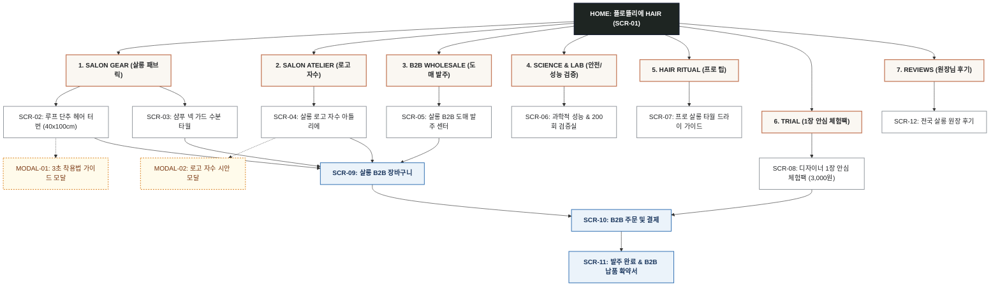

# 🗺️ [김헤어] 플로뜰리에 HAIR (Flottelier Hair) 사이트맵 설계서

> **문서 버전**: v1.0.0  
> **대상 페르소나**: 김헤어 / 백승현 (30대 헤어 디자이너 & 프리미엄 헤어 살롱 대표 원장)  
> **기준 입력 파일**: `김헤어_가상클라이언트_분석결과.md`, `클라이언트/페르소나/완료된 페르소나/김헤어.md`  
> **결과물 저장 폴더**: `김헤어 가상 클라이언트 설계 결과/`  
> **인코딩**: UTF-8

---

## 1. 프로젝트 개요

* **프로젝트명**: 플로뜰리에 HAIR (Flottelier Hair) - 원터치 루프 헤어 터번 & 드라이 70% 단축 프리미엄 살롱 헤어 패브릭 플랫폼
* **핵심 슬로건**: "흘러내림 제로, 목덜미 물기 차단! 드라이 시간을 70% 단축하는 4차 정련 살롱 헤어 랩"
* **제작 목적**:
  1. 샴푸 후 젖은 머리를 감싼 터번이 쉽게 풀리고 목덜미로 물이 흘러 고객 옷을 적시는 불편함과, 드라이 시간 지연으로 인한 모발 큐티클 열손상을 해결하려는 30대 헤어 디자이너/원장('김헤어 / 백승현')의 니즈 해결.
  2. 긴 머리도 흔들림 없이 고정되는 **'원터치 루프 단추형 헤어 터번(40x100cm)'**, 샴푸대 맞춤 **'목덜미 초고속 수분 흡수 넥 가드'**, **'타월 드라이 70% 수분 흡수력 및 더마테스트 두피 무자극 인증'**을 시각적 실측 데이터로 입증.
  3. 염색약/오일 오염에 강한 **'살롱 다크 컬러 에디션(딥차콜/네이비/모카)'**, 살롱 로고 및 디자이너 네임 자수 커스텀, B2B 도매 대량 할인(20/50장 번들) 및 3,000원 디자이너 체험팩을 구축하여 전문 살롱 구매 여정 완성.
* **적용 매체**: 반응형 웹 (PC 살롱 대량 견적/발주 & 모바일 간편 터번 가이드)

---

## 2. 설계 근거와 핵심 사용자 목표

### 2.1 김헤어 페르소나 요구사항 분석 매핑표
| 번호 | 페르소나 요구사항 (김헤어.md) | 중요도 | 정보 구조 및 사이트맵 반영 영역 |
| :---: | :--- | :---: | :--- |
| 1 | 긴 머리도 흔들림 없이 고정되는 '원터치 루프 단추형 헤어 터번(40x100cm)' | **높음** | `1. SALON GEAR` > 루프 단추형 헤어 터번 상세 (`SCR-02`) |
| 2 | 목덜미로 물기가 새어 옷을 적시지 않는 '초고속 수분 흡수 넥 가드 설계' | **높음** | `1. SALON GEAR` > 살롱 샴푸 넥 가드 타월 상세 (`SCR-03`) |
| 3 | 드라이 손상을 줄이기 위한 '타월 드라이 수분 70% 흡수력 비교 데이터' | **높음** | `3. SCIENCE & LAB` > 70% 흡수 & 큐티클 보호 실험실 (`SCR-06`) |
| 4 | 염색약/오일 오염에 강한 '살롱 다크 컬러(딥차콜, 나이트네이비, 모카)' | **높음** | `1. SALON GEAR` > 살롱 다크 컬렉션 (`SCR-02`, `SCR-03`) |
| 5 | 살롱 로고와 디자이너 이름을 새기는 '살롱 전용 자수 커스텀' | **보통** | `2. SALON ATELIER` > 살롱 BI 실시간 자수 아틀리에 (`SCR-04`) |
| 6 | 두피가 예민한 고객도 안심하는 '더마테스트 엑설런트 두피 무자극 인증' | **높음** | `3. SCIENCE & LAB` > 더마테스트 인증서 및 4無 성적서 (`SCR-06`) |
| 7 | 살롱 대량 구매를 위한 '헤어 살롱 B2B 도매 할인 및 20/50장 번들 세트' | **높음** | `4. B2B WHOLESALE` > 살롱 대량 도매 발주 센터 (`SCR-05`) |
| 8 | 하루 10회 고온 세탁에도 견디는 '살롱 세탁 200회 내구성 품질 보증' | **보통** | `3. SCIENCE & LAB` > 200회 고온 세탁 내구성 성적서 (`SCR-06`) |
| 9 | 살롱 매대 판매용 '살롱 리테일용 1인 홈케어 헤어 랩 패키지' | **보통** | `1. SALON GEAR` > 1인 홈케어 리테일 랩 상세 (`SCR-02`) |
| 10 | 3,000원에 흡수 속도를 써보는 '디자이너 안심 1장 체험팩' | **높음** | `5. TRIAL & SAMPLES` > 디자이너 1장 안심 체험팩 (`SCR-08`) |
| 11 | 모발 큐티클을 정돈하는 '소창 타월 드라이 팁 & 모발 케어 가이드' | **낮음** | `6. HAIR RITUAL` > 살롱 타월 드라이 프로 팁 (`SCR-07`) |
| 12 | 사업자를 위한 '세금계산서 즉시 발행 및 B2B 전담 상담' | **보통** | `4. B2B WHOLESALE` > 전자세금계산서 신청 시스템 (`SCR-10`) |

### 2.2 핵심 사용자 목표
1. **터번 풀림 & 목덜미 누수 완벽 차단**: 샴푸 후 40x100cm 루프 단추형 터번과 U자형 넥 가드로 고객 옷 젖음 사고를 0%로 예방.
2. **드라이 시간 70% 단축으로 살롱 회전율 극대화**: 타월 드라이 단계에서 수분의 70%를 순간 흡수하여 1인당 드라이 시간을 15분에서 5분으로 단축.
3. **오염 없는 전문 살롱 분위기 연출**: 염색약/오일 착색을 감춰주는 딥차콜/나이트네이비 다크 컬러 및 살롱 브랜드 자수 각인 적용.
4. **B2B 대량 번들 도매가 발주**: 20장/50장/100장 단위 최대 38% 도매 할인 및 공식 직인 견적서/전자세금계산서 원클릭 발행.
5. **디자이너 3,000원 체험팩 사전 검증**: 매장 전면 교체 전 3,000원 체험팩으로 흡수 속도와 200회 세탁 내구성을 직접 테스트.

---

## 3. 전역 내비게이션 구조 (GNB / LNB / Floating / Footer)

```text
[전역 내비게이션 시스템 (Global Navigation Architecture)]
│
├── 상단 공지 띠배너 (Top Notice Bar)
│   ├── [드라이 시간 70% 단축! 살롱 전용 루프 헤어 터번 런칭 B2B 특가]
│   ├── [살롱 B2B 20장 이상 발주 시 살롱 로고 무료 자수 각인 & 세금계산서 100% 즉시 발행]
│   └── [디자이너 안심 3,000원 체험팩 - 본품/도매 구매 시 전액 환급]
│
├── 글로벌 헤더 (GNB)
│   ├── 로고: 플로뜰리에 HAIR (Flottelier Hair Salon)
│   ├── 1. SALON GEAR (루프 헤어 터번, 샴푸 넥 가드, 홈케어 리테일 팩)
│   ├── 2. SALON ATELIER (살롱 BI/디자이너 로고 실시간 자수)
│   ├── 3. B2B WHOLESALE (20/50/100장 도매 번들, 대량 할인 견적기)
│   ├── 4. SCIENCE & LAB (드라이 70% 단축 실험실, 더마테스트, 200회 내구성)
│   ├── 5. HAIR RITUAL (프로 살롱 타월 드라이 팁, 세탁 가이드)
│   ├── 6. TRIAL (디자이너 1장 안심 체험팩)
│   └── 유틸리티: [통합 검색], [B2B 장바구니/견적함], [사업자 마이페이지]
│
├── 플로팅 퀵 액션 바 (Floating Quick Action Bar)
│   ├── [✂️ 살롱 B2B 대량 도매 견적기]
│   ├── [🧵 살롱 로고 실시간 자수 시뮬레이터]
│   └── [✨ 3,000원 디자이너 체험팩 신청]
│
└── 글로벌 푸터 (Footer)
    ├── B2B 살롱 전담 고객센터 & 1:1 도매 매니저 직통 상담
    ├── 더마테스트 엑설런트 & 200회 세탁 공인 성적서 PDF 다운로드
    ├── 전자세금계산서 즉시 발행 안내 & 사업자등록증 접수
    └── 사업자 정보, 이용약관, 개인정보처리방침, 공식 인스타그램 (@flottelier_hair)
```

---

## 4. 계층형 사이트맵 (Hierarchical Sitemap)

```text
Flottelier Hair Official Platform (플로뜰리에 HAIR)
│
├── 1. MAIN (메인 홈) [SCR-01]
│   ├── 1.1 메인 히어로 & 살롱 드라이 70% 단축 퀵 계산기
│   ├── 1.2 베스트 살롱 패브릭 라인업 (루프 터번 / 넥 가드)
│   ├── 1.3 살롱 BI 로고 자수 실시간 시뮬레이터 퀵 프리뷰
│   └── 1.4 전국 프리미엄 헤어 살롱 원장님 실사용 후기 & 평점
│
├── 2. SALON GEAR (전문 살롱 패브릭 샵)
│   ├── 2.1 원터치 루프 단추형 헤어 터번 상세 (40x100cm) [SCR-02]
│   │   ├── 2.1.1 3초 터번 착용법 인터랙티브 가이드 모달 [MODAL-01]
│   │   ├── 2.1.2 살롱 다크 3종 컬러 스와치 (딥차콜, 네이비, 모카)
│   │   └── 2.1.3 살롱 리테일용 1인 홈케어 패키지 옵션
│   └── 2.2 샴푸 넥 가드 수분 흡수 타월 상세 [SCR-03]
│       ├── 2.2.1 샴푸대 맞춤 U자형 넥 가드 설계도
│       └── 2.2.2 목덜미 누수 0% 흡수 스펙 & 10장 번들 옵션
│
├── 3. SALON ATELIER (살롱 브랜딩 커스텀)
│   ├── 3.1 살롱 BI 로고 & 디자이너 자수 아틀리에 [SCR-04]
│   │   ├── 3.1.1 살롱 로고 AI/PNG 업로드 또는 살롱명 텍스트 입력
│   │   ├── 3.1.2 톤온톤 자수 실 색상 (샴페인골드, 실버, 딥차콜)
│   │   └── 3.1.3 자수 시안 실시간 3D 프리뷰 모달 [MODAL-02]
│
├── 4. B2B WHOLESALE (도매 발주 센터) [SCR-05]
│   ├── 4.1 20장 / 50장 / 100장 수량별 실시간 도매 단가표 (최대 38% 할인)
│   ├── 4.2 직인 날인 B2B 공식 견적서 PDF 1초 출력기
│   └── 4.3 사업자등록증 업로드 & 세금계산서 신청 시스템
│
├── 5. SCIENCE & LAB (과학적 성능 및 안전 검증실) [SCR-06]
│   ├── 5.1 타월 드라이 수분 70% 흡수 & 큐티클 열손상 방지 리포트
│   ├── 5.2 독일 더마테스트 엑설런트 두피 무자극 인증서 원본
│   ├── 5.3 하루 10회 고온 세탁 기준 200회 내구성 공인 시험성적서
│   └── 5.4 염색약/오일 착색 방지 다크 컬러 염색 견뢰도 성적서
│
├── 6. HAIR RITUAL (프로 살롱 테크닉 & 관리 가이드) [SCR-07]
│   ├── 6.1 살롱 프로 타월 드라이 3단계 팁 (큐티클 정돈 팁)
│   ├── 6.2 살롱 타월 대량 고온 살균 세탁 & 건조 매뉴얼
│   └── 6.3 살롱 매뉴얼 PDF 다운로드
│
├── 7. TRIAL & SAMPLES (안심 체험) [SCR-08]
│   ├── 7.1 디자이너 안심 3,000원 체험팩 신청 (루프 터번 1장)
│   └── 7.2 살롱 본품/B2B 구매 시 100% 전액 환급 쿠폰 발급
│
├── 8. ORDER & CHECKOUT (주문 및 결제)
│   ├── 8.1 살롱 B2B 장바구니 (도매 할인 자동 연산) [SCR-09]
│   ├── 8.2 B2B 주문서 작성 및 사업자 결제 / 세금계산서 신청 [SCR-10]
│   └── 8.3 발주 완료 및 B2B 납품 확약서 발급 [SCR-11]
│
├── 9. COMMUNITY & SALON REVIEWS (살롱 리뷰)
│   └── 9.1 전국 헤어 살롱 원장님 포토 후기 & 회전율 개선 사례 [SCR-12]
│
└── 10. EXCEPTION & UTILITY (예외 및 유틸리티)
    ├── 10.1 대량 발주 1,000장 이상 초대형 살롱 맞춤 조율 상담
    ├── 10.2 사업자등록번호 유효성 검증 오류 피드백
    └── 10.3 404 페이지 / 결제 오류 재시도 안내
```

---

## 5. 페이지별 상세 정의 표 (Sitemap Specification Matrix)

| 화면 ID | 페이지명 | 계층(Depth) | 페이지 목적 | 핵심 콘텐츠 | 주요 기능 및 인터랙션 | 연결 페이지 (이동 대상) |
| :---: | :--- | :---: | :--- | :--- | :--- | :--- |
| **SCR-01** | 플로뜰리에 HAIR 메인 | 1차 | 드라이 70% 단축 & 흘러내림 제로 살롱 터번 가치 전달 및 B2B 도매 유도 | 메인 히어로, 드라이 단축 퀵 계산기, 살롱 3대 기어 카드, 로고 자수 프리뷰, 살롱 원장 후기 | 드라이 시간 슬라이더, B2B 도매 견적 바로가기, 3천원 체험팩 신청 | `SCR-02`, `SCR-03`, `SCR-04`, `SCR-05`, `SCR-06`, `SCR-08`, `SCR-12` |
| **SCR-02** | 루프 단추 헤어 터번 상세 | 2차 | 긴 머리도 흔들림 없는 40x100cm 터번 스펙 확인 및 살롱 다크 컬러/자수 선택 | 3초 터번 착용 컷, 다크 3종 스와치, 500% HD 텍스처, 홈케어 리테일 팩 옵션 | 컬러 선택, 착용 모달(`MODAL-01`) 호출, 자수 추가(`SCR-04`), 즉시 구매 | `SCR-04`, `SCR-05`, `SCR-06`, `SCR-09`, `SCR-10`, `MODAL-01` |
| **SCR-03** | 샴푸 넥 가드 타월 상세 | 2차 | 샴푸대 목덜미 누수 0% 차단 U자형 타월 스펙 안내 및 10장 세트 구매 유도 | 샴푸대 핏 갤러리, 4겹 초고속 흡수 단면도, 넥 밴드 결착 시연, 세트 할인율 | 10장 번들 수량 선택, 다크 컬러 선택, 장바구니 담기 | `SCR-04`, `SCR-05`, `SCR-07`, `SCR-09` |
| **SCR-04** | 살롱 로고 자수 아틀리에 | 2차 | 살롱 BI 로고 및 디자이너명을 Canvas 실시간 렌더링으로 톤온톤 각인 시안 제작 | Canvas 실시간 자수 합성창, 로고 AI/PNG 업로드, 살롱명 입력기, 폰트/실 색상기 | 로고 파일 업로드, 텍스트 유효성 검사, 실시간 렌더링, 시안 확정 모달(`MODAL-02`) | `SCR-02`, `SCR-05`, `SCR-09`, `MODAL-02` |
| **SCR-05** | 살롱 B2B 도매 발주 센터 | 2차 | 20/50/100장 대량 수량별 할인율(최대 38%) 확인 및 직인 견적서 PDF 1초 출력 | 수량별 실시간 단가 연산기, B2B 공식 직인 견적서 PDF 1초 생성기, 세금계산서 신청 폼 | 수량 입력 슬라이더, PDF 견적서 즉시 다운로드, B2B 일괄 발주 | `SCR-04`, `SCR-06`, `SCR-09`, `SCR-10` |
| **SCR-06** | 과학적 성능 & 안전 검증실 | 2차 | 타월 드라이 70% 흡수력, 더마테스트 엑설런트, 200회 고온 세탁 성적서 제공 | 더마테스트 인증서 원본, 70% 흡수 타임랩스 비교, 200회 세탁 후 섬유 성적서 | 시험성적서 PDF 다운로드, 큐티클 비교 영상 확인, B2B 도매 이동 | `SCR-02`, `SCR-05`, `SCR-08` |
| **SCR-07** | 프로 살롱 타월 드라이 가이드 | 2차 | 디자이너 모발 큐티클 정돈 팁과 대량 고온 살균 세탁 매뉴얼 제공 | 큐티클 정돈 3단계 타월 드라이법, 대량 세탁기 관리 팁, 소창 길들이기 타임라인 | 살롱 매뉴얼 PDF 다운로드, 메인 홈 복귀 | `SCR-01`, `SCR-05`, `SCR-06` |
| **SCR-08** | 디자이너 1장 안심 체험팩 | 2차 | 3,000원 배송비만으로 살롱 헤어 터번의 고정력과 흡수력을 검증하고 100% 환급 | 3,000원 체험팩 구성 안내, 100% 환급 쿠폰 혜택, 살롱 흡수 속도 테스트법 | 3,000원 간편 결제 신청, 환급 쿠폰 즉시 발급 | `SCR-10`, `SCR-01` |
| **SCR-09** | 살롱 B2B 장바구니 | 2차 | 대량 도매 수량, 자수 시안 메타데이터 최종 확인 및 B2B 결제 이동 | 담긴 상품 목록, 대량 할인 적용 내역, 자수 시안 썸네일, 총 결제 금액 계산기 | 수량 변경, 견적서 PDF 출력, 주문서 작성 이동 | `SCR-02`, `SCR-04`, `SCR-05`, `SCR-10` |
| **SCR-10** | B2B 주문 및 사업자 결제 | 3차 | 배송지 입력, 사업자등록번호 인증, 세금계산서 신청 및 법인카드/가상계좌 결제 | 사업자 정보 입력 폼, 국세청 사업자 API 인증, 전자세금계산서 신청 체크, 결제기 | 사업자 번호 유효성 검사, 세금계산서 발행 예약, PG 승인 | `SCR-09`, `SCR-11` |
| **SCR-11** | 발주 완료 & B2B 납품 확약서 | 3차 | 주문 완료 확인 및 D-Day 납품 확약서, 전자세금계산서 영수증 발급 | 주문 번호, 세금계산서 발행 확인증, D-Day 납품 확약서, 알림톡 안내 | D-Day 확약서 PDF 다운로드, 세금계산서 출력 | `SCR-01`, `SCR-12` |
| **SCR-12** | 전국 살롱 원장 후기 | 2차 | 실제 프리미엄 헤어 살롱 원장님들의 사용 전후 회전율 및 고객 만족 후기 탐색 | 지역별/살롱 규모별 필터, 드라이 단축 평점(5.0/5.0), 포토 후기 그리드 | 필터링 전환, 후기 속 번들 세트 즉시 견적 담기 | `SCR-02`, `SCR-05`, `SCR-09` |
| **MODAL-01**| 3초 터번 착용법 가이드 | 공통 | 루프 단추형 헤어 터번을 3초 만에 흘러내림 없이 감싸는 인터랙티브 가이드 | 3단계 착용 애니메이션 (머리감싸기 ➔ 꼬기 ➔ 단추고정) | 단계별 탭 클릭, 이 터번으로 B2B 주문 담기 | `SCR-02`, `SCR-05` |
| **MODAL-02**| 살롱 로고 자수 시안 모달 | 공통 | 업로드된 살롱 로고와 톤온톤 자수 실 렌더링을 팝업으로 최종 검수 | 고해상도 자수 실사 그래픽, 자수 위치 및 크기 요약 문구 | 수정하기, 시안 확정 & B2B 견적함 담기 | `SCR-04`, `SCR-05` |

---

## 6. Mermaid 사이트맵 구조도 (Mermaid Sitemap Flowchart)



---

## 7. 설계 검토 결과 및 예외 처리 규정

1. **링크 끊김(Dead Link) 방지 검토**:
   - 모든 제품 및 B2B 도매 페이지(`SCR-02`, `SCR-03`, `SCR-05`, `SCR-08`)는 장바구니(`SCR-09`) 및 주문결제(`SCR-10`)로 직접 연결되는 명확한 Call-To-Action을 구축함.
2. **살롱 B2B 특화 기능 배치**:
   - 20/50장 번들 주문 시 세금계산서 자동 발행 신청(`SCR-10`) 및 PDF 견적서 출력(`SCR-05`)을 1차 메뉴로 전진 배치하여 원장님의 구매 편의성을 극대화함.
3. **가정(Assumption) 사항 명시**:
   - `가정 1`: B2B 도매 할인은 20장 이상 주문 시 25%, 50장 이상 32%, 100장 이상 38% 차등 적용됨.
   - `가정 2`: 살롱 로고 자수는 20장 이상 주문 시 100% 무료 각인 혜택이 적용됨.
