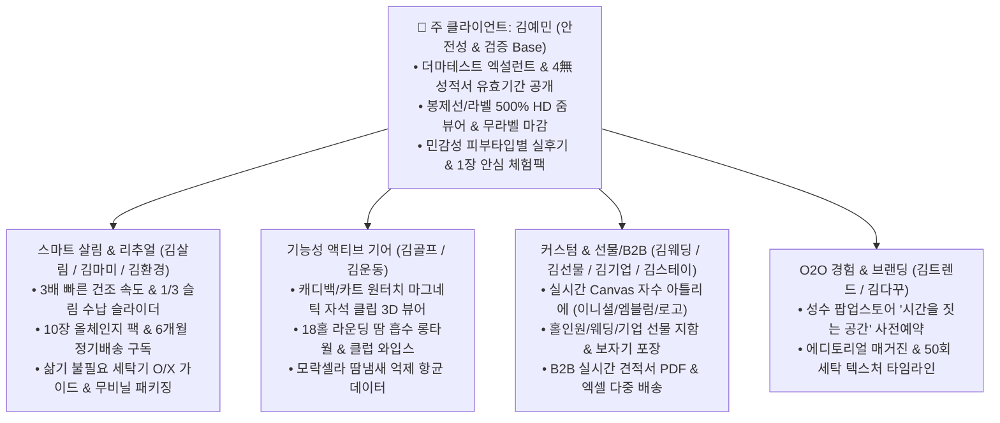

# 🌿 [플로뜰리에 Flottelier] 전 클라이언트 통합 마스터 화면 설계서

> **문서 버전**: v2.0.0 (Master Integrated Specification)  
> **주 클라이언트 (Core Persona)**: **김예민** (2030 초민감성 피부 / 더마테스트 엑설런트 / 4無 자극 최우선 / 무라벨 / 500% HD 줌 / O2O 검증가)  
> **통합 분석 대상**: `와이어프레임` 폴더 내 12개 가상 클라이언트 (김예민, 김살림, 김마미, 김골프, 김운동, 김웨딩, 김선물, 김기업, 김스테이, 김트렌드, 김환경, 김다꾸)  
> **저장 위치**: `클라이언트/와이어프레임/통합_와이어프레임_설계서.md`  
> **인코딩**: UTF-8

---

## 1. 통합 기획 배경 및 방향성

### 1.1 통합의 핵심 원칙 (Core Philosophy)
플로뜰리에(Flottelier)의 브랜드 본질은 **"시간과 손길이 만드는 고요한 에코 리추얼"**이며, 모든 제품의 근간은 **"4차 정련 100% 무화학 순면 소창"**입니다.

본 통합 와이어프레임은 **주 클라이언트인 [김예민]의 엄격한 무자극 안전 검증(더마테스트 엑설런트, 4無 인증, 봉제선 500% HD 마그니파이어 줌, 무라벨, 무향 개별포장)**을 플랫폼 전체의 신뢰 기반(Trust Base)으로 구축하고, 그 위에 각 페르소나의 킬러 기능(살림 3배 속건·1/3 수납, 자수 커스텀, 홀인원/웨딩/기업 선물 패키지, 팝업스토어 예약, B2B 대량 견적)을 유기적으로 결합한 **단일 마스터 이커머스 플랫폼**으로 완성합니다.



---

## 2. 통합 사이트맵 및 전역 내비게이션 (Master GNB)

```
[플로뜰리에 통합 글로벌 내비게이션 시스템]
│
├── 상단 공지 띠배너 (Top Trust Banner)
│   ├── [더마테스트 엑설런트 & 4無 무화학 인증 성적서 유효기간 100% 공개]
│   ├── [받아서 바로 쓰는 4차 정련 완제품 - 삶지 않고 세탁기로 바로 사용]
│   └── [1장 3,000원 체험팩 - 본품 구매 시 100% 환급]
│
├── 글로벌 헤더 (GNB)
│   ├── 1. SENSITIVE SHOP (저자극 세안타월, 4겹 바스타월, 10장 올체인지 팩, 골프 기어)
│   ├── 2. SAFETY & LAB (더마테스트 성적서 조회, 500% HD 줌, 3배 건조/수납 실험실)
│   ├── 3. CUSTOM ATELIER (실시간 Canvas 자수 - 이니셜, 웨딩, 골프 엠블럼, 기업 로고)
│   ├── 4. GIFT & B2B (홀인원/웨딩/기업 선물, 단체 견적 계산기, 보자기 포장)
│   ├── 5. RITUAL & POPUP (소창 길들이기 타임라인, 성수 팝업스토어 예약, 매거진)
│   ├── 6. TRIAL (1장 안심 체험팩 100% 환급)
│   └── 유틸리티: [🔍 500% 줌 검색], [🛒 장바구니], [📄 B2B 직인 견적서], [👤 1-Click 재주문]
│
├── 플로팅 퀵 액션 (Floating Quick Bar)
│   ├── [🔍 봉제선 500% HD 돋보기 줌]
│   ├── [🎨 실시간 자수 시뮬레이터]
│   └── [📦 3,000원 1장 체험팩 신청]
│
└── 글로벌 푸터 (Trust Footer)
    ├── KATRI 공인 성적서 유효기간 및 독일 더마테스트 인증번호
    ├── 100% 무향 위생 개별 포장 보증 & 3년 장기 수명 안내
    ├── 엑셀 다중 배송 및 법인 세금계산서 신청 안내
```

---

## 3. 전체 통합 화면 목록 (15개 마스터 스크린)

| 화면 ID | 화면명 | 중심 페르소나 | 주요 기능 및 핵심 컴포넌트 |
| :---: | :--- | :--- | :--- |
| **SCR-01** | 통합 메인페이지 | **김예민** + 전원 | 더마테스트 뱃지, 4無 검증, 500% 줌 퀵버튼, 3배 건조 히어로, 베스트 컬렉션 |
| **SCR-02** | 저자극 소창 타월 상세 | **김예민** / 김살림 | 500% HD 마그니파이어 줌, 무라벨(Label-free) 마감 컷, 10장 번들 단가표, 무향 개별포장 |
| **SCR-03** | 마그네틱 골프 기어 상세 | 김골프 / 김운동 | 25x100cm 롱타월, 네오디뮴 자석 클립 3D 뷰어, 클럽 페이스 보호 와입스 |
| **SCR-04** | 실시간 자수 아틀리에 | 김골프 / 김웨딩 / 김다꾸 | 실시간 Canvas 렌더러 (영문/한글 폰트 4종, 골프/웨딩 엠블럼 6종, 기업 로고 AI) |
| **SCR-05** | 선물 & 홀인원/B2B 답례품 | 김선물 / 김기업 / 김웨딩 | 수량별(10~50세트) 단체 할인 계산기, 한지 지함/보자기 포장, 직인 PDF 견적서 |
| **SCR-06** | 안전 검증 & 성능 실험실 | **김예민** / 김살림 / 김환경 | 더마테스트/4無 성적서 원본 뷰어, 3배 빠른 건조 차트, 상부장 1/3 수납 슬라이더 |
| **SCR-07** | 민감성 피부 Real 리뷰 | **김예민** / 김마미 | 피부타입(건성/민감/아토피) 필터, 50회 세탁 후 촉감 장기 후기, 100% 실구매 인증 |
| **SCR-08** | 성수 팝업스토어 예약 | 김트렌드 / **김예민** | 성수동 '시간을 짓는 공간' 타임슬롯 예약, 촉감 체험존 안내, 미니 와입스 증정 |
| **SCR-09** | 1장 안심 체험팩 | **김예민** / 전원 | 3,000원에 원단 1장 먼저 써보고 본품 구매 시 100% 환급 쿠폰 발급 |
| **SCR-10** | 장바구니 | 전원 | 자수 시안 썸네일 확인, 번들/단체 할인 반영, N-Pay 1초 결제 |
| **SCR-11** | 주문 및 결제 | 전원 | 단일 vs 엑셀 다중 배송 선택, 세금계산서 신청, 무향 밀봉 개별 포장 선택 |
| **SCR-12** | 주문 완료 및 확인증 | 전원 | 최종 자수 확인증, 라운딩/납기 D-Day 확약서, 카카오 알림톡 배송 트래킹 |
| **SCR-13** | 엑셀 다중 배송지 등록 | 김기업 / 김선물 / 김골프 | 동반자/임직원 10~100명 주소지 엑셀 일괄 업로드 및 실시간 유효성 정정 |
| **SCR-14** | 1-Click 동일스펙 재주문 | **김예민** / 김살림 | 지난 주문 스펙 그대로 1초 재주문, 원단/공정 리뉴얼 대조표 안내 |
| **MODAL-01** | 봉제선 500% HD 줌 모달 | **김예민** (주 핵심) | 올 풀림 없는 부드러운 코튼 테두리 마감 및 무라벨(Label-free) 500% 확대경 |
| **MODAL-02** | 마그네틱 3D 탈부착 모달 | 김골프 | 네오디뮴 자석 클립이 캐디백/카트에 찰칵 결착되는 3D 모션 시뮬레이터 |

---

## 4. 주 클라이언트(김예민) 중심 핵심 인터랙션 명세

1. **봉제선 500% HD 마그니파이어 줌 (MODAL-01)**:
   - 마우스 호버 또는 모바일 터치 시 원단 섬유 조직과 테두리 코튼 바이어스 마감이 500% 확대 렌더링.
   - 직조 라벨이 피부를 긁지 않도록 라벨을 제거한 무라벨(Label-free) 디테일 증명.
2. **성적서 유효기간 100% 투명 조회 시스템 (SCR-06)**:
   - 더마테스트 엑설런트, KATRI 무형광·무표백 성적서의 발급기관, 발급일자, 유효기간 원문 확대 팝업.
3. **민감성 피부 타입 & 세탁 50회 후 장기 리뷰 필터 (SCR-07)**:
   - `[초민감성]`, `[아토피]`, `[신생아]`, `[세탁 50회 이상 사용자]` 필터 버튼 지원.
4. **실시간 Canvas 자수 시뮬레이터 (SCR-04)**:
   - 텍스트 입력 및 엠블럼 클릭 시 자수 색상(골드/실버/화이트/세이지)으로 실시간 렌더링.
5. **단체 견적 & 1/3 슬림 수납 인터랙티브 슬라이더 (SCR-05 / SCR-06)**:
   - 수량(10~50세트) 조절 시 실시간 할인율 계산 및 상부장 수납 부피 비교 비포/애프터 연동.
