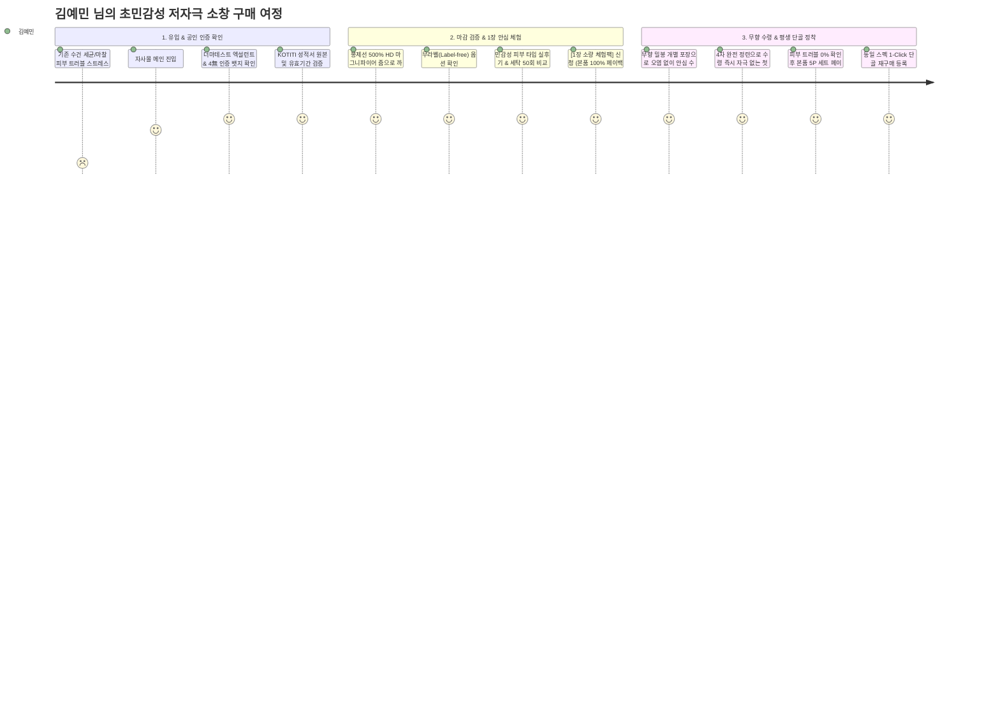

# 🔍 가상 주 클라이언트 (Primary Client): 김예민

> **"피부가 극도로 예민해서 단 1%의 자극이나 화학 잔류물도 용납할 수 없어요. 더마테스트 엑설런트 인증과 봉제선 마감을 눈으로 직접 확인해야 안심하고 매일 쓸 수 있습니다."**

---

## 👤 1. 프로필 정보 (Demographics)

| 구분 | 세부 내용 |
| :--- | :--- |
| **이름 / 나이** | **김예민 (28세)** |
| **직업** | 바이오 헬스케어 연구원 (원격 근무 및 연구실 출퇴근 병행) |
| **피부 특성** | **초민감성 & 아토피/접촉성 피부염 소인** (작은 봉제선 마찰이나 미세 화학 잔류물에도 즉각 붉어짐) |
| **거주 형태** | 서울 마포구 (1인 가구, 위생과 청결을 최우선으로 관리하는 미니멀 하우스) |
| **월평균 소득** | 390만 원 |
| **고객 분류** | **★ 메인 주 클라이언트 (Primary Target)**: 초민감성 저자극 검증 & 마감 밀착 줌 O2O 검증형 구매자 |
| **선호 금액대** | **30,000원 ~ 40,000원+** (확실한 저자극 검증 시 4만 원 이상도 흔쾌히 지불, 정착 시 평생 대용량 단골 재구매) |
| **선호 브랜드** | 제로이드, 피지오겔, 아벤느, 라푸안 칸쿠리트, 르라보 (무향/저자극/성분 투명 공개 브랜드) |

---

## 🔬 2. 라이프스타일 & 구매 성향 (Psychographics)

* **철저한 저자극 성분 및 공인 인증 검증주의**:
  * 단순 마케팅용 '친환경', '순면' 문구는 신뢰하지 않음. **독일 더마테스트(Dermatest) 엑설런트 등급**, **4無(무형광·무표백·무염색·무향료)** 공인 시험성적서 원본과 **유효기간**을 반드시 직접 확인.
* **마감 디테일(봉제선/라벨) 초밀착 확인 (O2O 검증형)**:
  * 피부에 직접 닿는 수건의 가장자리 봉제선(말아박기), 테두리 바이어스, 브랜드 라벨의 까끌거림 여부를 현미경처럼 확대해 보거나 오프라인에서 직접 만져보고 구매. **무라벨(Label-free)** 선호.
* **1장 소량 체험 후 '대용량 평생 단골 재구매' 패턴**:
  * 한 번에 대량 구매하여 실패하는 위험을 극도로 두려워함. **1~2장 소량 체험팩**으로 세안 후 피부 트러블이 없는지 확인되면, 평생 단골이 되어 주기적으로 동일 스펙을 1-Click 재구매함.
* **무향(Fragrance-free) 및 위생 밀봉 개별 포장 필수**:
  * 패키지에 배어 있는 인공 방향제 향이나 외부 유통 과정의 먼지 오염에 민감하여, **위생적인 무향 개별 밀봉 포장**을 요구함.

---

## ⚡ 3. 김예민 님의 10대 핵심 요구사항 (Client Requirements)

| 번호 | 요구사항 항목 | 중요도 | 세부 내용 및 웹 구현 방안 |
| :---: | :--- | :---: | :--- |
| **01** | **더마테스트 엑설런트 & 4無 인증** | ★★★ **(최우선)** | 독일 Dermatest Excellent 공식 뱃지 및 무형광·무표백·무염색·무향료 4無 상단 고정 |
| **02** | **시험성적서 원본 & 유효기간 공개** | ★★★ **(최우선)** | KOTITI 공인 시험성적서 원본 뷰어, 발급일자 및 유효기간 실시간 투명 고지 |
| **03** | **봉제선·라벨 500% HD 마그니파이어 줌** | ★★★ **(최우선)** | 봉제선과 라벨 마감을 500% 초밀착 확대하는 인터랙티브 돋보기 뷰어 + 무라벨 옵션 |
| **04** | **4차 완전 정련 & 즉시 사용 명시** | ★★★ **(최우선)** | 공방에서 친환경 고온 4회 정련 완료 표기 (수령 즉시 바로 세안 가능) |
| **05** | **민감성 피부 전용 후기 필터** | ★★★ **(최우선)** | 건성 / 민감성 / 알레르기 피부타입별 필터 + 세탁 50회 후 장기 실사용 비교 후기 |
| **06** | **무향(Fragrance-Free) 위생 개별 포장** | ★★★ **(최우선)** | 외부 냄새 및 먼지 오염을 100% 차단하는 무향 밀봉 개별 포장 보증 마크 |
| **07** | **1장 체험팩 & 체험비 100% 페이백** | ★★☆ **(높음)** | 1장 소량 체험팩 구매 시 본품 구매 시 100% 사용 가능한 페이백 쿠폰 지급 |
| **08** | **피부 미맞춤 시 100% 안심 환불제** | ★★★ **(최우선)** | 사용 후 피부 트러블 발생 시 100% 전액 환불/교환 보장 안심 정책 |
| **09** | **세탁 50회 후 수축/보풀/촉감 비교표** | ★★☆ **(높음)** | 50회 세탁 후에도 부드러움이 유지되는 수축률(%) 및 보풀 비교 데이터 제공 |
| **10** | **동일 조건 1-Click 재구매 & 리뉴얼 대조표** | ★★☆ **(높음)** | 피부에 맞은 원단 스펙 그대로 1초 재주문 + 리뉴얼 시 변경점 투명 사전 공지 |

---

## 🗺️ 4. 김예민 님의 정밀 UX 구매 여정 (User Journey)

