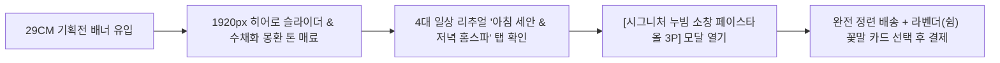

# 🌿 가상 클라이언트 페르소나 01: 이지은

> **"매일 아침과 저녁, 내 살결에 닿는 3초의 순간만큼은 가장 나답고 다정했으면 좋겠어요."**

---

## 👤 1. 프로필 정보 (Demographics)

| 구분 | 세부 내용 |
| :--- | :--- |
| **이름 / 나이** | 이지은 (29세) |
| **직업** | IT 플랫폼 기업 시니어 UX/UI 디자이너 |
| **거주 형태** | 서울 성수동 오피스텔 (1인 가구, 4년 차 독립) |
| **월평균 소득** | 420만 원 |
| **고객 분류** | **주 사용자 (Primary Persona)**: 2030 리추얼 족 / 바스 테리어(Bath-terior) 관여층 |
| **선호 브랜드** | 29CM, 아르켓(ARKET), 이솝(Aesop), 킨포크(Kinfolk), 스테이폴리오 |

---

## 🧘 2. 라이프스타일 & 성향 (Psychographics)

* **아보하(아주 보통의 하루)와 자기 돌봄**:
  * 거창한 성공이나 소비보다, 퇴근 후 나만의 공간에서 즐기는 따뜻한 차 한 잔, 배쓰 타임, 잔잔한 음악과 같은 '소소하고 확실한 일상 루틴'을 소중히 여김.
* **바스 테리어(Bath-terior) & 스몰 럭셔리**:
  * 욕실을 단순한 위생 공간이 아닌 '내면을 충전하는 프라이빗 공방'으로 인식. 인테리어를 해치는 알록달록한 수건 대신 정갈한 톤의 패브릭 오브제를 선호.
* **디지털 피로와 아날로그 터치 갈망**:
  * 온종일 모니터와 스마트폰을 보며 일하기 때문에, 집에서는 손으로 직접 만져지는 자연스러운 천연 섬유의 질감(Tactile Quality)에서 깊은 심리적 안정감을 얻음.

---

## ⚡ 3. 주요 고민 및 문제점 (Pain Points)

1. **일반 수건의 세균 쉰내와 피부 자극**:
   * 통풍이 잘 안되는 원룸 오피스텔 특성상 수건이 잘 마르지 않아 특유의 시큼한 냄새가 나고, 잦은 세탁으로 올이 뻣뻣해져 민감성 피부에 미세 트러블을 유발함.
2. **기존 소창 제품의 '투박한 행주' 느낌**:
   * 소창이 위생적이라는 것은 알지만, 시중의 제품들은 디자인이 지나치게 올드하고 마감이 엉성하여 감성적인 욕실 인테리어를 해침.
3. **복잡한 소창 정련(삶기) 과정의 번거로움**:
   * 1인 가구로서 냄비에 물을 끓여 3번 이상 삶고 헹구는 전통 소창 정련을 집에서 직접 하기가 물리적으로 부담스러움.

---

## 🎯 4. 플로뜰리에 솔루션 & 기대 가치 (Value Proposition)

* **완전 정련 배송 서비스**:
  * 공방에서 이미 3회 친환경 열탕 정련을 마쳐, 택배를 받자마자 바로 쓸 수 있는 편리함.
* **독자적 감성 누빔 디자인**:
  * 세탁 후에도 원단이 뒤틀리지 않고, 딥 그린과 에크루 톤이 어우러져 욕실 걸이에 걸어두는 것만으로도 공간의 품격을 높여줌.
* **3배 빠른 쾌속 건조**:
  * 45분 만에 뽀송하게 말라 습한 여름철에도 쉰내 걱정 없이 상쾌한 아침 세안 보장.

---

## 💻 5. 웹사이트 인터랙션 시나리오

