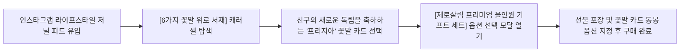

# 🎁 가상 클라이언트 페르소나 03: 정민우

> **"단순히 비싼 명품보다, 지구에 무해하면서도 받는 사람의 마음에 다정한 온기를 건네는 선물을 하고 싶어요."**

---

## 👤 1. 프로필 정보 (Demographics)

| 구분 | 세부 내용 |
| :--- | :--- |
| **이름 / 나이** | 정민우 (31세) |
| **직업** | 라이프스타일 & 건축 디자인 매거진 에디터 |
| **거주 형태** | 서울 한남동 빌라 (1인 가구, 반려식물 12종과 동거) |
| **월평균 소득** | 380만 원 |
| **고객 분류** | **잠재 사용자 (Tertiary Persona)**: 가치소비 지향 기프트(Gift) 바이어 / 미닝아웃 실천가 |
| **선호 브랜드** | 르라보(Le Labo), 오브젝트 랩(Object Lab), 무지(MUJI), 그랑핸드 |

---

## 🌿 2. 라이프스타일 & 성향 (Psychographics)

* **미닝아웃(Meaning-Out)과 컨셔스 소비**:
  * 자신이 소비하는 브랜드가 사회와 환경에 미치는 영향을 중요하게 생각함. 일회용 쓰레기를 양산하는 과대 포장 선물을 지양함.
* **정서적 공감과 이야기(Storytelling) 중시**:
  * 물건의 물질적 기능보다 그 물건이 탄생한 배경, 브랜드가 담고 있는 철학, 그리고 사람과 사람 사이를 이어주는 서사적 가치에 깊이 감응함.
* **스몰 럭셔리 & 에디토리얼 미학**:
  * 책, 도록, 인쇄물의 활자와 지질(Paper Texture)을 음미하듯, 패키지의 정교한 지함 마감과 클래식한 세리프 타이포그래피에 심미적 쾌감을 느낌.

---

## ⚡ 3. 주요 고민 및 문제점 (Pain Points)

1. **친환경 선물의 '투박하고 성의 없는' 포장**:
   * 기존 제로웨이스트나 친환경 선물들은 자연주의라는 핑계로 비닐도 없는 날것 상태로 배송되거나 마감이 엉성하여, 소중한 사람(지인의 집들이, 결혼, 생일)에게 격식을 갖춰 건네기 민망함.
2. **뻔하고 몰개성한 선물 시장**:
   * 디퓨저, 핸드크림, 텀블러 등 누구나 주고받는 흔한 선물 카테고리에 피로감을 느끼며, 진심 어린 위로와 감동을 주는 차별화된 아이템을 찾기 어려움.
3. **진정성 있는 친환경 스토리텔링의 부재**:
   * 환경을 생각한다고 하면서도 실제 제품 생애주기 끝단의 폐기나 회수(리콜) 시스템을 갖춘 브랜드를 찾기 힘듦.

---

## 🎯 4. 플로뜰리에 솔루션 & 기대 가치 (Value Proposition)

* **프리미엄 생분해 지함 기프트 패키지**:
  * 사탕수수 생분해 펄프와 콩기름 인쇄로 제작된 고급스러운 지함 박스로, 버릴 때 죄책감이 없고 그 자체로 소장하고 싶은 스몰 럭셔리 오브제 완성.
* **6가지 꽃말 마음 위로 일러스트 카드**:
  * 프리지아(새로운 시작 응원), 목화(어머니의 사랑), 라벤더(쉼과 평온) 등 받는 사람의 현재 상황에 딱 맞는 맞춤형 위로 메시지 동봉.
* **선순환 에코 루프(Eco-Loop) 시스템**:
  * 선물을 받은 사람도 훗날 수명이 다한 타올을 반납해 자연으로 되돌리고 5,000원 리워드를 받을 수 있어, 선물 자체가 지속가능한 가치 공유로 확장됨.

---

## 💻 5. 웹사이트 인터랙션 시나리오

