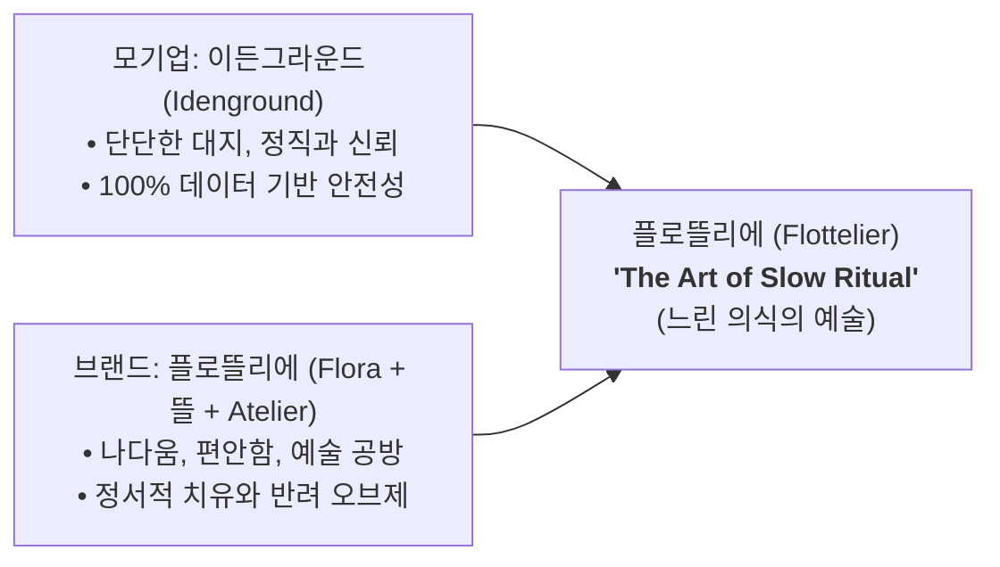
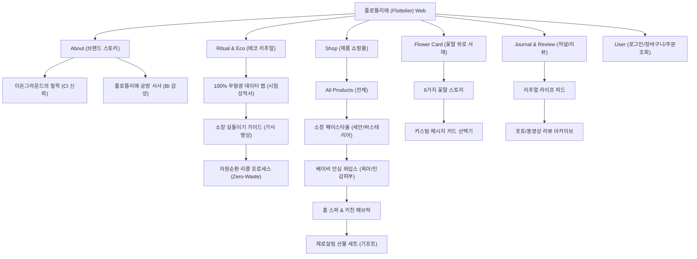

# 🌿 [플로뜰리에 / Flottelier] 공식 웹사이트 구축 기획서

본 문서는 `브랜드리서치.tst`의 브랜드 전략과 10대 레퍼런스 사이트의 정밀 분석 데이터를 기반으로, 실제 웹사이트(자사몰 및 브랜드 플랫폼)를 구축하기 위해 설계된 **웹사이트 종합 기획 및 UI/UX 설계서**입니다.

---

## 📌 1. 프로젝트 개요 & 브랜드 아이덴티티



* **브랜드명**: 플로뜰리에 (Flottelier) — *'꽃(Flora)' + 우리말 '뜰' + '공방(Atelier)'*
* **브랜드 슬로건**: **"The Art of Slow Ritual" (느린 의식의 예술)**
* **핵심 서비스 & 제품**: 100% 천연 순면 프리미엄 소창 섬유 라인(수건, 와입스, 화장솜 등), 완전 정련 배송 옵션, 에코-리추얼 서비스, 꽃말 위로 카드 가이드
* **웹사이트 핵심 목표**: 
  1. 가짜 친환경(그린워싱)을 타파하는 **100% 무형광·무화학 시험 데이터의 투명한 시각화(필코노미 UI)**
  2. 단순 수건을 넘어 일상을 가꾸는 **'에코-리추얼 라이프스타일 오브제'**로 포지셔닝
  3. 번거로운 소창 정련(삶기) 진입장벽을 낮추는 **'완전 정련 배송 vs DIY 정련 키트' 이원화 구매 경험** 제공

---

## 👥 2. 타깃 페르소나 및 사용자 요구사항

| 타깃 그룹 | 페르소나 정의 | 웹사이트 핵심 요구 기능 |
| :--- | :--- | :--- |
| **주 타깃 (Primary)** | **2030 리추얼족 / 바스테리어 관여층**<br>(나만의 힐링과 감성 욕실 인테리어 추구) | • 감각적인 대형 룩북 및 공간 오브제 스타일링 비주얼<br>• 소창의 부드러운 길들임을 기록하는 '리추얼 저널' 컨텐츠 |
| **부 타깃 (Secondary)** | **깐깐한 체크슈머 / 안심 육아맘**<br>(아기 피부 안전, 화학물질 무첨가 철저 검증) | • 상단 고정 100% 무형광 성분 시험 성적서 인포그래픽<br>• 삶을 필요 없이 바로 쓰는 '완전 정련 배송 안심 인장' 표시 |
| **잠재 타깃 (Tertiary)** | **가치소비 기프트 구매자**<br>(격식 있는 친환경 선물, 위로의 메시지 전달) | • 예술적 소장 가치가 있는 '꽃말 일러스트 카드 6종' 선택 옵션<br>• 생분해 바이오 지함 패키지 선물 포장 큐레이션 |

---

## 🎨 3. UI/UX 디자인 시스템 (Design System)

10대 레퍼런스 분석(아르켓의 엄격한 그리드 + 오브젝트 랩의 대형 슬라이더/대칭 배너 + **JIII ATELIER & mira의 수채화 몽환 톤 & 캔버스 질감(Texture)** + 르엘의 톤온톤 무드)을 융합한 디자인 시스템입니다.

### (1) 배경 텍스처 & 수채화 컬러 팔레트 (Tactile & Watercolor)
* **Canvas Texture (질감)**: 목화와 소창 원단 특유의 직조감을 살린 미세한 **패브릭/종이 캔버스 질감 노이즈 텍스처(`bg_texture`)** 적용
* **Primary Deep**: `Deep Ground Green` (`#1F3327`) — 신뢰감 있는 대지와 식물의 깊은 녹음
* **Secondary Warm**: `Earth Brown` (`#5A4232`) — 단단한 흙과 정직한 토대
* **Base Neutral**: `Pure Ecru` (`#F7F4EE`) — 목화 본연의 무표백 따뜻한 아이보리
* **Accent Soft**: `Soft Flora Petal` (`#E8B4A2`) — 마음을 어루만지는 톤다운 살구빛 핑크
* **Watercolor Blur Effect**: `Pure Ecru`와 `Soft Flora Petal`이 캔버스 위에 물감처럼 번지는 **수채화풍 몽환적 그라디언트 블러(`watercolor_blur`)** 구현

### (2) 타이포그래피 (Typography Hierarchy)
* **헤드라인 (영문/BI)**: 우아하고 클래식한 세리프 서체 (*Cormorant Garamond* 또는 *Cinzel*)
* **메인 타이틀 (국문)**: 사려 깊고 단정한 프리미엄 명조체 (*Noto Serif KR* / *KoPub 바탕*)
* **본문 및 데이터 스펙**: 가독성이 높고 오차 없는 모던 산세리프 (*Pretendard*)
* **모션 타이포**: 섹션 전환부에 무한 롤링되는 영문 텍스트 슬라이더 (*Marquee Loop*) 적용

### (3) 레이아웃 & 그리드 원칙
* **Strict Grid & High Negative Space**: 여백 비율 50% 이상 확보, 12컬럼 기반 정교한 모듈러 정렬
* **Symmetric 1:1 Split**: 좌측 대형 비주얼 + 우측 텍스트/스토리텔링 대칭 배치
* **Organic Circle & Soft Frame**: 4대 리추얼 아이콘 및 배지에 부드러운 서클(Orb)과 라운드 프레임 적용
* **Half Off-Canvas Navigation**: 햄버거 메뉴 클릭 시 우측 50%만 열리는 세련된 슬라이드 메뉴

---

## 🗺️ 4. 웹사이트 정보구조도 (IA: Information Architecture)



---

## 🖥️ 5. 핵심 페이지별 상세 와이어프레임 & 화면 기획

### 🏠 ① 메인 페이지 (Main Page: Home)

```
+-----------------------------------------------------------------------------------+
|  [Logo: Flottelier]      About    Ritual & Eco    Shop    Flower Card    [Cart(0)] [≡]  |
+-----------------------------------------------------------------------------------+
| [HERO SLIDER] (1920x975 수채화 캔버스 질감 오버레이 & 비디오 슬라이더)           |
|                                                                                   |
|                   "The Art of Slow Ritual"                                        |
|                   시간과 살결이 머무는 곳, 느린 의식의 예술                        |
|                                                                                   |
| [1 / 3  ==========----------] [VIEW MORE BUTTON]                                  |
+-----------------------------------------------------------------------------------+
| [INFINITE ROLLING TEXT] >>> THE ART OF SLOW RITUAL * FLOTTIELIER * ZERO CHEMICAL  |
+-----------------------------------------------------------------------------------+
| [TRUST BAR] 100% 무형광 공정 시험 데이터 투명 고지 (Zero Chemical Test Proof)      |
| • 무형광 증백제 0.0%  • 잔류 화학물질 0%  • 독자적 감성 누빔 구조  • 완전 정련 배송    |
+-----------------------------------------------------------------------------------+
| [4 RITUAL CONTEXT TABS] (유기적 서클 아이콘 기반의 4대 일상 큐레이션)               |
|  (○ #01 아침 첫 세안)  (○ #02 저녁 홈 스파)  (○ #03 안심 아기 육아)  (○ #04 주말 가사 명상) |
|                                                                                   |
|  +---------------------------+  +-----------------------------------------------+ |
|  | [대표 비주얼 이미지]       |  |  "아침 첫 물기를 닦아내는 3초의 다정함"       | |
|  | (소프트 내추럴 라이트 샷) |  |  피부 마찰을 최소화한 플로뜰리에 프리미엄 소창 | |
|  |                           |  |  [해당 세트 바로보기 →]                         | |
|  +---------------------------+  +-----------------------------------------------+ |
+-----------------------------------------------------------------------------------+
| [BEST & FEATURED PRODUCTS] 엄격한 정형 그리드 (4-Column Strict Grid)               |
| +-------------+  +-------------+  +-------------+  +-------------+                |
| | [Img Hover] |  | [Img Hover] |  | [Img Hover] |  | [Img Hover] |                |
| | 시그니처 타올 |  | 베이비 와입스 |  | 홈스파 바스롭 |  | 제로살림 세트 |                |
| | 32,000원    |  | 18,000원    |  | 78,000원    |  | 65,000원    |                |
| +-------------+  +-------------+  +-------------+  +-------------+                |
+-----------------------------------------------------------------------------------+
| [SYMMETRIC 1:1 SPLIT BANNER] (좌우 대칭 2분할 배너)                               |
| +------------------------------------+  +------------------------------------+    |
| | [Left Banner: Complete Scouring]   |  | [Right Banner: Flower Card & Gift] |    |
| | "삶는 번거로움 없는 완전 정련 배송"|  | "진심을 전하는 6가지 꽃말 일러스트"|    |
| | [자세히 보기 →]                    |  | [기프트 컬렉션 →]                  |    |
| +------------------------------------+  +------------------------------------+    |
+-----------------------------------------------------------------------------------+
| [SLOW RITUAL JOURNAL & ARCHIVE] (정돈된 3열 아티클 그리드)                        |
| "손길이 닿을수록 부드러워지는 소창 길들이기 이야기"                                |
| [아티클 카드 01]         [아티클 카드 02]         [아티클 카드 03]                 |
+-----------------------------------------------------------------------------------+
| [FOOTER: Eco-Loop Notice / CS / Bank / Copyright]                                 |
+-----------------------------------------------------------------------------------+
```

---

### 🛍️ ② 상품 상세 페이지 (Product Detail Page - PDP)

1. **상단 구매 영역 (5:5 Split Layout)**:
   * **좌측**: 고해상도 소창 결 매크로 접사 사진 + 롤링 갤러리 (호버 확대)
   * **우측**: 
     * 제품명 및 가격 (정갈한 세리프 타이틀)
     * **핵심 선택 옵션 (이원화)**:
       - `[Option A] 바로 사용하는 '완전 정련 배송'` (정련 인장 라벨 부착)
       - `[Option B] 직접 삶아 길들이는 'DIY 자가 정련 키트'` (-2,000원 할인 + 정련 가이드북 동봉)
     * **꽃말 카드 선택 옵션**: 6종 일러스트 카드 중 택 1 + 메시지 각인 여부

2. **중단 안심 검증 섹션 (Proof Section)**:
   * **100% 무형광 시험 성적서**: 공인 시험기관 데이터 성적서 원본 뷰어 팝업 및 직관적 인포그래픽 수치 제공
   * **독자적 감성 누빔 테크니컬 다이어그램**: 원단 밀림 현상을 방지하는 퀼팅 구조 확대도

3. **하단 소창 길들이기 & 자원순환 안내 (Slow Care & Eco-Loop)**:
   * 빳빳한 첫 상태에서 부드러운 반려 타올로 변해가는 주차별(1주~4주) 촉감 변화 안내 그래프
   * 수명이 다한 타올 반납 시 리워드를 제공하는 `Zero-Waste 리콜 프로그램` 신청 UI

---

### 📖 ③ 브랜드 스토리 & 리추얼 랩 (Brand & Ritual Lab)

* **2컬럼 교차 레이아웃 + 수채화 캔버스 질감 배경**:
  * **섹션 1. 대지의 정직함 (CI: 이든그라운드)**: 흙과 목화가 자라는 깨끗한 토양, 무화학 공정의 원칙
  * **섹션 2. 공방의 온기 (BI: 플로뜰리에)**: 예술 공방에서 서툰 나다움을 발견하고 치유받는 슬로우 라이프
  * **섹션 3. 가사 명상 가이드**: 뽀얗게 삶아 햇볕에 너는 소창 루틴을 통해 마음을 비우는 영상 & 음원(ASMR) 임베드

---

## ⚙️ 6. 기술 구현 가이드라인 (Front-End & System Spec)

| 영역 | 권장 기술 스펙 및 구현 가이드 |
| :--- | :--- |
| **질감(Texture) & 배경** | • CSS Canvas Texture / SVG Noise Filter 오버레이 (부드러운 패브릭 캔버스 질감)<br>• `radial-gradient`와 CSS `blur()`를 결합한 수채화 번짐 효과 |
| **Grid / Layout** | • CSS Grid (12-Column) & Flexbox를 결합한 반응형 모듈러 레이아웃<br>• 모바일(1~2열), 태블릿(2~3열), 데스크탑(4열) 엄격한 정렬 유지 |
| **슬라이더 & 롤링 텍스트** | • **Swiper.js**: 메인 1920px 슬라이더(프로그레스 게이지 연동)<br>• **Infinite Marquee CSS**: 끊김 없는 텍스트 롤링 슬라이더 모션 |
| **인터랙션 UI** | • **Half Off-Canvas Drawer**: 화면 50% 너비 슬라이드 메뉴 구현 (CSS `transform: translateX`)<br>• 상품 썸네일 `onmouseover` 시 2차 무드 컷/접사 컷 크로스페이드 |
| **웹 폰트 최적화** | • `Pretendard` (Subset WOFF2 경량화 적용)<br>• `Noto Serif KR` (헤드라인 전용 dynamic subset 로딩) |
| **SEO & 오픈그래프** | • 메타 태그 최적화: `오브젝트 랩`, `에코 리추얼`, `프리미엄 소창 타올`, `플로뜰리에`<br>• 카카오톡/SNS 공유 시 목화와 햇살이 담긴 감성 썸네일 카드 자동 노출 |
