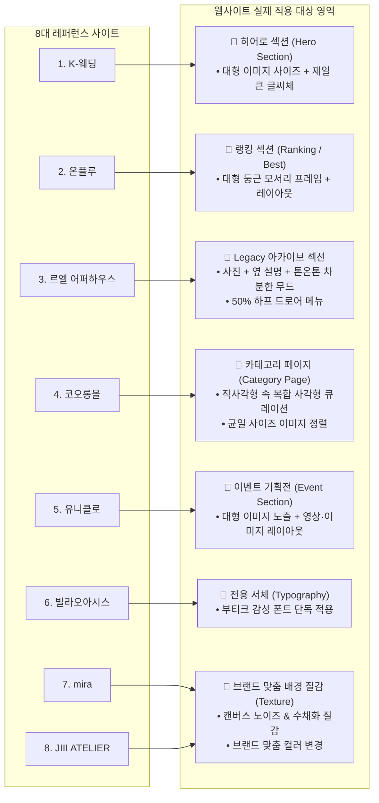

# 🌐 웹사이트 레퍼런스 분류 체계서 (Reference Classification)

> **문서 개요**  
> 본 문서는 `사이트 자료조사.tst`의 최신 보완 조사 내용을 전면 반영하여, 8개 벤치마킹 웹사이트의 **실제 적용 희망 영역(히어로, 랭킹, Legacy 아카이브, 카테고리 페이지, 이벤트, 서체, 브랜드 맞춤 질감)** 및 디자인/UI/UX 핵심 축별로 체계적으로 재분류한 레퍼런스 가이드입니다.

---

## 🎯 1. 사용자 지정 실전 적용 영역 맵 (Target Section Mapping)

조사자가 지정한 각 사이트별 실제 구현 대상 영역입니다.

---

## 🧭 2. 레퍼런스 카테고리별 세부 분류

### [분류 1] 히어로 & 대형 비주얼 (Hero & Visual Scale)

| 사이트명 | 원문 URL | 사용자 지정 적용 위치 | 핵심 벤치마킹 요소 | 레퍼런스 등급 |
| :--- | :--- | :--- | :--- | :--- |
| **K-웨딩** | [https://k-wedding.co.kr/](https://k-wedding.co.kr/) | **히어로 섹션 (Hero Section)** | • 뷰포트를 채우는 대형 이미지 비주얼 • 제일 큰 글씨체(대형 세리프 헤드라인) • 시각적 압도감과 럭셔리 감성 | **Core Reference** (히어로) |

---

### [분류 2] 랭킹 & 오가닉 프레임 (Ranking & Frame Layout)

| 사이트명 | 원문 URL | 사용자 지정 적용 위치 | 핵심 벤치마킹 요소 | 레퍼런스 등급 |
| :--- | :--- | :--- | :--- | :--- |
| **온플루 (Onflou)** | [https://www.onflou.com/home](https://www.onflou.com/home) | **랭킹 부분 (Ranking / Best Seller)** | • 이미지를 크게 보여주고 둥글게 나오는 프레임 • 여백 기반의 세련된 레이아웃 구조 • 1위~5위 인기 상품 랭킹 시각화 | **Core Reference** (랭킹) |

---

### [분류 3] 헤리티지 아카이브 & 내비게이션 (Legacy & UX)

| 사이트명 | 원문 URL | 사용자 지정 적용 위치 | 핵심 벤치마킹 요소 | 레퍼런스 등급 |
| :--- | :--- | :--- | :--- | :--- |
| **르엘 어퍼하우스** | [https://le-el-upperhouse.co.kr/contents/legacy.php](https://le-el-upperhouse.co.kr/contents/legacy.php) | **Legacy 섹션 (3번 항목 스타일)** | • 사진 + 옆 설명이 들어가는 2단 레이아웃 • 톤온톤 배경 색상 무드로 차분하고 단정한 느낌 • 메뉴 버튼 클릭 시 50% 하프 드로어 메뉴 • 단정하고 품격 있는 서체 | **Core Reference** (헤리티지/UX) |

---

### [분류 4] 카테고리 페이지 & 벤토 그리드 (Category & Grid)

| 사이트명 | 원문 URL | 사용자 지정 적용 위치 | 핵심 벤치마킹 요소 | 레퍼런스 등급 |
| :--- | :--- | :--- | :--- | :--- |
| **코오롱몰** | [https://www.kolonmall.com/](https://www.kolonmall.com/) | **카테고리 페이지 (Category Page)** | • 신상품 입고: 대형 직사각형 안 크고 작은 사각형 조합 • 같은 사이즈 이미지 정렬을 통한 정돈감 • 대분류/소분류 체계적 상품 탐색 UX | **Core Reference** (카테고리) |

---

### [분류 5] 이벤트 & 미디어 스토리텔링 (Event & Media Storytelling)

| 사이트명 | 원문 URL | 사용자 지정 적용 위치 | 핵심 벤치마킹 요소 | 레퍼런스 등급 |
| :--- | :--- | :--- | :--- | :--- |
| **유니클로** | [https://www.uniqlo.com/kr/ko/](https://www.uniqlo.com/kr/ko/) | **이벤트 기획전 (Event Section)** | • 사람들에게 이미지를 크게 보여주는 비주얼 • 영상과 이미지들의 레이아웃 결합 구조 • 브랜드 감성을 직관적으로 전달하는 스토리텔링 | **Core Reference** (이벤트) |

---

### [분류 6] 서체 전용 차용 (Typography Only)

| 사이트명 | 원문 URL | 사용자 지정 적용 위치 | 핵심 벤치마킹 요소 | 레퍼런스 등급 |
| :--- | :--- | :--- | :--- | :--- |
| **빌라오아시스** | [https://villaoasis.co.kr/](https://villaoasis.co.kr/) | **서체 스타일 (Typography)** | • 글씨체만 선별 차용 (기타 요소 배제) • 부티크 감성의 세련되고 미니멀한 레터링 • 서브 헤딩 및 감성 라벨링에 적용 | **Selective Reference** (서체 한정) |

---

### [분류 7] 배경 질감 & 브랜드 컬러 커스텀 (Texture & Custom Color)

| 사이트명 | 원문 URL | 사용자 지정 적용 위치 | 핵심 벤치마킹 요소 & 커스텀 지침 | 레퍼런스 등급 |
| :--- | :--- | :--- | :--- | :--- |
| **mira** | [https://mira-inc.jp/](https://mira-inc.jp/) | **배경 질감 (Texture)** | • 배경의 몽환적인 수채화 번짐 질감 차용 • **[커스텀 지침] 색상은 플로뜰리에 브랜드(Ecru/Green/Petal)에 맞춰 변경 적용** | **Core Texture Reference** |
| **JIII ATELIER** | [https://jiii-atelier.com/](https://jiii-atelier.com/) | **배경 질감 (Texture)** | • 캔버스/페이퍼 마이크로 노이즈 질감 차용 • **[커스텀 지침] 색상은 브랜드 아이덴티티에 맞춰 커스텀 조율** | **Core Texture Reference** |

---

## 📊 3. 레퍼런스 종합 요약표 (최신 반영본)

| 대상 사이트 | 사용자 지정 적용 영역 | 핵심 조사 내용 & 메모 | 적용 및 커스텀 방침 |
| :--- | :--- | :--- | :--- |
| **K-웨딩** | **히어로 섹션** | • 히어로 섹션 마음에 듬 • 대형 이미지 사이즈 • 제일 큰 글씨체 선호 | 뷰포트 풀스크린 대형 히어로 비주얼 + 대형 세리프 헤드라인 폰트 배치 |
| **온플루** | **랭킹 섹션** | • 랭킹 부분에 사용 희망 • 대형 둥근 모서리 프레임 • 레이아웃 구조 선호 | 베스트셀러 1~5위 랭킹 카드에 32px 오가닉 라운드 프레임 및 비대칭 레이아웃 구현 |
| **르엘 어퍼하우스** | **Legacy 섹션** | • 3번처럼 사용 희망 • 사진+설명 톤온톤 배경 • 50% 하프 드로어 메뉴 • 단정 글씨체 | 브랜드 헤리티지/정련 아카이브 섹션을 사진+설명 2단 톤온톤 배색으로 구성, 50% 하프 메뉴 적용 |
| **코오롱몰** | **카테고리 페이지** | • 카테고리 페이지에 사용 희망 • 균일 이미지 정렬 • 직사각형 속 복합 사각형 | 카테고리 탐색 페이지에 대·소 직사각형 벤토 모듈 큐레이션 및 균일 4열 상품 그리드 구축 |
| **유니클로** | **이벤트 섹션** | • 이벤트에 사용 희망 • 사람들에게 대형 이미지 노출 • 영상+이미지 레이아웃 | 시즌 기획전/이벤트 영역에 대형 와이드 화보 + 루프 영상 믹스 스토리텔링 블록 전개 |
| **빌라오아시스** | **서체 (단독)** | • 글씨체만 마음에 듬 | 기타 레이아웃은 배제하고, 부티크 감성의 영문/라벨 폰트 스타일만 선별 적용 |
| **mira** | **배경 질감 (커스텀)** | • 배경 질감 사용 희망 • 수채화 몽환 느낌 | 몽환적 수채화 번짐 질감을 채택하되, **색상은 브랜드 고유 컬러(에크루/딥그린/살구)로 변경** |
| **JIII ATELIER** | **배경 질감 (커스텀)** | • 배경 질감 사용 희망 • 캔버스 질감 | 패브릭/캔버스 미세 노이즈 질감을 채택하되, **색상은 브랜드 팔레트에 맞춰 톤 조율** |

---

## 💡 4. 실전 구축 및 통합 설계 원칙

> [!IMPORTANT]
> **1. 정확한 영역별 매핑 (Precise Section Mapping)**
> 사용자가 지정한 5대 핵심 페이지/섹션(**히어로 → 랭킹 → Legacy 아카이브 → 카테고리 페이지 → 이벤트 기획전**)에 각 레퍼런스의 장점이 정확히 1:1로 매핑되도록 설계합니다.

> [!TIP]
> **2. 배경 질감의 브랜드 맞춤 컬러라이징 (Color Customization)**
> `mira`와 `JIII ATELIER`의 질감(수채화 블러 및 캔버스 노이즈)은 차용하되, 원본의 차가운 톤 대신 우리 브랜드 고유 컬러(`Pure Ecru #F7F4EE`, `Deep Green #1F3327`, `Soft Petal #E8B4A2`, `Earth Brown #5A4232`)를 기반으로 자연스럽게 블렌딩합니다.

> [!CAUTION]
> **3. 빌라오아시스 등 단일 요소의 경계 (Font Only)**
> `빌라오아시스`는 명시된 대로 **글씨체(Typography)**에만 한정 적용하며, 다른 불필요한 디자인 요소가 혼입되지 않도록 통제합니다.
