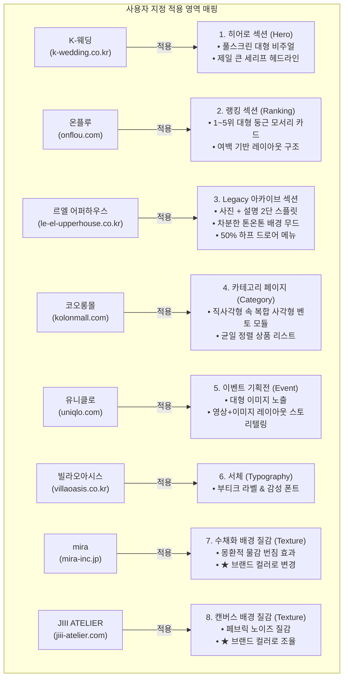
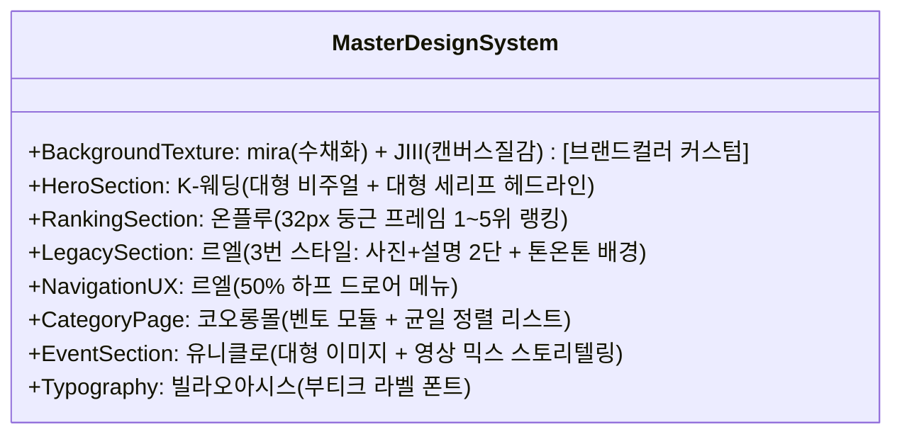
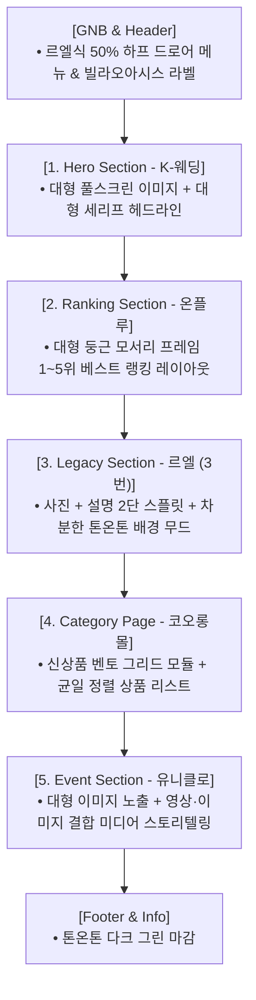

# 🔍 웹사이트 레퍼런스 정밀 분석 및 영역별 구현 전략서

> **문서 개요**  
> 본 문서는 `사이트 자료조사.tst`의 최신 보완 사항을 완벽히 수용하여, 8개 레퍼런스 웹사이트의 선호 요소를 **사용자가 지정한 목표 영역(히어로, 랭킹, Legacy 아카이브, 카테고리 페이지, 이벤트 기획전, 서체, 브랜드 맞춤 배경 질감)**에 맞춤형으로 구현하기 위한 심층 분석 및 실전 개발 가이드라인입니다.

---

## 📋 목차
1. [지정 영역별 8대 레퍼런스 심층 분석](#1-지정-영역별-8대-레퍼런스-심층-분석)
   - [1.1 K-웨딩: 히어로 섹션 (Hero Section)](#11-k-웨딩-히어로-섹션-hero-section)
   - [1.2 온플루: 랭킹 섹션 (Ranking / Best Seller)](#12-온플루-랭킹-섹션-ranking--best-seller)
   - [1.3 르엘 어퍼하우스: Legacy 섹션 & 50% 하프 메뉴](#13-르엘-어퍼하우스-legacy-섹션--50-하프-메뉴)
   - [1.4 코오롱몰: 카테고리 페이지 (Category Page)](#14-코오롱몰-카테고리-페이지-category-page)
   - [1.5 유니클로: 이벤트 기획전 (Event Section)](#15-유니클로-이벤트-기획전-event-section)
   - [1.6 빌라오아시스: 부티크 서체 전용 차용 (Typography)](#16-빌라오아시스-부티크-서체-전용-차용-typography)
   - [1.7 mira: 브랜드 맞춤 수채화 배경 질감 (Custom Texture)](#17-mira-브랜드-맞춤-수채화-배경-질감-custom-texture)
   - [1.8 JIII ATELIER: 브랜드 맞춤 캔버스 노이즈 질감 (Custom Texture)](#18-jiii-atelier-브랜드-맞춤-캔버스-노이즈-질감-custom-texture)
2. [통합 디자인 시스템 & 브랜드 컬러 커스텀 매트릭스](#2-통합-디자인-시스템--브랜드-컬러-커스텀-매트릭스)
3. [지정 영역 기반 실전 화면 설계도 (Section Blueprints)](#3-지정-영역-기반-실전-화면-설계도-section-blueprints)

---

## 1. 지정 영역별 8대 레퍼런스 심층 분석



---

### 1.1 K-웨딩 (`https://k-wedding.co.kr/`)

#### 📌 사용자 조사 메모
> **"히로 섹션이 마음에 듬"**  
> 1. *이미지의 사이즈가 크게 보여서 좋다.*  
> 2. *제일 큰 글씨체가 제가 마음에 듬.*

#### ✨ 심층 분석 및 UI/UX 원리
* **풀스크린 와이드 히어로 (Full-scale Visual Scale)**: 첫 화면에서 사용자의 시야를 가득 채우는 대형 고화질 컷으로 브랜드의 럭셔리함과 편안한 감성을 압도적으로 전달합니다.
* **대형 세리프 헤드라인 (Expressive Typography)**: 가장 큼직한 타이틀에 클래식하고 우아한 세리프 폰트를 적용해 시선의 닻(Anchor) 역할을 수행합니다.

#### 🛠 히어로 섹션 실전 구현 가이드
* **적용 위치**: 웹사이트 메인 첫 번째 섹션 (`#hero`)
* **구현 스펙**:
  - 뷰포트 높이 85~95vh의 대형 와이드 비주얼 카드
  - 대형 영문 세리프 폰트: `font-size: clamp(3rem, 5.5vw, 5rem)`, `font-family: 'Cormorant Garamond', 'Noto Serif KR', serif`
  - 플로팅 안심 인증 뱃지(더마테스트 엑설런트) 결합

---

### 1.2 온플루 (`https://www.onflou.com/home`)

#### 📌 사용자 조사 메모
> **"사용한다면 랭킹 부분에서 사용하고 싶음"**  
> 1. *이미지를 크게 보여주고 둥근게 나오는 프레임이 마음에 든다.*  
> 2. *레이아웃 구조도 마음에 든다.*

#### ✨ 심층 분석 및 UI/UX 원리
* **오가닉 라운드 랭킹 카드 (Organic Rounded Frame)**: 일반적인 날카로운 사각형 썸네일 대신 넉넉한 반경(`border-radius: 28px ~ 40px`)의 둥근 모서리를 적용하여 고객이 많이 찾는 베스트 제품의 친근함과 프리미엄 감성을 동시에 전달합니다.
* **비대칭 랭킹 레이아웃 (Asymmetric Ranking Layout)**: 1위 제품을 크게 강조하고 2~5위 제품을 유기적으로 배치하여 시각적 지루함을 해소하고 탐색 재미를 높입니다.

#### 🛠 랭킹 섹션 실전 구현 가이드
* **적용 위치**: 웹사이트 베스트셀러 / 실시간 랭킹 섹션 (`#ranking`)
* **구현 스펙**:
  ```css
  .ranking-card {
    border-radius: 32px;
    overflow: hidden;
    background: #FFF;
    border: 1px solid var(--border-subtle);
    box-shadow: var(--shadow-subtle);
    transition: transform 0.4s ease, border-radius 0.4s ease;
  }
  .ranking-card:hover {
    transform: translateY(-8px);
    border-radius: 40px;
    border-color: var(--accent-terracotta);
  }
  .ranking-badge-pill {
    position: absolute;
    top: 18px;
    left: 18px;
    background: var(--primary-deep);
    color: #FFF;
    font-family: var(--font-serif-en);
    font-size: 1.2rem;
    padding: 4px 14px;
    border-radius: 9999px;
  }
  ```

---

### 1.3 르엘 어퍼하우스 (`https://le-el-upperhouse.co.kr/contents/legacy.php`)

#### 📌 사용자 조사 메모
> **"사용한다면 3번처럼 사용하고 싶음"**  
> 1. *글씨체가 마음에 든다.*  
> 2. *메뉴버튼을 누르면 메뉴가 반절만 나오는 것이 좋다.*  
> 3. *Legacy에서 사진과 옆에 설명이 들어가는 배경의 색상의 무드와 톤온톤을 사용해서 차분함과 단정한 느낌을 줘서 좋다.*

#### ✨ 심층 분석 및 UI/UX 원리
* **Legacy 3번 스타일 아카이브 (Editorial Split)**: 사진 1열 + 설명 텍스트 1열의 정갈한 2단 대칭 구조로, 원료 채취부터 3회 정련(삶기)까지의 브랜드 헤리티지를 단정하게 서술합니다.
* **톤온톤(Tone-on-Tone) 어스 배경 무드**: 아이보리(`Pure Ecru`), 웜 크림, 딥 그린, 어스 브라운의 조화로운 톤온톤 배색으로 안정감과 신뢰도를 극대화합니다.
* **50% 하프 드로어 네비게이션**: 메뉴 클릭 시 화면 우측 50%만 점유하여 기존 화면의 컨텍스트를 유지하는 럭셔리 GNB UX를 제공합니다.

#### 🛠 Legacy 섹션 & 하프 메뉴 실전 구현 가이드
* **적용 위치**: 헤리티지 아카이브 섹션 (`#legacy`) & 상단 GNB 드로어 (`#drawerOverlay`)
* **구현 스펙**:
  - 배경: `background: rgba(31, 51, 39, 0.025)` 톤온톤 레이어
  - 2단 그리드: `display: grid; grid-template-columns: 1fr 1fr; gap: 64px; align-items: center;`
  - 하프 드로어: `width: 50vw; min-width: 480px; transform: translateX(100%); transition: transform 0.55s ease;`

---

### 1.4 코오롱몰 (`https://www.kolonmall.com/`)

#### 📌 사용자 조사 메모
> **"사용한다면 카테고리 페이지에 사용하고 싶음"**  
> 1. *이미지들이 같은 사이즈로 정열되어 있는 것이 보기 좋음*  
> 2. *신상품 입고에서 가장 큰 틀의 직사각형 안에 다른 크고 작은 직사각형들이 맞춰져있어서 보기 좋다.*

#### ✨ 심층 분석 및 UI/UX 원리
* **신상품 벤토 그리드 모듈 (Bento Grid Curation)**: 가장 큰 메인 직사각형 키 비주얼 1개 안에 2~4개의 크고 작은 서브 직사각형 상품을 모듈형으로 결합하여 잡지 표지 같은 세련된 큐레이션을 제공합니다.
* **균일 정렬 카테고리 리스트 (Consistent Grid Alignment)**: 대분류/소분류 탭과 1:1 정방형 썸네일 카드로 일관된 정렬감을 주어 탐색의 피로도를 줄이고 구매 전환을 돕습니다.

#### 🛠 카테고리 페이지 실전 구현 가이드
* **적용 위치**: 카테고리 상품 탐색 섹션 (`#categoryPage`)
* **구현 스펙**:
  - 상단: `display: grid; grid-template-columns: 1.4fr 1fr 1fr; grid-template-rows: 290px 290px; gap: 24px;` (벤토 모듈)
  - 하단: `display: grid; grid-template-columns: repeat(4, 1fr); gap: 28px;` (균일 4열 정렬)

---

### 1.5 유니클로 (`https://www.uniqlo.com/kr/ko/`)

#### 📌 사용자 조사 메모
> **"이벤트에 사용하고 싶음. 사람들에게 이미지를 크게 보여주는 것이 마음에 듬"**  
> 1. *영상과 이미지들의 레이아웃 구조를 보여줘서 브랜드의 감성을 이해하기 쉬웠다.*

#### ✨ 심층 분석 및 UI/UX 원리
* **대형 비주얼 이벤트 기획전 (Large-scale Event Showcase)**: 사람들의 시선을 사로잡는 대형 기획전 이미지와 함께, 실제 일상 속에서 소창을 사용하는 무음 루프 비디오를 결합합니다.
* **미디어 믹스 스토리텔링**: 단순 할인 행사가 아니라 '느린 의식(Slow Ritual) 캠페인'의 감동을 전달하는 비디오 & 이미지 혼합 레이아웃 구조를 전개합니다.

#### 🛠 이벤트 섹션 실전 구현 가이드
* **적용 위치**: 시즌 이벤트 & 기획전 섹션 (`#eventSection`)
* **구현 스펙**:
  - 좌측: 16:10 비율의 대형 앰비언트 비디오 캔버스 (`.video-canvas-container`)
  - 우측: 이벤트 혜택 탭 및 스토리 설명 블록 (`.ritual-step-tabs`, `.ritual-content-text`)
  - 대형 이미지 프로모션 배너 연계

---

### 1.6 빌라오아시스 (`https://villaoasis.co.kr/`)

#### 📌 사용자 조사 메모
> **"글씨체를 사용하고 싶음"**  
> 1. *글씨체만 마음에 듬.*

#### ✨ 심층 분석 및 UI/UX 원리
* **부티크 감성 타이포그래피 (Boutique Typography Only)**: 휴양지/스테이 감성의 세련된 자간 확장 서체(`Tenor Sans`)를 선별하여 브랜드의 품격을 높입니다. (타 요소 배제)

#### 🛠 서체 실전 구현 가이드
* **적용 위치**: 섹션 아이브로우(`Section Eyebrow`), 카테고리 태그(`Category Tag`), 인용 문구(`Quote`)
* **구현 스펙**:
  ```css
  .font-boutique, .section-eyebrow {
    font-family: 'Tenor Sans', sans-serif;
    letter-spacing: 0.16em;
    text-transform: uppercase;
    font-size: 0.82rem;
    color: var(--secondary-warm);
  }
  ```

---

### 1.7 mira (`https://mira-inc.jp/`)

#### 📌 사용자 조사 메모
> **"사용한다면 배경의 질감을 사용하고 싶음. 색상은 브랜드에 맞춰서 변경하면 좋을 것 같음."**  
> 1. *배경의 몽환적인 느낌이 마음에 듬. 수채화 같은 느낌*

#### ✨ 심층 분석 및 UI/UX 원리
* **몽환적 수채화 번짐 질감 (Watercolor Blur Texture)**: 맑은 물에 물감이 은은하게 번지는 유기적 그라디언트 블러 질감을 차용합니다.
* **★ 브랜드 컬러 맞춤 커스텀 (Brand Customization)**: mira의 차가운 톤을 그대로 쓰지 않고, 플로뜰리에 고유의 **`Pure Ecru (#F7F4EE)`**, **`Deep Ground Green (#1F3327)`**, **`Soft Flora Petal (#E8B4A2)`** 톤으로 변경하여 적용합니다.

#### 🛠 수채화 배경 질감 실전 구현 가이드
* **적용 스펙**:
  ```css
  .wc-blob-petal {
    background: radial-gradient(circle, rgba(232, 180, 162, 0.45) 0%, rgba(232, 180, 162, 0) 70%);
    filter: blur(90px);
  }
  .wc-blob-green {
    background: radial-gradient(circle, rgba(31, 51, 39, 0.12) 0%, rgba(31, 51, 39, 0) 70%);
    filter: blur(100px);
  }
  ```

---

### 1.8 JIII ATELIER (`https://jiii-atelier.com/`)

#### 📌 사용자 조사 메모
> **"사용한다면 배경의 질감을 사용하고 싶음. 색상은 브랜드에 맞춰서 변경하면 좋을 것 같음."**  
> 1. *배경의 몽환적인 색상이 마음에 듬.*  
> 2. *배경의 질감이 마음에 듬.*

#### ✨ 심층 분석 및 UI/UX 원리
* **촉각적 캔버스 노이즈 질감 (Tactile Canvas Noise Texture)**: 갓 짠 무표백 소창 원단과 종이의 결을 시각화하는 초미세 노이즈 오버레이를 적용합니다.
* **★ 브랜드 컬러 맞춤 커스텀**: 자연 친화적이고 따뜻한 린넨 에크루(`Pure Ecru`) 배경 위에 3~4% 미세 투명도로 얹어 눈의 피로를 없애고 물질감을 전달합니다.

#### 🛠 캔버스 질감 실전 구현 가이드
* **적용 스펙**:
  ```css
  body::before {
    content: '';
    position: fixed;
    top: 0; left: 0; width: 100%; height: 100%;
    background-image: url("data:image/svg+xml,...fractalNoise baseFrequency='0.85'...");
    opacity: 0.035;
    pointer-events: none;
    z-index: 9999;
  }
  ```

---

## 2. 통합 디자인 시스템 & 브랜드 컬러 커스텀 매트릭스



| 구분 | 접목 레퍼런스 | 지정 적용 영역 | 구체적 구현 및 커스텀 규격 |
| :--- | :--- | :--- | :--- |
| **배경 질감 (Texture)** | `mira` + `JIII ATELIER` | **전체 배경 질감** | • **[커스텀]** 에크루(`Pure Ecru`) + 살구빛 핑크(`Soft Petal`) + 딥 그린 번짐<br>• 미세 캔버스 노이즈 질감 (`opacity: 0.035`) |
| **히어로 (Hero)** | `K-웨딩` | **히어로 섹션** | • 뷰포트 압도 대형 이미지 카드<br>• 대형 세리프 폰트 (*Cormorant Garamond*) |
| **랭킹 (Ranking)** | `온플루` | **랭킹 / 베스트 섹션** | • 32px 라운드 코너 오가닉 프레임<br>• 1~5위 비대칭 베스트 랭킹 카드 레이아웃 |
| **헤리티지 (Legacy)** | `르엘 어퍼하우스` | **Legacy 섹션 (3번)** | • 톤온톤 어스 차분한 배경 배색<br>• 사진 1열 + 설명 1열 2단 스플릿 아카이브 |
| **내비게이션 (GNB)** | `르엘 어퍼하우스` | **상단 GNB 메뉴** | • 50% 화면 점유 하프 드로어 메뉴 |
| **카테고리 (Category)** | `코오롱몰` | **카테고리 페이지** | • 신상품 벤토 그리드(직사각형 속 대·소 사각형)<br>• 균일 4열 정렬 상품 리스트 |
| **이벤트 (Event)** | `유니클로` | **이벤트 기획전** | • 사람들에게 대형 이미지 노출<br>• 영상+이미지 결합 미디어 저널 룩북 |
| **서체 (Typography)** | `빌라오아시스` | **라벨/인용구 서체** | • 부티크 감성 레터링 (*Tenor Sans*) |

---

## 3. 지정 영역 기반 실전 화면 설계도 (Section Blueprints)


