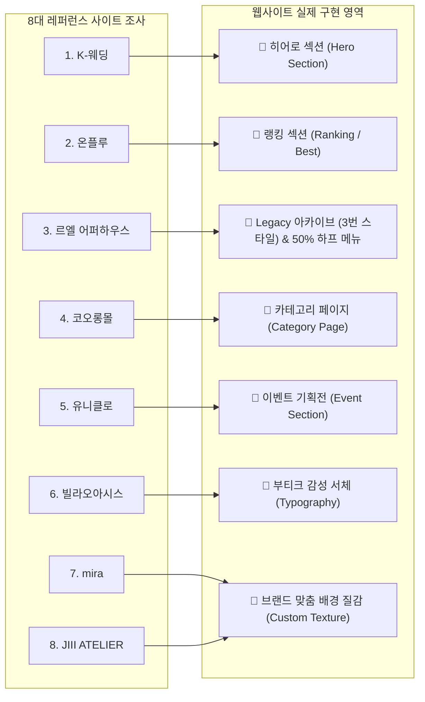

# 📂 사이트 레퍼런스 조사 · 분류 · 분석 가이드 (Site Research Hub)

> **폴더 위치**: `Antigravity/평가 파일/디자인/사이트/`  
> **기반 자료**: [`사이트 자료조사.tst`](file:///C:/Users/SBS/Documents/GitHub/Gravity/Antigravity/%ED%8F%89%EA%B0%80%20%ED%8C%8C%EC%9D%BC/%EB%94%94%EC%9E%90%EC%9D%B8/%EC%82%AC%EC%9D%B4%ED%8A%B8%20%EC%9E%90%EB%A3%8C%EC%A1%B0%EC%82%AC.tst) (최신 보완 반영)  
> **생성 목적**: 8대 레퍼런스 사이트의 정량적/정성적 조사 메모와 **사용자가 지정한 실전 적용 영역(히어로, 랭킹, Legacy 아카이브, 카테고리, 이벤트, 서체, 브랜드 맞춤 배경 질감)**을 반영한 완벽한 설계 및 프로토타입을 제공합니다.

---

## 📑 문서 구성 및 바로가기

| 파일명 | 주요 내용 | 핵심 역할 |
| :--- | :--- | :--- |
| **[`01_웹사이트_레퍼런스_분류.md`](file:///C:/Users/SBS/Documents/GitHub/Gravity/Antigravity/%ED%8F%89%EA%B0%80%20%ED%8C%8C%EC%9D%BC/%EB%94%94%EC%9E%90%EC%9D%B8/%EC%82%AC%EC%9D%B4%ED%8A%B8/01_%EC%9B%B9%EC%82%AC%EC%9D%B4%ED%8A%B8_%EB%A0%88%ED%8D%BC%EB%9F%B0%EC%8A%A4_%EB%B6%84%EB%A5%98.md)** | • 사용자 지정 목표 영역별 8대 사이트 재분류 • 벤치마킹 요소 및 중요도 등급화 • 배경 질감 브랜드 컬러 맞춤 커스텀 지침 | **영역별 레퍼런스 분류서** |
| **[`02_웹사이트_레퍼런스_분석.md`](file:///C:/Users/SBS/Documents/GitHub/Gravity/Antigravity/%ED%8F%89%EA%B0%80%20%ED%8C%8C%EC%9D%BC/%EB%94%94%EC%9E%90%EC%9D%B8/%EC%82%AC%EC%9D%B4%ED%8A%B8/02_%EC%9B%B9%EC%82%AC%EC%9D%B4%ED%8A%B8_%EB%A0%88%ED%8D%BC%EB%9F%B0%EC%8A%A4_%EB%B6%84%EC%84%9D.md)** | • 각 사이트별 정밀 분석 및 구체적 CSS/UX 스펙 • 통합 디자인 시스템 및 브랜드 컬러 매핑 • 6개 주요 섹션별 실전 구현 블루프린트 | **정밀 분석 및 구현 전략서** |
| **[`웹디자인 초안.html`](file:///C:/Users/SBS/Documents/GitHub/Gravity/Antigravity/%ED%8F%89%EA%B0%80%20%ED%8C%8C%EC%9D%BC/%EB%94%94%EC%9E%90%EC%9D%B8/%EC%82%AC%EC%9D%B4%ED%8A%B8/%EC%9B%B9%EB%94%94%EC%9E%90%EC%9D%B8%20%EC%B4%88%EC%95%88.html)** | • 8대 레퍼런스가 지정 영역별로 완벽 구현된 독립 실행형 고품질 웹페이지 프로토타입 | **실전 웹디자인 프로토타입** |

---

## 🎯 8대 레퍼런스 및 사용자 지정 적용 영역 매핑표

| 레퍼런스 사이트 | 사용자 지정 적용 희망 영역 | 핵심 벤치마킹 요소 및 커스텀 방침 |
| :--- | :--- | :--- |
| **K-웨딩** | **히어로 섹션 (Hero)** | 대형 이미지 사이즈 + 제일 큰 세리프 헤드라인 폰트 |
| **온플루** | **랭킹 섹션 (Ranking)** | 이미지를 크게 보여주는 32px 둥근 모서리 프레임 + 비대칭 랭킹 레이아웃 |
| **르엘 어퍼하우스** | **Legacy 섹션 (3번 방식)** | 사진 + 옆 설명 2단 스플릿 + 톤온톤 차분한 배경 + 50% 하프 드로어 메뉴 |
| **코오롱몰** | **카테고리 페이지** | 신상품 입고: 큰 직사각형 속 복합 사각형 벤토 모듈 + 균일 정렬 상품 그리드 |
| **유니클로** | **이벤트 섹션 (Event)** | 사람들에게 이미지를 크게 보여주는 대형 컷 + 영상과 이미지 레이아웃 스토리텔링 |
| **빌라오아시스** | **서체 (Typography Only)** | 부티크 감성의 세련된 라벨 및 인용구 서체 전용 차용 |
| **mira** | **배경 질감 (Texture)** | 수채화 물감 번짐 질감 채택 + **색상은 브랜드(Ecru/Green/Petal) 맞춤 변경** |
| **JIII ATELIER** | **배경 질감 (Texture)** | 캔버스/패브릭 노이즈 질감 채택 + **색상은 브랜드 팔레트에 맞춰 조율** |
